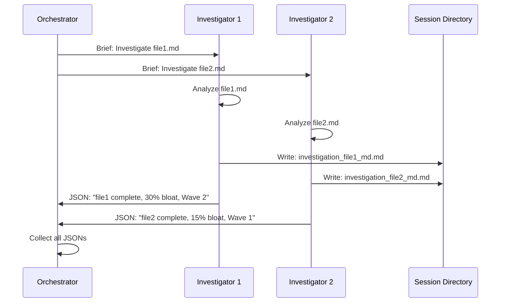
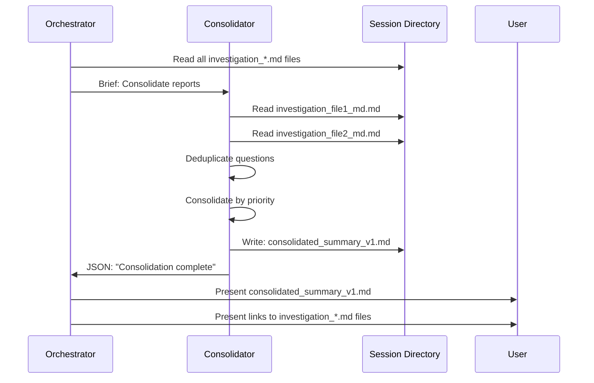
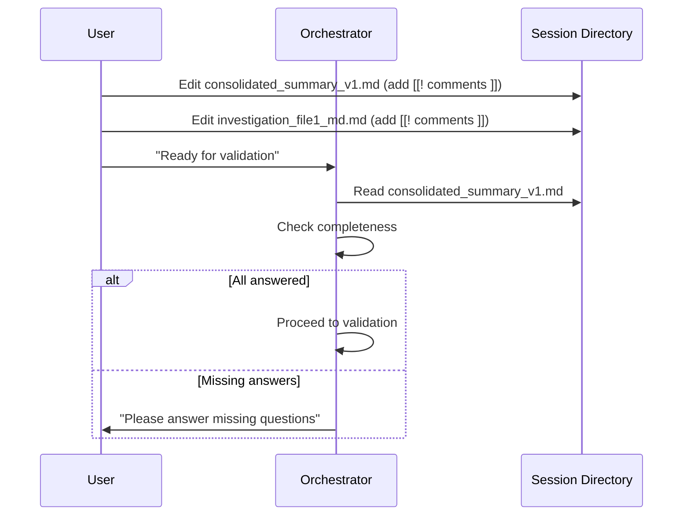
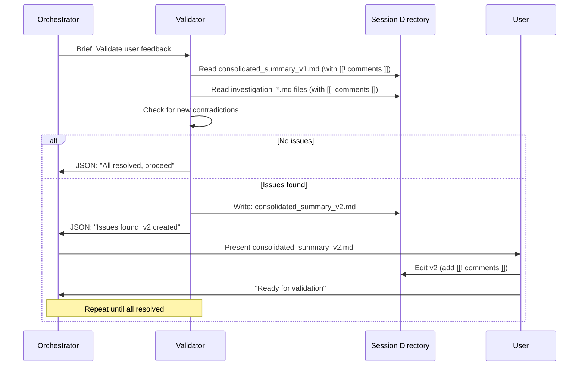
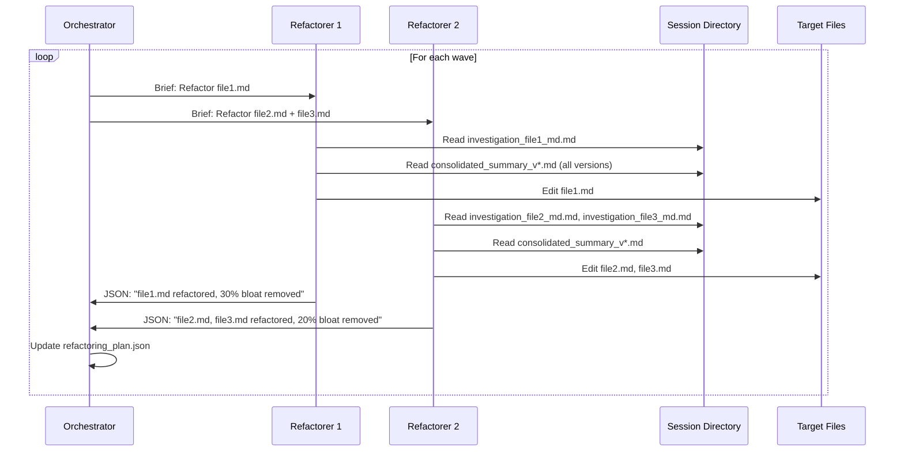
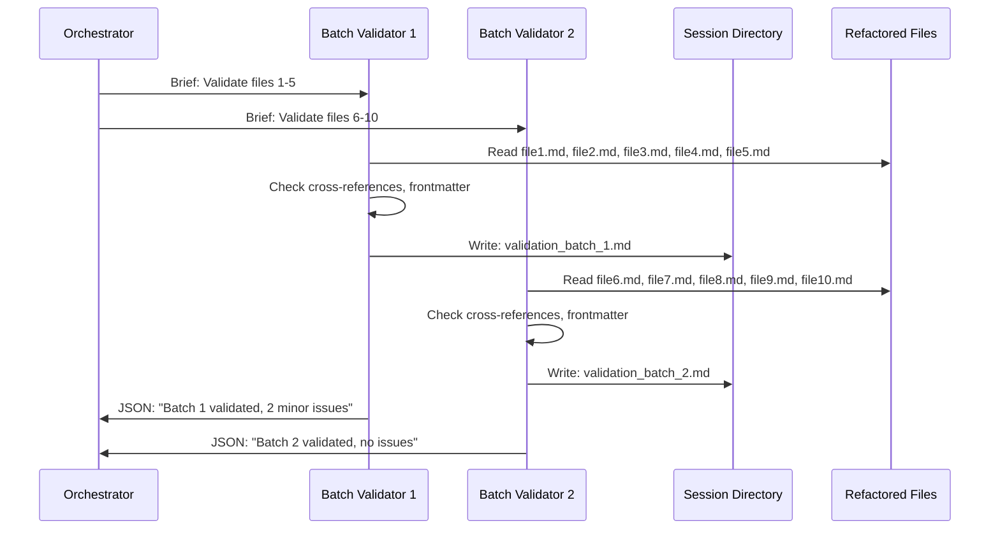
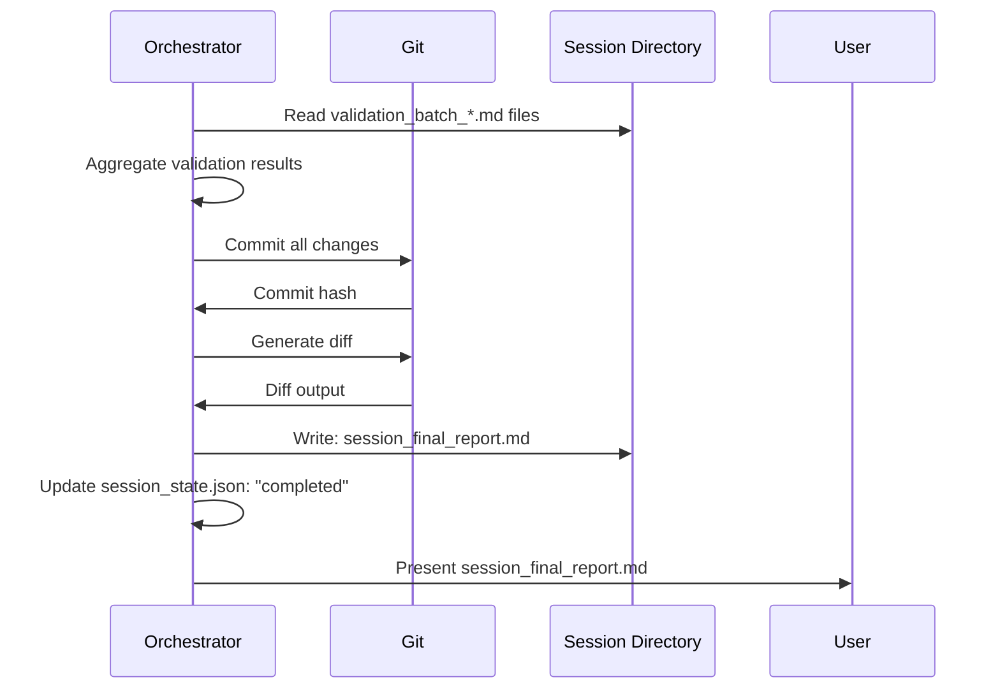

---
metadata:
  status: APPROVED
  version: 1.0
  modules: [doc-refactoring, reporting, lifecycle-management]
  tldr: "Complete lifecycle specification of reports from creation through consumption, iteration, and archiving for all report types in the system"
  dependencies: [system-overview.md, ../../SKILL.md]
  last_updated: 2025-11-19
---

# Documentation Refactoring System - Report Lifecycle

## Purpose

This document specifies the complete lifecycle of reports in the documentation refactoring system: creation, consumption, iteration, and archiving.

## Report Types

### 1. Investigation Reports (Markdown)

**Creator**: `/investigate-doc` command (one per file)
**Format**: Markdown with YAML frontmatter
**Filename**: `investigation_{file_path_with_underscores}.md`
**Consumers**: Consolidator, refactorer agents, user
**Lifetime**: Permanent (archived in session directory)

**Purpose**:
- Document bloat analysis, contradictions, gaps
- Record dependencies discovered
- Ask user questions about contradictions
- Provide recommendations for refactoring

### 2. Consolidated Summary (Markdown)

**Creator**: `/consolidate-reports` command
**Format**: Markdown with YAML frontmatter
**Filename**: `consolidated_summary_v{N}.md` (v1, v2, v3, ...)
**Consumers**: User, validator agents, refactorer agents
**Lifetime**: Permanent (all versions preserved)

**Purpose**:
- Deduplicate cross-cutting questions
- Consolidate inconsistencies by priority
- Provide cross-file context
- Collect user decisions via [[! comments ]]

### 3. Validation Reports (Markdown)

**Creator**: `/validate-user-feedback` command
**Format**: Markdown with YAML frontmatter
**Filename**: `consolidated_summary_v{N+1}.md` (only if issues found)
**Consumers**: User, orchestrator
**Lifetime**: Permanent (all versions preserved)

**Purpose**:
- Identify new contradictions from user answers
- Generate follow-up questions
- Iterate until all issues resolved

### 4. Refactoring Summaries (JSON)

**Creator**: `/refactor-doc` command (one per bundle)
**Format**: Minimal JSON (returned to orchestrator)
**Storage**: Not stored as file (logged in refactoring_plan.json)
**Consumers**: Orchestrator only
**Lifetime**: Session only (captured in state files)

**Purpose**:
- Confirm refactoring completion
- Report critical issues if encountered
- Provide bloat reduction metrics

### 5. Batch Validation Reports (Markdown)

**Creator**: `/validate-doc-batch` command (one per batch)
**Format**: Markdown with YAML frontmatter
**Filename**: `validation_batch_{N}.md`
**Consumers**: Orchestrator, user
**Lifetime**: Permanent (archived in session directory)

**Purpose**:
- Verify cross-references still valid
- Check for new contradictions post-refactoring
- Validate frontmatter integrity
- Flag issues for user review

### 6. Final Session Report (Markdown)

**Creator**: Orchestrator (at finalization)
**Format**: Markdown with embedded git commands
**Filename**: `session_final_report.md`
**Consumers**: User (primary), future AI agents (for retrieving old versions)
**Lifetime**: Permanent (archived in session directory)

**Purpose**:
- Provide git info (branch, commit, diff)
- Summarize changes (files modified, bloat reduction)
- List validation findings
- Offer rollback commands
- Guide user decision (merge, iterate, rollback)

## Report Contracts

All commands follow report contract principles from `managing-claude-context` skill:

### JSON Report to Orchestrator

**Minimal, High-Signal**:
- 1-2 sentence summary
- Critical alerts only (if any)
- Essential data for orchestrator's next decision

**Example**:
```json
{
  "status": "completed",
  "report_file": "investigation_file1_md.md",
  "summary": "Analyzed file1.md: 30% bloat, 3 questions, 2 critical issues",
  "dependencies": {
    "depends_on": ["file2.md"],
    "suggested_wave": 2
  },
  "critical_alert": "CRITICAL: Contradiction with README.md (see report)"
}
```

### Markdown Report for User/Agents

**Detailed, Structured**:
- Full analysis with line numbers
- Rationale for recommendations
- Questions for user with context
- Actionable next steps

## Report Flow

### Phase 1: Investigation



### Phase 2: Consolidation



### Phase 3: User Review



### Phase 4: Validation Iteration



### Phase 5: Refactoring



### Phase 6: Post-Refactoring Validation



### Phase 7: Finalization



## Report Schemas

### Investigation Report Template

See `../report-templates/investigation-report.md`

**Key Sections**:
- Executive Summary (metrics at a glance)
- Foundational Alignment Check
- Bloat Analysis (redundancy, outdated content)
- Consistency Issues (contradictions, missing info)
- Dependency Analysis (dependencies discovered)
- Recommendations by Priority

### Consolidated Summary Template

See `../report-templates/consolidated-report.md`

**Key Sections**:
- Instructions for User
- Critical Cross-File Issues (blocking)
- Foundational Document Issues
- File-Specific Issues Summary (with links)
- Recommendations by Priority
- Dependency Graph Summary

### Validation Batch Report Template

See `../report-templates/validation-batch-report.md`

**Key Sections**:
- Batch Summary (files validated, status)
- Cross-Reference Validation
- Frontmatter Integrity Check
- Markdown Syntax Validation
- Issues Found (if any)
- Recommendations

### Final Session Report Template

See `../report-templates/final-session-report.md`

**Key Sections**:
- Git Information (branch, commit, diff command)
- Changes Summary (metrics)
- Validation Results
- Rollback Commands
- Next Steps (user decision guide)
- Audit Trail (links to all reports)

## User Interaction Patterns

### [[! Comment ]] Syntax

Users add [[! comments ]] directly in markdown reports:

**Example in consolidated_summary_v1.md**:
```markdown
### Contradiction: Feature X Status
**Question**: What is the correct status of Feature X?
[[! Feature X is in beta. Please update all docs to reflect this. ]]
```

**Example in investigation_file1_md.md**:
```markdown
### Recommendation: Remove lines 100-150
Rationale: Duplicates content in file2.md
[[! Agreed, remove this section and link to file2.md instead ]]
```

**Parsing by Agents**:
```
function parse_user_comments(markdown_content):
  pattern = r'\[\[!\s*(.*?)\s*\]\]'
  comments = regex.findall(pattern, markdown_content)
  return comments
```

### Completeness Check

Orchestrator checks if all questions answered:

```
function check_completeness(consolidated_summary):
  questions = extract_questions(consolidated_summary)
  comments = extract_user_comments(consolidated_summary)

  unanswered = []
  for question in questions:
    if not has_comment_near(question, comments):
      unanswered.append(question)

  return {
    "complete": len(unanswered) == 0,
    "unanswered_count": len(unanswered),
    "unanswered_questions": unanswered
  }
```

## Report Archiving

All reports permanently stored in session directory:

```
./.SBTDD-refactoring/docs-refactoring-{timestamp}/
├── investigation_*.md           # Investigation phase
├── consolidated_summary_v*.md   # Consolidation + validation iterations
├── validation_batch_*.md        # Post-refactoring validation
├── session_final_report.md      # Finalization
├── session_state.json           # Session tracking
├── refactoring_plan.json        # Wave plan
└── dependency_graph.json        # File dependencies
```

**Audit Trail Value**:
- **User**: Can review past sessions, understand decisions made
- **Future AI Agents**: Can retrieve old file versions, understand refactoring rationale
- **Team**: Can understand documentation evolution, review methodology

## Report Consumption Patterns

### Refactorer Consumes Multiple Reports

Each `/refactor-doc` task reads:
1. **Its investigation report**: Specific bloat, recommendations
2. **All consolidated summaries** (v1, v2, v3...): Cross-cutting guidance
3. **User comments in investigation report**: File-specific instructions
4. **Dependency files**: Context for integration

**Briefing Pattern**:
```markdown
## Briefing: /refactor-doc

**Files to Refactor**: file2.md, file3.md

**Investigation Reports**:
- investigation_file2_md.md
- investigation_file3_md.md

**Consolidated Summaries** (all versions, read for cross-cutting guidance):
- consolidated_summary_v1.md
- consolidated_summary_v2.md
- consolidated_summary_v3.md

**Dependencies** (read for context):
- file1.md (foundational, already refactored in Wave 1)
- README.md (source of truth)

**Foundational Documents**:
- ./CLAUDE.md
- ./00_DOCS/PRD.md

**Instructions**:
1. Read your investigation reports with [[! comments ]] from user
2. Read ALL consolidated summaries with [[! comments ]] for cross-cutting guidance
3. Read dependency files for context (do not modify)
4. Apply approved recommendations
5. Respect user overrides from [[! comments ]]
6. Update cross-references if sections moved
7. Preserve frontmatter
```

### Validator Consumes Consolidated + Investigations

Each `/validate-user-feedback` task reads:
1. **Consolidated summary with user comments**: Cross-cutting answers
2. **All investigation reports with user comments**: File-specific context
3. **Foundational documents**: Source of truth for consistency check

**Decision Logic**:
```
function validate_user_feedback(consolidated, investigations, foundational):
  new_issues = []

  # Check if user answers create new contradictions
  for answer in user_answers:
    if contradicts_foundational_docs(answer, foundational):
      new_issues.append({
        "type": "contradiction_with_foundation",
        "message": f"User answer '{answer}' contradicts {foundational_doc}"
      })

    if contradicts_other_answers(answer, user_answers):
      new_issues.append({
        "type": "internal_contradiction",
        "message": f"Answer '{answer}' contradicts answer '{other_answer}'"
      })

  if len(new_issues) == 0:
    return {"status": "all_resolved"}
  else:
    return {
      "status": "issues_found",
      "create_next_version": True,
      "issues": new_issues
    }
```

## Error Handling in Reports

### Investigation Fails
- Orchestrator logs failure in session_state.json
- Investigation report not created
- User notified, can retry or exclude file

### Consolidation Fails
- Orchestrator retries once
- If still fails, alerts user
- User can manually create summary or abort

### Validation Iteration Exceeds Threshold
- After v5, orchestrator warns user
- Suggests manual resolution outside session
- User can choose to continue or abort

### Refactoring Fails
- Bundle logged as failed in refactoring_plan.json
- Orchestrator continues with other bundles
- User can retry or manually refactor

### Post-Validation Finds Critical Issues
- Orchestrator presents issues, does NOT auto-restart
- User decides: accept, fix manually, new session, or rollback

## Next Steps

For related specifications:
- `../report-templates/` - Detailed report templates
- `../specifications/investigator-spec.md` - Investigation report creation
- `../specifications/consolidator-spec.md` - Consolidation logic
- `../specifications/validator-spec.md` - Validation iteration logic
- `../specifications/refactor-spec.md` - How refactorers consume reports
