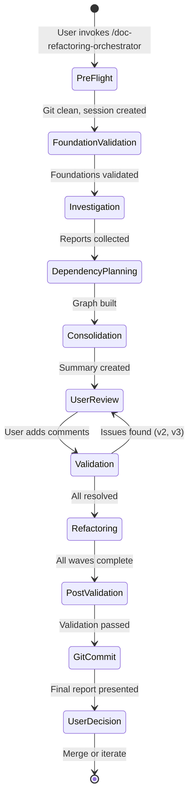
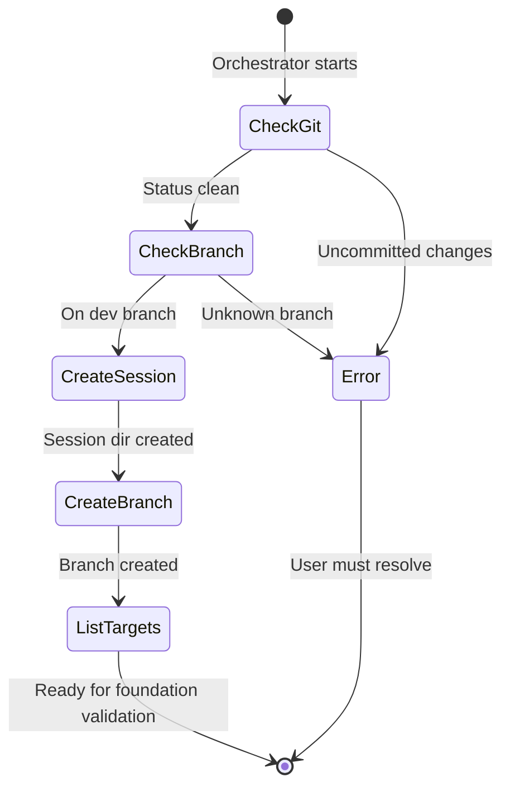
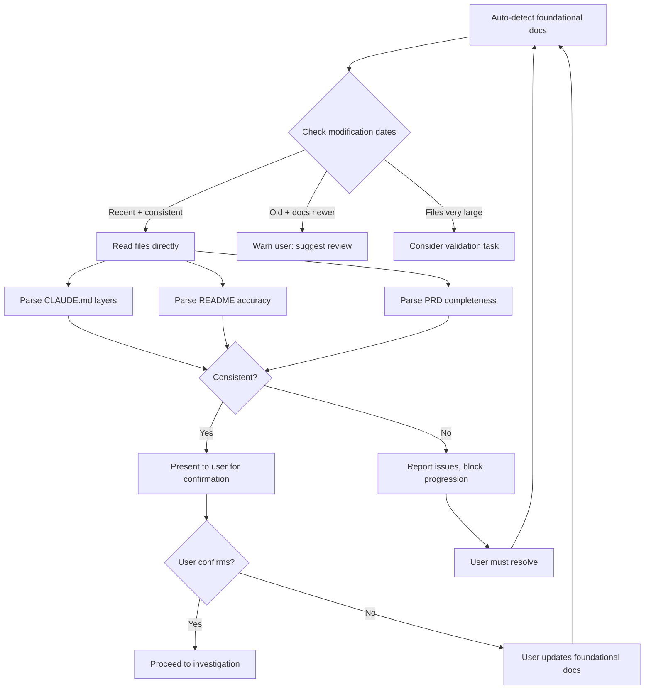

---
metadata:
  status: APPROVED
  version: 1.0
  modules: [doc-refactoring, workflow, orchestration]
  tldr: "Detailed workflow sequences with mermaid diagrams for the complete 10-phase documentation refactoring process"
  dependencies: [system-overview.md, ../../SKILL.md]
  last_updated: 2025-11-19
---

# Documentation Refactoring System - Workflow Sequence

## Overview

This document provides detailed workflow sequences with mermaid diagrams for the complete documentation refactoring process.

## Complete System Workflow



## Detailed Sequence Diagram

```mermaid
sequenceDiagram
    participant User
    participant Orch as Orchestrator<br/>(Main Chat)
    participant Skill as doc-refactoring<br/>Skill
    participant Inv as /investigate-doc<br/>(Task)
    participant Con as /consolidate-reports<br/>(Task)
    participant Val as /validate-user-feedback<br/>(Task)
    participant Ref as /refactor-doc<br/>(Task)
    participant Batch as /validate-doc-batch<br/>(Task)
    participant Git as Git System

    User->>Orch: /doc-refactoring-orchestrator 00_DOCS/
    Note over Orch: Runs in main chat

    Orch->>Skill: Load skill for knowledge
    Skill-->>Orch: Framework + procedures loaded

    Note over Orch,Git: PRE-FLIGHT PHASE
    Orch->>Git: Check git status
    Git-->>Orch: Clean (all committed/pushed)
    Orch->>Git: Create branch docs-refactoring-{timestamp}
    Orch->>Orch: Create session dir + session_state.json

    Note over Orch,Skill: FOUNDATION VALIDATION
    Orch->>Orch: Auto-detect foundational docs
    Orch->>Orch: Check modification dates
    Orch->>Orch: Read CLAUDE.md, README, PRD
    Orch->>User: Confirm foundational docs?
    User-->>Orch: Confirmed

    Note over Orch,Inv: INVESTIGATION WAVE
    Orch->>Skill: Load manual: investigate-doc
    Skill-->>Orch: Briefing template

    par Parallel Investigation
        Orch->>Inv: Task: Investigate file1.md
        Orch->>Inv: Task: Investigate file2.md
        Orch->>Inv: Task: Investigate file3.md
    end

    Note over Inv: Each investigator:<br/>- Reads target + foundational docs<br/>- Discovers dependencies<br/>- Updates frontmatter<br/>- Creates markdown report

    Inv-->>Orch: JSON: file1.md report + dependencies
    Inv-->>Orch: JSON: file2.md report + dependencies
    Inv-->>Orch: JSON: file3.md report + dependencies

    Note over Orch: DEPENDENCY PLANNING
    Orch->>Orch: Build dependency graph
    Orch->>Orch: Topological sort for waves
    Orch->>Orch: Create refactoring_plan.json

    Note over Orch,Con: CONSOLIDATION
    Orch->>Skill: Load manual: consolidate-reports
    Orch->>Con: Task: Consolidate all investigation reports
    Con->>Con: Read all markdown reports
    Con->>Con: Deduplicate questions
    Con->>Con: Consolidate by priority
    Con-->>Orch: consolidated_summary_v1.md created

    Note over Orch,User: USER REVIEW LOOP
    Orch->>User: Review consolidated_summary_v1.md<br/>Review individual investigation reports<br/>Add [[! comments ]]
    User->>User: Reviews reports, adds comments
    User->>Orch: Ready for validation

    Orch->>Orch: Check completeness
    alt Incomplete
        Orch->>User: Please answer missing questions
        User->>Orch: Updated comments
    end

    Note over Orch,Val: VALIDATION ITERATION
    Orch->>Skill: Load manual: validate-user-feedback
    Orch->>Val: Task: Validate user comments
    Val->>Val: Parse [[! comments ]]
    Val->>Val: Check for contradictions
    Val->>Val: Verify consistency

    alt No issues
        Val-->>Orch: Success, proceed to refactoring
    else Issues found
        Val-->>Orch: consolidated_summary_v2.md created
        Orch->>User: Review v2, add [[! comments ]]
        User->>Orch: v2 commented
        Note over Orch,Val: Repeat until resolved
    end

    Note over Orch,Ref: REFACTORING WAVES
    Orch->>Orch: Load refactoring_plan.json

    loop For each wave
        Note over Orch: Wave 1: Foundational files
        Orch->>Skill: Load manual: refactor-doc

        par Parallel Refactoring (within wave)
            Orch->>Ref: Task: Refactor file2.md
            Orch->>Ref: Task: Refactor file5.md + file6.md (bundled)
        end

        Note over Ref: Each refactorer:<br/>- Reads investigation report<br/>- Reads consolidated summaries<br/>- Reads dependencies<br/>- Applies changes<br/>- Preserves frontmatter

        Ref-->>Orch: JSON: file2.md refactored successfully
        Ref-->>Orch: JSON: file5.md, file6.md refactored

        Orch->>Orch: Update refactoring_plan.json

        Note over Orch: Wait for wave completion<br/>Then proceed to Wave 2, Wave 3...
    end

    Note over Orch,Batch: POST-REFACTORING VALIDATION
    Orch->>Orch: Group files into batches (5-10 each)
    Orch->>Skill: Load manual: validate-doc-batch

    par Parallel Batch Validation
        Orch->>Batch: Task: Validate batch 1 (files 1-5)
        Orch->>Batch: Task: Validate batch 2 (files 6-10)
    end

    Note over Batch: Each validator:<br/>- Checks cross-references<br/>- Validates frontmatter<br/>- Checks markdown syntax<br/>- Verifies alignment

    Batch-->>Orch: validation_batch_1.md
    Batch-->>Orch: validation_batch_2.md

    Note over Orch,Git: GIT WORKFLOW & FINAL REPORT
    Orch->>Git: Commit all changes
    Git-->>Orch: Commit hash
    Orch->>Git: Generate diff
    Orch->>Orch: Aggregate validation reports
    Orch->>Orch: Create session_final_report.md
    Orch->>Orch: Update session_state.json: "completed"

    Orch->>User: Final report presented<br/>Git info, diff, rollback commands

    Note over User: USER DECISION
    alt Validation clean
        User->>Git: Merge to dev/main
    else Validation has issues
        User->>Orch: Discuss issues
        alt Accept as-is
            User->>Git: Merge anyway
        else Manually fix
            User->>Git: Fix, then merge
        else Start new session
            Orch->>Orch: Compact chat history
            User->>Orch: /doc-refactoring-orchestrator (new session)
        else Rollback
            User->>Git: Restore from git
        end
    end
```



## Phase Breakdown

### Phase 1: Pre-Flight

**Duration**: 30-60 seconds
**Parallelization**: None (sequential checks)



### Phase 2: Foundation Validation

**Duration**: 1-2 minutes
**Parallelization**: None (orchestrator reads directly)

**Decision Tree**:


### Phase 3: Investigation Wave

**Duration**: 2-5 minutes (depends on file count)
**Parallelization**: Full (one investigator per file)

```mermaid
gantt
    title Investigation Wave Timeline
    dateFormat ss
    axisFormat %S

    section Wave Launch
    Orchestrator briefs investigators :00, 10s

    section Parallel Execution
    Investigator 1 (file1.md) :crit, 10, 90s
    Investigator 2 (file2.md) :crit, 10, 85s
    Investigator 3 (file3.md) :crit, 10, 95s
    Investigator 4 (file4.md) :crit, 10, 88s
    Investigator 5 (file5.md) :crit, 10, 92s

    section Report Collection
    Orchestrator collects reports :100, 10s
```



### Phase 4: Dependency Planning

**Duration**: 30-60 seconds
**Parallelization**: None (sequential graph building)

**Algorithm**:
```
1. Collect dependencies from investigator reports
2. Build adjacency list
3. Perform topological sort (detect cycles)
4. Group into waves (files with no dependencies = Wave 1)
5. Identify parallelization opportunities (2-3 files if closely related)
6. Create refactoring_plan.json
```

### Phase 5: Consolidation

**Duration**: 1-2 minutes
**Parallelization**: None (single consolidator task)

### Phase 6: User Review Loop

**Duration**: Variable (human-dependent)
**Parallelization**: None (user interaction)

### Phase 7: Validation Iterations

**Duration**: 1-2 minutes per iteration
**Parallelization**: None (single validator task per iteration)
**Iterations**: Typically 0-2 (most sessions resolve in v1)

### Phase 8: Refactoring Waves

**Duration**: 3-10 minutes per wave
**Parallelization**: Full within wave, sequential across waves

```mermaid
gantt
    title Refactoring Wave Timeline (3 Waves)
    dateFormat ss
    axisFormat %S

    section Wave 1 (Foundational)
    Refactor file2.md :crit, 00, 120s
    Refactor file5.md :crit, 00, 110s

    section Wave 2 (Intermediate)
    Refactor file1.md :crit, 120, 130s
    Refactor file3.md + file4.md :crit, 120, 140s
    Refactor file6.md :crit, 120, 125s

    section Wave 3 (Dependent)
    Refactor file7.md :crit, 260, 115s
```



### Phase 9: Post-Refactoring Validation

**Duration**: 2-4 minutes
**Parallelization**: Full (one validator per batch)

```mermaid
gantt
    title Post-Refactoring Validation Timeline
    dateFormat ss
    axisFormat %S

    section Batch Validation
    Validator 1 (files 1-5) :crit, 00, 120s
    Validator 2 (files 6-10) :crit, 00, 125s
    Validator 3 (files 11-15) :crit, 00, 118s

    section Report Aggregation
    Orchestrator aggregates reports :120, 15s
```



### Phase 10: Git Workflow & Finalization

**Duration**: 1-2 minutes
**Parallelization**: None (sequential git operations)

## Error Handling

### Git Status Check Fails
- **Cause**: Uncommitted changes, conflicts
- **Action**: Orchestrator alerts user, blocks progression
- **Resolution**: User must commit/push or stash changes

### Foundation Validation Fails
- **Cause**: CLAUDE.md inconsistent, README outdated, PRD incomplete
- **Action**: Orchestrator reports issues, blocks investigation
- **Resolution**: User must fix foundational docs or mark as acceptable risk

### Investigation Task Fails
- **Cause**: File not found, permission error, timeout
- **Action**: Orchestrator logs failure, continues with other investigators
- **Resolution**: User can retry individual file or exclude from session

### Dependency Cycle Detected
- **Cause**: Circular dependencies in frontmatter or references
- **Action**: Orchestrator reports cycle, requests user resolution
- **Resolution**: User breaks cycle by removing/updating dependencies

### User Review Incomplete
- **Cause**: User hasn't answered all questions
- **Action**: Orchestrator prompts user in main chat, blocks validation
- **Resolution**: User adds missing [[! comments ]]

### Validation Creates Many Iterations
- **Cause**: User answers create new contradictions
- **Action**: Orchestrator continues creating v2, v3, v4...
- **Threshold**: After v5, suggest manual resolution
- **Resolution**: User resolves contradictions outside session, restarts

### Refactoring Task Fails
- **Cause**: File permission error, disk space, timeout
- **Action**: Orchestrator logs failure, continues with other refactors
- **Resolution**: User can manually refactor failed files or retry

### Post-Validation Finds Critical Issues
- **Cause**: Refactoring broke cross-references, introduced contradictions
- **Action**: Orchestrator presents issues to user, does NOT auto-restart
- **Resolution**: User chooses to accept, manually fix, start new session, or rollback

### Session Interrupted
- **Cause**: Network error, user stops process, crash
- **Action**: session_state.json preserves progress
- **Resolution**: User re-invokes orchestrator, it detects incomplete session and offers to resume

## Performance Optimization

### Investigation Phase
- **Parallel**: All investigators run simultaneously
- **Optimization**: Brief investigators with focused foundational doc list (not entire repo)
- **Trade-off**: More investigators = faster, but higher API rate limit risk

### Refactoring Phase
- **Wave-Based**: Sequential waves, parallel within wave
- **Bundling**: 1-3 files per refactorer (saves context setup cost)
- **Trade-off**: Larger bundles = fewer agents, but riskier (one failure affects multiple files)

### Validation Phase
- **Batch**: 5-10 files per validator
- **Optimization**: Group by directory/module for contextual efficiency
- **Trade-off**: Larger batches = fewer validators, but longer per-validator duration

### Context Management
- **Orchestrator**: Minimal context (only summaries + state files)
- **Optional Compaction**: Summarize phases if main chat grows large
- **Trade-off**: Compaction costs time, but prevents overflow

## Next Steps

For related specifications:
- `dependency-graph-planning.md` - Topological sort algorithm
- `foundation-validation-strategy.md` - Date heuristics, layered CLAUDE.md parsing
- `session-state-tracking.md` - Restart capability details
- `report-lifecycle.md` - Report contracts and data flow
- `git-integration.md` - Branching strategy, rollback commands
