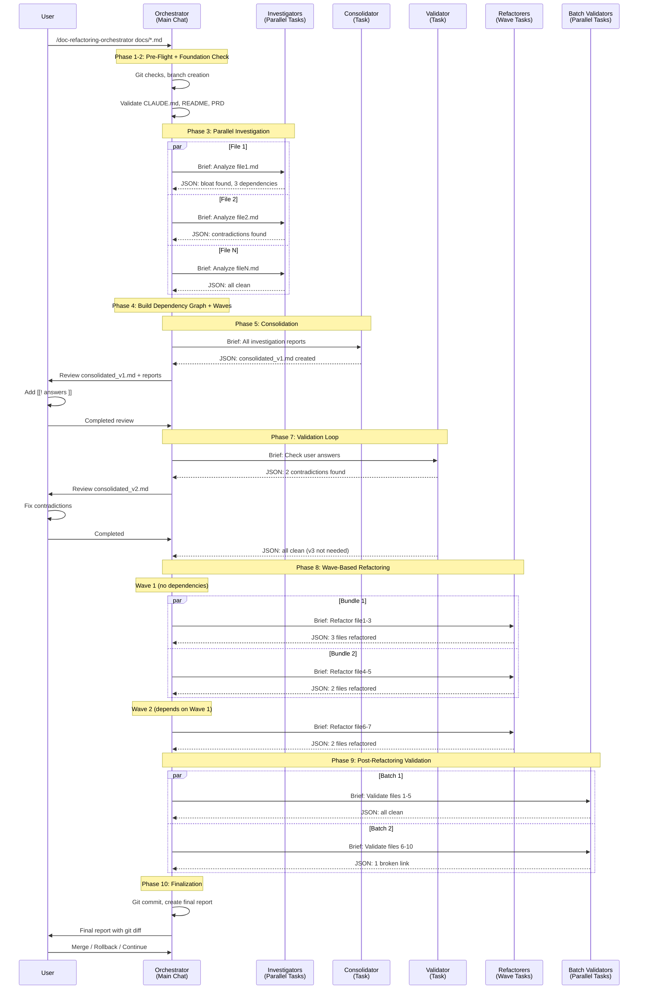

# Documentation Refactoring Skill

## Purpose

Systematic review, analysis, and refactoring of markdown documentation to eliminate bloat, resolve contradictions, and improve quality.

**Core Problems:**
- Documentation grows bloated (redundancy, outdated content, verbosity)
- Cross-file contradictions emerge
- Maintaining consistency across many files is error-prone

**Solution:**
Orchestrated workflow with parallel investigation, user-guided decisions, and dependency-aware refactoring.

## Core Philosophy

**User-Guided**: User makes all decisions via `[[! comments ]]`. Agents identify issues, user resolves.

**Dependency-Aware**: Files refactored in waves based on dependency graph. Dependencies refactored first.

**Zero Context Overflow**: Specialists work in isolated tasks. Orchestrator receives minimal JSON summaries.

**Complete Audit Trail**: All reports and state saved. Git branch-based workflow with rollback capability.

## Workflow Overview



## Commands

### 1. `/doc-refactoring-orchestrator`
Main entry point. Coordinates entire session. Loads skill + manuals, briefs all specialists.

### 2. `/investigate-doc`
Analyze individual file. Identify bloat, detect contradictions, discover dependencies, create investigation report.

### 3. `/consolidate-reports`
Consolidate investigation reports. Deduplicate questions, create user-friendly summary.

### 4. `/validate-user-feedback`
Validate user answers. Check for contradictions, create new version if issues found.

### 5. `/refactor-doc`
Apply refactoring to 1-3 files. Respect user instructions, update cross-references.

### 6. `/validate-doc-batch`
Post-refactoring validation. Check 5-10 files for cross-references, contradictions, frontmatter integrity, markdown syntax.

## Agent Positioning

### Phase 3: Investigation - `/investigate-doc`
**Receives**: File path, foundational docs
**Executes**: Bloat detection, contradiction detection, dependency discovery
**Produces**: Investigation report (markdown), JSON summary
**Feeds**: Consolidator
**Optional Load**: This skill for workflow context, `contradiction-detection.md` + `dependency-management.md` references

### Phase 5: Consolidation - `/consolidate-reports`
**Receives**: All investigation reports
**Executes**: Question deduplication, priority consolidation
**Produces**: Consolidated summary v1 (markdown), JSON summary
**Feeds**: User review → Validator
**Optional Load**: This skill for validation loop understanding

### Phase 7: Validation - `/validate-user-feedback`
**Receives**: Consolidated summary with user `[[! comments ]]`, investigation reports
**Executes**: Answer consistency check, contradiction detection
**Produces**: New version if issues (v2/v3), JSON summary
**Feeds**: Refactorers (if clean) or User review (if issues)
**Optional Load**: This skill for iteration pattern, `user-comment-interpretation.md` reference

### Phase 8: Refactoring - `/refactor-doc`
**Receives**: 1-3 files (bundled), consolidated summaries, investigation reports, dependencies
**Executes**: Apply user changes, update cross-references
**Produces**: Refactored files, JSON summary
**Feeds**: Batch validators
**Optional Load**: This skill for dependency graph pattern, `dependency-management.md` + `user-comment-interpretation.md` references

### Phase 9: Post-Validation - `/validate-doc-batch`
**Receives**: 5-10 refactored files, foundational docs, all session files
**Executes**: Cross-reference validation, new contradiction detection, frontmatter integrity
**Produces**: Validation report (markdown), JSON summary
**Feeds**: Final report
**Optional Load**: This skill for validation requirements, `contradiction-detection.md` reference

### Orchestrator
**Loads**: This skill + manuals + `orchestrator-workflow.md` reference
**Coordinates**: All phases, session state, user engagement
**Receives**: Minimal JSON summaries only (never reads full reports)

## Documentation Quality Principles

### Bloat Detection

**Redundancy**: Same information in multiple files/sections
- Action: Consolidate to single source, cross-reference from others

**Outdated Content**: References to deprecated features, old versions, past dates
- Action: Update to current state or remove if no longer relevant

**Verbosity**: Unnecessarily long explanations, repetitive content
- Action: Condense to essential information, use bullet points

### Cross-Reference Management

**Link Format**: `[text](./file.md#section-id)`
- Always use relative paths from current file
- Use `#section-id` for internal links (same file)
- Use `./file.md#section-id` for cross-file links

**Dependency Tracking**: Files referenced = dependencies
- Update frontmatter `metadata.dependencies: [file1.md, file2.md]`
- Refactor dependencies before dependent files

**Link Validation**: All links must resolve
- Check file exists
- Check section exists in target file
- Flag broken links for user decision

### Contradiction Resolution

**Types**:
- Feature status (released vs beta)
- Version requirements (Node 16 vs Node 18)
- Dates (different release dates)
- Terminology (microservices vs SOA)
- Boolean states (enabled vs disabled)

**Process**:
1. Investigators detect, flag in reports
2. User resolves via [[! comments ]]
3. Refactorers apply resolution
4. Batch validators check no new contradictions introduced

### Frontmatter Standards

**Required Fields**:
```yaml
---
metadata:
  status: DRAFT | IN-REVIEW | APPROVED
  version: X.Y
  dependencies: [file1.md, file2.md]
---
```

**Dependency Accuracy**: Files in dependencies list MUST be referenced in content

### Markdown Quality

**Heading Hierarchy**: No skips (H1 → H2 → H3, not H1 → H3)
**Code Blocks**: All opened blocks closed
**Tables**: Valid syntax, consistent columns
**Lists**: Consistent indentation, proper nesting

## Progressive Disclosure

**Orchestrator**:
- Always: This skill + manuals
- On-demand: `orchestrator-workflow.md` reference (git, session, error handling)

**Specialists**:
- Default: Execute from briefing only
- Optional: This skill (for workflow context)
- On-demand: Specific references (dependency, user-comments, contradictions)

## References

**For Orchestrator**:
- `orchestrator-workflow.md` - Git integration, session management, error handling

**Shared (2+ agents)**:
- `dependency-management.md` - Used by investigator + refactorer
- `user-comment-interpretation.md` - Used by validator + refactorer
- `contradiction-detection.md` - Used by investigator + batch validator

---

**This skill follows managing-claude-context patterns: progressive disclosure, zero-redundancy, orchestration-ready.**
