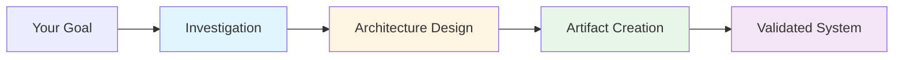

---
metadata:
  status: approved
  version: 1.0
  modules: [context-engineering, documentation]
  tldr: "Quick start guide for users new to the managing-claude-context skill"
---

# Quick Start: Managing Claude Context

⚠️ **Development Status**: This skill is actively under development. We welcome contributions!

## What is this?

The `managing-claude-context` skill transforms Claude into an expert **Context Architect** - a specialist that can design, build, and manage your entire AI context ecosystem.

**Context ecosystem** = All the artifacts that make your AI work effectively:
- `/commands` - Reusable slash commands
- `.claude/agents/` - Specialist AI agents
- `.claude/skills/` - Knowledge modules
- `CLAUDE.md` files - Persistent project context

## When to Use This Skill

Use this skill when you need to:
- **Build new AI capabilities** from scratch
- **Modify existing AI artifacts** (agents, commands, skills)
- **Audit your context architecture** for efficiency
- **Plan complex workflows** before implementation
- **Understand how AI context works** in your project

## How It Works



The skill follows a structured 3-phase workflow:

1. **Investigation**: Understand requirements and current state
2. **Architecture**: Design the optimal solution
3. **Creation**: Build the artifacts using specialist commands

## Core Commands

| Command | Purpose | When to Use |
|---------|---------|-------------|
| `/investigate-context` | Gather requirements | Starting any new capability |
| `/context-architecture` | Design architecture | After investigation complete |
| `/create-edit-agent` | Build AI agents | Need autonomous specialists |
| `/create-edit-command` | Build slash commands | Need reusable tools |
| `/create-edit-skill` | Build knowledge modules | Need domain expertise |
| `/create-edit-claude-md` | Update project context | Set project-wide rules |
| `/setup-mcp-integration` | Integrate external tools | Connect to APIs/services |

## Quick Example: Creating Your First Command

Let's create a simple command that runs tests:

### Step 1: Activate the Skill

```
Hey Claude, I want to create a new slash command for running tests.
Load the managing-claude-context skill.
```

### Step 2: Describe What You Want

```
Create a /run-tests command that:
- Accepts a directory path as argument
- Runs all test files in that directory
- Returns a summary of pass/fail results
```

### Step 3: Let Claude Architect It

Claude will use the `/create-edit-command` command internally, following the briefing philosophy. You'll get:

- A functional command file
- Proper JSON report format
- Integration-ready output

### Step 4: Test It

```
/run-tests src/components
```

That's it! You've created a reusable AI-powered command.

## Operation Modes

For more guided workflows, use these global operation modes:

### `/manage-context` (Recommended for Beginners)

Activates the Context Manager mode. Use this when you want guided assistance through the entire process.

```
/manage-context
```

Claude will:
- Guide you through requirements gathering
- Propose architecture automatically
- Create all necessary artifacts
- Validate integration

### Advanced Modes

- `/full-build-mode` - For building complex capabilities from scratch
- `/modify-mode` - For refactoring existing artifacts
- `/audit-mode` - For analyzing and documenting current state

## Key Concepts

### Progressive Disclosure

The skill uses **progressive disclosure** - it loads detailed knowledge only when needed:

- `SKILL.md` = Lightweight framework (~400 tokens)
- `references/` = Deep knowledge loaded on-demand
- **Result**: Efficient context usage

### Briefing Philosophy

When creating artifacts, you provide **requirements**, not implementation details:

❌ **Don't**: Write the full agent prompt yourself
✅ **Do**: Describe what the agent should accomplish

The specialist commands are experts - they know how to build optimal prompts. Your job is to brief them with complete requirements.

### Zero Redundancy

Information exists in exactly ONE place:

- Project-wide rules → Root `CLAUDE.md`
- Module-specific rules → Subdirectory `CLAUDE.md`
- Deep procedures → Skill `references/`
- Agent logic → Agent system prompt

## Common Workflows

### Workflow 1: Build a New Feature

1. Run `/investigate-context` with your goal
2. Review the Context Analysis Report
3. Run `/context-architecture` with the report
4. Review the architecture documents
5. Use `/create-edit-*` commands to build artifacts
6. Test and validate

### Workflow 2: Improve Existing Agent

1. Use `/modify-mode` operation mode
2. Describe desired improvements
3. Claude analyzes current agent
4. Updates using `/create-edit-agent`
5. Validates integration

### Workflow 3: Audit Your Context

1. Use `/audit-mode` operation mode
2. Claude analyzes all artifacts
3. Generates efficiency report
4. Recommends improvements

## Getting Help

### Documentation

- **SKILL.md** - Complete skill philosophy and framework
- **references/README.md** - Index of all reference materials
- **manuals/** - Briefing guides for each command
- **research/** - Foundational research and design rationale

### Common Issues

**"Command not working"**
→ Check briefing structure in `manuals/[command-name].md`

**"Agent producing wrong output"**
→ Verify Report Contract v2 format in `references/report-contracts.md`

**"Context pollution"**
→ Review `references/context-minimization.md` for strategies

**"Not sure which tool to use"**
→ Check `references/subagent-design-guide.md` for Command vs Agent decision framework

## Next Steps

1. **Try the simple example above** - Create your first command
2. **Explore references** - Deep dive into specific topics
3. **Use operation modes** - Get guided assistance
4. **Contribute** - See contributing section below to help improve this skill

## Tips for Success

- ✅ **Start with investigation** - Don't skip requirements gathering
- ✅ **Use operation modes** - They guide you through best practices
- ✅ **Provide complete briefings** - More context = better output
- ✅ **Test iteratively** - Validate each artifact before moving on
- ✅ **Follow zero redundancy** - Keep information in ONE place

## Architecture at a Glance

```
.claude/
├── commands/           # Reusable slash commands
│   └── managing-claude-context/  # Context management commands
├── agents/            # Specialist AI agents
├── skills/            # Knowledge modules (like this one!)
│   └── managing-claude-context/
│       ├── SKILL.md           # Main skill file
│       ├── manuals/           # How to use commands
│       ├── references/        # Deep knowledge
│       └── research/          # Design research
└── CLAUDE.md          # Project-wide context (auto-loaded)
```

---

## 🔧 Contributing to This Skill

This skill is under active development. Here's how you can help improve it:

### Understanding the Codebase

**Core Files**:
- `SKILL.md` - Main skill definition (core principles, glossary, execution strategies)
- `references/` - Deep knowledge loaded on-demand (18 reference files)
- `manuals/` - Briefing guides for each command (7 manuals)

**Research & Development**:
- `research/` - **SACRED DIRECTORY** - Contains foundational research used to build this skill
  - `claude-code-system-prompt/` - Detailed Claude Code system prompt analysis (40 files)
  - `skills_research.md` - Original skills framework research
  - `repo-structure-research.md` - Repository organization patterns
  - `IMPLEMENTATION_COMPLETE.md` - Recent implementation notes
  - Other research files (~12 total files, ~360KB)

**Development Artifacts**:
- `00_DOCS/context-architecture/` - Self-documentation of this skill's architecture
- `.trash/` - Archived historical planning documents

### How to Contribute

#### 1. Improve References

References are loaded on-demand by agents. To add or improve:
- Check `references/README.md` for current coverage
- Identify gaps or outdated information
- Create new reference or update existing following zero-redundancy principle
- Update `references/README.md` cross-reference table

#### 2. Enhance Commands

Commands are the workhorses of the skill. To improve:
- Check command file in `.claude/commands/managing-claude-context/`
- Review corresponding manual in `manuals/`
- Update command prompt structure
- Ensure JSON report format follows Report Contract v2
- Test with real briefings

#### 3. Research Before Building

**CRITICAL**: Always check `research/` directory first:
- **Before adding features**: Check if research already exists
- **Before major changes**: Review `claude-code-system-prompt/` analysis
- **Before architecture decisions**: Read relevant research documents

The research directory contains the "why" behind all design decisions. **Never modify research files** - they are historical reference.

#### 4. Improve Operation Modes

Operation modes orchestrate the skill's commands:
- Check `.claude/commands/managing-claude-context/operation_modes/`
- Ensure modes properly load skill and references
- Test workflow guidance is clear
- Validate command orchestration patterns

### Development Workflow

1. **Identify Gap**: What's missing or broken?
2. **Research First**: Check `research/` directory for context
3. **Design**: Use `/context-architecture` if making major changes
4. **Implement**: Use the skill's own commands to build artifacts
5. **Test**: Validate with real workflows
6. **Document**: Update references, manuals, or this guide

### Testing Your Changes

**Manual Testing**:
- Load skill: Verify SKILL.md loads without errors
- Test commands: Invoke each command with valid briefing
- Check reports: Verify JSON format matches Report Contract v2
- Test references: Load references and verify cross-references work

**Integration Testing**:
- Test with operation modes
- Test command chaining
- Test with real projects
- Verify progressive disclosure works

### Key Principles for Contributors

1. **Zero Redundancy**: Information appears in exactly ONE place
2. **Progressive Disclosure**: Keep SKILL.md lightweight, detailed knowledge in references
3. **Briefing Philosophy**: Commands receive requirements, not implementation details
4. **Research Preservation**: Never modify `research/` directory
5. **Self-Consistency**: Use the skill's own commands to improve itself

### Questions or Issues?

- Review `research/IMPLEMENTATION_COMPLETE.md` for recent changes
- Check `references/README.md` for architecture overview
- Examine `00_DOCS/context-architecture/` for self-documentation
- Load SKILL.md for comprehensive principles

---

**Ready to start?** Try creating your first command using the example above, or activate `/manage-context` mode for guided assistance.

**Questions?** Load the full SKILL.md for comprehensive documentation, or check the research directory for design rationale.

**Author**: Vladimir K.S.
**Last Updated**: 2025-11-13
**Version**: 1.1
