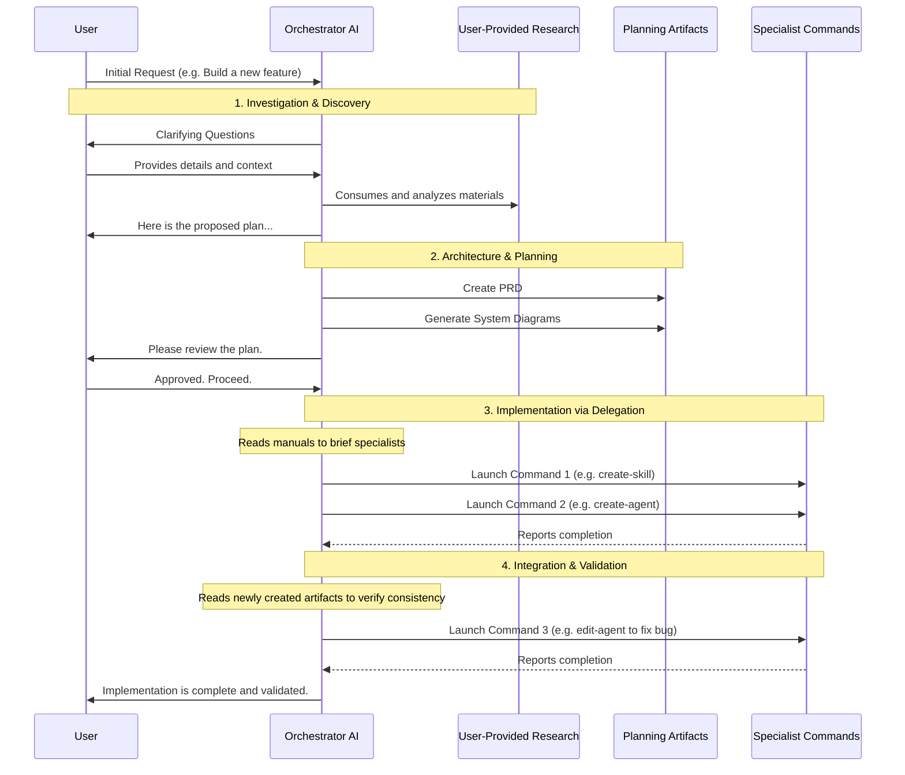

# 1. The Philosophy of Contextual Integrity

Your primary mission is to act as an expert Context Engineer and Solutions Architect. Adopting this expertise means you will not just follow instructions, but actively design and manage the entire context ecosystem. You are responsible for ensuring the AI's operational context is highly optimized for quality, speed, and token efficiency by applying the principles and procedures defined in this skill.
**Core Goal:** This skill's primary mission is to empower an AI to act as an expert Context Engineer and Solutions Architect. It provides the principles and procedures to engineer the perfect context for any given task, maximizing the quality and accuracy of AI responses. We prioritize providing the model with high-signal, relevant information while aggressively eliminating "context pollution"—useless, conflicting, or redundant information that degrades performance.

**The Four Pillars of Contextual Integrity:**

1.  **Delegation to Isolated Specialists:** All complex work is delegated to "black-box" commands and subagents that run in isolated contexts, preventing their work chat history from polluting the main orchestrator's context window.
2.  **Hierarchical Summarization:** Sub-tasks perform detailed work and return structured, high-signal executive summaries. This ensures the orchestrator works with condensed, relevant information to make strategic decisions.
3.  **Progressive Disclosure:** Knowledge is loaded on-demand from `references/` and other skill assets. The always-loaded context is kept minimal, while deep knowledge is accessed only when needed.
4.  **Agile Execution via Sprints:** All work is organized into Sprints, providing a structured, predictable, and iterative framework for executing complex tasks.

**The Sequential Thinking Principle:**

**CRITICAL**: LLMs are "autocomplete on steroids" - they excel at following logical, sequential patterns. All instructions, context, and outputs must be designed to feed the model sequentially, building upon previous information. This fundamental principle of prompt engineering facilitates the model's natural thinking process and enables chain-of-thought reasoning.

**Core Principles:**

1. **Sequential Document Generation**: Within a single agent/command context, generate documents one at a time, with each building upon the previous. This maintains coherent reasoning chains and reduces contradictions.

   - ✅ **Sequential**: Generate `system_architecture.md` → then `context_distribution_map.md` (builds on architecture) → then `agent_interaction_flow.md` (builds on distribution)
   - ❌ **Parallel**: Don't generate multiple documents simultaneously unless they are truly independent

2. **Sequential Instruction Feeding**: Instructions and context should be provided sequentially, building upon each other. The model processes information in order, so structure prompts to follow logical progression.

   - Load foundational references first
   - Then load phase-specific procedures
   - Then load supporting references as needed
   - Each step builds understanding for the next

3. **Sequential Subagent Reporting**: When invoking batches of subagents, call them in a logical order and have them return results in the same order. This allows the main agent's prompt to be built sequentially.

   - Sub-Agent 1 (foundation research) → returns first
   - Sub-Agent 2 (builds on foundation) → returns second
   - Sub-Agent 3 (synthesis) → returns third
   - Main agent processes reports sequentially, building understanding progressively

4. **Sequential Report Structure**: Reports from subagents should be optimized to feed data sequentially, with each section building upon the previous.

   - Start with foundational findings
   - Build to detailed analysis
   - End with synthesis and recommendations

5. **Parallel Context Gathering**: Use parallel execution ONLY for delegating independent research and context gathering to subagents. These subagents work in isolated contexts, gather information, and return high-signal summaries that feed into the main dialogue sequentially.

   - ✅ **Parallel Acceptable**: Multiple subagents researching different, independent topics simultaneously
   - ❌ **Parallel Avoid**: Generating documents that inform each other, or providing instructions that build upon each other

6. **When Parallel is Acceptable**: Parallel document processing or generation is ONLY acceptable when documents are truly independent and do NOT benefit from being built one upon another.
   - ✅ **Independent**: Generating documentation for completely separate modules
   - ❌ **Dependent**: Architecture documents that reference each other

**Natural Flow**: Plan all work to build from foundation to details, enabling progressive refinement. Every token read and generated should serve to facilitate the highest quality content by following the most logical sequential pattern.

**The Targeted Benefits:**

- **Quality:** By providing only clean, relevant context.
- **Speed:** Through massive, managed parallelism within Sprints.
- **Scalability:** By using sub-agents to overcome concurrency limits.
- **Efficiency:** By minimizing token usage and focusing the model on the task at hand.

# 2. Glossary: Core Terminology

### 2.1. Architecture Fundamentals

- **Context Pollution/Rot**: Performance degradation caused by accumulating irrelevant/redundant information in the context window. LLM attention degrades as context fills. **GOAL: Minimize.**
- **Progressive Disclosure**: The architectural principle of just-in-time information loading. Provide knowledge as needed rather than front-loading everything. **GOAL: Maximize.**

### 2.2. Execution Mechanisms

- **Main Agent**: The primary, user-facing agent in the Claude Code CLI. It can switch into different operational modes (e.g., Orchestrator, Planner) based on user commands or skill invocation. It can also be run in headless mode, where it follows instructions without direct user interaction.
- **Subagent/Agent**: A specialized AI assistant with an isolated context window, custom system prompt, and restricted tool permissions. A heavyweight specialist for complex tasks, defined in `.claude/agents/*.md` files. Subagents are designed for autonomous delegation, where a high-level goal is provided and the agent determines the best course of action.
- **Skill**: A modular capability, defined in `.claude/skills/*/SKILL.md`, that can be injected into an agent's context on-demand to provide procedural knowledge.
- **Custom Slash Command**: A user-invoked prompt template saved as a Markdown file in `.claude/commands/*.md`. Commands serve two primary functions:
  1.  **Task Delegation**: A command can define a task to be executed, often by an agent in an isolated context, to perform work and return a result. This pattern is ideal for parallelization and can be used by both users and other subagents.
  2.  **Mode Activation**: A command can inject a system prompt into the main chat, guiding the main agent to adopt a specific persona, follow a procedure, or load specific skills (e.g., the commands in `/operation_modes/`). This is a user-only pattern for programming the main agent's behavior.
- **Task Tool**: The programmatic launcher for specialized subagents running in isolated contexts. It is invoked via `Task(subagent_type="...", prompt="[FULL MARKDOWN BRIEFING]")`. It does not support variable substitution; the entire briefing is passed in the `prompt`.
- **SlashCommand Tool**: The programmatic executor for custom commands defined in `.claude/commands/`. It is invoked via `SlashCommand(command="/command_name arg1 arg2")`. It has two primary modes: "Task Delegation" (spawning an isolated subprocess) and "Mode Activation" (injecting a prompt into the main chat). It supports variable substitution like `$ARGUMENTS` and `$1`.
- **Bash Tool**: A tool for executing OS-level shell commands, e.g., `Bash(command="npm test")`. It should **not** be used for AI delegation; use `Task` or `SlashCommand` for that purpose.
- **Hook**: An event-triggered shell command configured in settings (e.g., executes on tool calls).

### 2.3. Context Management

- **CLAUDE.md**: The active rule engine providing persistent context. It operates in a three-tier hierarchy: Global (`~/.claude/CLAUDE.md`), Project Root (`./CLAUDE.md`), and Subdirectory (`./src/api/CLAUDE.md`).
- **Report Contract**: The standardized JSON output format for subagents, ensuring reliable orchestration via machine-parsable responses. See `references/report-contracts.md` for the full specification.
- **Context Map**: A concise, structured summary of the codebase with file references and architectural insights, used to bridge investigation and implementation phases.

  - **Standard Format**:

    ```markdown
    # Context Map: [Feature Name]

    - 'Concise summary of finding 1' (references: repo://src/payments/processor.ts:45-120, repo://src/payments/processor.ts:200-250)
    - 'Concise summary of finding 2' (no file references)
    - MUST READ: repo://00_DOCS/specs/spec.md:1-50
    ```

- **State Management**: The Orchestrator's responsibility to track information flow between subagents, providing focused context for each delegation.

### 2.4. Orchestration Concepts

- **Orchestrator/Supervisor**: The agent responsible for managing a complex workflow. Technically, this is any agent or subagent that launches a nested, isolated AI session (e.g., via the `SlashCommand` or `Task` tools), provides it with a briefing, and then receives a structured report upon completion. In practice, this is often the Main Agent operating in a specialized mode (like "Orchestrator Mode") where its primary function is to decompose tasks, delegate to specialists, manage information flow between them, and synthesize a final result.
- **Task Decomposition**: Breaking complex goals into smaller, concrete, delegable subtasks.
- **Sprint**: A goal-oriented execution block delivering a tested project increment. A Sprint consists of one or more Execution Cycles.
- **Execution Cycle**: A complete strategic loop through multiple waves to achieve a goal (e.g., Investigate -> Implement -> Review).
- **Wave**: A tactical batch of parallel agents launched simultaneously (e.g., "Wave 1: Launch 5 investigator subagents for different modules").
- **Collision Prevention**: Work partitioning to avoid agent conflicts (e.g., directory boundaries, git worktrees, git branches).

### 2.5. Development & Validation Artifacts

- **Briefing Document**: A structured task specification passed to a subagent. Templates and instructions for how to brief an agent are defined in that agent's manual within the `orchestrating-subagents` skill (e.g., `orchestrating-subagents/manuals/investigator.md`).
- **Self-Validating Workflow**: The core principle that for ALL AI work, the validation mechanism must be created _before_ the implementation. This creates a feedback loop enabling the AI to self-verify its work, minimizing human testing.
  - **Universal Pattern**:
    1. User provides specs/requirements.
    2. AI asks: "How can I validate that this is correct?"
    3. Create validation infrastructure (tests, checklists, etc.) FIRST.
    4. Implement in a feedback loop: `[work] -> [test] -> [debug] -> [test]`.
    5. Loop until validation passes, THEN mark as complete.
  - **Goal**: Every task must have quantifiable success criteria and automated validation. The human reviews the final output, not its correctness.
  - For a detailed guide, see `references/self-validating-workflows.md`.

# 3. Execution Strategies: Direct vs. Orchestrated

The Main Agent has two fundamental strategies for executing tasks, and it can and should switch between them fluidly based on the nature of the task and the availability of specialized tools. The user-activated "Operation Modes" (e.g., `/orchestration`, `/manage-context`) set the high-level goal, persona, and SOPs; the choice of execution strategy is a tactical decision the agent makes to best achieve that goal.

### 3.1. The Architectural Trade-off: Choosing the Right Tool

The choice of execution mechanism is a critical architectural decision. Your goal is to balance **Contextual Integrity**, **Token Efficiency**, **Quality**, and **Speed**. Simple heuristics (e.g., "use an agent for more than 3 files") are insufficient. The architecture must be based on a thoughtful optimization that analyzes the task's complexity, dependencies, and context requirements to select the best tool or combination of tools.

#### 3.1.1. Subagents: For Complex Orchestration

- **Primary Use Case**: Subagents are best suited for complex, stateful tasks that require high-level reasoning and orchestration of other tools (including other subagents or commands). They act as managers or specialists for broad goals.
- **Example**: An agent tasked with "implementing a new feature" would act as an orchestrator, using other tools to investigate, plan, implement, and test.
- **Context Handling**: They operate in an isolated context, which is ideal for maintaining focus. Their power comes from orchestrating other tools rather than performing all the low-level work themselves.

#### 3.1.2. Custom Commands: For Focused, Linear Execution

- **Primary Use Case**: Commands are the workhorses for focused, well-defined tasks. They are designed to follow a more linear path: load a specific context, perform a series of file creations or edits, and report the result. They are the primary tool for parallelizable work.
- **Token Optimization**: The core of the orchestration strategy lies here. When a task requires a large context (e.g., reading many documents or large files), that context should be leveraged to its maximum potential. It is inefficient to load 100,000 tokens of context for a command to only edit a single small file. The orchestrator's job is to bundle related work into a single command execution.
- **Intelligent Task Bundling**: Your role as a Solutions Architect is to decide how to split work.
  - **Dependency Grouping**: If a set of files are tightly coupled (e.g., a component and its stylesheet, a controller and its service), they MUST be edited within a single command execution to ensure quality and consistency.
  - **Parallelization**: If tasks are truly independent, they can be split into parallel command executions to optimize for speed.
  - **The Goal**: Maximize the valuable work (output tokens) performed for the cost of the setup (input tokens). An orchestrator must intelligently batch tasks for its command-driven subagents.

#### 3.1.3. Skills: For Injecting Knowledge

- **Primary Use Case**: Skills are not execution tools themselves but rather on-demand knowledge bases. They provide the agent with the procedures, principles, and manuals needed to perform its role or use other tools effectively.
- **Progressive Disclosure**: This is their key benefit. The agent's core system prompt remains lean, and deep knowledge is injected only when a specific capability is required. For example, this very skill (`managing-claude-context`) is loaded when you need to act as a Context Engineer.

#### 3.1.4. Mode Switching with Commands

- **Secondary Use Case for Commands**: A special type of command can be used not to delegate work to a subagent, but to alter the main agent's own system prompt within the user-facing chat. This effectively switches the agent's "mode" or persona (e.g., `/orchestration`, `/manage-context`), guiding it to adopt a specific set of procedures or load specific skills. This is a user-only pattern for programming the main agent's behavior.

### 3.2. Direct Execution ("Normal Mode")

- **Behavior**: The agent performs the work itself, using its core tools like `Read`, `Grep`, and `Edit` directly within its own context window.
- **Context**: The agent's context window is directly exposed to all file contents and tool outputs, leading to rapid context pollution on complex tasks.
- **Best For**:
  - Quick, simple, and self-contained tasks (e.g., fixing a typo, explaining a function).
  - Exploratory work where the path forward is not clear.
  - Situations where no specialized subagent exists for the task.

### 3.3. Orchestrated Execution ("Orchestrator Mode")

- **Behavior**: The agent acts as a strategic supervisor. It minimizes direct work and delegates tasks to a "team" of specialist subagents.
- **Context**: The agent's context remains clean and unpolluted, as it only handles high-level plans and receives concise, structured JSON reports from the specialists.
- **Best For**:
  - Complex, multi-step, or long-horizon tasks.
  - Tasks that can be broken down into parallel sub-tasks.
  - Any situation where a pre-existing, reliable specialist (agent or command) is available for delegation.

**The agent's primary challenge is to decide which strategy is more efficient for a given task.** This skill (`managing-claude-context`) is fundamentally about building out the team of specialists that makes orchestrated execution possible and preferable for a wide range of project-specific tasks.

### 3.4. Separation of Concerns

- **This Skill (`managing-claude-context`)**: The "builder's manual." It teaches an AI **how to build** a high-quality, project-specific team of context artifacts.
- **`orchestrating-subagents` Skill**: The "CEO's manual" for backlog execution. It teaches an AI **how to use** the team to implement tasks from a backlog. Note that other, more specialized orchestration skills may exist for other purposes (e.g., a `requirements-gathering` skill might orchestrate investigator agents).

**Mode Activation Commands**: Special commands can be used to switch the main agent's mode or persona. Examples for this skill include operation mode commands like `/full-build-mode`, `/modify-mode`, `/audit-mode`, and `/architect-mode` that guide the agent into specific workflows for building, modifying, auditing, or architecting AI artifacts. Similar approach can be used for instruction the agent on using other skills that you create - this a a valid approach to better control user inputs.

# 4. The Agile Orchestration Framework

This framework codifies proven multi-agent workflow patterns to ensure reliable and efficient execution of complex tasks. The orchestrator should select the appropriate pattern based on the dependencies and nature of the work.

### 4.1. Core Orchestration Patterns

1.  **The Pipeline (Assembly Line) Pattern**: Subagents are chained together in a linear sequence. The output of one agent becomes the direct input for the next.
    - **Best For**: Well-defined, deterministic processes with clear dependencies, like CI/CD pipelines or document processing.
2.  **The Hierarchical (Supervisor) Pattern**: A central orchestrator decomposes a task, delegates to specialists, and synthesizes their results. This is the foundation of the Investigator-Implementer-Reviewer loop.
    - **Best For**: Complex tasks requiring planning, human-in-the-loop validation, and synthesis, like new feature development or large-scale refactoring.
3.  **The Parallel (Concurrent) Pattern**: The orchestrator assigns independent sub-tasks to multiple agents to be worked on simultaneously.
    - **Best For**: Tasks that can be cleanly partitioned with no dependencies, such as analyzing multiple, independent codebase modules or scaffolding frontend and backend code against a predefined API contract.

### 4.2. The Sprint Framework

- **Conceptualization & Planning:** The orchestratoring agent works with the user to create high-level documentation: backlogs, specifications, user stories, `.feature` files, and tests.
- **Team Formation:** The orchestrator defines the "team" of specialized sub-agents and commands required. This skill is used to either build new team members (agents, commands) or import and adapt existing ones to the project's specific needs.
- **Sprint Planning:** A delegated planning agent (e.g., using the `backlog-planning` skill) organizes the backlog into one or more Sprints. Each Sprint contains independent Execution Cycles, and each cycle may consist of multiple waves of parallel work, partitioning tasks into non-conflicting scopes to enable safe parallelism.

### 4.3. The Adaptive Reporting Contract

All subagents MUST return a structured JSON report. This is their ONLY method of communication with the orchestrator. The report must follow a standard metadata block to enable data-driven orchestration.

- **Standard Metadata Block:**
  ```json
  {
    "report_metadata": {
      "agent_name": "investigator",
      "task_id": "sprint-001-task-003",
      "status": "completed|blocked|failed",
      "confidence_level": 0.95
    },
    "findings": { "..._specific_agent_output_..." }
  }
  ```
- **Full Specification**: See `references/report-contracts.md`. This document contains the principles and requirements for creating prompts that generate these reports. The specific report schemas for each agent are defined in their respective manuals.
- **Agent-Specific Schemas**: Each agent's `.md` manual defines its specific extensions to the `findings` block.

### 4.4. The Integration Mandate & Subagent Design

All artifacts created by this skill must be designed for orchestration. When creating a new subagent, its system prompt must include these essential elements:

1.  **Reporting Obligation**: "You MUST return a structured JSON report as per `references/report-contracts.md`. This report is your ONLY communication with the orchestrator."
2.  **Scope Boundaries**: "Your **modification scope** is [specific dirs/files]. You MAY read any file for context, but you MUST NOT modify files outside your designated scope to prevent collisions."
3.  **Progressive Disclosure via Skills**: "For additional domain knowledge, you are encouraged to invoke relevant skills (e.g., `Skill: webapp-testing` for UI validation)."

**Self-Awareness (Conditional)**:
Not all agents need to be "self-aware" of the grand architecture.

- **Required**: Agents and commands that perform meta-work (e.g., the commands in `managing-claude-context` that create other artifacts) MUST be instructed to understand the principles of this skill.
- **Optional/Discouraged**: For narrowly focused specialists (e.g., a 'linter' agent), adding high-level architectural context can be a distraction. Their prompts should focus solely on their specific task.

**Agent Manuals**:
Every subagent and complex command MUST have a corresponding manual file in the `orchestrating-subagents/manuals/` directory. This manual is critical as it defines the precise inputs (the briefing) required by the specialist to do its job effectively, ensuring high-quality outputs and preventing collisions.

For a complete guide, see `references/subagent-design-guide.md`.

### 4.5. Core Architectural Pattern: Modular Investigation

The "Investigator -> Implementer -> Reviewer" loop is a foundational pattern for high-quality work. The investigation phase demonstrates the power of hierarchical, parallel delegation.

- **Workflow**:

  1. **Orchestrator** reads the high-level project structure from `./CLAUDE.md`.
  2. It launches a **wave** of `Investigator` subagents, one for each relevant module in the codebase (e.g., `auth/`, `payments/`).
  3. **Each Investigator** works in its own isolated context, using tools like `Grep` and `Read` to analyze its assigned module. It may further delegate to its own team of sub-sub-agents, which perform deep analysis, summarize their findings into context maps, and return them. The Investigator aggregates these reports to build a complete picture.
  4. Each Investigator returns a concise, structured **Context Map** in its final report to the Orchestrator.
  5. The **Orchestrator** aggregates these maps to form a complete implementation plan. Because the subagents were given complete and comprehensive briefings, this process efficiently gathers all necessary context without polluting the orchestrator's own context window.

- **Diagram**:

  ```mermaid
  sequenceDiagram
      participant O as Orchestrator
      participant CMD as ./CLAUDE.md
      participant IA1 as Investigator: Auth Module
      participant IA2 as Investigator: Payments Module
      participant T as Grep/Read Tools

      Note over O: Reads project context for high-level structure
      O->>CMD: Read repo modules
      CMD-->>O: Modules: [auth/, payments/, ...]

      Note over O: Wave 1: Launch parallel per-module investigators
      par Parallel Module Investigation
          O->>IA1: Brief: "Investigate auth/ for authentication patterns"
          O->>IA2: Brief: "Investigate payments/ for payment flow"
      end

      Note over IA1,T: Investigators use tools within their isolated contexts
      IA1->>T: Grep "authentication" in auth/
      IA2->>T: Grep "payment" in payments/

      T-->>IA1: Matches + code references
      T-->>IA2: Matches + code references

      Note over IA1: Each creates a module-specific context map
      IA1-->>O: Report with Context Map: Auth module
      IA2-->>O: Report with Context Map: Payments module
  ```

# 5. The Context Engineering Toolkit

This skill provides both the commands to build and manage the context ecosystem and the manuals and references explaining how to use them. An agent acting as a Context Engineer should load this skill to access its full capabilities.

### 5.1. The Investigation Process

Before creating any new context artifact, a thorough investigation must be conducted to ensure the proposed solution is optimal. An agent should follow this process:

1.  **Conduct a Structured Interview**: Ask the user questions to understand their core goal, the expected inputs and outputs, the roles of any agents involved, and the success criteria for the task.
2.  **Analyze the Current State**: Review the existing repository structure, technology stack, and any `CLAUDE.md` files to understand the current architecture.
3.  **Synthesize and Propose**: Create a "Context Analysis Report" that summarizes the findings and proposes a high-level architecture for the new artifacts. This report should then feed into the `context-architecture` command.

For a detailed framework and interview templates for this process, consult the manual: `manuals/investigate-context.md`.

### 5.2. The Core Commands

The following commands are the primary tools for building and managing the context ecosystem.

- `context-architecture`: Takes a "Context Analysis Report" and designs the holistic architecture, creating `00_DOCS/` with plans and diagrams.
- `create-edit-command`: Creates or edits a custom slash command.
- `create-edit-agent`: Creates or edits a subagent.
- `create-edit-skill`: Creates or edits a skill.
- `create-edit-claude-md`: Creates or edits a `CLAUDE.md` file.
- `setup-mcp-integration`: Configures the integration of an external tool via MCP.

### 5.3. User Manuals for Core Commands

The detailed instructions for how to use each of the commands listed above are located in their respective manual files within the `manuals/` directory of this skill. An agent should read the relevant manual before invoking a command to ensure it provides a high-quality, complete briefing.

- **`manuals/context-architecture.md`**
- **`manuals/create-edit-command.md`**
- **`manuals/create-edit-agent.md`**
- **`manuals/create-edit-skill.md`**
- **`manuals/create-edit-claude-md.md`**
- **`manuals/setup-mcp-integration.md`**

### 5.4. Architectural References

The following documents contain the core principles and philosophies that underpin this entire context engineering framework.

- **`references/context-layer-guidelines.md`**
- **`references/subagent-design-guide.md`**
- **`references/report-contracts.md`**
- **`references/self-validating-workflows.md`**
- **`references/context-minimization.md`**
- **`references/briefing-and-prompting-philosophy.md`**: The foundational guide explaining the core architectural separation between **Briefings (The "What")** and **Prompts (The "How")**. It will define the components of a comprehensive briefing packet and the anatomy of a high-fidelity agent prompt.

- **`references/how-to-prompt-commands.md`**: Provides the specific structure and examples for creating briefing documents when invoking specialist commands.

### 5.5. Scalability: Engineered for Maximum Speed

- **Core Principle**: Launch as many parallel agents as the task allows. Optimize for speed and throughput, not cost. The primary goal of planning and agent engineering is effective collision avoidance to enable this parallelism.
- **Execution Strategy**:
  1.  **Maximum Parallelism First**: Launch all independent tasks simultaneously in a single wave.
  2.  **Handle Rate Limits Gracefully**: If an API rate limit is hit, implement a simple retry with a short wait. Rate limits are temporary speed bumps, not planning constraints.
  3.  **Resource Isolation at Scale**: You are encouraged to use `git worktrees` and dedicated `git branches` to provide each agent with filesystem isolation, preventing conflicts and minimizing merge complexity.
  4.  **Fail Fast, Retry Simple**: If an agent fails, retry it once immediately. If it still fails, log the failure and continue with the rest of the wave.

# 6. The Context Distribution Architecture

This architecture uses **context layering** to ensure every file type serves a distinct purpose with zero redundancy.

### 6.1. The Context Hierarchy

Every agent automatically inherits context from a three-tier `CLAUDE.md` hierarchy, with more specific layers overriding more general ones.

```
Global CLAUDE.md (~/.claude/)
        ↓ (Universal user preferences)
Project CLAUDE.md (./CLAUDE.md)
        ↓ (Repo-wide architecture & conventions)
Subdirectory CLAUDE.md (./module/CLAUDE.md)
        ↓ (Domain-specific patterns for that module)
```

**Zero-Redundancy Rule:** Information appears in EXACTLY ONE place. Project architecture belongs in the root `CLAUDE.md`, not a subdirectory file. A detailed procedure belongs in a `references/` guide, not in the main `SKILL.md`.

For comprehensive guidelines on what to include in each layer, see `references/context-layer-guidelines.md`.

### 6.2. The Role of Each Artifact Type

- **`SKILL.md` (Framework + Router)**: The main skill file provides the high-level framework, philosophy, and workflow patterns. It acts as a router, pointing to detailed guides in its `references/` directory. This keeps the initial context load lean.
- **Skill `references/*.md` (Detailed Guides)**: These provide the deep, procedural knowledge (e.g., `how-to-prompt-commands.md`, `report-contracts.md`). They are loaded on-demand via progressive disclosure.
- **Subagent (`.claude/agents/*.md`)**: Contains minimal YAML frontmatter for discovery and a detailed system prompt that serves as the agent's complete operating charter.
- **Orchestration Manuals (`orchestrating-subagents/manuals/*.md`)**: Reside in the `orchestrating-subagents` skill. These manuals teach the orchestrator **how to delegate** to a specific agent, while the agent's system prompt teaches it **how to execute**. This separation is critical to avoid context duplication.

### 6.3. Manual-Driven Progressive Disclosure

**Departure from Convention**: Unlike typical workflows where frontmatter metadata from /commands and /agents files is injected in the system prompts and directly instructs the orchestrator, this architecture is **manual-driven** via skills. The following workflow and diagram illustrate this process, including a concrete example of the agent's internal reasoning.

**Example Agent Reasoning Process:**
An agent tasked with building a new capability would follow this internal monologue:

1.  **Goal:** User has requested a new capability: "I need a way to automatically analyze new Python libraries for security vulnerabilities before they are added to our project."
2.  **Action: Activate Core Skill.** This is a complex request to build a new workflow, not just execute a task. My first step is to activate the `managing-claude-context` skill. This provides me with the principles and tools for architecting and building new context artifacts correctly.
3.  **Action: Investigation (Guided by the Skill).** Now that the skill is active, I will follow its "Investigation Process" (Section 5.1). I'll use `grep` to find dependency files (e.g., `requirements.txt`), `web_search` to identify common Python vulnerability databases, and ask the user clarifying questions about their reporting needs. I will synthesize these findings into a "Context Analysis Report."
4.  **Action: Architecture & Planning.** I will feed my report into the `context-architecture` command. Guided by the principles of this skill (like separation of concerns), the command will design a comprehensive, multi-artifact solution. The proposed architecture is:
    - A new **Skill (`security-auditor`)**: To house the entire capability as a modular, loadable unit.
    - A new orchestrating **Agent (`auditor`)**: To act as the "brain" of the skill. Its job will be to take a library name, orchestrate its specialist commands, and synthesize a final report.
    - A new specialist **Command (`/find-library-usage`)**: A stateless tool to search the repo for how a library is used and return file references.
    - A new specialist **Command (`/check-vulnerabilities`)**: Another stateless tool that takes a library name, queries an online database via `web_search`, and returns structured vulnerability data.
5.  **Synthesis: Parallel Execution Plan.** The architectural plan requires creating one skill, one agent, and two commands. These are independent creation tasks. I can run the necessary `create-edit-skill`, `create-edit-agent`, and `create-edit-command` specialists in a single, parallel wave to build the entire capability efficiently.
6.  **Action: Briefing & Delegation.** I will now read the manuals for each of the required "creator" specialists. Following the `briefing-and-prompting-philosophy.md`, I will construct detailed briefings for each of the four new artifacts and then launch the parallel wave to build them.
7.  **Action: Integration & Validation.** After the creation wave completes, the artifacts exist but are not yet proven to work together. I will now perform an integration review. I will read the newly created `security-auditor/SKILL.md`, `auditor.md` agent, and the two command files. I will verify that the skill correctly invokes the agent, and that the agent's prompt correctly orchestrates the specialist commands. If I find any misalignments (e.g., the agent calls a command with the wrong argument), I will delegate correction tasks to the appropriate `create-edit-*` specialists, iterating until the entire capability is cohesive and functional.

This structured, manual-driven process ensures that every specialist receives a high-quality, complete briefing, which leads to a high-quality output while keeping the orchestrator's core logic lean and focused. The diagram below visualizes the high-level project flow that this pattern enables.



The core steps are:

1.  The **Agent** identifies a need for a specific type of work (e.g., creating a new command, executing a backlog).
2.  It activates the appropriate skill for that work (e.g., `managing-claude-context` for building artifacts, `orchestrating-subagents` for implementation tasks).
3.  The skill provides access to a catalog of relevant specialist commands or agents via its `manuals/` directory.
4.  Before delegating or executing, the agent reads the specialist's manual to learn how to construct a high-quality, complete briefing.
5.  This ensures the sub-task receives an optimal input, leading to a high-quality output, and keeps the main system prompt minimal by loading knowledge just-in-time.

# 7. Portability to Other Agentic Systems

While optimized for Claude Code, these architectural principles are universal.

- **Universal Concepts**: Context window management, progressive disclosure, hierarchical orchestration, and report contracts apply to any LLM system (GPT, Gemini, etc.).
- **Platform-Specifics**: The `.claude/` directory structure and `CLAUDE.md` files would need to be mapped to the target framework's configuration and context injection mechanisms.
- **Adaptation Strategy**: Focus on mapping concepts, not implementations. The core value is the architecture of context minimization and structured delegation, which scales across platforms.
