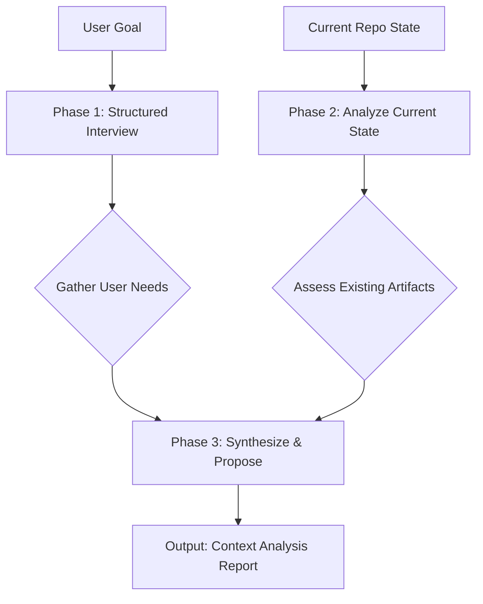

---
metadata:
  status: approved
  version: 1.0
  modules: [context-engineering, planning]
  tldr: "Provides a structured framework and interview templates for the 'investigate-context' command to gather comprehensive requirements before designing a context architecture."
---

# Investigation Guide for Context Engineering

[{! This document is already a guide for an orchestrator/agent, so it aligns well with the new philosophy. I will add a comment to refine its focus slightly. It should be positioned as the manual for the `investigate-context` command, and its output, the "Context Analysis Report," is the comprehensive briefing packet that gets passed to the `context-architecture` command. This makes the workflow explicit. }]

This guide provides the operational framework for the `investigate-context` command. Its purpose is to ensure a systematic and thorough requirements gathering process _before_ any architectural or implementation work begins. A successful investigation phase is the most critical predictor of a successful outcome.

## 1. Core Process

The investigation process consists of a structured interview with the user, followed by an analysis of the existing repository state. The final output is a **Context Analysis Report** that serves as the primary input for the `context-architecture` command.



## 2. Phase 1: The Structured Interview (Ask the User)

The agent must guide the user through a structured interview to elicit all necessary requirements. The agent should ask the following questions, adapting their phrasing to be conversational.

### 2.1. Core Goal & Workflows

- "What is the high-level goal you are trying to achieve? What business problem are you solving?"
- "Describe the primary workflow. What is the sequence of actions that will use these new agents/commands?"
- "Who are the primary users of this system (e.g., developers, data analysts, non-technical users)?"

### 2.2. Inputs, Outputs, and Interfaces

- "What are the expected inputs for this workflow? (e.g., a file, a user prompt, a ticket URL)"
- "What is the desired final output or artifact? (e.g., a report, a pull request, a deployed service)"
- "How should this output be structured? Please provide an example if possible."

### 2.3. Roles and Specializations

- "What distinct roles or specializations are involved in this workflow? (e.g., 'a planner', 'a coder', 'a reviewer', 'a data analyst')."
- "For each role, what specific tasks would it be responsible for?"
- "What tools would each specialist need to perform its task?"

### 2.4. Success Criteria and Validation

- "How will we know when this task is successfully completed? What are the acceptance criteria?"
- "What is the best way to automatically validate the correctness of the final output? (e.g., a unit test, a linting rule, a schema validation, a human review checklist)." (Reference `self-validating-workflows.md`)

## 3. Phase 2: Analyze Current State (Read the Repo)

After gathering user requirements, the agent must analyze the existing repository to understand the current context.

1.  **Analyze Existing Artifacts**:
    - Scan the `.claude/` directory for existing agents, commands, and skills that might be reusable or conflicting.
    - Review the root `CLAUDE.md` to understand the project's established architecture and conventions.
2.  **Analyze Repo Structure & Tech Stack**:
    - Identify the primary programming languages, frameworks, and package managers.
    - Review the `00_DOCS/` and `01_SPECS/` directories to understand existing team patterns and documentation standards. [[! We should analyze DOCS and SPECS in modules and skill folder]]

## 4. Phase 3: Synthesize and Propose (Generate the Report)

The final step is to synthesize the findings from the interview and the state analysis into a comprehensive **Context Analysis Report**. This report is the key handoff document to the `context-architecture` phase.

### Context Analysis Report Template

```markdown
# Context Analysis Report

## 1. Requirements Summary (User Needs)

- **Goal**: [Summary of the user's high-level goal]
- **Workflow**: [Description of the required workflow sequence]
- **Inputs**: [List of inputs]
- **Outputs**: [Description and/or schema of the desired output]
- **Success Criteria**: [List of acceptance criteria for the final outcome]

## 2. Current State Assessment

- **Existing Relevant Artifacts**: [List of reusable/conflicting agents, commands]
- **Repo Tech Stack**: [Languages, frameworks identified]
- **Architectural Constraints**: [Key rules and conventions from `CLAUDE.md`]

## 3. Proposed High-Level Architecture

- **Proposed Agent Team**: [A list of the recommended specialist agents and their roles]
- **Proposed Orchestration Pattern**: [Recommendation of a sequential, hierarchical, or parallel pattern]
- **Identified Artifacts to Create**: [List of new agents, commands, and skills to be built]
- **Proposed Validation Strategy**: [The recommended approach for automatic validation]
```

This structured investigation process ensures that all context engineering work is grounded in a solid foundation of well-understood requirements and a clear plan for success.
