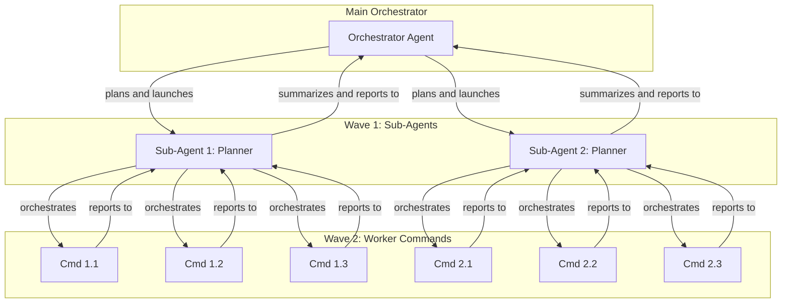

# Parallel Execution: The Wave-Based Model

## 1. Core Philosophy

**CRITICAL PRINCIPLE**: LLMs are "autocomplete on steroids" - they excel at following logical, sequential patterns. Parallel execution is used ONLY for **independent context gathering and research**, NOT for document generation, instruction feeding, or any work that benefits from sequential building.

Parallel execution is the primary mechanism for achieving speed and efficiency in this framework. By breaking down large tasks into smaller, independent units of work that can be executed concurrently, we can dramatically reduce the total time to completion. However, this parallelism must be applied correctly:

- ✅ **Use Parallel Execution For**: Delegating independent research, context gathering, code analysis, pattern investigation to subagents
- ❌ **Do NOT Use Parallel Execution For**:
  - Generating documents that inform each other
  - Creating artifacts that build upon each other
  - Providing instructions that build sequentially
  - Any work that requires sequential thinking

**Sequential vs Parallel: When to Use Which**

> **📖 FOUNDATION**: For the complete philosophy of sequential thinking and why LLMs excel at sequential patterns, see **SKILL.md → Section "The Sequential Thinking Principle" (lines 25-65)**. That section is the single source of truth for the core philosophy.

**Quick Summary for Orchestrators**:
- **Parallel**: Use ONLY for independent research/context gathering (subagents analyzing different modules, gathering different data)
- **Sequential**: Use for EVERYTHING that builds upon itself (document generation, instruction feeding, synthesis, reporting)

**Why Parallel Context Gathering Works**:
- Main context stays clean
- Research happens in isolated contexts
- Reports provide high-signal summaries
- Main agent then processes reports sequentially and generates sequentially

## 2. The Wave Strategy

A "wave" is a set of 1 to 10 independent tasks (commands or agents) that are launched simultaneously by an orchestrator. The orchestrator waits for all tasks in a wave to complete and return their reports before synthesizing the results and planning the next wave.

### Key Concepts

- **Partitioning:** Before launching a wave, the orchestrator must partition the workload. This is done by assigning each task a unique, non-overlapping scope. Common partitioning strategies include:
  - **By Directory:** Agent 1 analyzes `/src`, Agent 2 analyzes `/tests`.
  - **By File Type:** Command 1 processes `*.js`, Command 2 processes `*.css`.
  - **By Concern:** Agent 1 audits for security, Agent 2 audits for performance.
- **Dependency Management:** If Task C depends on the output of Tasks A and B, the orchestrator must place A and B in Wave 1, and place Task C in Wave 2. This ensures dependencies are met before a task begins.

## 3. Hierarchical Scaling to Bypass Concurrency Limits

The hard limit for concurrent operations is 10. To perform massive-scale analysis (e.g., across hundreds of directories), we use **Sub-Agent Scaling**.

- **The Strategy:** The main orchestrator launches a sub-agent. This sub-agent, running in its own isolated context, then acts as a _secondary orchestrator_, launching its own wave of up to 10 parallel worker commands or agents.
- **Benefit:** This allows for exponential scaling. An orchestrator can launch 10 sub-agents, and each of those can launch 10 worker commands, resulting in 100 parallel operations.

### Hierarchical Scaling Diagram

## 4. Architectural Patterns for Parallelism

### The "Investigator" Pattern

- **Use Case:** Preparing a clean context for a complex task.
- **Execution:** A single `Investigator Agent` is launched in Wave 1. It performs a broad but shallow scan of the repository to identify all files and code sections relevant to the upcoming task. Its report is a high-signal "map" for the next wave.
- **Example:** For a feature request, the Investigator finds all relevant API endpoints, data models, and UI components, returning a list of `file:line` references.
- **Key Point:** The investigator gathers context in parallel/isolation, then the main agent uses this context to generate documents sequentially.

### The "Hierarchical Research" Pattern

- **Use Case:** Large-scale analysis or refactoring.
- **Execution:** The orchestrator launches a `Research Planner Agent` (Sonnet) in Wave 1. In Wave 2, the Planner launches a massive wave of simple `Analysis Commands` (Haiku), each partitioned to a specific directory. The Planner then aggregates the reports from all the workers into a single summary.
- **Example:** To find all uses of a deprecated function, the Planner launches 20 commands, each searching one directory. It then combines the 20 small reports into one master list.
- **Key Point:** All research happens in parallel, but the final synthesis and document generation happens sequentially in the main agent.

### The "Context Gathering" Pattern (Recommended)

- **Use Case:** Gathering diverse context needed for architecture design or complex task.
- **Execution:** Main agent launches multiple subagents in parallel, each gathering specific context:
  - Sub-Agent 1: Investigate codebase structure
  - Sub-Agent 2: Analyze existing patterns
  - Sub-Agent 3: Research best practices
  - Sub-Agent 4: Review similar implementations
- **Synthesis:** Main agent receives all reports, synthesizes findings, then generates documents sequentially (foundation → details → integration).
- **Example:** For architecture design, launch 3-5 investigator subagents in parallel to gather context, then generate architecture documents one at a time, building upon each other.
