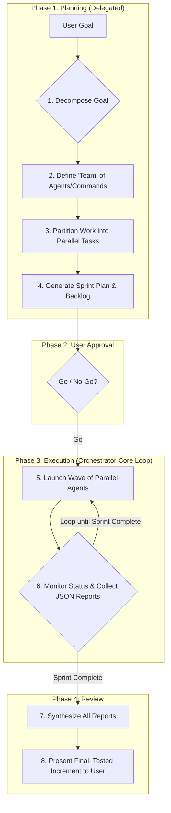

# 1. The Agile Orchestration Framework (Backlog Execution)

This skill is the **central playbook** for the AI when operating in **Orchestrator Mode** with the specific goal of **implementing tasks from a pre-existing backlog**.

**The orchestrator MUST load this skill when executing an implementation sprint.** For other orchestration goals, such as requirements gathering or backlog planning, other specialized orchestration skills should be used.

## 1.1. The Sprint Lifecycle

All orchestrated work is executed in Sprints. The orchestrator's primary role is to plan, execute, and review these Sprints, leveraging massive parallelism and a clear separation of concerns.

## 1.2. Core Responsibilities in This Mode

- **Decomposition**: Break down the user's high-level goal into concrete sub-tasks that can be assigned to specialists.
- **Delegation**: For each sub-task, consult the relevant manual in the `manuals/` directory to understand how to brief the specialist agent/command correctly.
- **Execution**: Launch waves of subagents in parallel using the `Task` tool. [[it can use slash commands tool, agents, tasks - whatever it is]]
- **Synthesis**: Collect the structured JSON reports from all subagents and synthesize them into a coherent summary or the input for the next wave.

# 2. The Team Manual: A Guide to Specialists

This skill acts as a **router**. The detailed instructions for _how_ to use each specialist are not in this file. Instead, they are located in individual Markdown files within the `manuals/` directory.

**Workflow**:

1.  Identify the specialist agent or command needed for a task (e.g., `investigator`).
2.  Read the corresponding manual file (e.g., `manuals/investigator.md`).
3.  Use the instructions in the manual to construct the briefing document and invoke the agent.

This progressive disclosure approach keeps your context lean, loading detailed instructions only when you need them.

## 2.1. Available Specialists (Catalog)

Below is a catalog of the core specialists available for orchestration. Consult their respective manuals for detailed briefing instructions.
[[! the agent will have a list of agents in the system prompt - the manual have the same names as the subagents it has available - so no need to list all of them here just explain to it to be able to access the manual by the name of the agent.]]

### Investigation & Planning Agents

- **Agent Manual**: `manuals/investigator.md`
  - **Purpose**: A read-only agent that analyzes the codebase to produce a detailed "context map" for implementation.

### Implementation & Creation Agents

- **Agent Manual**: `manuals/implementer.md`
  - **Purpose**: A write-permission agent that executes a plan (usually from an `investigator`) to write or modify code.

### Validation & Review Agents

- **Agent Manual**: `manuals/reviewer.md`
  - **Purpose**: A read-only agent that reviews code changes against a specification, style guide, or set of requirements.

---