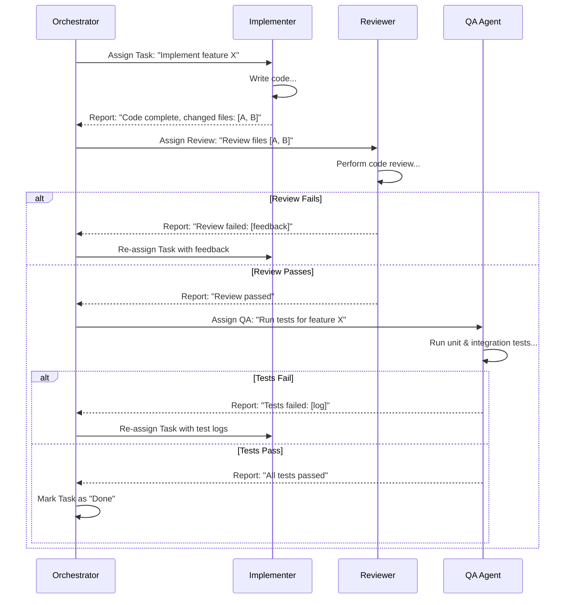

# Sprint Execution Patterns

## 1. The Sprint: The Core Unit of Work

A Sprint is a container for a set of tasks designed to achieve a specific, high-level goal. Unlike a simple "wave," a Sprint is stateful and iterative. It has a clear backlog, defined roles for the agents involved, and a workflow that includes implementation, review, and quality assurance.

**Sprint Types:**
*   **Investigation Sprints:** The goal is to produce a complete project plan, context map, and specifications.
*   **Implementation Sprints:** The goal is to produce working, tested, and reviewed code that meets the specifications.
*   **Refactoring Sprints:** The goal is to improve the internal quality of the codebase without changing its external behavior.

## 2. The Sprint Team: Specialized Agent Roles

Each Sprint is executed by a "team" of specialized agents, coordinated by the main Orchestrator.

*   **Orchestrator (Scrum Master):** Plans the sprint, manages the backlog, assigns tasks, and communicates with the user.
*   **Investigator Agent:** Scans the repository to gather context and create the initial "context map" for other agents.
*   **Implementer/Coder Agent:** Writes the code to satisfy the task requirements and pass the associated tests.
*   **Reviewer Agent:** Performs a code review, checking for quality, style, and adherence to architectural principles.
*   **QA Agent:** Runs automated tests (unit, integration, etc.) to validate that the implementation is correct and has not introduced regressions.

## 3. The Sprint Workflow: From `To Do` to `Done`

The Orchestrator manages tasks through a lifecycle, ensuring each piece of work is properly implemented, reviewed, and tested before being considered complete.

### The Definition of Done

A task is only considered **Done** when it has successfully passed through the Implementation, Review, and QA stages. The Orchestrator is responsible for enforcing this quality gate.

## 4. Sprint Planning & State Management

To manage the state of a Sprint, the Orchestrator creates a dedicated directory for it (e.g., `.sprints/sprint-001/`). This directory contains:

*   `backlog.md`: The list of all tasks to be completed in the sprint.
*   `plan.md`: The overall strategy, including agent assignments and dependencies.
*   `context-map.md`: The initial context map created by the Investigator agent.
*   `reports/`: A subdirectory where all reports from all agents are stored for auditability.

This makes the Sprint a persistent, auditable entity that can even survive multiple sessions.
