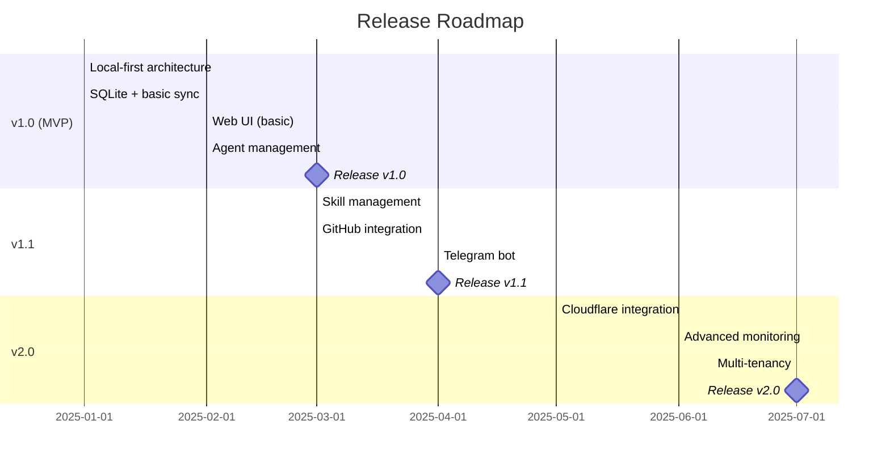

---
metadata:
  status: DRAFT
  version: 0.4
  modules: [product, requirements]
  tldr: "Product Requirements - Local-first multi-agent orchestration with safety, quota, automation"
---

# CCM Orchestrator - Product Requirements Document

## Product Vision

**Local-first multi-agent task orchestration** with optional cloud sync. Run autonomous coding agents (Claude Code, Gemini CLI) on your machine or server fleet, managed via local web UI or remote Supabase hub.

## Core Principle

**Works completely offline**. Supabase is optional for:
- Multi-system coordination
- Remote task delegation
- Central skill management
- Mobile/voice interfaces

## Target Users

| Persona | % | Primary Use Case |
|---------|---|------------------|
| **Developers** | 50% | Autonomous coding across multiple repos |
| **DevOps** | 30% | Server fleet monitoring & auto-remediation |
| **Business Users** | 20% | Voice-driven content creation |

## Core Features

###  Local-First Architecture

**✓ SQLite primary database** - All data local, works offline
**✓ Local Web UI** - Manage tasks at localhost:8765
**✓ Optional Supabase sync** - Multi-system coordination when needed
**✓ Seamless UX** - User doesn't see local vs remote distinction

### Agent Management

**✓ Process supervision** - systemd/launchd ensures 24/7 daemon operation
**✓ tmux-based isolation** - One window per agent/project (supervised by systemd/launchd)
**✓ Hook-based monitoring** - Claude Code hooks write structured events to SQLite
**✓ Multiple CLI support** - Claude Code, Gemini CLI, custom agents
**✓ Resource limits** - Configurable max concurrent agents
**✓ Auto-cleanup** - Idle agent termination

### Configuration Profiles

**Full** (Mac/Desktop): Web UI + daemon + full sync (~200MB base RAM)
**Minimal** (Linux servers): Daemon only, CLI management (~50MB base RAM)

### Agent Patterns

**✓ Worker agents** - Execute tasks (headless JSON mode, interactive mode, hybrid)
**✓ Supervisory agents** - Monitor execution, analyze quality, write reports
**✓ Manager agents** - Cross-system monitoring, alerting (Telegram/Slack)
**✓ Meta-agent pattern** - Agents monitoring and adjusting other agents

### Monitoring & Observability

**✓ Hook-based events** - Structured JSON events for all agent actions
**✓ Real-time dashboards** - Web UI shows live agent activity
**✓ Supervisory reports** - Automated quality assurance per task/project
**✓ Alert system** - Critical events trigger immediate notifications
**✓ Performance analytics** - Task duration, success rates, resource usage

### Sync Strategies

**✓ Adaptive sync** - Periodic (15-30min) + threshold (N ops) + urgent events
**✓ Batch packaging** - Aggregate local details → summary for Supabase
**✓ Offline resilience** - Queue operations, drain when connected
**✓ Configurable modes** - Aggressive, balanced, conservative sync profiles

### Task Orchestration

**✓ Database-driven workflows** - SQLite state machine triggers next stages
**✓ Context-aware routing** - Tasks route to systems with required project context
**✓ Priority queue management** - Urgent, high, normal, low priority levels
**✓ Local task execution** - Instant, no network required
**✓ Remote task delegation** - Intelligent routing to distributed systems
**✓ Offline queue** - Tasks queued when disconnected, sync later
**✓ Predefined patterns** - Simple, chain, parallel, conditional workflows

### Skill Management

**✓ Central skill repository** - Store in Supabase (optional)
**✓ Auto-sync** - Pull skill updates every 60s
**✓ File-based** - Skills written to `.claude/skills/`
**✓ New agents only** - Running agents unaffected by updates

### Safety & Sandboxing

**✓ Git worktree isolation** - Each task in dedicated working directory
**✓ Filesystem isolation** - Agents cannot access outside worktree
**✓ Git operation restrictions** - No push, no branch switching, no submodules
**✓ Resource limits** - Max worktree size, file size, commits per task
**✓ Auto-cleanup** - Stale worktrees removed after 7 days
**✓ Snapshot rollback** - Auto-snapshots every 10 commits
**✓ Branch management** - Dedicated branches (ccm/task-{id}) per task
**✓ Merge approval flow** - User reviews changes before merging to main

### Quota Management

**✓ ccusage integration** - Real-time quota detection (primary method)
**✓ Conservative fallback** - Proactive limits when ccusage unavailable
**✓ Auto-pause** - Agents pause at 90% quota usage
**✓ Auto-resume** - Tasks resume after quota reset
**✓ Dashboard visibility** - Real-time quota status in Web UI
**✓ Multi-channel alerts** - Desktop, Telegram, Slack notifications
**✓ Manual controls** - Force pause/resume overrides
**✓ Configurable thresholds** - Warning at 50%, critical at 90%

### Automation Framework

**✓ Hook-based extensions** - Custom automations triggered by 9 Claude Code hooks
**✓ Standard interfaces** - Simple shell script API for automation development
**✓ Security guards** - Example: Block dangerous bash commands
**✓ Git checkpoints** - Example: Auto-commit after N file edits
**✓ Context injection** - Example: Add project context to prompts
**✓ Extension points** - `~/.ccm/automations/enabled/` directory
**✓ Shared libraries** - Common utilities and database helpers

### Integrations

**✓ GitHub** - Webhooks for CI/CD automation
**✓ Telegram** - Voice interface for business users
**✓ Prometheus** - Auto-remediation for DevOps
**✓ n8n/make.com** - Webhook triggers
**✓ Cloudflare** (Post-MVP) - Workers API gateway, Tunnel

## Success Metrics

**Adoption**:
- Active systems: 100+
- Projects managed: 500+
- Tasks/day: 1000+

**Performance**:
- Task success rate: >95%
- Average execution time: <5min
- System uptime: >99%

**Business Impact**:
- Time saved: 10+ hrs/week per user
- Cost reduction: 30%+
- Error rate reduction: 50%+

## Release Roadmap

## Technical Stack

**Core (Required)**:
- Python 3.9+ (FastAPI, libtmux)
- SQLite 3
- systemd (Linux) / launchd (macOS)

**Optional**:
- Supabase (PostgreSQL + Realtime)
- Cloudflare Workers/Tunnel (Post-MVP)

**Distribution**:
- PyPI package
- CLI: `ccm-orchestrator`

## Resource Requirements

See: [resource-requirements.md](./resource-requirements.md)

**Summary**:
- **Full profile**: ~200MB base + 150MB per agent
- **Minimal profile**: ~50MB base + 150MB per agent
- **Recommended**: 4GB RAM, 4 cores for 5-10 concurrent agents

## Security Model

**Local**:
- SQLite file permissions (user-only)
- Localhost-only FastAPI (port 8765)
- Encrypted JWT storage

**Supabase**:
- User authentication (email/password/2FA)
- Row-Level Security (RLS)
- User-scoped access only

**Agents**:
- tmux window isolation
- Working directory isolation
- Tool permission limits

## Non-Goals (Out of Scope for v1.0)

- ✗ Distributed task scheduling (Kubernetes-style)
- ✗ Built-in LLM model hosting
- ✗ Windows support (deferred to v2.0)
- ✗ Multi-tenancy SaaS (personal/team use only)

---

**Status**: DRAFT
**Version**: 0.4
**Last Updated**: 2025-11-17

**Key Enhancements in v0.4**:
- Safety & Sandboxing (git worktree isolation, filesystem restrictions, rollback mechanisms)
- Quota Management (ccusage integration, auto-pause/resume, multi-channel alerts)
- Automation Framework (hook-based extensions, 9 Claude Code hooks, example automations)
- 4-stage execution cycle (Planning → Executing → Reviewing → Verifying)
- Complete Claude Code hook schemas (PreToolUse, PostToolUse, etc.)

**Enhancements from v0.3**:
- Hook-based monitoring (structured events, not terminal scraping)
- Context-aware intelligent routing
- Database-driven orchestration (SQLite as control plane)
- Supervisory & manager agent patterns
- Adaptive sync strategies (periodic + threshold + event-driven)
