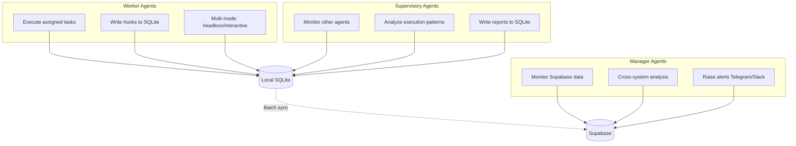
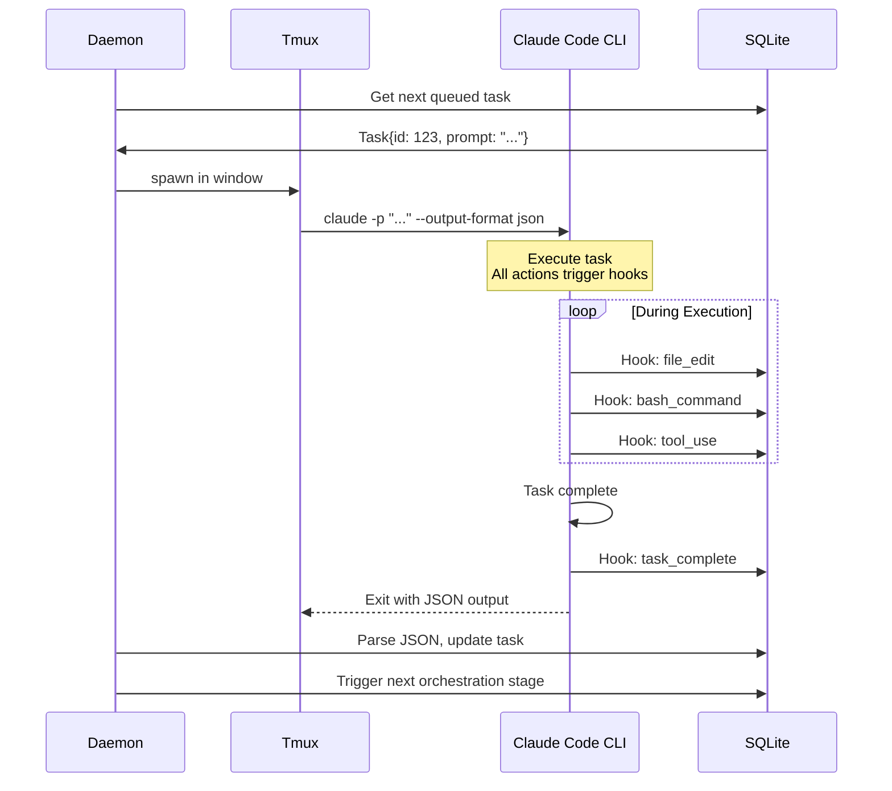
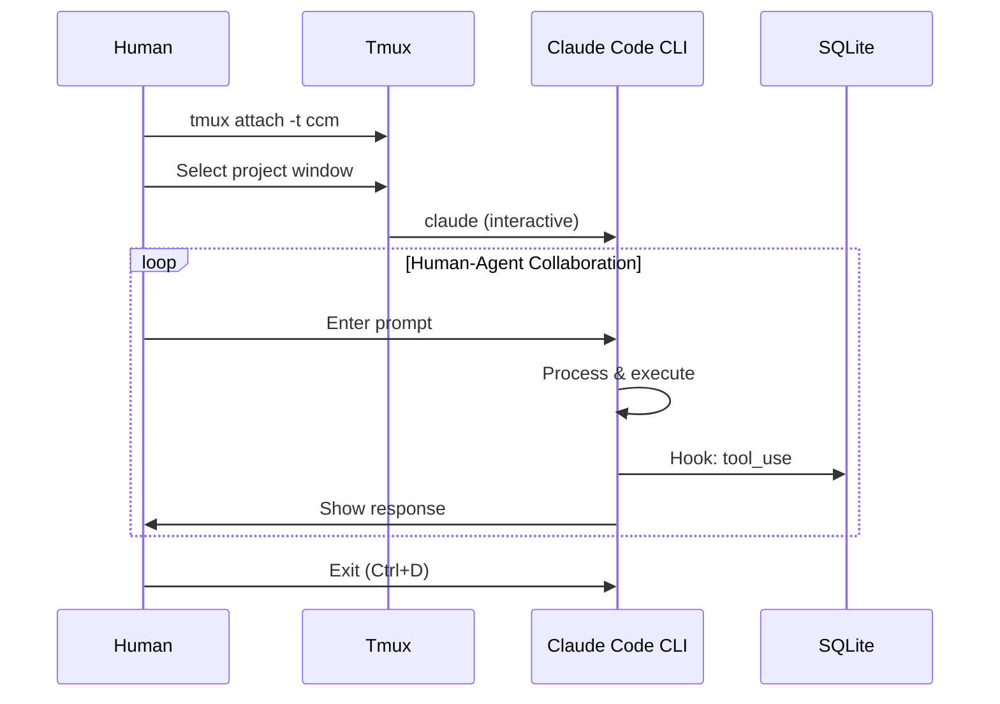
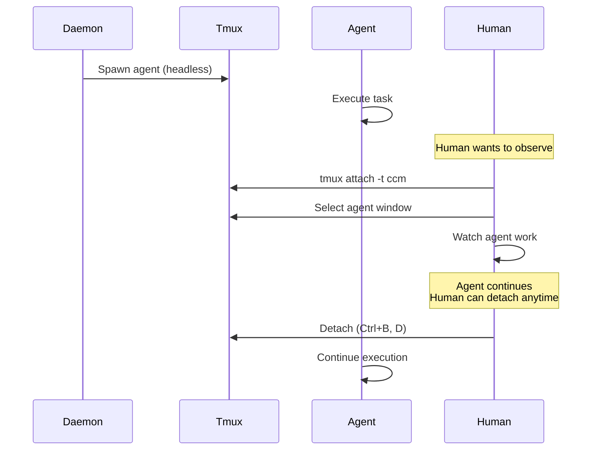
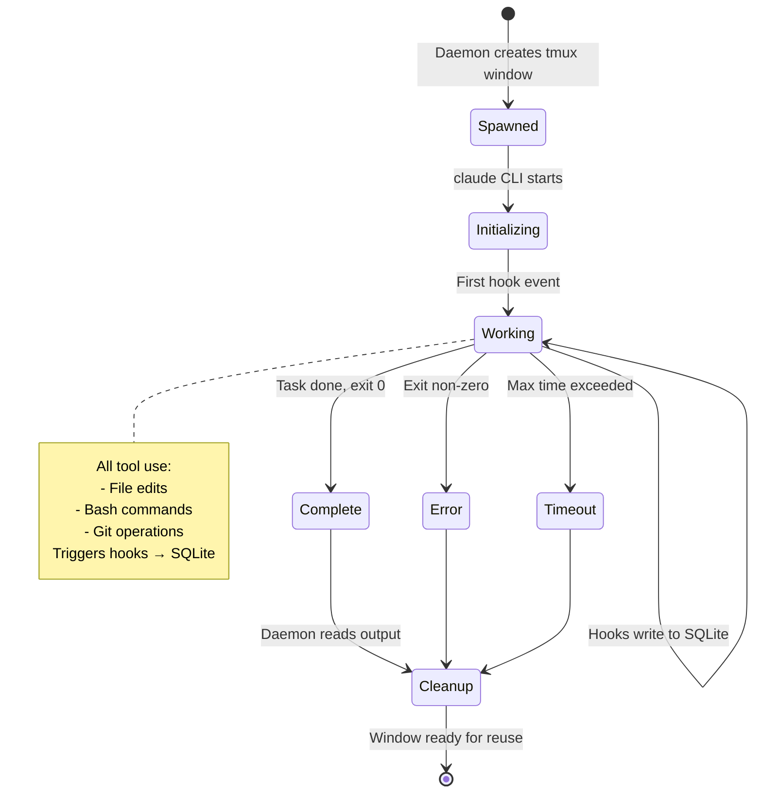
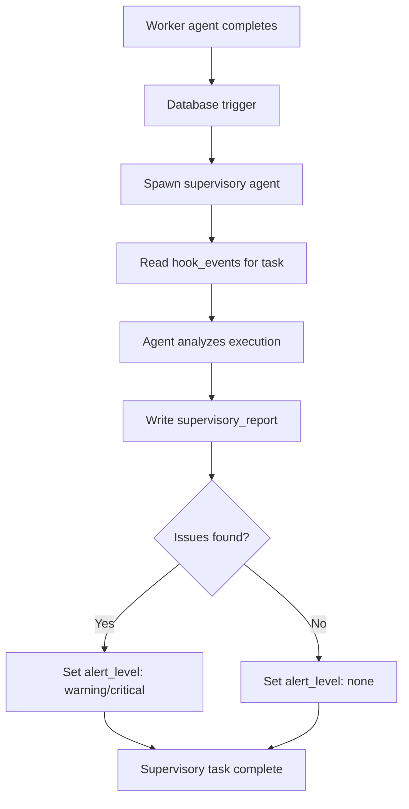
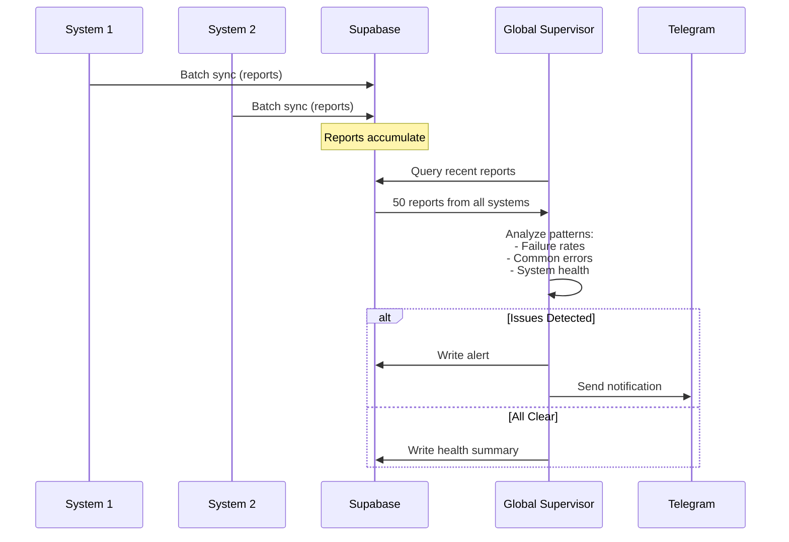
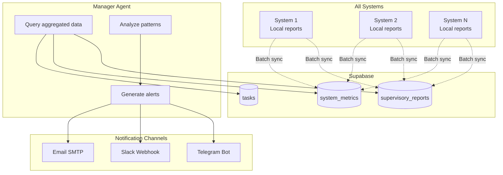
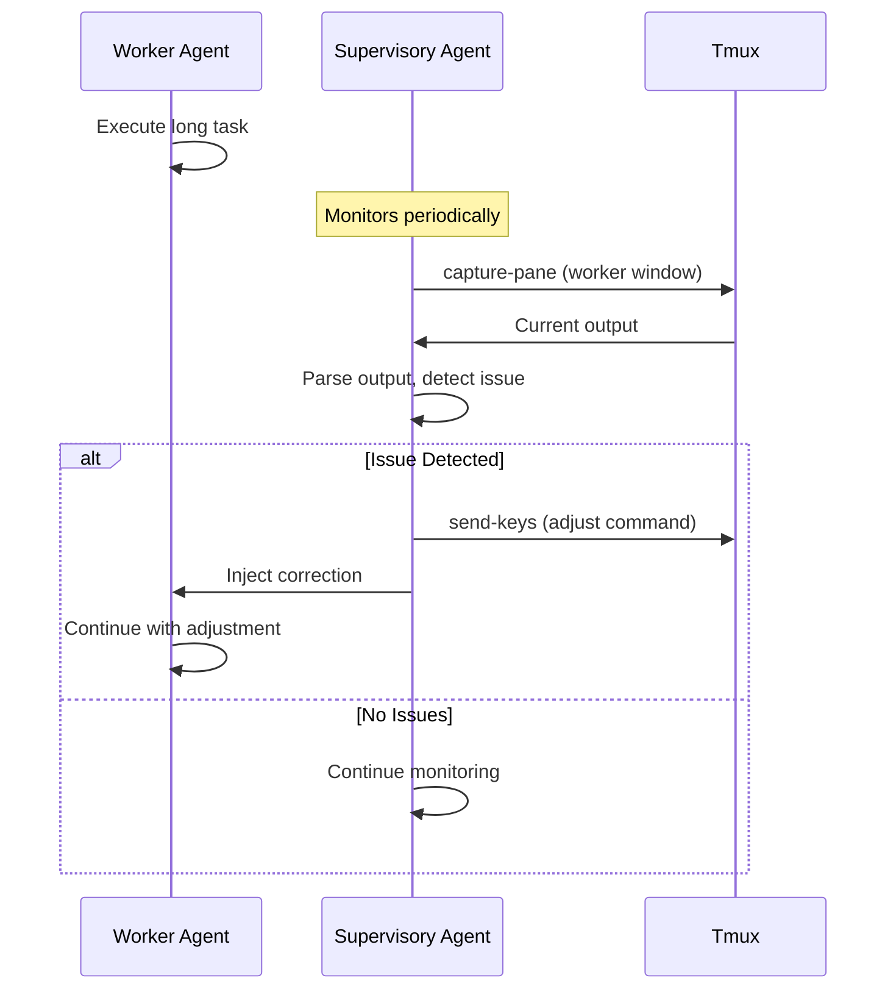

---
metadata:
  status: DRAFT
  version: 0.3
  tldr: "Worker, supervisory, and manager agent patterns"
  dependencies: [architecture-principles.md, monitoring-architecture.md]
---

# Agent Patterns

## Overview

CCM Orchestrator supports three agent archetypes, each with distinct responsibilities and execution modes.



## 1. Worker Agents

**Primary function**: Execute assigned tasks

### Execution Modes

#### Headless Mode (JSON Output)


**Command pattern**:
```bash
claude -p "Review PR #123 and summarize findings" \
  --output-format json \
  --max-turns 10 \
  --system-prompt-file /opt/ccm/prompts/pr-reviewer.md \
  --allowedTools "Read,Bash(git:*)"
```

**Key characteristics**:
- Non-interactive (no human input)
- Structured JSON output
- Hook events write to SQLite
- Exit code indicates success/failure
- Output parsed by daemon

#### Interactive Mode


**Command pattern**:
```bash
# No flags - full interactive mode
claude
```

**Key characteristics**:
- Full interactivity
- Human can observe and intervene
- Hooks still write to SQLite
- Useful for debugging, exploration
- Can be long-lived session

#### Hybrid Mode (Detached Monitoring)


**Key characteristics**:
- Agent runs headless in tmux
- Human can attach to observe
- Agent unaffected by attach/detach
- Best of both worlds

### Worker Agent Lifecycle



### Hook Integration

**All hooks write structured events**:
```
hook_events table:
- id: auto-increment
- agent_id: "agent-project-1"
- task_id: 123
- hook_type: "tool_use", "file_edit", "error", etc.
- timestamp: 2025-11-17 10:30:15
- data: JSON blob with details
```

**Example hook data**:
```json
{
  "hook_type": "file_edit",
  "tool": "Edit",
  "file_path": "/path/to/file.py",
  "old_content_hash": "abc123",
  "new_content_hash": "def456",
  "lines_changed": 15
}
```

## 2. Supervisory Agents

**Primary function**: Monitor other agents, write reports

### Local Supervisory Pattern



**Launch pattern**:
```bash
# Daemon spawns supervisory agent
claude -p "Analyze the execution of task #123. \
Review all hook events and determine if the task \
was executed correctly. Output structured report." \
  --output-format json \
  --max-turns 5 \
  --system-prompt-file /opt/ccm/prompts/task-supervisor.md \
  --allowedTools "Read"
```

**Supervisory agent prompt template**:
```markdown
You are a supervisory agent analyzing task execution.

Task ID: {task_id}
Task type: {task_type}
Execution time: {duration}

Hook events:
{hook_events_json}

Analyze:
1. Was the task executed correctly?
2. Were appropriate tools used?
3. Were there any errors or warnings?
4. Were file changes reasonable?
5. Overall execution quality (1-10)

Output JSON:
{
  "quality_score": 8,
  "issues": [],
  "recommendations": [],
  "alert_level": "none"
}
```

**Report written to SQLite**:
```
supervisory_reports table:
- id: auto-increment
- task_id: 123
- agent_id: "supervisor-local"
- scope: "task"  # or "project", "system"
- quality_score: 8
- issues: JSON array
- recommendations: JSON array
- alert_level: "none", "info", "warning", "critical"
- created_at: timestamp
```

### Global Supervisory Pattern



**Global supervisor launch** (on central system or any system):
```bash
# Periodic task (every hour)
claude -p "Review all supervisory reports from the last hour. \
Identify patterns, common issues, systems with problems. \
Output structured analysis." \
  --output-format json \
  --max-turns 10 \
  --system-prompt-file /opt/ccm/prompts/global-supervisor.md \
  --allowedTools "Read"
```

### Per-Project Supervisory

**Scope**: Monitor all tasks for a specific project

**Trigger**: Daily, weekly, or after N tasks completed

**Analysis**:
- Task success rate for project
- Common errors
- Agent performance trends
- Code quality changes over time

**Use case**: "Is my project's automated maintenance working well?"

### Per-Task Supervisory

**Scope**: Monitor a single task execution

**Trigger**: Immediately after task completes

**Analysis**:
- Was task executed correctly?
- Were appropriate tools used?
- Execution efficiency

**Use case**: "Did this specific PR review work correctly?"

## 3. Manager Agents

**Primary function**: Cross-system monitoring, alerting

### Architecture



### Manager Agent Triggers

**Periodic** (cron-style):
- Every hour: Health check
- Every 4 hours: Performance analysis
- Daily: Digest report
- Weekly: Trend analysis

**Event-driven**:
- Critical error logged anywhere
- System goes offline >5 min
- Task failure rate >10% in last hour
- Unusual resource usage

### Manager Agent Prompts

**Health Check**:
```markdown
Analyze system health across all systems.

Systems: {system_count}
Active tasks: {active_task_count}
Completed tasks (last hour): {completed_count}
Failed tasks (last hour): {failed_count}

Recent supervisory reports:
{reports_json}

Determine:
1. Overall fleet health (healthy/degraded/critical)
2. Systems needing attention
3. Recommended actions

If health is degraded or critical, raise alert.
```

**Performance Analysis**:
```markdown
Analyze task execution performance across all systems.

Task completion times (last 4 hours):
{task_times_json}

Resource usage:
{resource_usage_json}

Determine:
1. Slowest systems
2. Bottlenecks
3. Optimization opportunities

Output recommendations.
```

**Anomaly Detection**:
```markdown
Analyze for anomalies in the last hour.

Expected patterns:
- Task success rate: >95%
- Avg execution time: <5 min
- Systems online: All

Actual data:
{metrics_json}

Detect anomalies and explain likely causes.
If critical, raise alert immediately.
```

### Alert Levels

**INFO**: Informational, no action needed
- Daily digest
- Performance summary
- Trend reports

**WARNING**: Needs attention, not urgent
- Task success rate 85-95%
- One system offline
- Slow performance

**CRITICAL**: Immediate attention required
- Task success rate <85%
- Multiple systems offline
- Security event detected
- Data loss risk

### Notification Format

**Telegram message**:
```
🔴 CRITICAL ALERT

System: mac-pro-office
Issue: High task failure rate (15% in last hour)
Failed tasks: 12 out of 80

Likely cause: Git authentication failure

Action needed: Check git credentials on system

View details: http://localhost:8765/system/mac-pro-office
```

**Slack webhook**:
```json
{
  "text": "⚠️ WARNING: System performance degraded",
  "attachments": [
    {
      "color": "warning",
      "fields": [
        {"title": "System", "value": "ubuntu-server-2", "short": true},
        {"title": "Issue", "value": "Slow task execution", "short": true},
        {"title": "Avg time", "value": "12 min (expected: 5 min)", "short": true}
      ]
    }
  ]
}
```

## Agent Pattern Comparison

| Aspect | Worker | Supervisory | Manager |
|--------|--------|-------------|---------|
| **Purpose** | Execute tasks | Monitor execution | Cross-system oversight |
| **Scope** | Single task | Task/project/system | All systems |
| **Data source** | Task prompt | hook_events table | Supabase aggregated data |
| **Execution** | Headless or interactive | Always headless | Always headless |
| **Output** | Task results | Supervisory reports | Alerts, digests |
| **Triggers** | Task assignment | Task completion, schedule | Schedule, events |
| **Location** | System with context | Any system, usually local | Any system, often central |
| **Lifespan** | Minutes to hours | Seconds to minutes | Seconds to minutes |

## Implementation Examples

### Worker Agent: PR Review

```bash
claude -p "Review PR #456 in project my-app. \
Analyze code changes, check for issues, \
write summary in .ccm/reports/pr-456-review.md" \
  --output-format json \
  --max-turns 15 \
  --system-prompt-file /opt/ccm/prompts/pr-reviewer.md \
  --allowedTools "Read,Bash(git:*),Write"
```

### Supervisory Agent: Task Quality Check

```bash
claude -p "Task #789 just completed. \
Review hook_events where task_id=789. \
Determine if execution was correct and efficient." \
  --output-format json \
  --max-turns 5 \
  --system-prompt-file /opt/ccm/prompts/task-supervisor.md \
  --allowedTools "Read"
```

### Manager Agent: Fleet Health

```bash
claude -p "Query Supabase for all supervisory reports \
from the last hour. Analyze fleet health. \
Raise alert if any critical issues." \
  --output-format json \
  --max-turns 10 \
  --system-prompt-file /opt/ccm/prompts/fleet-health.md \
  --allowedTools "Read,WebFetch"
```

## Meta-Agent Pattern

**Definition**: Agent monitoring and adjusting other agents

### Use Case: Long-Running Task Adjustment



**Example**:
- Worker agent analyzing logs
- Supervisory agent detects it's stuck in a loop
- Supervisory agent sends Ctrl+C then corrected command
- Worker agent continues with fix

**Caution**: Use sparingly, can be fragile

---

**Status**: DRAFT
**Version**: 0.3
**Last Updated**: 2025-11-17
