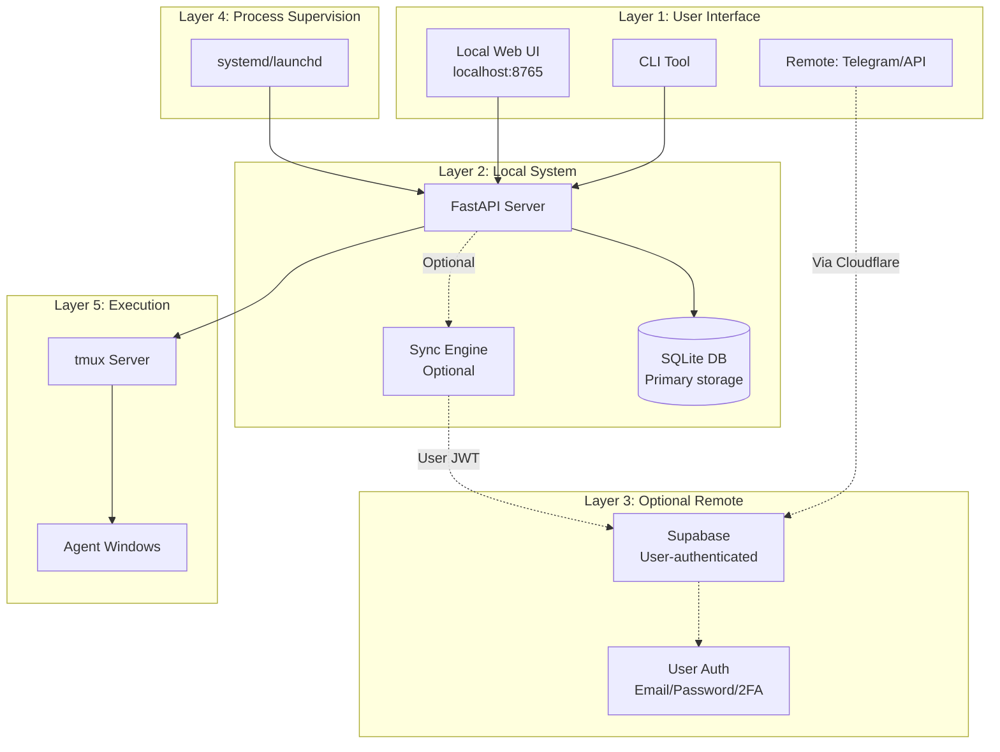
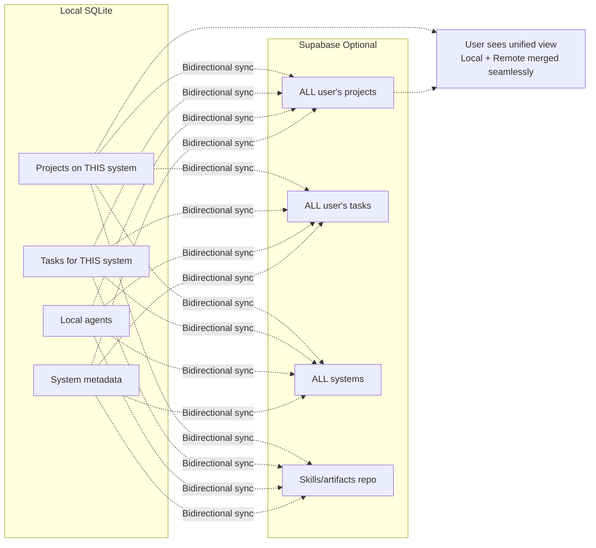
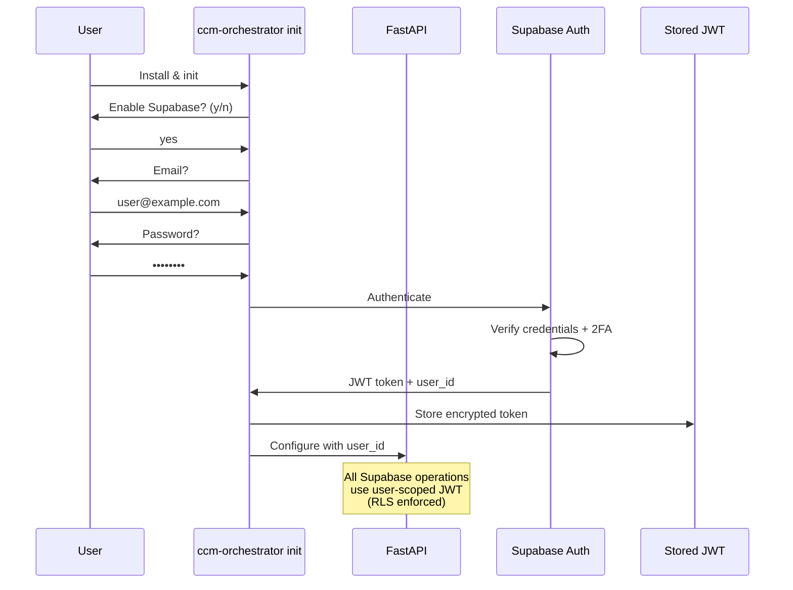
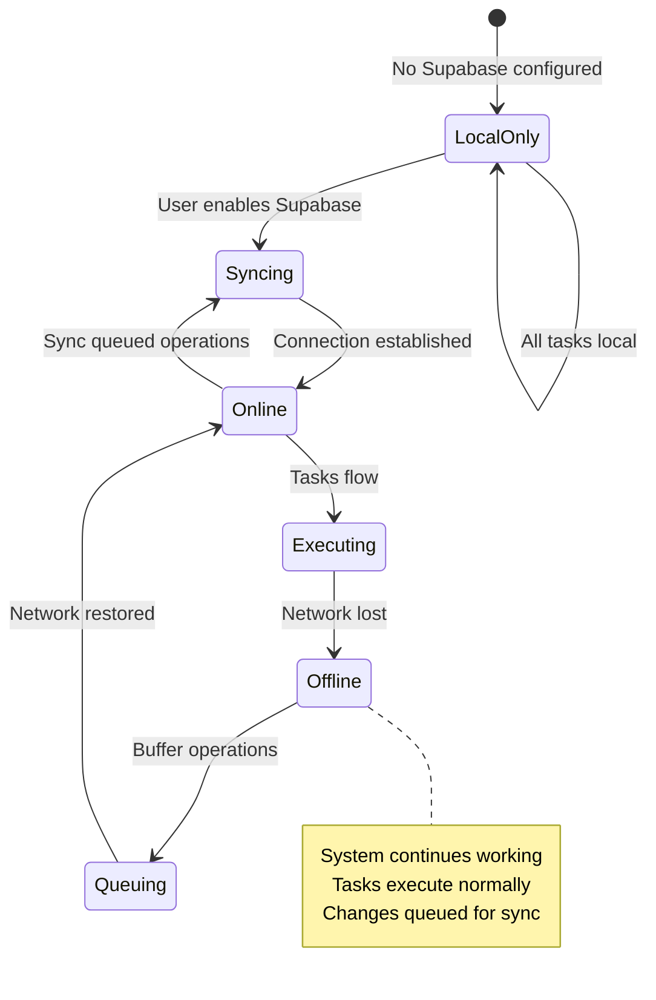

---
metadata:
  status: DRAFT
  version: 0.2
  tldr: "Local-first system architecture with optional Supabase sync"
---

# System Architecture Overview

## Core Principle: Local-First

**CCM Orchestrator works completely offline**. Supabase is optional for remote management and multi-system coordination.

## System Layers



> **IMPORTANT - Process Supervision Model:**
>
> **systemd/launchd is the supervisor** - It ensures the FastAPI daemon runs 24/7, restarts on crash, starts on boot.
>
> **tmux provides isolation** - Each agent runs in its own tmux window for visibility and debugging, but tmux is NOT responsible for keeping processes alive.
>
> **The daemon controls agents** - FastAPI daemon uses libtmux to spawn/monitor/kill agents within tmux windows.
>
> This layered approach combines the robustness of a true service manager (systemd/launchd) with the interactivity and debugging capabilities of tmux. For detailed rationale, see `research/claude-code-cli-tmux-automation.md`.

## Technology Stack

**Core (Required)**:
- **SQLite** - Primary local database
- **FastAPI** - API server + Web UI (localhost:8765)
- **libtmux** - tmux control
- **systemd/launchd** - Process supervision

**Optional**:
- **Supabase** - Remote sync, multi-system coordination
- **Cloudflare Workers/Tunnel** - Production security (post-MVP)

## Local vs Remote Scope



## Supabase Authentication Flow



## Seamless Local/Remote UX

```mermaid
flowchart TD
    User[User creates task] --> WebUI[Local Web UI]
    WebUI --> Detect{Task scope}

    Detect -->|Local project| SQLite[(SQLite)]
    Detect -->|Remote project| Check{Supabase connected?}

    Check -->|Yes| API[FastAPI → Supabase API]
    Check -->|No| Queue[Queue for later sync]

    SQLite --> Execute[Execute locally]
    API --> Broadcast[Broadcast to target system]
    Queue --> Execute

    Execute --> Result[Show result]
    Broadcast --> Result

    Result -.->|User doesn't see difference| User

    Note over Detect,Result: User experience is seamless<br/>System auto-routes operations
```

## Deployment Models

### Local-Only (Offline)

- Single machine
- SQLite database
- No network required
- Web UI at localhost:8765

### Local + Supabase (Multi-System)

- Multiple machines
- SQLite on each + Supabase central hub
- User-scoped authentication
- Remote task delegation

### Production (with Cloudflare)

- Cloudflare Workers - API gateway
- Cloudflare Tunnel - Secure FastAPI exposure
- Enhanced security, load balancing
- **Post-MVP enhancement**

## Offline Resilience



## Security Model

**Local Security**:
- SQLite file permissions (user-only access)
- Encrypted JWT token storage
- Localhost-only FastAPI (port 8765)

**Supabase Security**:
- User authentication (email/password/2FA)
- JWT tokens (user-scoped)
- Row-Level Security (RLS)
- Users only see their own data

**Agent Isolation**:
- Separate tmux windows per project
- Working directory isolation
- Tool permission limits

## Extension Points

**CLI Agents**: Claude Code CLI, Gemini CLI, custom agents
**Integrations**: GitHub, Telegram, Slack, Prometheus, n8n, make.com
**Skills**: Central repository in Supabase, auto-sync to local `.claude/`
**Webhooks**: Trigger external systems from agents

See: [integrations.md](./integrations.md), [skill-management.md](./skill-management.md)

---

**Status**: DRAFT
**Version**: 0.2
**Last Updated**: 2025-11-17
