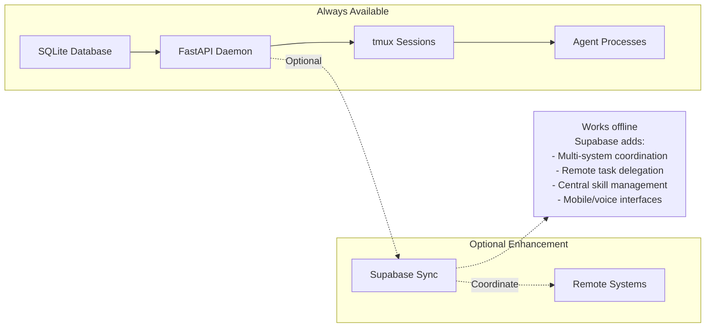
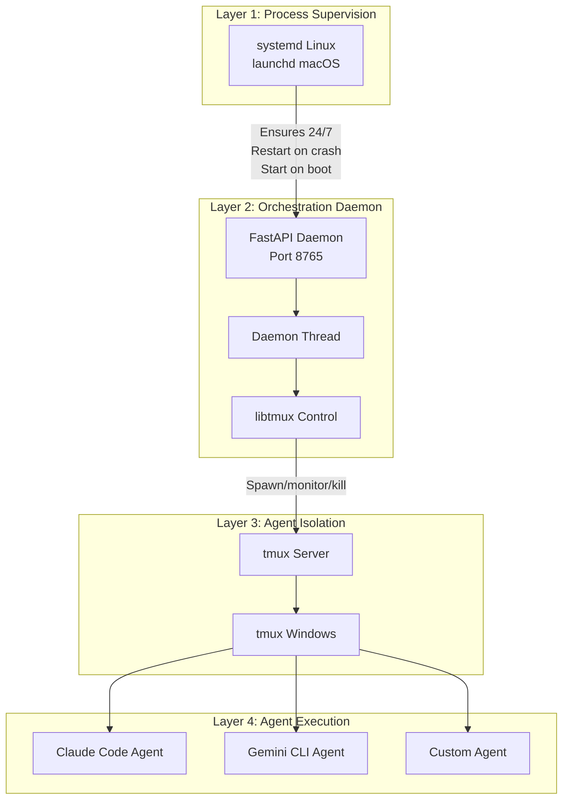
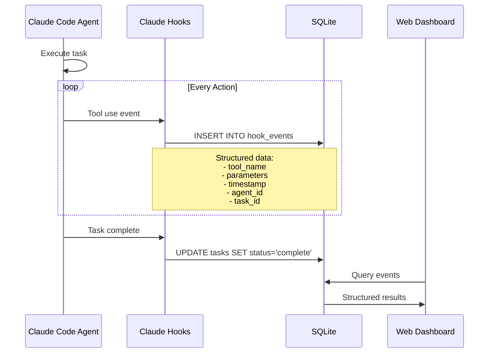
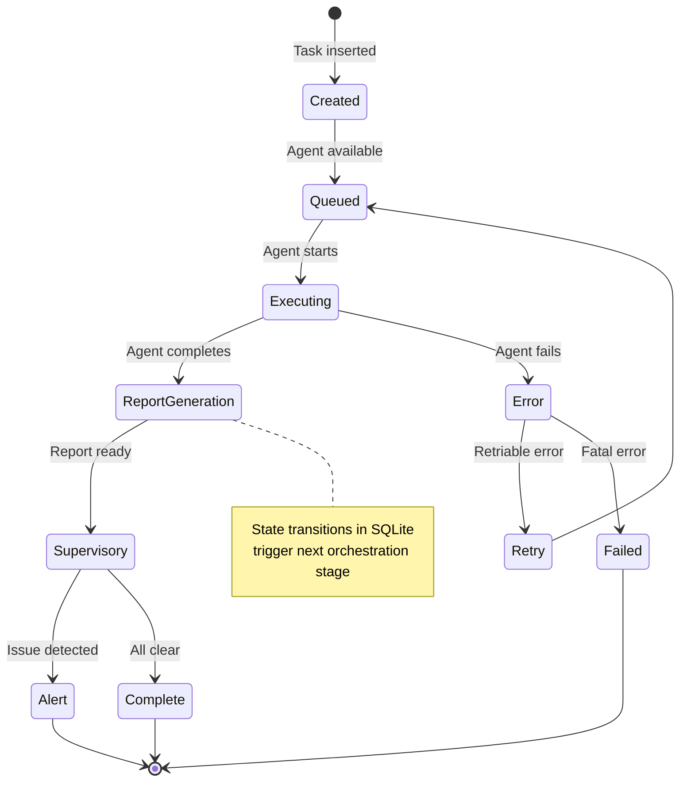
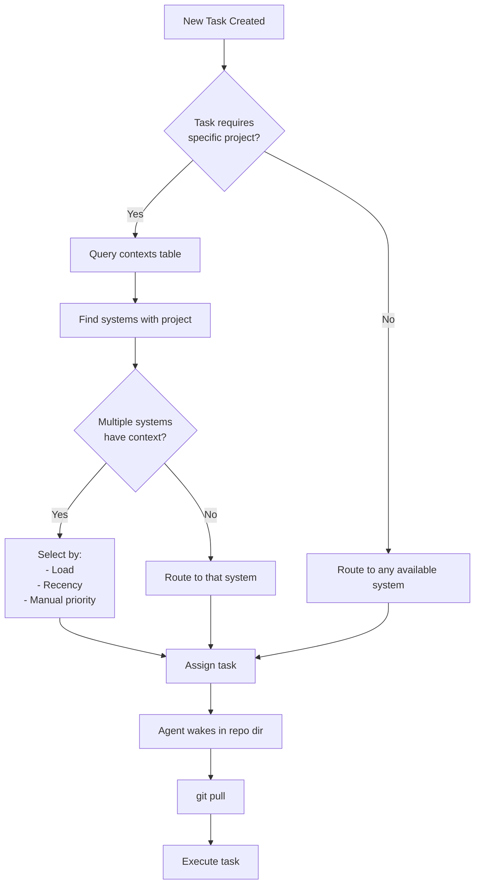
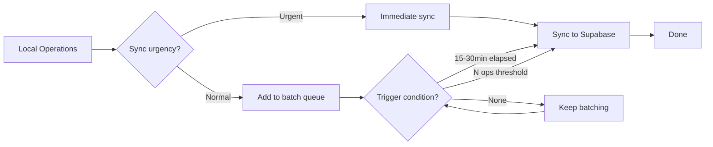

---
metadata:
  status: DRAFT
  version: 0.3
  tldr: "Core architectural principles and design decisions"
  dependencies: [research/claude-code-cli-tmux-automation.md]
---

# Architecture Principles

## 1. Local-First Design

**Primary Principle**: The system works completely offline. Supabase is optional.



**Key Decisions**:
- SQLite is primary database, not a cache
- All functionality must work without network
- Supabase sync enhances, never blocks
- User sees unified view (local + remote merged seamlessly)

## 2. Layered Supervision Model

**Critical Distinction**: systemd/launchd supervises, tmux isolates



### Why This Pattern?

**systemd/launchd Responsibilities**:
- Start daemon on system boot
- Restart daemon if it crashes
- Manage dependencies (wait for network)
- Resource limits (CPU, memory)
- Security restrictions (user, permissions)

**tmux Responsibilities**:
- Provide isolated terminal environment per agent
- Allow human observation and debugging
- Enable interactive and headless modes
- Persist sessions when SSH disconnects

**tmux is NOT responsible for**:
- ❌ Detecting agent crashes
- ❌ Restarting failed agents
- ❌ Starting on boot
- ❌ Process lifecycle management

**Rationale**: See `research/claude-code-cli-tmux-automation.md` for detailed analysis of why tmux-only supervision is fundamentally brittle.

## 3. Hook-Based Monitoring

**Primary Principle**: Structured events > terminal scraping



### Hook Categories

**All available Claude Code hooks**:
- **Tool use hooks**: File edits, bash commands, git operations
- **Session lifecycle hooks**: Start, pause, resume, complete
- **Error hooks**: Tool failures, permission denials, crashes
- **State change hooks**: Task status transitions

**Benefits**:
- Structured, parseable data (JSON)
- Reliable state detection
- Complete audit trail
- No terminal output parsing fragility

**tmux capture-pane is secondary**:
- Used for supplementary visibility
- Human debugging
- Fallback monitoring
- Not critical path for state management

## 4. Database-Driven Orchestration

**Primary Principle**: SQLite is the control plane, not just logs



### Predefined Orchestration Patterns

**Example: Code Review Workflow**
1. Task created: `review_pr`
2. State: `queued` → Agent 1 starts
3. Agent 1 completes → State: `review_complete`
4. Database trigger → State: `report_generation`
5. Supervisory agent starts (reads review)
6. Writes summary → State: `complete`

**Database tables drive flow**:
- `tasks` table: Current state
- `hook_events` table: Detailed actions
- `supervisory_reports` table: Meta-analysis
- State changes trigger next agents

**Not external scheduler** - The database IS the scheduler

## 5. Context-Aware Task Routing

**Primary Principle**: Tasks route to systems with required context



### Context Registration

**Systems declare available contexts**:
```
contexts table:
- system_id: "mac-pro-office"
- project_path: "/Users/user/code/my-app"
- repo_url: "github.com/org/my-app"
- last_updated: "2025-11-17 10:30:00"
```

**Benefits**:
- Generic tasks → any system (max parallelism)
- Project-specific tasks → only systems with that repo
- Redundancy → multiple systems can handle same project
- Efficiency → agent starts in correct directory

## 6. Adaptive Sync Strategies

**Primary Principle**: Balance responsiveness vs Supabase efficiency



### Sync Triggers

**Periodic** (configurable per system):
- Default: Every 15-30 minutes
- Low-priority systems: Every hour
- High-priority systems: Every 5 minutes

**Threshold-based**:
- Every N operations (e.g., 50 hook events)
- Every N task completions (e.g., 5 tasks)

**Event-driven** (immediate):
- Critical errors detected
- User-requested task status
- System health alerts
- Security events

### Batch Packaging

**Local SQLite** (detailed):
- All hook events (thousands per hour)
- Full task execution logs
- Complete agent activity

**Supabase sync** (aggregated):
- Task summaries (not full logs)
- System health metrics
- Error/alert events
- Supervisory reports

**Goal**: Supabase has enough for global visibility, not drowning in local details

## 7. Agent Patterns

**Three agent types**:

### Worker Agents
- Execute assigned tasks
- Run in tmux windows
- Write hooks to SQLite
- Modes: headless JSON, interactive

### Supervisory Agents
- Monitor other agents (local or global)
- Launched headless with analysis prompt
- Write reports to SQLite
- Scope: per-project, per-task, or system-wide

### Manager Agents
- Monitor Supabase aggregated data
- Detect cross-system issues
- Raise alerts (Telegram, Slack)
- Can be on central system or distributed

**Meta-agent pattern**: Agents monitoring agents, adjusting work in progress

## 8. Per-Project Initialization

**Model**: Like git - global install, per-project init

```
~/.ccm-global/          # Global daemon config
├── config.yaml
├── ccm.db              # All projects on this system
└── auth.json

~/code/project-1/       # Per-project context
├── .ccm/
│   ├── config.yaml     # Project-specific settings
│   ├── skills/         # Local skills
│   ├── prompts/        # Custom prompts
│   └── agent.log       # Agent execution log
└── src/

~/code/project-2/
├── .ccm/
└── src/
```

**Benefits**:
- Each project gets dedicated agent
- Project-specific configuration
- Isolated working directories
- Easy to manage per-project

## 9. Seamless UX

**User Perspective**: Local or remote doesn't matter

**Web UI at localhost:8765**:
- Shows all tasks (local + remote merged)
- Create task → system auto-routes based on context
- Task status updates → whether local or Supabase
- Skill updates → sync transparently

**User doesn't see**:
- Where data is stored (SQLite or Supabase)
- Which system executes task
- Sync happening in background

**User does see**:
- All their projects
- All their tasks
- All their systems
- Unified, consistent interface

## 10. Configuration Profiles

**Two deployment modes**:

### Full Profile (Mac, Desktop Linux)
- FastAPI Web UI enabled
- Full daemon + sync engine
- Resource: ~200MB base + 150MB per agent
- Use case: Developer workstations

### Minimal Profile (Linux Servers)
- FastAPI API only (no Web UI static files)
- Daemon + optional sync
- Resource: ~50MB base + 150MB per agent
- Use case: Headless servers, fleets

**Configuration flag**: `profile: full` or `profile: minimal`

**Both support**:
- systemd/launchd supervision
- Full agent orchestration
- Hook-based monitoring
- All core functionality

---

**Status**: DRAFT
**Version**: 0.3
**Last Updated**: 2025-11-17
