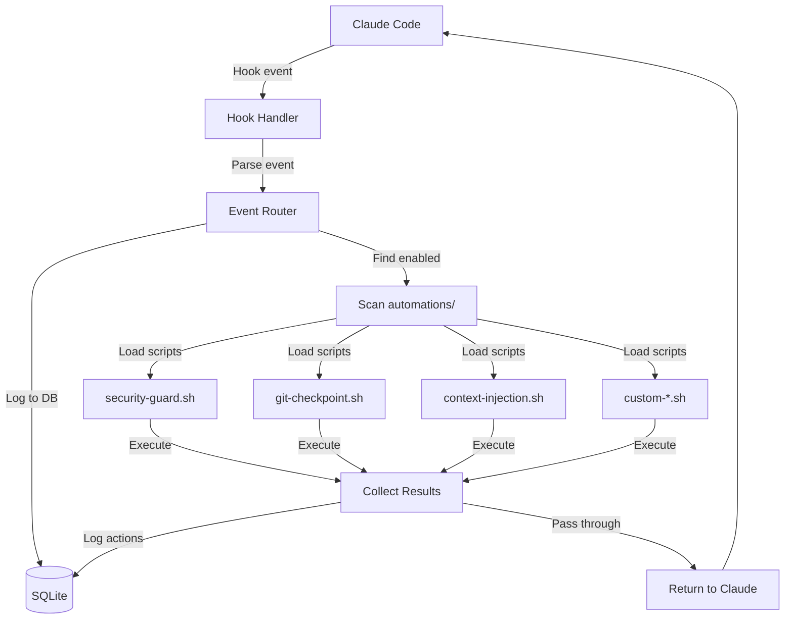
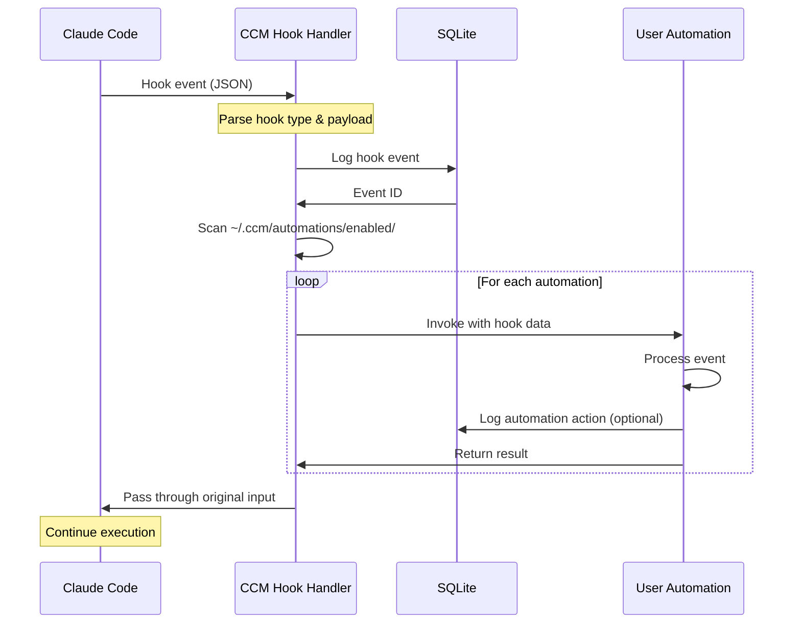

---
metadata:
  status: DRAFT
  version: 0.4
  tldr: "Hook-based extension framework with minimal example automations"
  dependencies: [monitoring-architecture.md, architecture-principles.md]
  code_refs: [_dev_tools/pneuma-claude-hooks/]
---

# Automation Framework

## Core Principle

**Hook-based extension architecture**. Users write custom automations triggered by Claude Code hooks. Framework provides structure, security, and standard interfaces.

## Architecture Overview



## Hook-Based Invocation

### Standard Hook Flow

**From Claude Code** → **CCM Hook Handler** → **User Automations** → **Back to Claude**



### Hook Types (9 Total)

**From Claude Code hooks**:
1. **PreToolUse** - Before tool execution
2. **PostToolUse** - After tool execution
3. **UserPromptSubmit** - User submits prompt
4. **Notification** - Claude sends notification
5. **Stop** - Session stop
6. **SubagentStop** - Subagent stops
7. **SessionStart** - Session begins
8. **SessionEnd** - Session ends
9. **PreCompact** - Before compaction

**Each hook type** triggers different automation opportunities.

## Extension Points

### Directory Structure

```
~/.ccm/
├── automations/
│   ├── available/                   # All automations (disabled)
│   │   ├── security-guard.sh
│   │   ├── git-checkpoint.sh
│   │   ├── context-injection.sh
│   │   └── custom-logger.sh
│   │
│   ├── enabled/                     # Symlinks to enabled automations
│   │   ├── security-guard.sh -> ../available/security-guard.sh
│   │   └── git-checkpoint.sh -> ../available/git-checkpoint.sh
│   │
│   └── lib/                         # Shared utilities
│       ├── common.sh                # Helper functions
│       └── database.sh              # SQLite wrappers
│
└── logs/                            # Automation logs
    └── automations/
        └── {date}-{automation}.log
```

### Standard Interface

**All automations** must follow this contract:

```bash
#!/bin/bash
# automation-name.sh
#
# HOOK TYPES: PreToolUse, PostToolUse, UserPromptSubmit
# DESCRIPTION: Brief description of what this does
# AUTHOR: User name

set -euo pipefail

# Arguments from CCM
HOOK_TYPE="$1"        # e.g., "PreToolUse"
TASK_ID="$2"          # e.g., "task-123"
EVENT_ID="$3"         # e.g., "evt-456"

# Read hook event JSON from stdin
input=$(cat)

# ============================================
# MAIN LOGIC HERE
# ============================================

# Process the hook event
# ... your code ...

# ============================================
# RETURN ORIGINAL INPUT UNCHANGED
# ============================================
echo "$input"

# Exit codes:
# 0 = Success, allow operation
# 1 = Error (logged but operation continues)
# 2 = Block operation (only for PreToolUse)
exit 0
```

### Transparency Requirement

**CRITICAL**: Automations MUST pass through original input unchanged.

**Why**: Hook events are part of Claude's execution flow. Modifying input breaks Claude.

**Allowed**:
- Read hook data
- Log to database
- Write to files
- Send notifications
- Execute external commands

**Forbidden**:
- Modify stdin before passing to stdout
- Exit without returning input
- Change JSON structure

## Minimal Example Automations

### 1. Security Guard

**Purpose**: Block dangerous commands before execution.

**Hook Type**: PreToolUse

**File**: `~/.ccm/automations/available/security-guard.sh`

```bash
#!/bin/bash
# security-guard.sh
#
# HOOK TYPES: PreToolUse
# DESCRIPTION: Blocks dangerous bash commands
# AUTHOR: CCM Team

set -euo pipefail

HOOK_TYPE="$1"
TASK_ID="$2"
EVENT_ID="$3"

# Only process PreToolUse
if [ "$HOOK_TYPE" != "PreToolUse" ]; then
    cat
    exit 0
fi

# Read input
input=$(cat)

# Extract tool name and command
tool=$(echo "$input" | jq -r '.tool // empty')
command=$(echo "$input" | jq -r '.command // empty')

# Check if bash tool with dangerous command
if [ "$tool" = "Bash" ]; then
    # Dangerous patterns
    if echo "$command" | grep -E "rm -rf /|sudo.*rm|mkfs|dd if=|:(){:|fork bomb" >/dev/null; then
        # Log blocked command
        echo "BLOCKED: Dangerous command in task $TASK_ID" >&2
        echo "$command" >&2

        # Log to database
        sqlite3 ~/.ccm/ccm.db <<SQL
INSERT INTO automation_events (event_id, automation, action, details)
VALUES ('$EVENT_ID', 'security-guard', 'blocked', '$command');
SQL

        # BLOCK EXECUTION
        exit 2
    fi
fi

# Safe command, pass through
echo "$input"
exit 0
```

**Enable**:
```bash
ln -s ~/.ccm/automations/available/security-guard.sh \
      ~/.ccm/automations/enabled/security-guard.sh
```

### 2. Git Checkpoint

**Purpose**: Auto-commit after significant file edits.

**Hook Type**: PostToolUse

**File**: `~/.ccm/automations/available/git-checkpoint.sh`

```bash
#!/bin/bash
# git-checkpoint.sh
#
# HOOK TYPES: PostToolUse
# DESCRIPTION: Auto-commit after N file edits
# AUTHOR: CCM Team

set -euo pipefail

HOOK_TYPE="$1"
TASK_ID="$2"
EVENT_ID="$3"

# Only process PostToolUse
if [ "$HOOK_TYPE" != "PostToolUse" ]; then
    cat
    exit 0
fi

# Read input
input=$(cat)

# Extract tool name
tool=$(echo "$input" | jq -r '.tool // empty')

# Only checkpoint after Edit/Write tools
if [[ "$tool" != "Edit" && "$tool" != "Write" ]]; then
    echo "$input"
    exit 0
fi

# Get worktree path
worktree=$(sqlite3 ~/.ccm/ccm.db \
    "SELECT worktree_path FROM task_worktrees WHERE task_id='$TASK_ID';")

if [ -z "$worktree" ]; then
    echo "$input"
    exit 0
fi

# Count uncommitted changes
cd "$worktree"
changes=$(git diff --name-only | wc -l)

# Auto-commit every 5 changes
if (( changes >= 5 )); then
    git add .
    git commit -m "Auto-checkpoint: $changes files modified (task $TASK_ID)"

    # Log checkpoint
    sqlite3 ~/.ccm/ccm.db <<SQL
INSERT INTO automation_events (event_id, automation, action, details)
VALUES ('$EVENT_ID', 'git-checkpoint', 'committed', '$changes files');
SQL
fi

# Pass through
echo "$input"
exit 0
```

### 3. Context Injection

**Purpose**: Inject project context into user prompts.

**Hook Type**: UserPromptSubmit

**File**: `~/.ccm/automations/available/context-injection.sh`

```bash
#!/bin/bash
# context-injection.sh
#
# HOOK TYPES: UserPromptSubmit
# DESCRIPTION: Adds project context to prompts
# AUTHOR: CCM Team

set -euo pipefail

HOOK_TYPE="$1"
TASK_ID="$2"
EVENT_ID="$3"

# Only process UserPromptSubmit
if [ "$HOOK_TYPE" != "UserPromptSubmit" ]; then
    cat
    exit 0
fi

# Read input
input=$(cat)

# Get worktree path
worktree=$(sqlite3 ~/.ccm/ccm.db \
    "SELECT worktree_path FROM task_worktrees WHERE task_id='$TASK_ID';")

if [ -z "$worktree" ]; then
    echo "$input"
    exit 0
fi

# Gather context
cd "$worktree"
branch=$(git branch --show-current)
recent_files=$(git diff --name-only HEAD~3..HEAD 2>/dev/null | head -5)

# Build context message
context="[AUTO-CONTEXT]
Current branch: $branch
Recent files:
$recent_files
"

# Log context injection (but DON'T modify input)
sqlite3 ~/.ccm/ccm.db <<SQL
INSERT INTO automation_events (event_id, automation, action, details)
VALUES ('$EVENT_ID', 'context-injection', 'gathered', '$context');
SQL

# NOTE: In real implementation, this would use Claude's context injection API
# For now, just log it

# Pass through unchanged
echo "$input"
exit 0
```

## Shared Utilities Library

### Common Functions

**File**: `~/.ccm/automations/lib/common.sh`

```bash
#!/bin/bash
# common.sh - Shared utility functions

# Log to automation log file
log() {
    local level="$1"
    shift
    local message="$*"
    local timestamp=$(date -u +"%Y-%m-%dT%H:%M:%SZ")

    echo "[$timestamp] [$level] $message" >> ~/.ccm/logs/automations/$(date +%Y%m%d).log
}

# Extract JSON field safely
json_get() {
    local json="$1"
    local field="$2"
    echo "$json" | jq -r ".$field // empty"
}

# Check if tool is file-editing tool
is_file_tool() {
    local tool="$1"
    [[ "$tool" =~ ^(Edit|Write|NotebookEdit)$ ]]
}

# Check if tool is bash tool
is_bash_tool() {
    local tool="$1"
    [[ "$tool" == "Bash" ]]
}

# Get task metadata
get_task_metadata() {
    local task_id="$1"
    sqlite3 ~/.ccm/ccm.db \
        "SELECT json_object('worktree', worktree_path, 'branch', branch_name)
         FROM task_worktrees WHERE task_id='$task_id';"
}
```

### Database Helpers

**File**: `~/.ccm/automations/lib/database.sh`

```bash
#!/bin/bash
# database.sh - SQLite wrapper functions

DB_PATH="$HOME/.ccm/ccm.db"

# Log automation event
log_event() {
    local event_id="$1"
    local automation="$2"
    local action="$3"
    local details="$4"

    sqlite3 "$DB_PATH" <<SQL
INSERT INTO automation_events (event_id, automation, action, details, timestamp)
VALUES ('$event_id', '$automation', '$action', '$details', datetime('now'));
SQL
}

# Get task worktree
get_worktree() {
    local task_id="$1"
    sqlite3 "$DB_PATH" \
        "SELECT worktree_path FROM task_worktrees WHERE task_id='$task_id';"
}

# Check if task paused
is_task_paused() {
    local task_id="$1"
    local status=$(sqlite3 "$DB_PATH" \
        "SELECT status FROM tasks WHERE id='$task_id';")
    [[ "$status" == "paused" ]]
}
```

## Development Guide

### Creating New Automation

**1. Create Script**:
```bash
# Create new automation file
cat > ~/.ccm/automations/available/my-automation.sh <<'EOF'
#!/bin/bash
# my-automation.sh
#
# HOOK TYPES: PostToolUse
# DESCRIPTION: My custom automation
# AUTHOR: Your Name

set -euo pipefail

HOOK_TYPE="$1"
TASK_ID="$2"
EVENT_ID="$3"

input=$(cat)

# Your logic here

echo "$input"
exit 0
EOF

chmod +x ~/.ccm/automations/available/my-automation.sh
```

**2. Test**:
```bash
# Test with sample input
echo '{"tool":"Bash","command":"ls"}' | \
    ~/.ccm/automations/available/my-automation.sh PostToolUse task-123 evt-456
```

**3. Enable**:
```bash
# Enable automation
ccm-orchestrator automations enable my-automation

# Or manually:
ln -s ~/.ccm/automations/available/my-automation.sh \
      ~/.ccm/automations/enabled/my-automation.sh
```

### Testing Framework

**Test Runner**: `~/.ccm/automations/test-automation.sh`

```bash
#!/bin/bash
# test-automation.sh - Test automation with sample data

automation="$1"

if [ -z "$automation" ]; then
    echo "Usage: $0 <automation-name>"
    exit 1
fi

script="$HOME/.ccm/automations/available/$automation.sh"

if [ ! -f "$script" ]; then
    echo "Automation not found: $automation"
    exit 1
fi

# Sample hook events for testing
test_pretooluse() {
    echo '{"tool":"Bash","command":"ls -la","params":{}}' | \
        "$script" PreToolUse task-test evt-test
}

test_posttooluse() {
    echo '{"tool":"Edit","file":"/path/to/file.py","success":true}' | \
        "$script" PostToolUse task-test evt-test
}

test_userpromptsubmit() {
    echo '{"prompt":"Fix the bug","context":{}}' | \
        "$script" UserPromptSubmit task-test evt-test
}

# Run tests
echo "Testing $automation..."
echo ""

echo "=== PreToolUse ==="
test_pretooluse
echo ""

echo "=== PostToolUse ==="
test_posttooluse
echo ""

echo "=== UserPromptSubmit ==="
test_userpromptsubmit
echo ""

echo "Tests complete"
```

## Security Model

### Sandboxing

**Automations run with limited permissions**:
- Cannot modify system files
- Cannot access other tasks' worktrees
- Cannot push to git remotes
- Read-only access to main repositories

**Enforcement**:
```bash
# Run automation in restricted environment
run_automation() {
    local script="$1"
    local hook_type="$2"
    local task_id="$3"

    # Set restrictive environment
    env -i \
        PATH="/usr/local/bin:/usr/bin:/bin" \
        HOME="$HOME" \
        TASK_ID="$task_id" \
        bash "$script" "$hook_type" "$task_id" "$event_id"
}
```

### Input Validation

**Prevent injection attacks**:
```bash
# Validate task_id format
validate_task_id() {
    local task_id="$1"

    if ! [[ "$task_id" =~ ^task-[0-9a-f]{8}$ ]]; then
        echo "Invalid task_id format" >&2
        exit 1
    fi
}

# Sanitize for SQL (use parameterized queries instead)
sanitize_sql() {
    local input="$1"
    echo "$input" | sed "s/'/''/g"
}
```

### Resource Limits

**Timeout**: Automations must complete in <5 seconds.

```python
# In CCM hook handler
async def run_automation(script_path, hook_data):
    try:
        result = await asyncio.wait_for(
            subprocess.run(
                [script_path, hook_type, task_id, event_id],
                input=hook_json,
                capture_output=True,
                text=True
            ),
            timeout=5.0  # 5 second timeout
        )
    except asyncio.TimeoutError:
        logger.error(f"Automation timeout: {script_path}")
        return hook_data  # Pass through unchanged
```

## CLI Management

### List Automations

```bash
# List all available
ccm-orchestrator automations list

# Output:
# Available Automations:
#   security-guard      [ENABLED]  - Blocks dangerous commands
#   git-checkpoint      [ENABLED]  - Auto-commit after edits
#   context-injection   [DISABLED] - Inject project context
#   my-automation       [DISABLED] - Custom automation
```

### Enable/Disable

```bash
# Enable automation
ccm-orchestrator automations enable security-guard

# Disable automation
ccm-orchestrator automations disable git-checkpoint

# Enable all
ccm-orchestrator automations enable-all
```

### View Logs

```bash
# Show automation activity
ccm-orchestrator automations logs --tail 20

# Filter by automation
ccm-orchestrator automations logs --automation security-guard

# Filter by task
ccm-orchestrator automations logs --task task-123
```

## Monitoring

### Automation Events Table

```sql
CREATE TABLE automation_events (
    id INTEGER PRIMARY KEY AUTOINCREMENT,
    event_id TEXT NOT NULL,           -- Links to hook_events
    automation TEXT NOT NULL,         -- Automation name
    action TEXT NOT NULL,             -- Action taken
    details TEXT,                     -- Additional context
    timestamp TIMESTAMP DEFAULT CURRENT_TIMESTAMP,

    FOREIGN KEY (event_id) REFERENCES hook_events(id)
);

CREATE INDEX idx_automation_events_time ON automation_events(timestamp);
CREATE INDEX idx_automation_events_automation ON automation_events(automation);
```

### Dashboard Widget

**Web UI Display**:
```
┌─────────────────────────────────────────┐
│ Automations Activity (Last Hour)       │
├─────────────────────────────────────────┤
│ security-guard    12 checks   0 blocks  │
│ git-checkpoint     8 commits            │
│ context-injection  5 injections         │
│                                         │
│ [View Details] [Manage Automations]     │
└─────────────────────────────────────────┘
```

### Performance Metrics

```sql
-- Average automation execution time
SELECT
    automation,
    COUNT(*) as executions,
    AVG(julianday(timestamp) - julianday(created_at)) * 86400 as avg_seconds
FROM automation_events
WHERE timestamp > datetime('now', '-1 hour')
GROUP BY automation;
```

## Best Practices

### 1. Keep Automations Simple

**Good**:
```bash
# Simple, focused logic
if is_dangerous_command "$command"; then
    exit 2  # Block
fi
```

**Bad**:
```bash
# Complex, multi-purpose logic
check_command_safety
check_file_permissions
check_git_status
check_network_access
# ... 100 more lines
```

### 2. Fail Safe

**Always pass through on error**:
```bash
# If automation fails, don't break Claude
if ! process_event; then
    log "ERROR: Automation failed, passing through"
    echo "$input"
    exit 0  # Success code, operation continues
fi
```

### 3. Log Everything

**For debugging and audit**:
```bash
log "INFO" "Processing $HOOK_TYPE for task $TASK_ID"
log "DEBUG" "Tool: $tool, Command: $command"
log "INFO" "Action: $action, Result: $result"
```

### 4. Use Libraries

**Don't duplicate code**:
```bash
# Source common utilities
source ~/.ccm/automations/lib/common.sh
source ~/.ccm/automations/lib/database.sh

# Use helper functions
log "INFO" "Starting automation"
metadata=$(get_task_metadata "$TASK_ID")
```

### 5. Test Before Enabling

**Always test with sample data**:
```bash
# Test script
~/.ccm/automations/test-automation.sh my-automation

# Review output
# Only enable if tests pass
```

## Advanced Patterns

### Conditional Execution

**Only run on certain projects**:
```bash
# Get project name
project=$(sqlite3 ~/.ccm/ccm.db \
    "SELECT p.name FROM projects p
     JOIN tasks t ON p.id = t.project_id
     WHERE t.id='$TASK_ID';")

# Only run for specific project
if [ "$project" != "critical-app" ]; then
    echo "$input"
    exit 0
fi
```

### State Tracking

**Maintain state across hook calls**:
```bash
# Increment counter in database
sqlite3 ~/.ccm/ccm.db <<SQL
INSERT INTO automation_state (task_id, automation, key, value)
VALUES ('$TASK_ID', 'my-automation', 'counter', 1)
ON CONFLICT(task_id, automation, key)
DO UPDATE SET value = value + 1;
SQL
```

### Cross-Automation Coordination

**Trigger actions based on other automations**:
```bash
# Check if security-guard blocked command
blocked=$(sqlite3 ~/.ccm/ccm.db \
    "SELECT COUNT(*) FROM automation_events
     WHERE task_id='$TASK_ID'
       AND automation='security-guard'
       AND action='blocked';")

if (( blocked > 0 )); then
    # Escalate to user
    send_notification "Security guard blocked $blocked commands"
fi
```

---

**Status**: DRAFT
**Version**: 0.4
**Last Updated**: 2025-11-17

**Key Enhancements in v0.4**:
- Hook-based extension framework
- Standard automation interface
- Three minimal example automations (security, git, context)
- Shared utilities library
- Security model and sandboxing
- Development guide and testing framework
- CLI management commands
