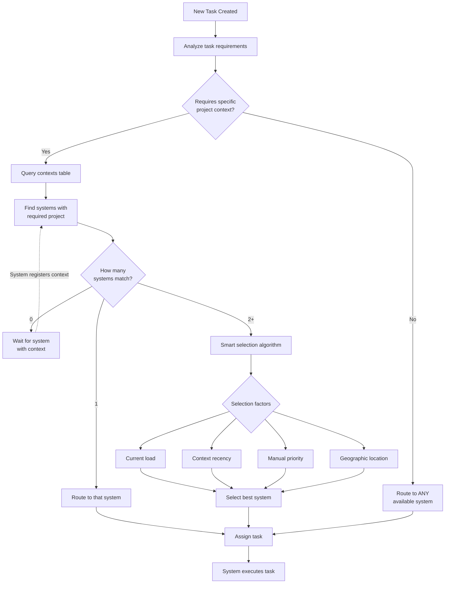
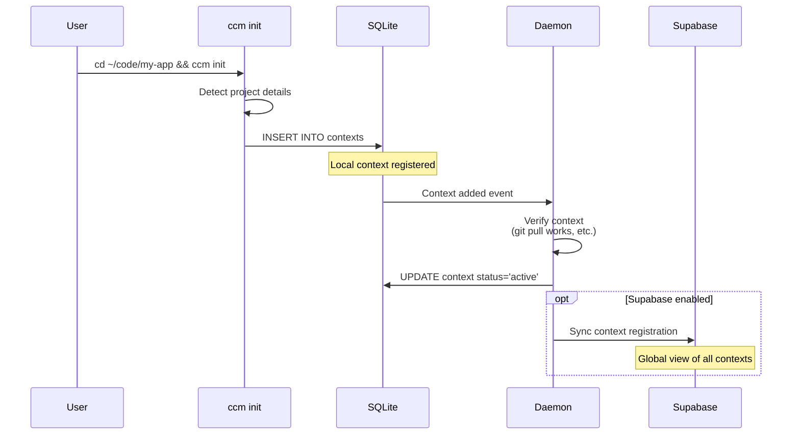
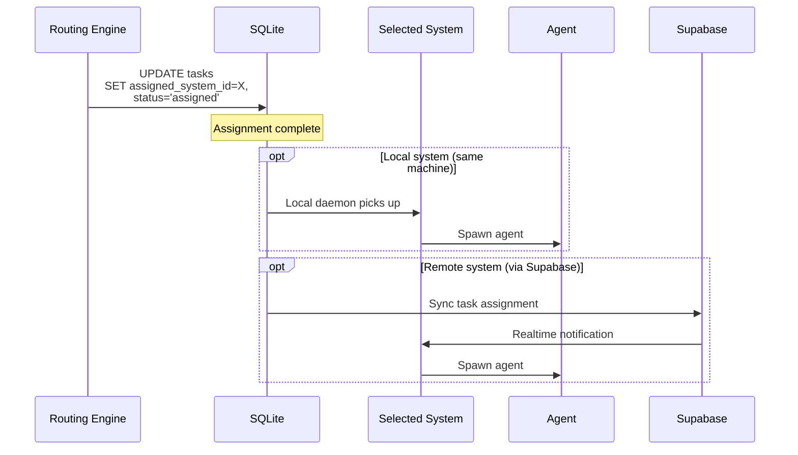
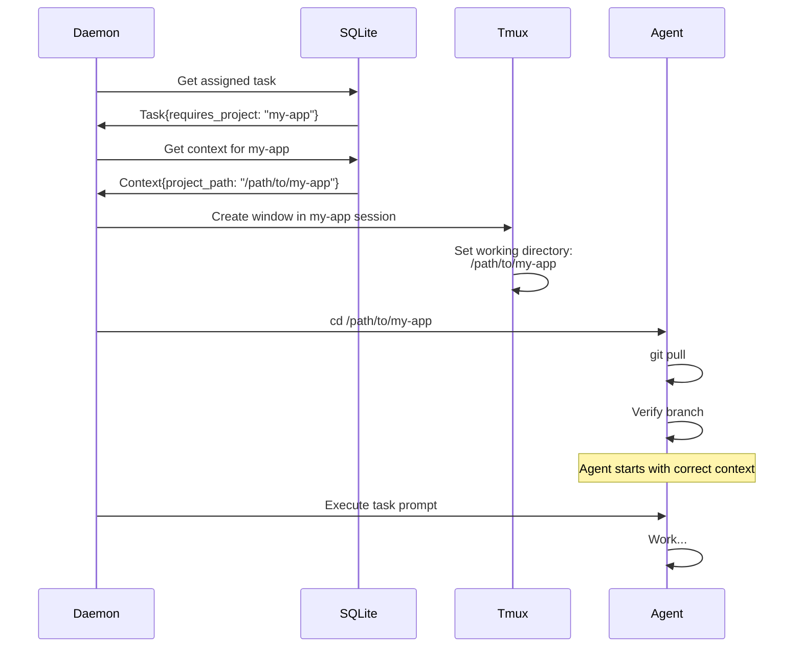

---
metadata:
  status: DRAFT
  version: 0.3
  tldr: "Context-aware task routing and intelligent system selection"
  dependencies: [architecture-principles.md, data-architecture.md]
---

# Context-Aware Task Routing

## Principle: Tasks Route to Systems with Required Context

Not all systems can execute all tasks. Some tasks require specific project context (repos, databases, API access). Context-aware routing ensures tasks go to capable systems.



## Context Registration

### Contexts Table Schema

```sql
CREATE TABLE contexts (
    id INTEGER PRIMARY KEY AUTOINCREMENT,
    system_id TEXT NOT NULL REFERENCES systems(id),
    project_name TEXT NOT NULL,
    project_path TEXT NOT NULL,  -- Local filesystem path
    repo_url TEXT,  -- Git repository URL (optional)
    repo_branch TEXT DEFAULT 'main',
    last_pulled TIMESTAMP,  -- Last git pull
    last_verified TIMESTAMP,  -- Last context verification
    status TEXT CHECK(status IN ('active', 'stale', 'error')) DEFAULT 'active',
    metadata JSON,  -- Custom attributes
    created_at TIMESTAMP DEFAULT CURRENT_TIMESTAMP,
    updated_at TIMESTAMP DEFAULT CURRENT_TIMESTAMP,
    UNIQUE(system_id, project_path)
);

CREATE INDEX idx_contexts_system ON contexts(system_id);
CREATE INDEX idx_contexts_project ON contexts(project_name);
CREATE INDEX idx_contexts_status ON contexts(status);
```

### Context Registration Flow



### Registration Command

```bash
# Automatic during project init
cd ~/code/my-app
ccm init

# Manual registration
ccm-orchestrator context add \
  --name my-app \
  --path ~/code/my-app \
  --repo https://github.com/org/my-app

# List contexts on this system
ccm-orchestrator context list
# Output:
# my-app        /Users/user/code/my-app     github.com/org/my-app    active
# other-project /Users/user/code/other      github.com/org/other     active
```

### Context Metadata

**Optional custom attributes**:
```json
{
  "languages": ["python", "typescript"],
  "databases": ["postgresql", "redis"],
  "apis": ["stripe", "sendgrid"],
  "environments": ["staging", "production"],
  "tags": ["backend", "api", "high-priority"]
}
```

**Use case**: Task requires PostgreSQL access → only route to systems with `"databases": ["postgresql"]`

## Task Context Requirements

### Task Schema with Context

```sql
CREATE TABLE tasks (
    id INTEGER PRIMARY KEY AUTOINCREMENT,
    prompt TEXT NOT NULL,
    status TEXT DEFAULT 'created',

    -- Context requirements
    requires_project TEXT,  -- NULL = any system, or "my-app"
    requires_context_metadata JSON,  -- Additional requirements

    -- Routing
    assigned_system_id TEXT REFERENCES systems(id),
    routed_at TIMESTAMP,

    ...
);
```

### Specifying Context Requirements

**Generic task** (any system):
```sql
INSERT INTO tasks (prompt, requires_project)
VALUES ('Generate daily usage report', NULL);
-- Can run on ANY system
```

**Project-specific task**:
```sql
INSERT INTO tasks (prompt, requires_project)
VALUES ('Review PR #123 in my-app', 'my-app');
-- ONLY systems with my-app context
```

**Context with metadata requirements**:
```sql
INSERT INTO tasks (
  prompt,
  requires_project,
  requires_context_metadata
) VALUES (
  'Run database migration',
  'my-app',
  json_object('databases', json_array('postgresql'))
);
-- ONLY systems with my-app AND postgresql access
```

## Routing Algorithm

### Step 1: Find Candidate Systems

```mermaid
flowchart TD
    Start[Task created] --> CheckProject{requires_project<br/>specified?}

    CheckProject -->|No| AllSystems[SELECT * FROM systems<br/>WHERE status='online']
    CheckProject -->|Yes| ProjectFilter[SELECT systems<br/>FROM contexts<br/>WHERE project_name = ?]

    AllSystems --> MetadataFilter
    ProjectFilter --> MetadataFilter

    MetadataFilter{requires_context_metadata<br/>specified?}

    MetadataFilter -->|No| Candidates[Candidate systems]
    MetadataFilter -->|Yes| FilterMeta[Filter by metadata match]

    FilterMeta --> Candidates

    Candidates --> Count{Candidates.count()}
    Count -->|0| NoMatch[No systems available]
    Count -->|1| SingleMatch[Route to that system]
    Count -->|2+| MultiMatch[Apply selection algorithm]
```

**Query example**:
```sql
-- Find systems with required context
SELECT DISTINCT s.*
FROM systems s
JOIN contexts c ON s.id = c.system_id
WHERE s.status = 'online'
  AND c.project_name = 'my-app'
  AND c.status = 'active'
  AND (
    -- No metadata requirement OR metadata matches
    :requires_metadata IS NULL
    OR json_extract(c.metadata, '$.databases') LIKE '%postgresql%'
  );
```

### Step 2: System Selection (Multiple Candidates)

**Selection factors**:

1. **Current load** (40% weight)
2. **Context recency** (30% weight)
3. **Manual priority** (20% weight)
4. **Geographic/network proximity** (10% weight)

```sql
-- Calculate scores for each candidate
SELECT
    s.id,
    s.name,

    -- Load score (inverse: lower load = higher score)
    (1.0 - (running_tasks::FLOAT / max_concurrent_agents)) * 0.4 AS load_score,

    -- Recency score (recently pulled = higher score)
    CASE
        WHEN julianday('now') - julianday(c.last_pulled) < 1 THEN 0.3
        WHEN julianday('now') - julianday(c.last_pulled) < 7 THEN 0.2
        ELSE 0.1
    END AS recency_score,

    -- Priority score (manual configuration)
    s.routing_priority * 0.2 AS priority_score,

    -- Proximity score (placeholder, can use latency data)
    0.1 AS proximity_score,

    -- Total score
    load_score + recency_score + priority_score + proximity_score AS total_score

FROM systems s
JOIN contexts c ON s.id = c.system_id
WHERE s.id IN (...candidate_ids...)
ORDER BY total_score DESC
LIMIT 1;
```

### Step 3: Assign Task



## Agent Initialization with Context

### Context-Aware Spawn



**Spawn command**:
```python
# Get context
context = db.execute("""
    SELECT project_path, repo_branch
    FROM contexts
    WHERE system_id = ? AND project_name = ?
""", (system_id, task.requires_project)).fetchone()

# Spawn agent in context
pane = tmux_window.split_window()
pane.send_keys(f"cd {context['project_path']}")
pane.send_keys(f"git pull origin {context['repo_branch']}")
pane.send_keys(f"claude -p '{task.prompt}' --output-format json")
```

## Context Verification

### Automated Verification

**Periodic health checks**:
```sql
-- Find contexts not verified recently
SELECT * FROM contexts
WHERE status = 'active'
  AND (julianday('now') - julianday(last_verified)) > 1  -- More than 1 day
ORDER BY last_verified ASC
LIMIT 10;

-- Verify each context
-- 1. Check path exists
-- 2. If repo_url: try git pull (test auth)
-- 3. Update last_verified timestamp
```

**Verification task**:
```bash
# Spawned by daemon
claude -p "Verify context for my-app at /path/to/my-app. \
Check: 1) Path exists, 2) Git pull works, 3) Branch correct. \
Output JSON with status." \
  --output-format json \
  --max-turns 3 \
  --allowedTools "Bash(ls:*,git:*)"
```

### Context Staleness

**Definition**: Context is stale if repo is significantly behind remote

**Detection**:
```bash
cd /path/to/my-app
git fetch
LOCAL=$(git rev-parse HEAD)
REMOTE=$(git rev-parse origin/main)

if [ "$LOCAL" != "$REMOTE" ]; then
  echo "Context is stale"
  # Update contexts table
fi
```

**Automatic refresh**:
```sql
-- Mark stale contexts
UPDATE contexts
SET status = 'stale'
WHERE status = 'active'
  AND (julianday('now') - julianday(last_pulled)) > 7;  -- 7 days old

-- Daemon can auto-pull or warn user
```

## Multi-Context Systems

### One System, Multiple Projects

```
mac-pro-office (system_id: "mac-pro")
├── ~/code/project-a/  (context 1)
├── ~/code/project-b/  (context 2)
└── ~/code/project-c/  (context 3)
```

**Routing benefit**: Same system can handle tasks for any of its contexts

**Query**:
```sql
SELECT COUNT(DISTINCT project_name) FROM contexts
WHERE system_id = 'mac-pro';
-- Result: 3
```

### Redundant Contexts (Multiple Systems, Same Project)

```
mac-pro-office:
├── ~/code/my-app/  (context: my-app, system: mac-pro)

ubuntu-server-1:
├── /opt/repos/my-app/  (context: my-app, system: ubuntu-1)

ubuntu-server-2:
├── /opt/repos/my-app/  (context: my-app, system: ubuntu-2)
```

**Routing benefit**: Tasks for "my-app" can go to ANY of these 3 systems

**Use cases**:
- Load balancing
- High availability (if one system offline, others available)
- Geographic distribution

## Context-Based Prioritization

### Priority Routing

**System configuration**:
```sql
ALTER TABLE systems ADD COLUMN routing_priority INTEGER DEFAULT 50;

-- High-priority systems (prefer these)
UPDATE systems SET routing_priority = 90
WHERE id = 'mac-pro-office';

-- Low-priority systems (use only if high-priority busy)
UPDATE systems SET routing_priority = 10
WHERE id LIKE 'backup-server-%';
```

**Routing prefers high-priority** (all else equal)

### Task Affinity

**Concept**: Prefer routing follow-up tasks to same system as original

**Use case**: Task A and Task B both for "my-app", Task B depends on Task A's output

```sql
-- Store which system executed Task A
UPDATE tasks SET assigned_system_id='mac-pro' WHERE id=100;

-- When routing Task B (depends on Task A)
SELECT assigned_system_id FROM tasks WHERE id=100;
-- Prefer that system for Task B
```

## No-Context Fallback

### Handling "No Systems Available"

```mermaid
flowchart TD
    Task[Task requires my-app] --> Route[Query systems]
    Route --> Found{Systems<br/>with my-app?}

    Found -->|Yes| Assign[Route to system]
    Found -->|No| Wait[Set status: waiting]

    Wait --> Notify[Notify user:<br/>"No system with my-app context"]

    Notify --> UserAction{User action}
    UserAction -->|Register context| NewSystem[System registers my-app]
    UserAction -->|Cancel| CancelTask[Mark task cancelled]

    NewSystem --> Route
```

**Query to find waiting tasks**:
```sql
SELECT * FROM tasks
WHERE status = 'waiting'
  AND requires_project IS NOT NULL;

-- Check periodically if context now available
```

## Context Sync to Supabase

### Global Context Registry

```sql
-- Supabase table (global view)
CREATE TABLE contexts (
    id UUID PRIMARY KEY DEFAULT uuid_generate_v4(),
    system_id UUID REFERENCES systems(id),
    project_name TEXT NOT NULL,
    project_path TEXT NOT NULL,
    repo_url TEXT,
    last_synced TIMESTAMP,
    user_id UUID REFERENCES auth.users(id),
    ...
);

-- RLS: Users only see their own contexts
CREATE POLICY "Users see own contexts"
ON contexts FOR SELECT
USING (auth.uid() = user_id);
```

**Sync strategy**:
- Context added locally → sync to Supabase immediately (important for routing)
- Context removed → sync immediately
- Context metadata updated → batch sync (every 15-30 min)

**Use case**: User creates task via Telegram → Supabase knows which systems can execute

## Best Practices

### 1. Register Contexts Early
```bash
# Initialize every project directory
cd ~/code/project-1 && ccm init
cd ~/code/project-2 && ccm init
cd ~/code/project-3 && ccm init
```

### 2. Keep Contexts Fresh
```bash
# Periodic pull (cron or scheduled task)
*/30 * * * * ccm-orchestrator context refresh --all
```

### 3. Use Metadata for Complex Requirements
```json
{
  "requires_vpn": true,
  "requires_aws_access": true,
  "requires_database": "production"
}
```

### 4. Monitor Context Health
```sql
-- Alert if contexts are stale
SELECT system_id, project_name, last_pulled
FROM contexts
WHERE status = 'active'
  AND (julianday('now') - julianday(last_pulled)) > 7;
```

---

**Status**: DRAFT
**Version**: 0.3
**Last Updated**: 2025-11-17
