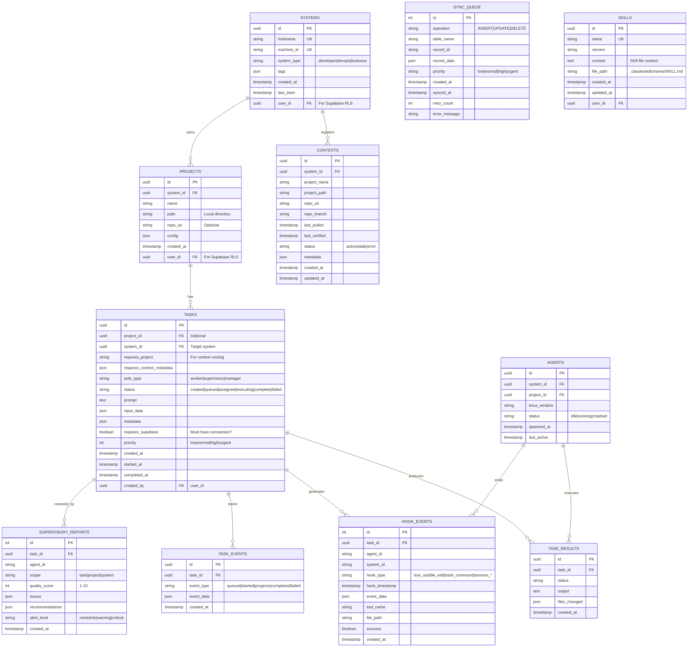

---
metadata:
  status: DRAFT
  version: 0.3
  tldr: "SQLite-first database with hook events, contexts, and adaptive sync"
  dependencies: [context-routing.md, monitoring-architecture.md, agent-patterns.md, sync-strategies.md]
---

# Data Architecture

## Core Principle

**SQLite is the primary database.** Supabase uses identical schema for optional remote sync.

## Database Schema



**Note**: Schema is identical in SQLite and Supabase. Only difference is scope.

**New Tables (v0.3)**:
- **CONTEXTS**: Context registration for intelligent task routing → See [context-routing.md](./context-routing.md)
- **HOOK_EVENTS**: Claude Code hooks for structured monitoring → See [monitoring-architecture.md](./monitoring-architecture.md)
- **SUPERVISORY_REPORTS**: Quality assurance reports from supervisory agents → See [agent-patterns.md](./agent-patterns.md)
- **SYNC_QUEUE**: Offline operation queue for adaptive sync → See [sync-strategies.md](./sync-strategies.md)

## Local vs Remote Scope

**SQLite (Local)**:
- Contains ONLY projects/tasks for THIS system
- Works completely offline
- Fast local queries
- File location: `~/.ccm/ccm.db`

**Supabase (Optional)**:
- Contains ALL projects/tasks across ALL user's systems
- User-scoped via RLS (user only sees their own data)
- Central skills repository
- Multi-system coordination


## Task Lifecycle


## User-Scoped RLS (Supabase Only)

**Row-Level Security** ensures users only see their own data.


## SQLite Indexes

**Primary Keys**: All `id` fields (UUID)
**Unique Indexes**: `systems.hostname`, `systems.machine_id`, `skills.name`
**Query Optimization**:
- `tasks.status, created_at` - Task queue queries
- `tasks.system_id, status` - System-specific tasks
- `projects.system_id` - Project lookups
- `task_results.task_id` - Result lookups

## Sync Queue Table

For offline operations, changes are queued for sync when Supabase is available.

```
SYNC_QUEUE {
    id INTEGER PK AUTOINCREMENT
    operation "INSERT|UPDATE|DELETE"
    table_name string
    record_id uuid
    record_data json
    created_at timestamp
    synced_at timestamp "NULL if not synced"
}
```

## Data Flow: Task Creation

**Local Project**:
```
User → Web UI → SQLite INSERT → Daemon → Spawn Agent
```

**Remote Project** (requires Supabase):
```
User → Web UI → Check connection → Supabase API → Realtime → Target System
```

**Offline** (Remote task):
```
User → Web UI → Check connection → Queue in sync_queue → Sync when connected
```

See: [sync-architecture.md](./sync-architecture.md) for detailed sync patterns.

## Skills Repository

**Central Skills in Supabase** (optional):
- All skills stored in `SKILLS` table
- File content stored as TEXT
- Version tracked with timestamps

**Auto-sync to Local**:
- Daemon polls for skill updates every 60s (when connected)
- Downloads changed skills to `.claude/skills/`
- Applies to NEW agents only (running agents unaffected)

See: [skill-management.md](./skill-management.md)

---

**Status**: DRAFT
**Version**: 0.2
**Last Updated**: 2025-11-17
