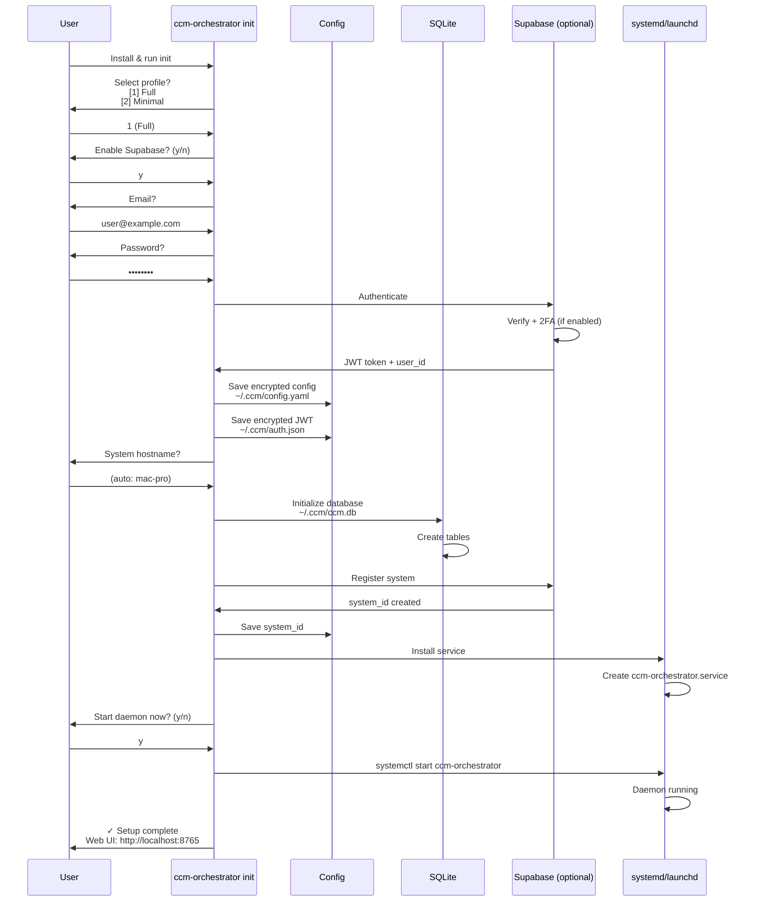

---
metadata:
  status: DRAFT
  version: 0.2
  tldr: "Global install + per-project initialization model"
---

# Installation & Setup

## Two-Level Architecture

**Global**: One daemon per machine (manages all projects)
**Per-Project**: Each folder has `.ccm/` config + dedicated agent

Like git: `pip install` globally, then `ccm init` in each project folder.

## Global Installation

```bash
pip install ccm-orchestrator
```

Installs:
- FastAPI daemon (global)
- CLI tools
- systemd/launchd service templates

## Configuration Profiles

### Full Profile (Mac, Desktop Linux)

**Features**:
- FastAPI Web UI (localhost:8765)
- Full daemon with sync engine
- tmux agent management
- Local + Supabase support

**Resource Requirements**:
- RAM: ~200MB base + ~150MB per active agent
- CPU: ~5% idle, ~20% per active agent
- Disk: ~10MB (plus project files)

### Minimal Profile (Linux Servers, Headless)

**Features**:
- Daemon only (no Web UI)
- Local SQLite or Supabase sync
- tmux agent management
- Configured via CLI only

**Resource Requirements**:
- RAM: ~50MB base + ~150MB per active agent
- CPU: ~2% idle, ~20% per active agent
- Disk: ~5MB (plus project files)

**Disabled**:
- Web UI (FastAPI serves API only, no static frontend)
- Browser-based monitoring

## System Initialization (One-Time)

Initialize the global daemon:

```bash
ccm-orchestrator daemon init
```

This creates:
- Global config: `~/.ccm-global/config.yaml`
- Global database: `~/.ccm-global/ccm.db`
- Service files: systemd/launchd

**Options**:
```bash
ccm-orchestrator daemon init --profile full        # With Web UI
ccm-orchestrator daemon init --profile minimal     # Daemon only
ccm-orchestrator daemon init --supabase            # Enable Supabase
```

## Per-Project Initialization

For each project folder you want to manage:

```bash
cd /path/to/my-project
ccm init
```

This creates **`.ccm/`** directory in the project:

```
my-project/
├── .ccm/
│   ├── config.yaml        # Project-specific config
│   ├── skills/            # Project-specific Claude skills
│   ├── prompts/           # Custom prompts
│   └── agent.log          # Agent execution log
├── src/
└── README.md
```

**Automatic Registration**:
- Project added to global database
- Dedicated agent spawned in tmux
- Agent watches for tasks targeting this project

**Example**:
```bash
# Initialize 3 projects
cd ~/code/repo-1 && ccm init
cd ~/code/repo-2 && ccm init
cd ~/code/repo-3 && ccm init

# Global daemon now manages all 3
ccm-orchestrator project list
# Output:
# - repo-1 (/Users/user/code/repo-1)
# - repo-2 (/Users/user/code/repo-2)
# - repo-3 (/Users/user/code/repo-3)
```

## Initialization Flow



## Configuration File

**`~/.ccm/config.yaml`**:

```yaml
profile: full  # full | minimal

system:
  id: "system-abc-123"
  hostname: "mac-pro"
  type: developer  # developer | devops | business
  tags: [development, mac]

database:
  sqlite_path: ~/.ccm/ccm.db

supabase:
  enabled: true
  url: https://xxx.supabase.co
  auth_file: ~/.ccm/auth.json  # Encrypted JWT storage

sync:
  enabled: true
  interval_seconds: 10
  max_retries: 5
  conflict_resolution: last_write_wins  # last_write_wins | manual

web_ui:
  enabled: true  # false for minimal profile
  host: 127.0.0.1
  port: 8765

agents:
  max_concurrent: 10  # Limit simultaneous agents
  max_idle_time: 300  # Seconds, cleanup idle agents
  tmux_session_name: ccm

daemon:
  log_level: info  # debug | info | warning | error
  log_file: ~/.ccm/logs/daemon.log
  health_check_interval: 60  # Seconds
```

## Resource Limits Configuration

```yaml
resources:
  # Agent limits
  max_agents: 10              # Maximum concurrent agents
  max_agent_memory_mb: 2048   # Per-agent memory limit (if supported)

  # tmux limits
  max_tmux_windows: 20        # Maximum tmux windows

  # Queue limits
  max_queue_size: 1000        # Maximum queued tasks

  # Connection limits
  max_supabase_connections: 5
  connection_pool_size: 10
```

## System Service Setup

### Linux (systemd)

**`/etc/systemd/system/ccm-orchestrator.service`**:

```ini
[Unit]
Description=CCM Orchestrator Daemon
After=network-online.target
Wants=network-online.target

[Service]
Type=simple
User=ccm
Group=ccm
ExecStart=/usr/local/bin/ccm-daemon
Restart=always
RestartSec=10
Environment=CCM_CONFIG=/home/ccm/.ccm/config.yaml

# Resource limits
MemoryMax=4G
CPUQuota=200%

[Install]
WantedBy=multi-user.target
```

Enable & start:
```bash
sudo systemctl daemon-reload
sudo systemctl enable ccm-orchestrator
sudo systemctl start ccm-orchestrator
```

### macOS (launchd)

**`~/Library/LaunchAgents/com.ccm.orchestrator.plist`**:

```xml
<?xml version="1.0" encoding="UTF-8"?>
<!DOCTYPE plist PUBLIC "-//Apple//DTD PLIST 1.0//EN"
  "http://www.apple.com/DTDs/PropertyList-1.0.dtd">
<plist version="1.0">
<dict>
    <key>Label</key>
    <string>com.ccm.orchestrator</string>

    <key>ProgramArguments</key>
    <array>
        <string>/usr/local/bin/ccm-daemon</string>
    </array>

    <key>RunAtLoad</key>
    <true/>

    <key>KeepAlive</key>
    <true/>

    <key>StandardOutPath</key>
    <string>/Users/user/.ccm/logs/daemon.log</string>

    <key>StandardErrorPath</key>
    <string>/Users/user/.ccm/logs/daemon-error.log</string>
</dict>
</plist>
```

Load:
```bash
launchctl load ~/Library/LaunchAgents/com.ccm.orchestrator.plist
```

## CLI Commands

```bash
# Initialization
ccm-orchestrator init               # Interactive setup
ccm-orchestrator init --minimal     # Skip Web UI
ccm-orchestrator init --no-supabase # Local-only

# Configuration
ccm-orchestrator config show        # Display current config
ccm-orchestrator config edit        # Edit config.yaml
ccm-orchestrator config validate    # Check config validity

# Supabase
ccm-orchestrator supabase connect   # Connect to Supabase
ccm-orchestrator supabase disconnect # Disconnect
ccm-orchestrator supabase status    # Check connection

# Projects
ccm-orchestrator project add ~/code/my-project
ccm-orchestrator project list
ccm-orchestrator project remove my-project

# Daemon control
ccm-orchestrator daemon start
ccm-orchestrator daemon stop
ccm-orchestrator daemon restart
ccm-orchestrator daemon status
ccm-orchestrator daemon logs        # Tail logs

# Sync
ccm-orchestrator sync now           # Force sync
ccm-orchestrator sync status        # Show sync state

# System info
ccm-orchestrator info               # Show system info
ccm-orchestrator version            # Show version
```

## Post-Installation Steps

1. **Register Projects**:
   ```bash
   ccm-orchestrator project add ~/code/repo-1 --name repo-1
   ccm-orchestrator project add ~/code/repo-2 --name repo-2
   ```

2. **Open Web UI** (Full profile):
   ```
   http://localhost:8765
   ```

3. **Verify Daemon**:
   ```bash
   ccm-orchestrator daemon status
   # Expected: Running
   ```

4. **Test Task Creation**:
   - Via Web UI: Create a simple task
   - Via CLI: `echo "Test task" | ccm-orchestrator task create --project repo-1`

## Upgrading

```bash
pip install --upgrade ccm-orchestrator
ccm-orchestrator daemon restart
```

**Database migrations** run automatically on daemon start if schema changes detected.

## Uninstallation

```bash
# Stop daemon
ccm-orchestrator daemon stop

# Remove service
sudo systemctl disable ccm-orchestrator  # Linux
launchctl unload ~/Library/LaunchAgents/com.ccm.orchestrator.plist  # macOS

# Remove package
pip uninstall ccm-orchestrator

# Optional: Remove data
rm -rf ~/.ccm
```

## Troubleshooting

**Daemon won't start**:
```bash
# Check logs
tail -f ~/.ccm/logs/daemon.log

# Validate config
ccm-orchestrator config validate

# Check systemd/launchd status
systemctl status ccm-orchestrator  # Linux
launchctl list | grep ccm          # macOS
```

**Supabase connection fails**:
```bash
# Test authentication
ccm-orchestrator supabase status

# Re-authenticate
ccm-orchestrator supabase connect
```

**High resource usage**:
```bash
# Check running agents
ccm-orchestrator agent list

# Stop idle agents
ccm-orchestrator agent cleanup

# Reduce max_concurrent in config
ccm-orchestrator config edit
# Set: agents.max_concurrent = 5
```

---

**Status**: DRAFT
**Version**: 0.2
**Last Updated**: 2025-11-17
