---
metadata:
  status: DRAFT
  version: 0.1
  tldr: "Integration patterns for external tools and services"
---

# Integration Patterns

## Integration Architecture Overview

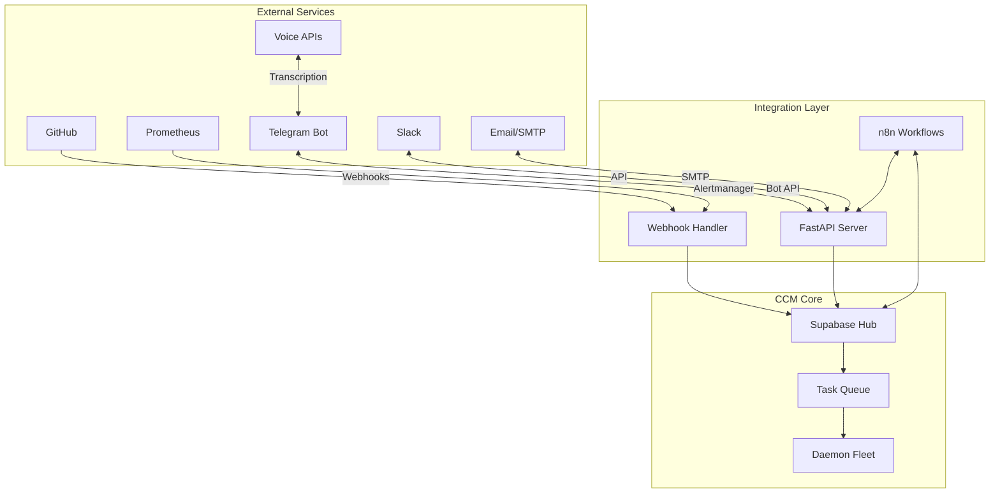
```mermaid
graph TB
    subgraph "External Services"
        TG[Telegram Bot]
        GH[GitHub]
        Slack[Slack]
        Prom[Prometheus]
        Email[Email/SMTP]
        Voice[Voice APIs]
    end

    subgraph "Integration Layer"
        WH[Webhook Handler]
        API[FastAPI Server]
        N8N[n8n Workflows]
    end

    subgraph "CCM Core"
        SB[Supabase Hub]
        Queue[Task Queue]
        Daemons[Daemon Fleet]
    end

    TG <-->|Bot API| API
    GH -->|Webhooks| WH
    Slack <-->|API| API
    Prom -->|Alertmanager| WH
    Email <-->|SMTP| API
    Voice <-->|Transcription| TG

    WH --> SB
    API --> SB
    N8N <--> API
    N8N <--> SB

    SB --> Queue
    Queue --> Daemons
```

## Telegram Bot Integration

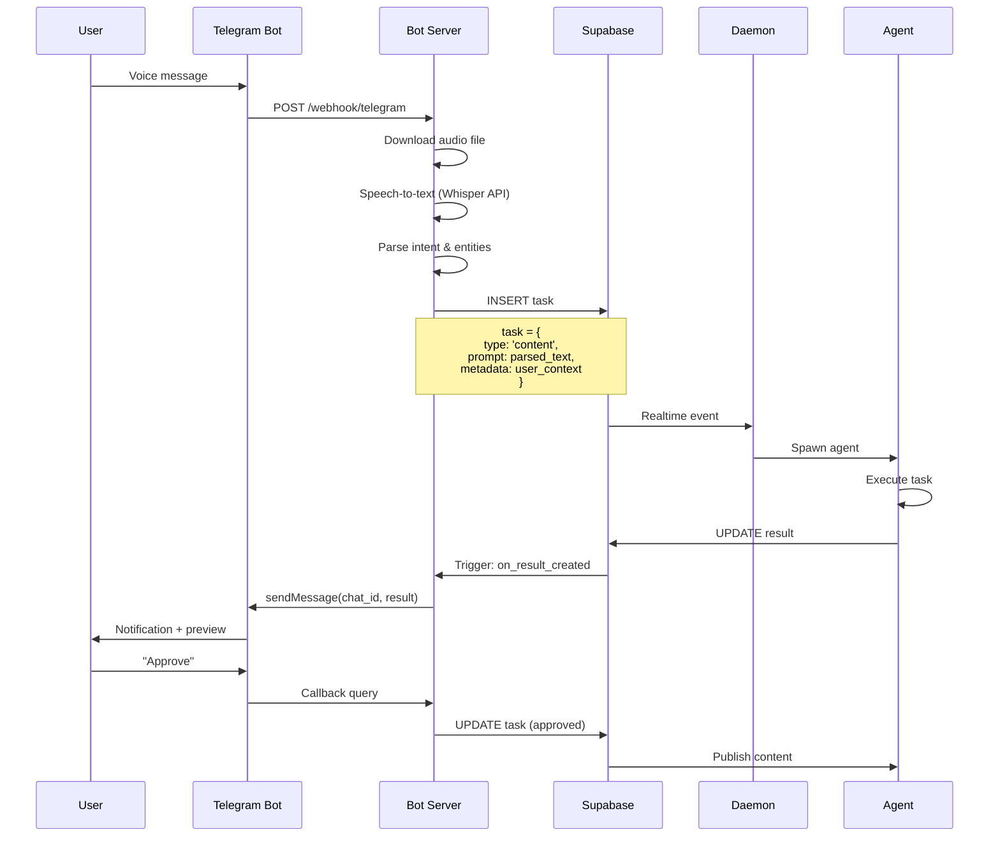
```mermaid
sequenceDiagram
    participant User
    participant TG as Telegram Bot
    participant Bot as Bot Server
    participant SB as Supabase
    participant Daemon
    participant Agent

    User->>TG: Voice message
    TG->>Bot: POST /webhook/telegram

    Bot->>Bot: Download audio file
    Bot->>Bot: Speech-to-text (Whisper API)
    Bot->>Bot: Parse intent & entities

    Bot->>SB: INSERT task
    Note over Bot,SB: task = {<br/>  type: 'content',<br/>  prompt: parsed_text,<br/>  metadata: user_context<br/>}

    SB->>Daemon: Realtime event
    Daemon->>Agent: Spawn agent
    Agent->>Agent: Execute task

    Agent->>SB: UPDATE result
    SB->>Bot: Trigger: on_result_created
    Bot->>TG: sendMessage(chat_id, result)
    TG->>User: Notification + preview

    User->>TG: "Approve"
    TG->>Bot: Callback query
    Bot->>SB: UPDATE task (approved)
    SB->>Agent: Publish content
```

## Telegram Bot Commands

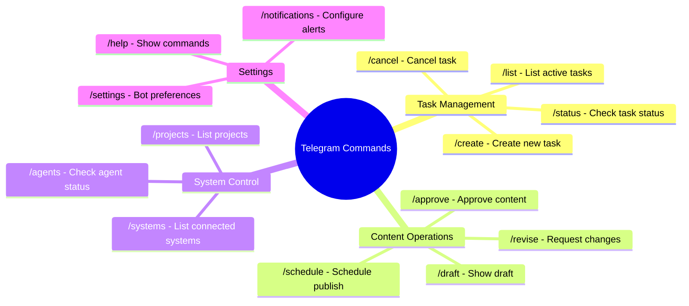
```mermaid
mindmap
  root((Telegram Commands))
    Task Management
      /create - Create new task
      /status - Check task status
      /list - List active tasks
      /cancel - Cancel task
    Content Operations
      /draft - Show draft
      /approve - Approve content
      /revise - Request changes
      /schedule - Schedule publish
    System Control
      /systems - List connected systems
      /projects - List projects
      /agents - Check agent status
    Settings
      /settings - Bot preferences
      /notifications - Configure alerts
      /help - Show commands
```

## GitHub Webhook Integration

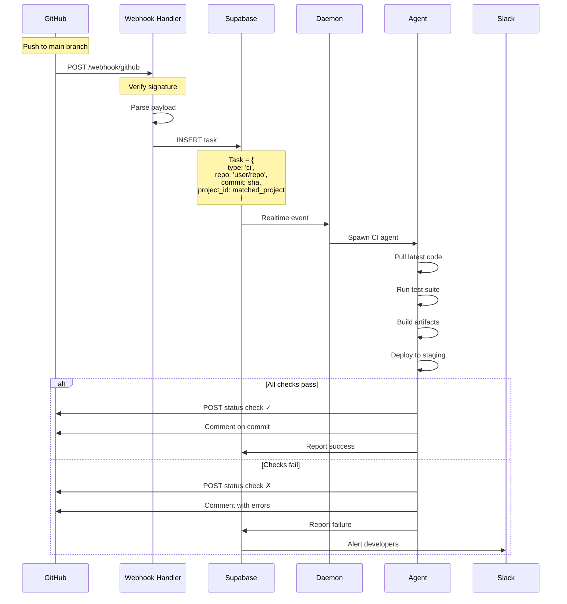
```mermaid
sequenceDiagram
    participant GH as GitHub
    participant WH as Webhook Handler
    participant SB as Supabase
    participant Daemon
    participant Agent

    Note over GH: Push to main branch
    GH->>WH: POST /webhook/github
    Note over WH: Verify signature

    WH->>WH: Parse payload
    WH->>SB: INSERT task

    Note over SB: Task = {<br/>  type: 'ci',<br/>  repo: 'user/repo',<br/>  commit: sha,<br/>  project_id: matched_project<br/>}

    SB->>Daemon: Realtime event
    Daemon->>Agent: Spawn CI agent

    Agent->>Agent: Pull latest code
    Agent->>Agent: Run test suite
    Agent->>Agent: Build artifacts
    Agent->>Agent: Deploy to staging

    alt All checks pass
        Agent->>GH: POST status check ✓
        Agent->>GH: Comment on commit
        Agent->>SB: Report success
    else Checks fail
        Agent->>GH: POST status check ✗
        Agent->>GH: Comment with errors
        Agent->>SB: Report failure
        SB->>Slack: Alert developers
    end
```

## GitHub Events Mapping

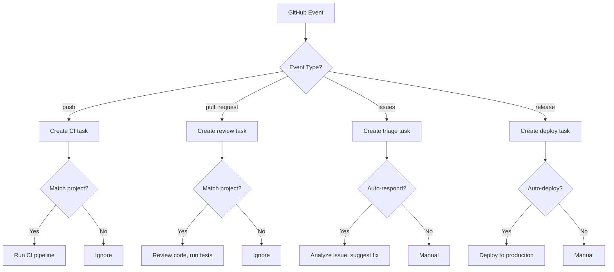
```mermaid
flowchart TD
    GH[GitHub Event] --> Type{Event Type?}

    Type -->|push| Push[Create CI task]
    Type -->|pull_request| PR[Create review task]
    Type -->|issues| Issue[Create triage task]
    Type -->|release| Release[Create deploy task]

    Push --> Match1{Match project?}
    PR --> Match2{Match project?}
    Issue --> Match3{Auto-respond?}
    Release --> Match4{Auto-deploy?}

    Match1 -->|Yes| Task1[Run CI pipeline]
    Match1 -->|No| Ignore1[Ignore]

    Match2 -->|Yes| Task2[Review code, run tests]
    Match2 -->|No| Ignore2[Ignore]

    Match3 -->|Yes| Task3[Analyze issue, suggest fix]
    Match3 -->|No| Ignore3[Manual]

    Match4 -->|Yes| Task4[Deploy to production]
    Match4 -->|No| Ignore4[Manual]
```

## Prometheus/Grafana Monitoring

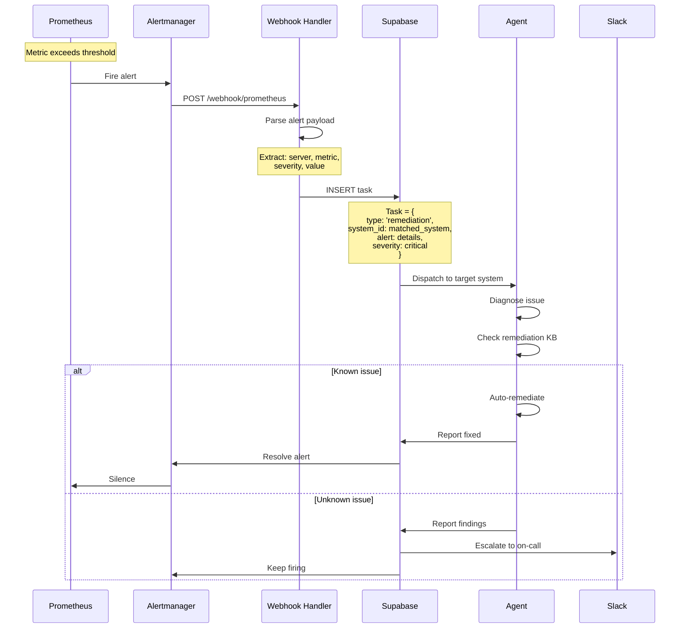
```mermaid
sequenceDiagram
    participant Prom as Prometheus
    participant AM as Alertmanager
    participant WH as Webhook Handler
    participant SB as Supabase
    participant Agent

    Note over Prom: Metric exceeds threshold
    Prom->>AM: Fire alert
    AM->>WH: POST /webhook/prometheus

    WH->>WH: Parse alert payload
    Note over WH: Extract: server, metric,<br/>severity, value

    WH->>SB: INSERT task
    Note over SB: Task = {<br/>  type: 'remediation',<br/>  system_id: matched_system,<br/>  alert: details,<br/>  severity: critical<br/>}

    SB->>Agent: Dispatch to target system
    Agent->>Agent: Diagnose issue
    Agent->>Agent: Check remediation KB

    alt Known issue
        Agent->>Agent: Auto-remediate
        Agent->>SB: Report fixed
        SB->>AM: Resolve alert
        AM->>Prom: Silence
    else Unknown issue
        Agent->>SB: Report findings
        SB->>Slack: Escalate to on-call
        SB->>AM: Keep firing
    end
```

## Prometheus Alert Routing

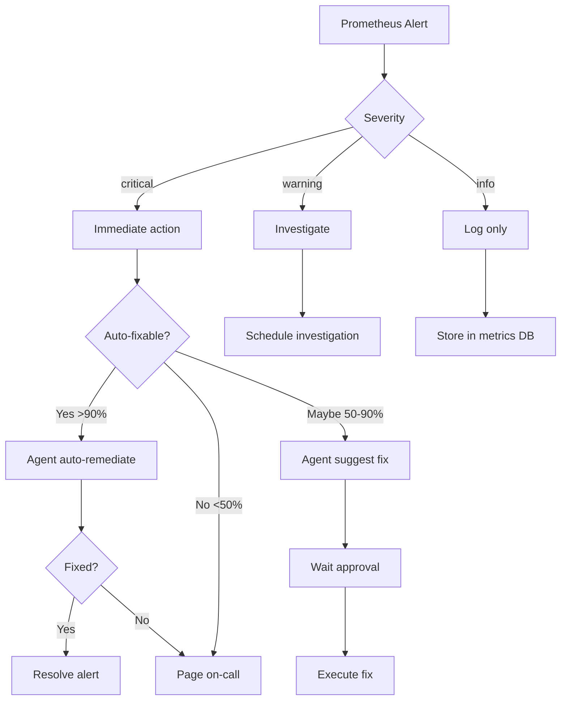
```mermaid
flowchart TD
    Alert[Prometheus Alert] --> Severity{Severity}

    Severity -->|critical| Critical[Immediate action]
    Severity -->|warning| Warning[Investigate]
    Severity -->|info| Info[Log only]

    Critical --> AutoFix{Auto-fixable?}
    AutoFix -->|Yes >90%| Agent1[Agent auto-remediate]
    AutoFix -->|Maybe 50-90%| Agent2[Agent suggest fix]
    AutoFix -->|No <50%| Page[Page on-call]

    Warning --> Schedule[Schedule investigation]
    Info --> Store[Store in metrics DB]

    Agent1 --> Verify1{Fixed?}
    Verify1 -->|Yes| Resolve[Resolve alert]
    Verify1 -->|No| Page

    Agent2 --> WaitApproval[Wait approval]
    WaitApproval --> Execute[Execute fix]
```

## Slack Notification Patterns

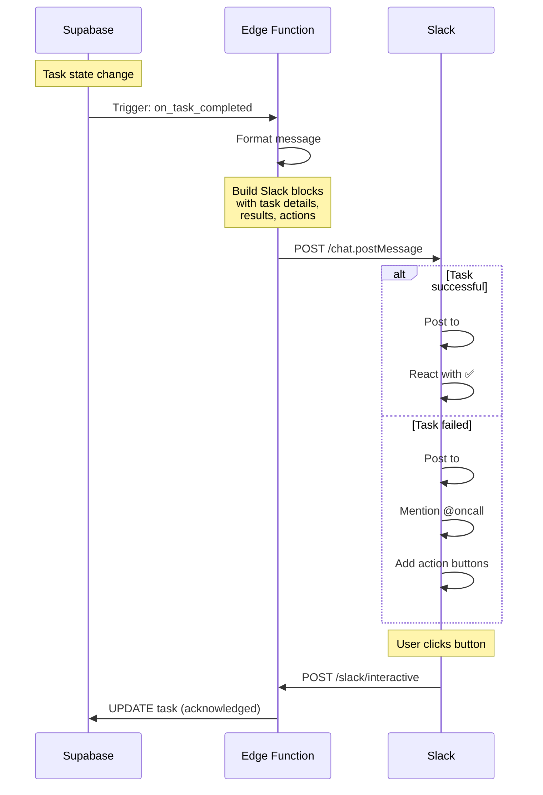
```mermaid
sequenceDiagram
    participant SB as Supabase
    participant Func as Edge Function
    participant Slack

    Note over SB: Task state change
    SB->>Func: Trigger: on_task_completed

    Func->>Func: Format message
    Note over Func: Build Slack blocks<br/>with task details,<br/>results, actions

    Func->>Slack: POST /chat.postMessage

    alt Task successful
        Slack->>Slack: Post to #successes
        Slack->>Slack: React with ✅
    else Task failed
        Slack->>Slack: Post to #alerts
        Slack->>Slack: Mention @oncall
        Slack->>Slack: Add action buttons
    end

    Note over Slack: User clicks button
    Slack->>Func: POST /slack/interactive
    Func->>SB: UPDATE task (acknowledged)
```

## Slack Command Integration

```mermaid
flowchart LR
    subgraph "Slack Commands"
        C1[/ccm create task]
        C2[/ccm status project]
        C3[/ccm list agents]
        C4[/ccm cancel task_id]
    end

    subgraph "Slack App"
        Handler[Command Handler]
        Auth[Verify Slack signature]
        Route[Route to API]
    end

    subgraph "CCM API"
        API[FastAPI]
        SB[Supabase]
    end

    C1 & C2 & C3 & C4 --> Handler
    Handler --> Auth
    Auth --> Route
    Route --> API
    API --> SB

    SB -.->|Response| API
    API -.->|Formatted message| Handler
    Handler -.->|Reply| Slack[Slack Channel]
```

## n8n Workflow Automation

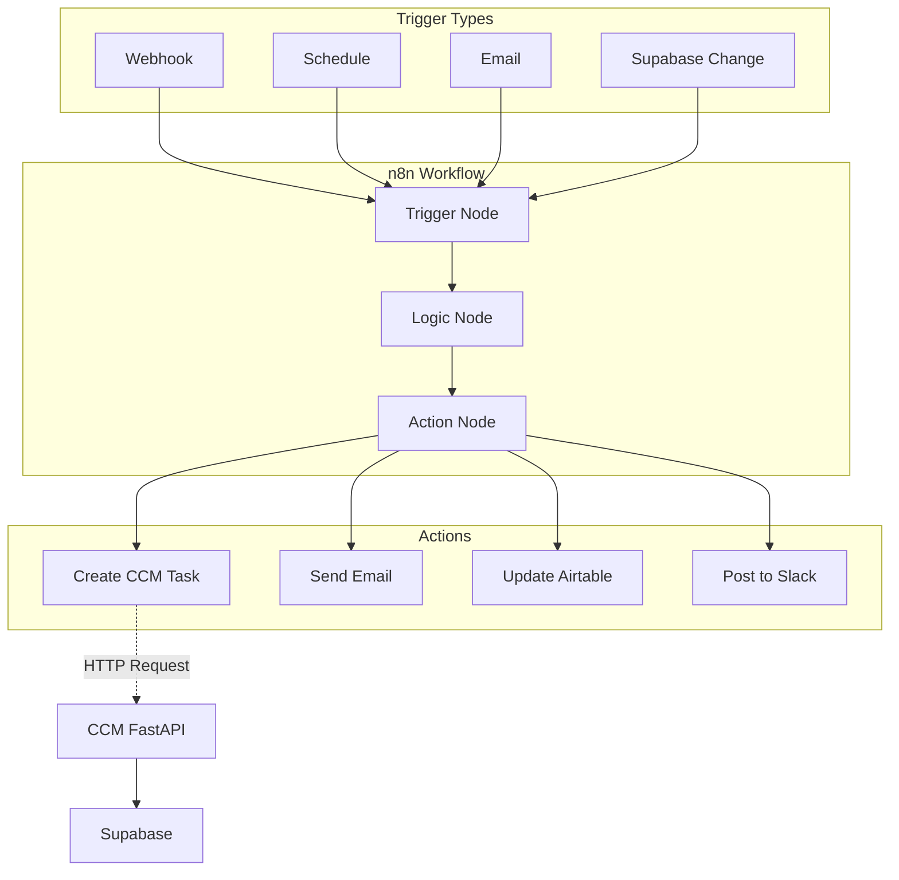
```mermaid
flowchart TD
    subgraph "n8n Workflow"
        Trigger[Trigger Node]
        Logic[Logic Node]
        Action[Action Node]
    end

    subgraph "Trigger Types"
        T1[Webhook]
        T2[Schedule]
        T3[Email]
        T4[Supabase Change]
    end

    subgraph "Actions"
        A1[Create CCM Task]
        A2[Send Email]
        A3[Update Airtable]
        A4[Post to Slack]
    end

    T1 & T2 & T3 & T4 --> Trigger
    Trigger --> Logic
    Logic --> Action

    Action --> A1
    Action --> A2
    Action --> A3
    Action --> A4

    A1 -.->|HTTP Request| API[CCM FastAPI]
    API --> SB[Supabase]
```

## n8n Example: Content Pipeline

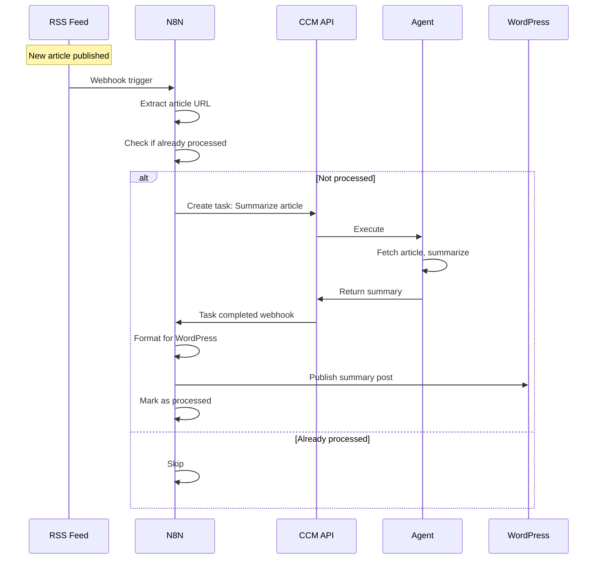
```mermaid
sequenceDiagram
    participant RSS as RSS Feed
    participant N8N
    participant CCM as CCM API
    participant Agent
    participant WP as WordPress

    Note over RSS: New article published
    RSS->>N8N: Webhook trigger

    N8N->>N8N: Extract article URL
    N8N->>N8N: Check if already processed

    alt Not processed
        N8N->>CCM: Create task: Summarize article
        CCM->>Agent: Execute
        Agent->>Agent: Fetch article, summarize
        Agent->>CCM: Return summary

        CCM->>N8N: Task completed webhook
        N8N->>N8N: Format for WordPress
        N8N->>WP: Publish summary post
        N8N->>N8N: Mark as processed
    else Already processed
        N8N->>N8N: Skip
    end
```

## Email Integration (SMTP)

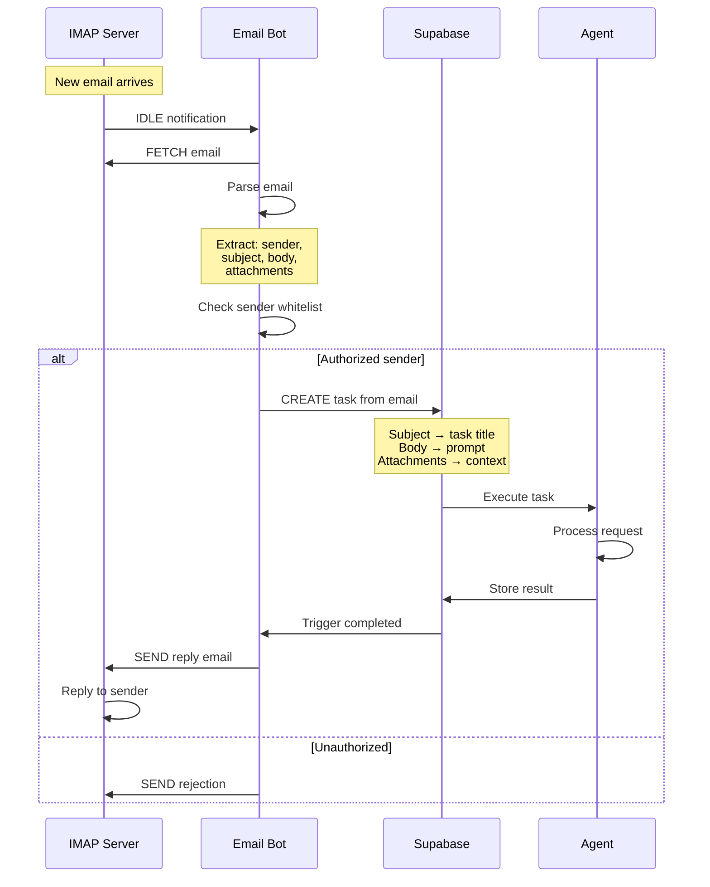
```mermaid
sequenceDiagram
    participant IMAP as IMAP Server
    participant Bot as Email Bot
    participant SB as Supabase
    participant Agent

    Note over IMAP: New email arrives
    IMAP->>Bot: IDLE notification
    Bot->>IMAP: FETCH email

    Bot->>Bot: Parse email
    Note over Bot: Extract: sender,<br/>subject, body,<br/>attachments

    Bot->>Bot: Check sender whitelist
    alt Authorized sender
        Bot->>SB: CREATE task from email
        Note over SB: Subject → task title<br/>Body → prompt<br/>Attachments → context

        SB->>Agent: Execute task
        Agent->>Agent: Process request
        Agent->>SB: Store result

        SB->>Bot: Trigger completed
        Bot->>IMAP: SEND reply email
        IMAP->>IMAP: Reply to sender
    else Unauthorized
        Bot->>IMAP: SEND rejection
    end
```

## Voice Interface Pattern

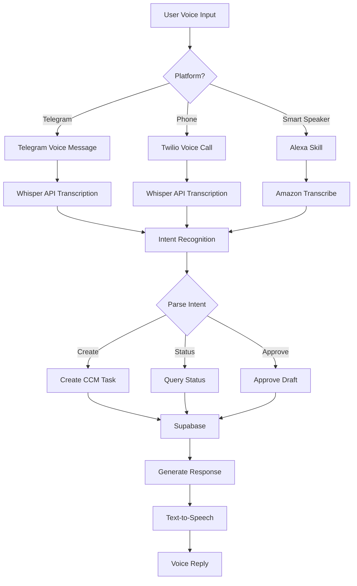
```mermaid
flowchart TD
    Voice[User Voice Input] --> Platform{Platform?}

    Platform -->|Telegram| TG_Voice[Telegram Voice Message]
    Platform -->|Phone| Twilio[Twilio Voice Call]
    Platform -->|Smart Speaker| Alexa[Alexa Skill]

    TG_Voice --> Whisper1[Whisper API Transcription]
    Twilio --> Whisper2[Whisper API Transcription]
    Alexa --> Amazon[Amazon Transcribe]

    Whisper1 & Whisper2 & Amazon --> NLP[Intent Recognition]

    NLP --> Parse{Parse Intent}
    Parse -->|Create| CreateTask[Create CCM Task]
    Parse -->|Status| CheckStatus[Query Status]
    Parse -->|Approve| ApproveContent[Approve Draft]

    CreateTask --> SB[Supabase]
    CheckStatus --> SB
    ApproveContent --> SB

    SB --> Response[Generate Response]
    Response --> TTS[Text-to-Speech]
    TTS --> Reply[Voice Reply]
```

## CI/CD Platform Integrations

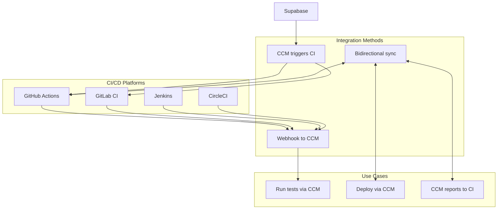
```mermaid
graph TB
    subgraph "CI/CD Platforms"
        GHA[GitHub Actions]
        GL[GitLab CI]
        Jenkins[Jenkins]
        Circle[CircleCI]
    end

    subgraph "Integration Methods"
        M1[Webhook to CCM]
        M2[CCM triggers CI]
        M3[Bidirectional sync]
    end

    subgraph "Use Cases"
        U1[Run tests via CCM]
        U2[Deploy via CCM]
        U3[CCM reports to CI]
    end

    GHA & GL & Jenkins & Circle --> M1
    M1 --> U1

    SB[Supabase] --> M2
    M2 --> GHA & GL

    M3 <--> GHA
    M3 <--> U2 & U3
```

## GitHub Actions + CCM

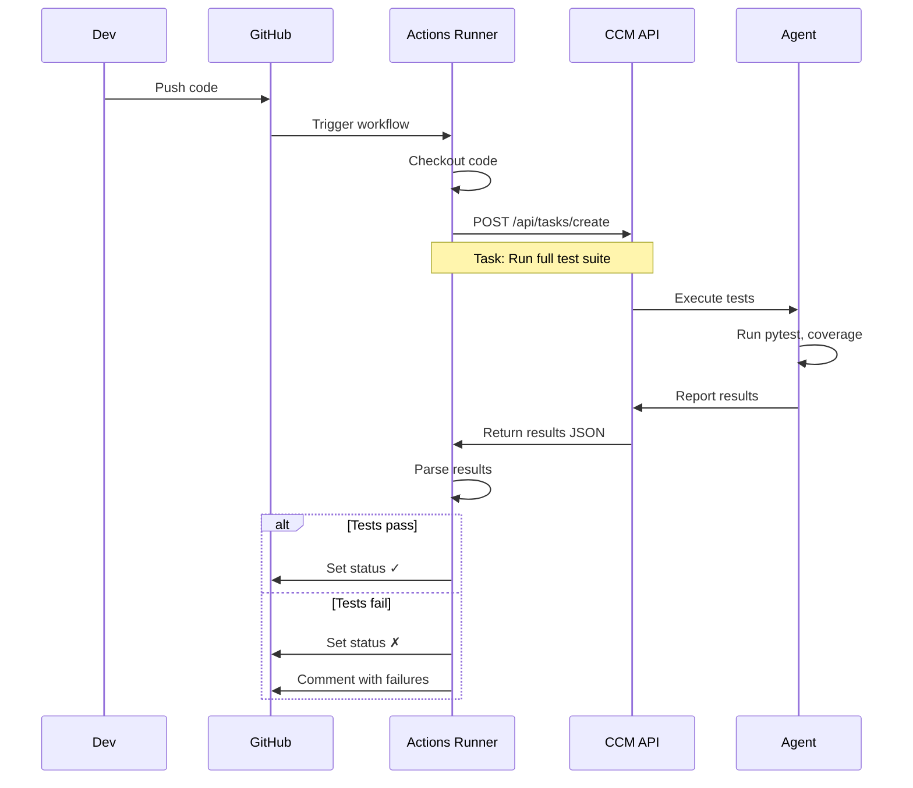
```mermaid
sequenceDiagram
    participant Dev
    participant GH as GitHub
    participant GHA as Actions Runner
    participant CCM as CCM API
    participant Agent

    Dev->>GH: Push code
    GH->>GHA: Trigger workflow

    GHA->>GHA: Checkout code
    GHA->>CCM: POST /api/tasks/create
    Note over GHA,CCM: Task: Run full test suite

    CCM->>Agent: Execute tests
    Agent->>Agent: Run pytest, coverage
    Agent->>CCM: Report results

    CCM->>GHA: Return results JSON
    GHA->>GHA: Parse results

    alt Tests pass
        GHA->>GH: Set status ✓
    else Tests fail
        GHA->>GH: Set status ✗
        GHA->>GH: Comment with failures
    end
```

## Webhook Security Pattern

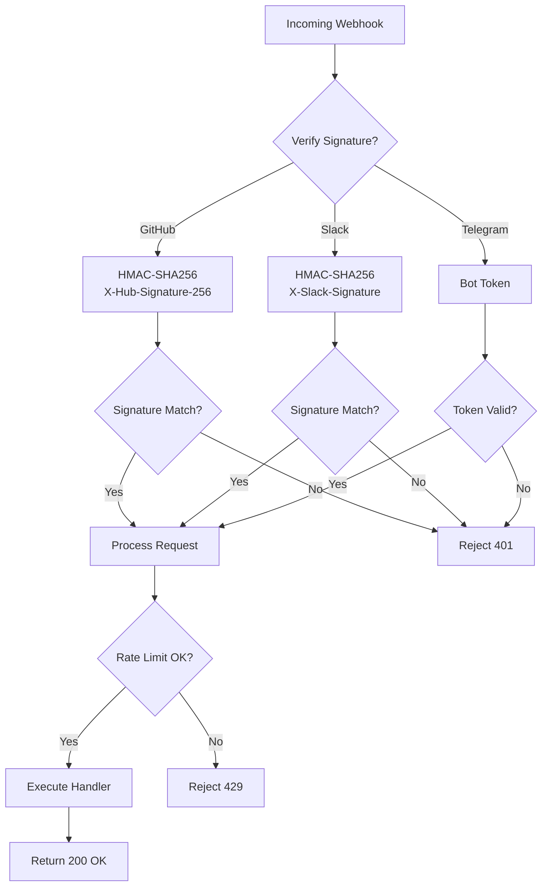
```mermaid
flowchart TD
    Request[Incoming Webhook] --> Verify{Verify Signature?}

    Verify -->|GitHub| HMAC1[HMAC-SHA256<br/>X-Hub-Signature-256]
    Verify -->|Slack| HMAC2[HMAC-SHA256<br/>X-Slack-Signature]
    Verify -->|Telegram| Token[Bot Token]

    HMAC1 --> Compare1{Signature Match?}
    HMAC2 --> Compare2{Signature Match?}
    Token --> Compare3{Token Valid?}

    Compare1 & Compare2 & Compare3 -->|Yes| Accept[Process Request]
    Compare1 & Compare2 & Compare3 -->|No| Reject[Reject 401]

    Accept --> RateLimit{Rate Limit OK?}
    RateLimit -->|Yes| Process[Execute Handler]
    RateLimit -->|No| Reject429[Reject 429]

    Process --> Response[Return 200 OK]
```

## API Authentication Flow

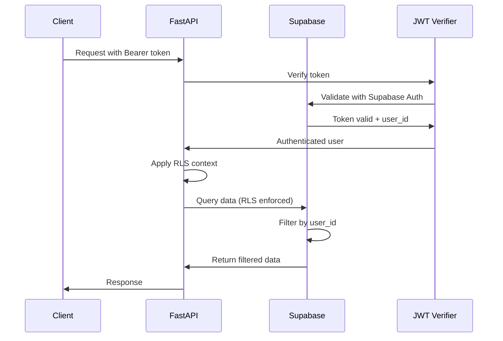
```mermaid
sequenceDiagram
    participant Client
    participant API as FastAPI
    participant SB as Supabase
    participant JWT as JWT Verifier

    Client->>API: Request with Bearer token
    API->>JWT: Verify token

    JWT->>SB: Validate with Supabase Auth
    SB->>JWT: Token valid + user_id

    JWT->>API: Authenticated user
    API->>API: Apply RLS context

    API->>SB: Query data (RLS enforced)
    SB->>SB: Filter by user_id
    SB->>API: Return filtered data

    API->>Client: Response
```

## Integration Health Monitoring

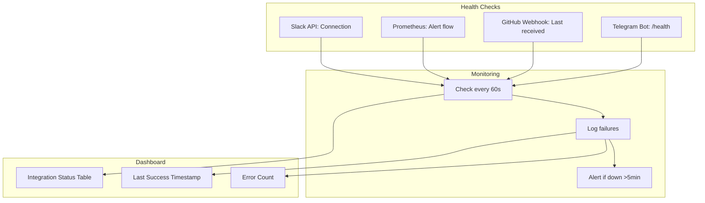
```mermaid
graph TB
    subgraph "Health Checks"
        H1[Telegram Bot: /health]
        H2[GitHub Webhook: Last received]
        H3[Prometheus: Alert flow]
        H4[Slack API: Connection]
    end

    subgraph "Monitoring"
        M1[Check every 60s]
        M2[Log failures]
        M3[Alert if down >5min]
    end

    subgraph "Dashboard"
        D1[Integration Status Table]
        D2[Last Success Timestamp]
        D3[Error Count]
    end

    H1 & H2 & H3 & H4 --> M1
    M1 --> M2
    M2 --> M3

    M1 --> D1
    M2 --> D2
    M2 --> D3
```

## Error Handling & Retries

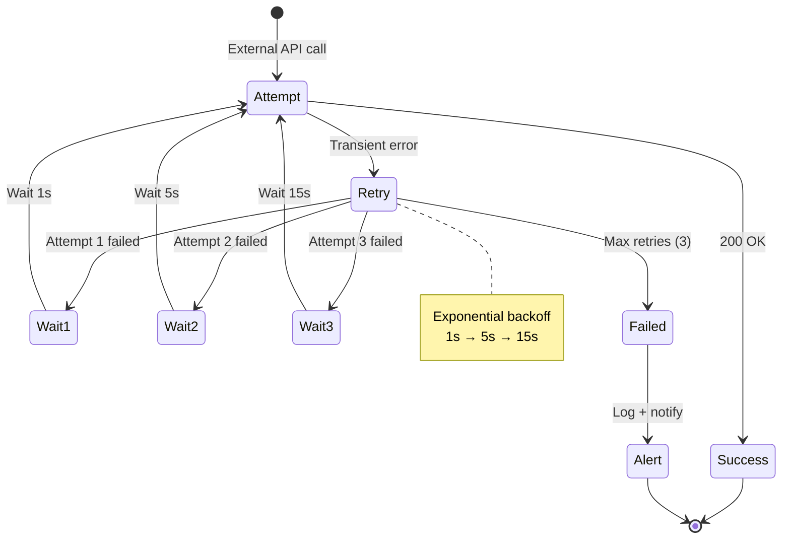
```mermaid
stateDiagram-v2
    [*] --> Attempt: External API call

    Attempt --> Success: 200 OK
    Attempt --> Retry: Transient error

    Retry --> Wait1: Attempt 1 failed
    Wait1 --> Attempt: Wait 1s

    Retry --> Wait2: Attempt 2 failed
    Wait2 --> Attempt: Wait 5s

    Retry --> Wait3: Attempt 3 failed
    Wait3 --> Attempt: Wait 15s

    Retry --> Failed: Max retries (3)

    Success --> [*]
    Failed --> Alert: Log + notify
    Alert --> [*]

    note right of Retry
        Exponential backoff
        1s → 5s → 15s
    end note
```

## Webhook Payload Examples

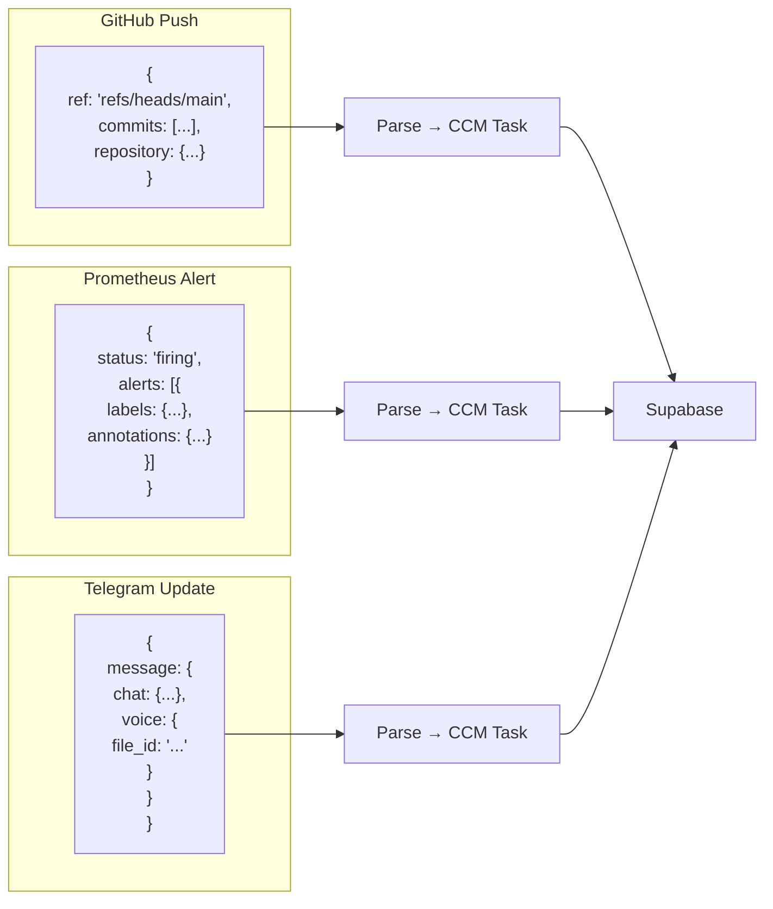
```mermaid
graph LR
    subgraph "GitHub Push"
        GH_Payload["{<br/>  ref: 'refs/heads/main',<br/>  commits: [...],<br/>  repository: {...}<br/>}"]
    end

    subgraph "Prometheus Alert"
        Prom_Payload["{<br/>  status: 'firing',<br/>  alerts: [{<br/>    labels: {...},<br/>    annotations: {...}<br/>  }]<br/>}"]
    end

    subgraph "Telegram Update"
        TG_Payload["{<br/>  message: {<br/>    chat: {...},<br/>    voice: {<br/>      file_id: '...'<br/>    }<br/>  }<br/>}"]
    end

    GH_Payload --> Parser1[Parse → CCM Task]
    Prom_Payload --> Parser2[Parse → CCM Task]
    TG_Payload --> Parser3[Parse → CCM Task]

    Parser1 & Parser2 & Parser3 --> SB[Supabase]
```

## Cloudflare Integration (Post-MVP)

**Status**: Future enhancement, not required for v1.0

### Use Cases

**Cloudflare Workers** - API gateway layer:
- Secure Supabase access
- Rate limiting
- Request validation
- Multi-tenant routing

**Cloudflare Tunnel** - Expose FastAPI securely:
- No port forwarding required
- Zero-trust access
- TLS termination

### Architecture

```mermaid
graph TB
    subgraph "Internet"
        User[Remote User]
        TG[Telegram Bot]
    end

    subgraph "Cloudflare"
        Workers[Workers: API Gateway]
        Tunnel[Tunnel: cloudflared]
    end

    subgraph "Supabase Cloud"
        SB[Supabase]
    end

    subgraph "Local System"
        FastAPI[FastAPI Daemon]
        SQLite[(SQLite)]
    end

    User -->|HTTPS| Workers
    TG -->|HTTPS| Workers

    Workers -->|Validated requests| SB
    Tunnel -.->|Secure tunnel| FastAPI

    FastAPI --> SQLite
    FastAPI <-.->|Sync| SB
```

**Benefits**:
- Enhanced security (WAF, DDoS protection)
- Global edge network (reduced latency)
- Load balancing across multiple systems
- Zero-trust access control

**Implementation** (v2.0):
- Cloudflare Workers intercept Telegram/API requests
- Validate, rate-limit, route to Supabase
- Cloudflare Tunnel exposes FastAPI for remote management
- Optional: Replace Supabase with Cloudflare Workers KV

---

**Status**: DRAFT
**Version**: 0.2
**Last Updated**: 2025-11-17
