---
metadata:
  status: DRAFT
  version: 0.2
  tldr: "Local web UI at localhost:8765 for unified task management"
---

# Local Web Interface

## Overview

**Built into FastAPI at `localhost:8765`**. Provides unified view of local + remote tasks with seamless UX.

## Access

```
http://localhost:8765
```

- No authentication required (localhost-only)
- FastAPI serves static frontend + REST API
- Frontend: Vue.js or React (lightweight, embedded)

## Unified Task View

User sees all tasks merged from local SQLite and remote Supabase (when connected).

```mermaid
flowchart TD
    UI[Web UI loads] --> Fetch{Fetch tasks}

    Fetch -->|Local| SQLite[(SQLite query)]
    Fetch -->|Remote| Check{Supabase connected?}

    Check -->|Yes| API[Supabase API call]
    Check -->|No| Skip[Skip remote]

    SQLite --> Merge[Merge results]
    API --> Merge
    Skip --> Merge

    Merge --> Dedupe[Deduplicate by task_id]
    Dedupe --> Display[Display unified list]

    Note over Display: User doesn't see<br/>local vs remote distinction
```

## UI Layout

```mermaid
graph TB
    subgraph "Header"
        Logo[CCM Orchestrator]
        SyncStatus[Sync: ● Online / ○ Offline]
        System[System: mac-dev-1]
    end

    subgraph "Sidebar"
        Nav1[📋 Tasks]
        Nav2[📁 Projects]
        Nav3[🤖 Agents]
        Nav4[🔧 Skills]
        Nav5[⚙️ Settings]
    end

    subgraph "Main Content"
        Content[Dynamic content based on nav]
    end

    Logo --> Nav1
    SyncStatus --> Content
    Nav1 & Nav2 & Nav3 & Nav4 & Nav5 --> Content
```



## Task List Page

**Features**:
- Filter: All / Queued / Running / Success / Failed
- Search by prompt text
- Sort: Created date, Status, Project
- Indicator: Local 📍 vs Remote 🌐 (subtle, optional)

**Task Actions**:
- View details
- View agent output (if local)
- Cancel (if queued/running)
- Retry (if failed)
- Delete


## Create Task Form


## Project Management

**List Projects**:
- Local projects (on THIS system)
- Remote projects (when Supabase connected)

**Create Project**:
```
Name: my-project
Path: /Users/user/code/my-project
System: [Dropdown: This system / Select from Supabase]
```

**Auto-register** local folders:
- Scan for git repos in `~/code/`, `~/projects/`
- Suggest registration if `.git` found
- One-click register


## Agent Monitor

**View Running Agents**:
- List tmux windows
- Agent status (idle/running)
- Current task
- Uptime

**Actions**:
- View live output (open tmux in browser via xterm.js)
- Stop agent
- Restart agent


## Skills Browser

**View Available Skills**:
- Local skills (in `.claude/skills/`)
- Remote skills (in Supabase, when connected)

**Actions**:
- View skill content (SKILL.md)
- Edit skill (saves to local `.claude/skills/`)
- Publish to Supabase (push local skill to central repo)
- Pull from Supabase (download and apply)

See: [skill-management.md](./skill-management.md)

## Settings Page

**System Configuration**:
- System ID (read-only)
- Hostname (auto-detected)
- System type (developer/devops/business)
- Tags (comma-separated)

**Supabase Configuration**:
- Status: Connected ● / Disconnected ○
- User email (if connected)
- Last sync time
- Actions: Connect, Disconnect, Re-authenticate

**Sync Settings**:
- Sync interval (default: 10s)
- Auto-sync on/off
- Manual sync button

## Connection State Indicator

```mermaid
stateDiagram-v2
    [*] --> LocalOnly: No Supabase config

    LocalOnly --> Connecting: User adds config
    Connecting --> Online: Auth success
    Connecting --> Error: Auth failed

    Online --> Syncing: Sync in progress
    Syncing --> Online: Sync complete

    Online --> Offline: Network lost
    Offline --> Connecting: Network restored

    Error --> LocalOnly: User removes config

    note right of LocalOnly
        Header: ○ Local Only
        Color: Gray
    end note

    note right of Online
        Header: ● Online
        Color: Green
    end note

    note right of Offline
        Header: ○ Offline (queued)
        Color: Yellow
    end note

    note right of Error
        Header: ✗ Error
        Color: Red
    end note
```



## Seamless UX Example

**User creates task for remote project**:

1. User fills form: Project = "server-configs" (remote)
2. Clicks "Create Task"
3. UI shows: "Task created ✓"
4. Behind scenes:
   - If connected: POST to Supabase API immediately
   - If offline: Queue in sync_queue, show "Queued for sync"
5. Task appears in list with 🌐 icon (subtle)
6. User doesn't need to worry about routing

**User views task details**:

1. Click task in list
2. UI fetches:
   - Local task: Query SQLite
   - Remote task: Query Supabase API
3. Display identical UI (user can't tell the difference)
4. Only difference: "View output" button available for local tasks only

## Error Handling

**Supabase Connection Lost Mid-Session**:
```mermaid
flowchart TD
    User[User creating task] --> Submit[Submit form]
    Submit --> Check{Supabase needed?}

    Check -->|Yes| Attempt[Attempt API call]
    Check -->|No| Local[Create locally]

    Attempt --> Fail{Connection error?}
    Fail -->|Yes| Notify[Show warning banner]
    Fail -->|No| Success[Task created]

    Notify --> Queue[Queue for later sync]
    Queue --> Confirm[Confirm to user: "Queued"]

    Local --> Success

    Note1[User sees:<br/>"Connection lost. Task queued for sync."]
    Notify -.-> Note1
```

## API Endpoints (FastAPI)

```
GET    /api/tasks              # List all tasks (local + remote merged)
POST   /api/tasks              # Create task (auto-route)
GET    /api/tasks/{id}         # Get task details
PUT    /api/tasks/{id}         # Update task
DELETE /api/tasks/{id}         # Delete task

GET    /api/projects           # List projects
POST   /api/projects           # Create project
GET    /api/projects/{id}      # Get project details
DELETE /api/projects/{id}      # Delete project

GET    /api/agents             # List running agents
GET    /api/agents/{id}/output # Get agent output
POST   /api/agents/{id}/stop   # Stop agent

GET    /api/skills             # List skills (local + remote)
GET    /api/skills/{name}      # Get skill content
PUT    /api/skills/{name}      # Update skill
POST   /api/skills/{name}/push # Push to Supabase

GET    /api/sync/status        # Sync engine status
POST   /api/sync/now           # Force sync
GET    /api/sync/conflicts     # List conflicts

GET    /api/settings           # Get system settings
PUT    /api/settings           # Update settings
POST   /api/settings/supabase/connect    # Connect to Supabase
DELETE /api/settings/supabase/disconnect # Disconnect
```

---

**Status**: DRAFT
**Version**: 0.2
**Last Updated**: 2025-11-17
