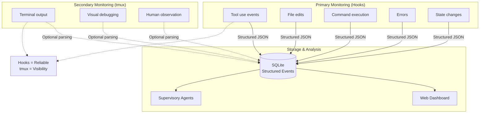
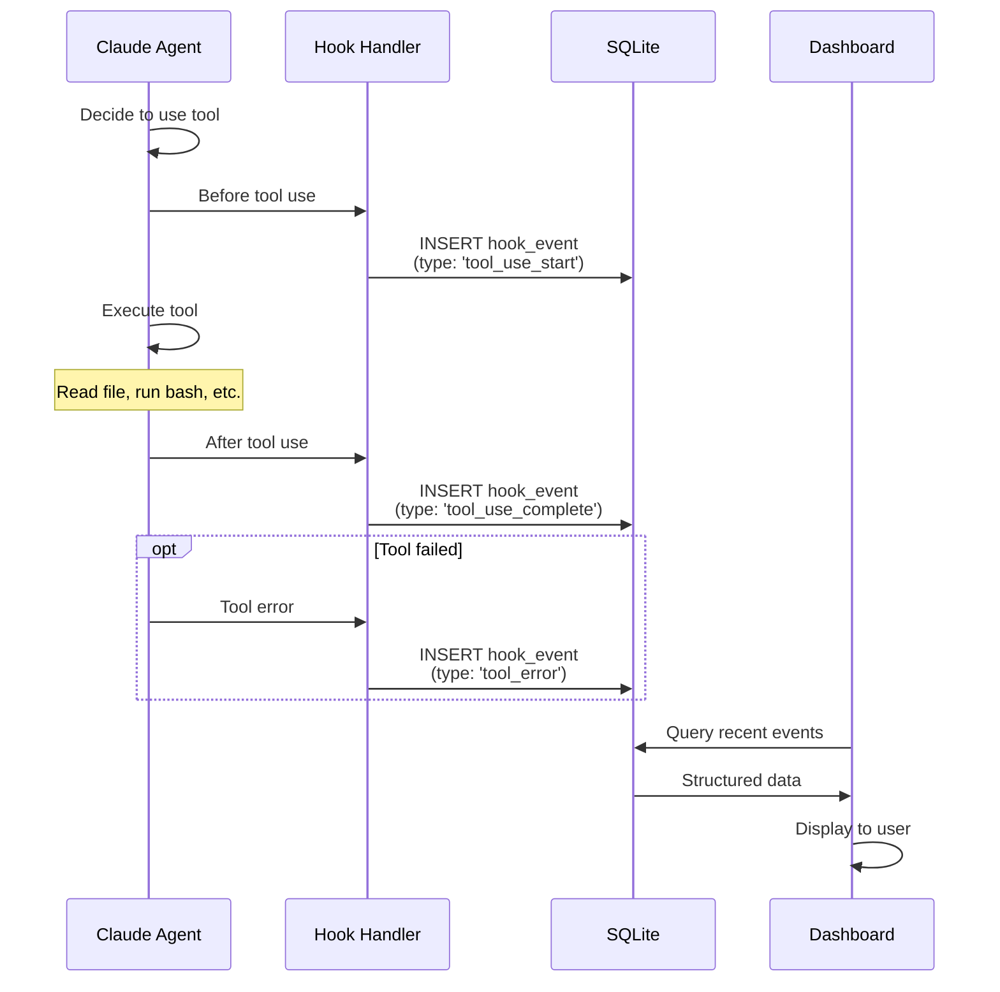
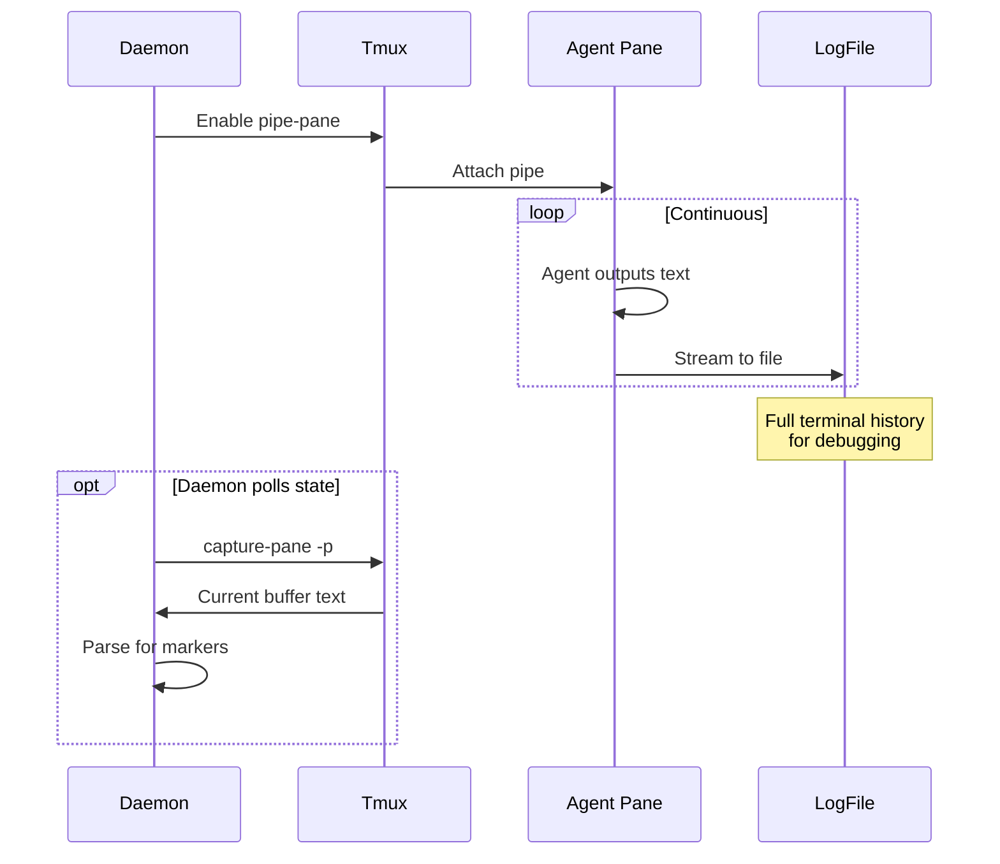
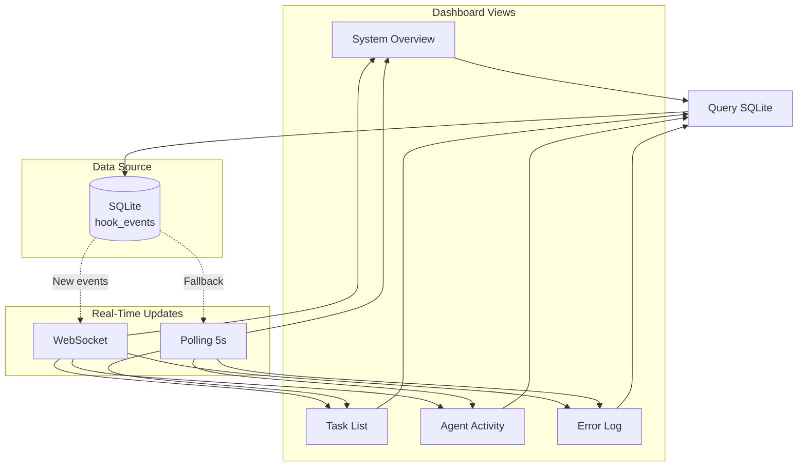
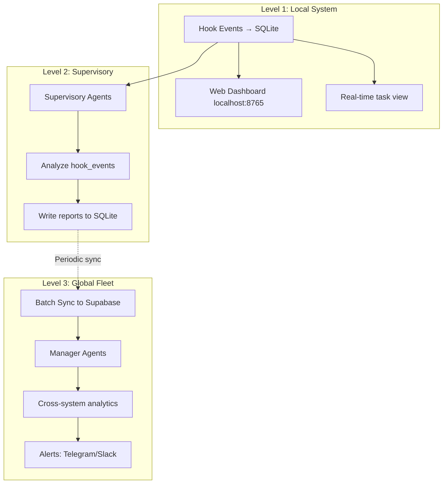

---
metadata:
  status: DRAFT
  version: 0.3
  tldr: "Hook-based monitoring (primary) and tmux capture-pane (secondary)"
  dependencies: [architecture-principles.md, agent-patterns.md]
---

# Monitoring Architecture

## Principle: Hooks Over Terminal Scraping

Claude Code hooks provide structured, reliable state management. tmux capture-pane is supplementary for human visibility.



## Hook-Based Monitoring (Primary)

### Claude Code Hook System

**All available hooks write to SQLite**:



### Hook Events Table

```sql
CREATE TABLE hook_events (
    id INTEGER PRIMARY KEY AUTOINCREMENT,
    task_id INTEGER REFERENCES tasks(id),
    agent_id TEXT NOT NULL,
    system_id TEXT NOT NULL,

    -- Hook metadata
    hook_type TEXT NOT NULL,  -- See types below
    hook_timestamp TIMESTAMP DEFAULT CURRENT_TIMESTAMP,

    -- Event data (structured JSON)
    event_data JSON NOT NULL,

    -- Quick filters
    tool_name TEXT,  -- 'Read', 'Edit', 'Bash', etc.
    file_path TEXT,  -- If file operation
    success BOOLEAN,  -- True/False/NULL

    created_at TIMESTAMP DEFAULT CURRENT_TIMESTAMP
);

CREATE INDEX idx_hook_events_task ON hook_events(task_id);
CREATE INDEX idx_hook_events_type ON hook_events(hook_type);
CREATE INDEX idx_hook_events_timestamp ON hook_events(hook_timestamp DESC);
CREATE INDEX idx_hook_events_agent ON hook_events(agent_id);
```

### Hook Types

**Tool Use Hooks**:
- `tool_use_start`: Agent decides to use tool
- `tool_use_complete`: Tool execution successful
- `tool_error`: Tool execution failed

**File Operation Hooks**:
- `file_read`: File opened for reading
- `file_edit`: File edited
- `file_write`: New file created
- `file_delete`: File removed

**Command Hooks**:
- `bash_command`: Bash command executed
- `bash_output`: Command output captured

**Session Hooks**:
- `session_start`: Agent session begins
- `session_pause`: Agent paused (waiting for input)
- `session_resume`: Agent resumed
- `session_complete`: Agent task finished
- `session_error`: Agent crashed or errored

**State Hooks**:
- `state_change`: Task status changed
- `context_switch`: Agent changed working directory/context

### Hook Event Data Examples

**Tool use event**:
```json
{
  "hook_type": "tool_use_complete",
  "tool_name": "Edit",
  "event_data": {
    "file_path": "/path/to/file.py",
    "old_content_hash": "abc123",
    "new_content_hash": "def456",
    "lines_added": 5,
    "lines_removed": 2,
    "edit_type": "modify"
  },
  "success": true
}
```

**Bash command event**:
```json
{
  "hook_type": "bash_command",
  "tool_name": "Bash",
  "event_data": {
    "command": "git status",
    "working_directory": "/path/to/repo",
    "exit_code": 0,
    "stdout": "On branch main...",
    "stderr": "",
    "duration_ms": 150
  },
  "success": true
}
```

**Session error event**:
```json
{
  "hook_type": "session_error",
  "event_data": {
    "error_type": "permission_denied",
    "error_message": "Tool 'Bash' requires permission",
    "tool_attempted": "Bash",
    "context": "Attempted to run: rm -rf /",
    "recoverable": false
  },
  "success": false
}
```

### Hook Configuration

**Setting up hooks** (per-project or global):

```yaml
# .ccm/config.yaml
hooks:
  enabled: true
  log_to_sqlite: true
  sqlite_path: ~/.ccm-global/ccm.db

  # Which hooks to capture
  capture:
    - tool_use
    - file_operations
    - bash_commands
    - session_lifecycle
    - errors

  # Filtering
  ignore_tools:
    - Read  # Don't log every file read (too verbose)

  ignore_paths:
    - "*/node_modules/*"  # Don't log npm package reads
    - "*/.git/*"  # Don't log .git internals

  # Performance
  batch_size: 10  # Write to DB in batches
  async: true  # Don't block agent on DB writes
```

### Hook Handler Implementation Pattern

**Pseudocode**:
```python
class HookHandler:
    def on_tool_use_start(self, tool_name, params):
        event = {
            "hook_type": "tool_use_start",
            "tool_name": tool_name,
            "event_data": {
                "parameters": params,
                "timestamp": now()
            }
        }

        if not should_ignore(tool_name, params):
            async_write_to_db(event)

    def on_tool_use_complete(self, tool_name, result):
        event = {
            "hook_type": "tool_use_complete",
            "tool_name": tool_name,
            "event_data": {
                "result": result,
                "success": result.success,
                "duration_ms": result.duration
            },
            "success": result.success
        }

        async_write_to_db(event)
```

## Monitoring Queries

### Real-Time Task Monitoring

**Get task progress**:
```sql
SELECT
    task_id,
    COUNT(*) as total_events,
    SUM(CASE WHEN hook_type LIKE '%error%' THEN 1 ELSE 0 END) as errors,
    SUM(CASE WHEN tool_name = 'Edit' THEN 1 ELSE 0 END) as files_edited,
    SUM(CASE WHEN tool_name = 'Bash' THEN 1 ELSE 0 END) as commands_run,
    MAX(hook_timestamp) as last_activity
FROM hook_events
WHERE task_id = 123
GROUP BY task_id;
```

**Result**:
```
task_id: 123
total_events: 45
errors: 0
files_edited: 3
commands_run: 12
last_activity: 2025-11-17 10:45:30
```

### Agent Activity Timeline

```sql
SELECT
    hook_timestamp,
    hook_type,
    tool_name,
    json_extract(event_data, '$.file_path') as file_path,
    json_extract(event_data, '$.command') as command,
    success
FROM hook_events
WHERE agent_id = 'agent-project-1'
ORDER BY hook_timestamp DESC
LIMIT 20;
```

**Dashboard display**:
```
10:45:30 | tool_use_complete | Edit  | src/api.py      | ✓
10:45:28 | tool_use_start    | Edit  | src/api.py      | -
10:45:20 | bash_command      | Bash  | git diff        | ✓
10:45:15 | file_read         | Read  | src/api.py      | ✓
...
```

### Error Detection

```sql
SELECT
    task_id,
    hook_timestamp,
    hook_type,
    tool_name,
    json_extract(event_data, '$.error_message') as error_message
FROM hook_events
WHERE success = false
  AND hook_timestamp > datetime('now', '-1 hour')
ORDER BY hook_timestamp DESC;
```

### Performance Analytics

```sql
SELECT
    tool_name,
    COUNT(*) as usage_count,
    AVG(json_extract(event_data, '$.duration_ms')) as avg_duration_ms,
    MAX(json_extract(event_data, '$.duration_ms')) as max_duration_ms
FROM hook_events
WHERE hook_type = 'tool_use_complete'
  AND event_data LIKE '%duration_ms%'
GROUP BY tool_name
ORDER BY usage_count DESC;
```

## tmux Capture-Pane Monitoring (Secondary)

### Use Cases

**1. Human Debugging**:
- Attach to agent window
- Watch agent think and work
- See full context (not just hooks)

**2. Supplementary Logging**:
- Capture full terminal output
- Write to log files for post-mortem

**3. Fallback State Detection**:
- If hooks fail, parse terminal output
- Detect prompts, completion markers

### Terminal Output Capture



### Pipe-Pane Setup

**Enable logging for all agents**:
```bash
# When spawning agent
tmux pipe-pane -t agent-project-1 \
  'cat >> ~/.ccm-global/logs/agent-project-1-$(date +%Y%m%d-%H%M%S).log'
```

**Result**: Complete terminal history saved

### Capture-Pane Patterns

**Check if agent is idle**:
```python
output = pane.cmd('capture-pane', '-p').stdout[-1]

# Look for shell prompt (agent done)
if output.endswith('$') or output.endswith('>'):
    agent_status = 'idle'
```

**Detect completion markers**:
```python
output = pane.cmd('capture-pane', '-p').stdout

if '[TASK COMPLETE]' in output:
    task_status = 'complete'
elif '[ERROR]' in output:
    task_status = 'error'
```

**Caution**: Fragile, depends on terminal output format

### When to Use capture-pane

**DO use for**:
- Full output logging (pipe-pane)
- Human debugging (attach to watch)
- Detecting idle state (shell prompt)

**DON'T use for**:
- Primary state management (use hooks)
- Parsing tool results (use hooks)
- Detecting completion (use hooks)
- Critical control flow (use hooks)

## Monitoring Dashboard

### Web UI Real-Time View



### Dashboard Queries

**System health**:
```sql
SELECT
    system_id,
    COUNT(DISTINCT agent_id) as active_agents,
    COUNT(*) as events_last_hour,
    SUM(CASE WHEN success = false THEN 1 ELSE 0 END) as errors
FROM hook_events
WHERE hook_timestamp > datetime('now', '-1 hour')
GROUP BY system_id;
```

**Active tasks**:
```sql
SELECT
    t.id,
    t.prompt,
    t.status,
    COUNT(he.id) as events,
    MAX(he.hook_timestamp) as last_activity,
    julianday('now') - julianday(MAX(he.hook_timestamp)) as minutes_idle
FROM tasks t
LEFT JOIN hook_events he ON t.id = he.task_id
WHERE t.status = 'executing'
GROUP BY t.id
ORDER BY last_activity DESC;
```

**Recent errors**:
```sql
SELECT
    task_id,
    agent_id,
    hook_timestamp,
    tool_name,
    json_extract(event_data, '$.error_message') as error
FROM hook_events
WHERE success = false
ORDER BY hook_timestamp DESC
LIMIT 20;
```

## Monitoring Hierarchy



### Monitoring Scope

| Level | Scope | Latency | Data Volume | Use Case |
|-------|-------|---------|-------------|----------|
| **Local** | Single system | Real-time (<1s) | High (all events) | Task debugging, active monitoring |
| **Supervisory** | Task/Project | Minutes | Medium (summaries) | Quality assurance, pattern detection |
| **Global** | All systems | Hours | Low (aggregated) | Fleet health, trend analysis |

## Alert Patterns

### Hook-Based Alerts

**Immediate alerts** (local):
```python
# On hook event
if event.hook_type == 'session_error':
    if event.event_data['recoverable'] == false:
        # Critical error
        create_alert(level='critical', message=event.event_data['error_message'])
```

**Threshold alerts**:
```sql
-- Check every 5 minutes
SELECT COUNT(*) FROM hook_events
WHERE success = false
  AND hook_timestamp > datetime('now', '-5 minutes');

-- If count > 10, raise alert
```

**Pattern alerts** (supervisory agents):
- Same error repeating
- Task taking too long (no new events in 10 min)
- Unusual tool usage patterns

## Best Practices

### 1. Use Hooks for State, tmux for Visibility

**Good**:
```python
# Check task status from hooks
latest_event = db.execute("""
    SELECT hook_type, event_data FROM hook_events
    WHERE task_id = ?
    ORDER BY hook_timestamp DESC LIMIT 1
""", (task_id,)).fetchone()

if latest_event['hook_type'] == 'session_complete':
    task_status = 'complete'
```

**Bad**:
```python
# Parse tmux output for status (fragile)
output = tmux.capture_pane(agent_pane)
if '[COMPLETE]' in output:  # Breaks if format changes
    task_status = 'complete'
```

### 2. Filter Noisy Hooks

**Avoid logging every file read**:
```yaml
hooks:
  ignore_tools:
    - Read  # Too verbose
  ignore_paths:
    - "*/node_modules/*"
```

### 3. Batch Hook Writes

**Don't block agent on every event**:
```python
# Buffer events
event_buffer = []

def on_hook_event(event):
    event_buffer.append(event)

    if len(event_buffer) >= 10:
        # Write batch to DB
        db.executemany("INSERT INTO hook_events ...", event_buffer)
        event_buffer.clear()
```

### 4. Async Hook Handling

**Don't slow down agent execution**:
```python
async def handle_hook(event):
    await asyncio.sleep(0)  # Yield control
    await db.write_event(event)  # Non-blocking write
```

### 5. Keep Log Files for Deep Debugging

**pipe-pane for complete history**:
```bash
# Enable for all agents
tmux pipe-pane -t agent-window \
  'cat >> ~/.ccm-global/logs/agent-$(date +%Y%m%d).log'
```

**Compress old logs**:
```bash
# Daily cron
gzip ~/.ccm-global/logs/*$(date -d yesterday +%Y%m%d)*.log
```

---

**Status**: DRAFT
**Version**: 0.3
**Last Updated**: 2025-11-17
