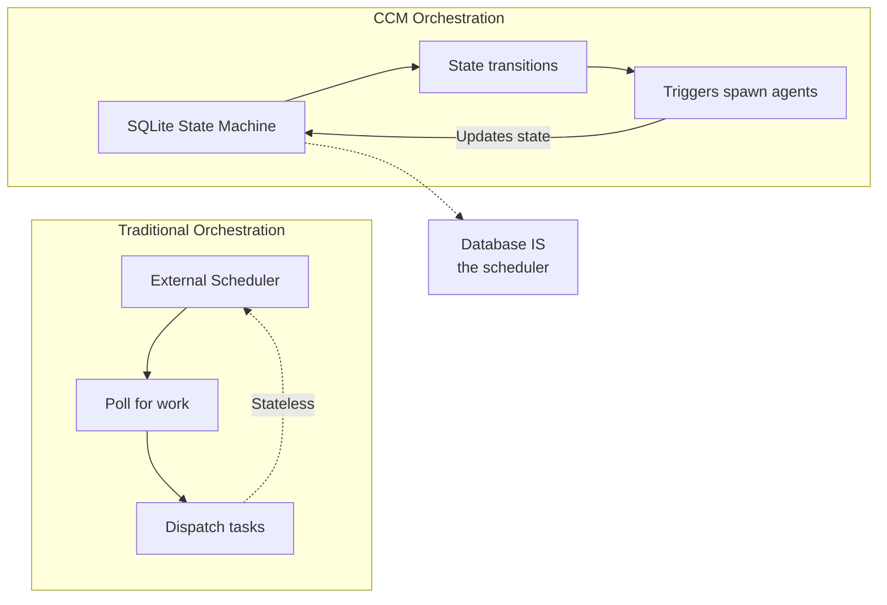
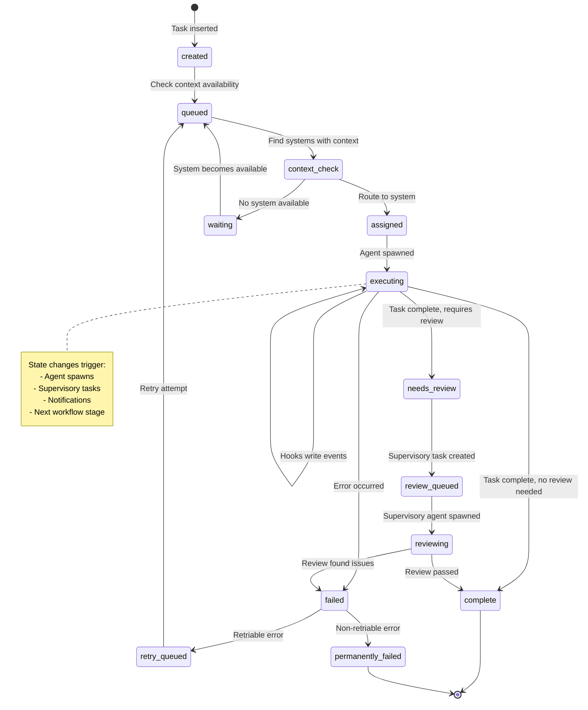
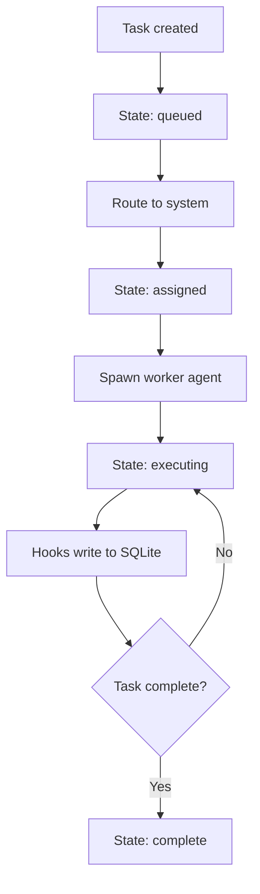
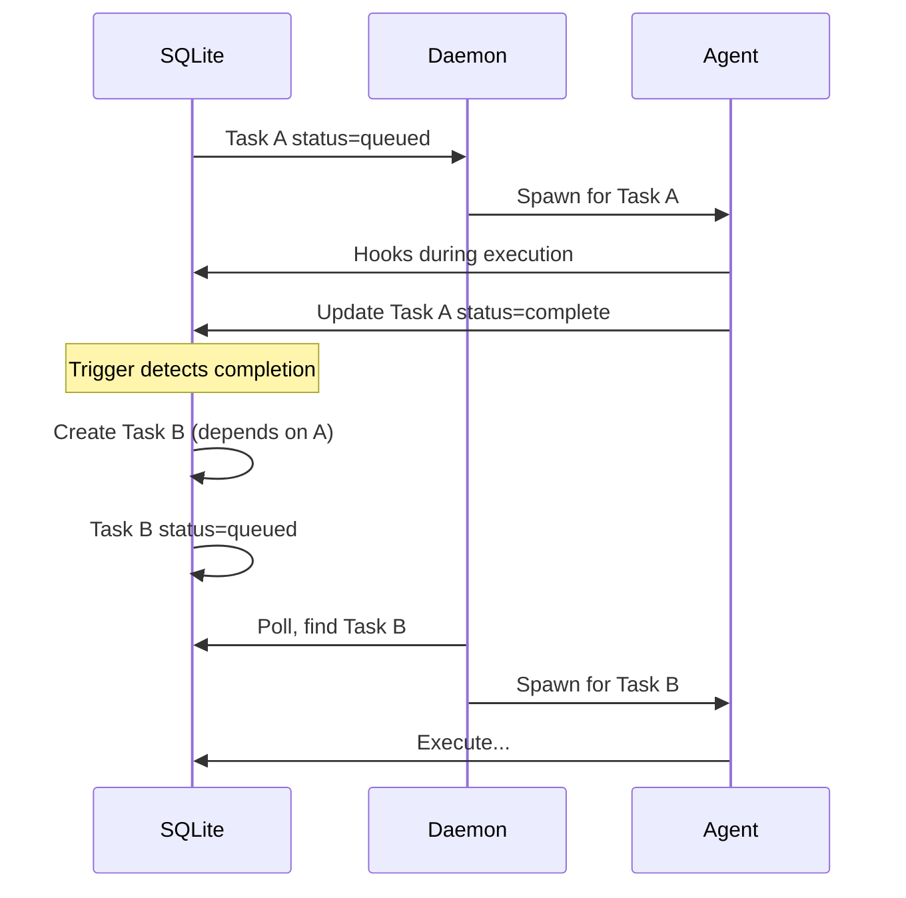
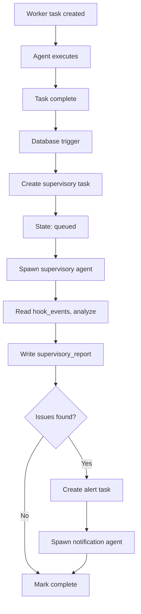
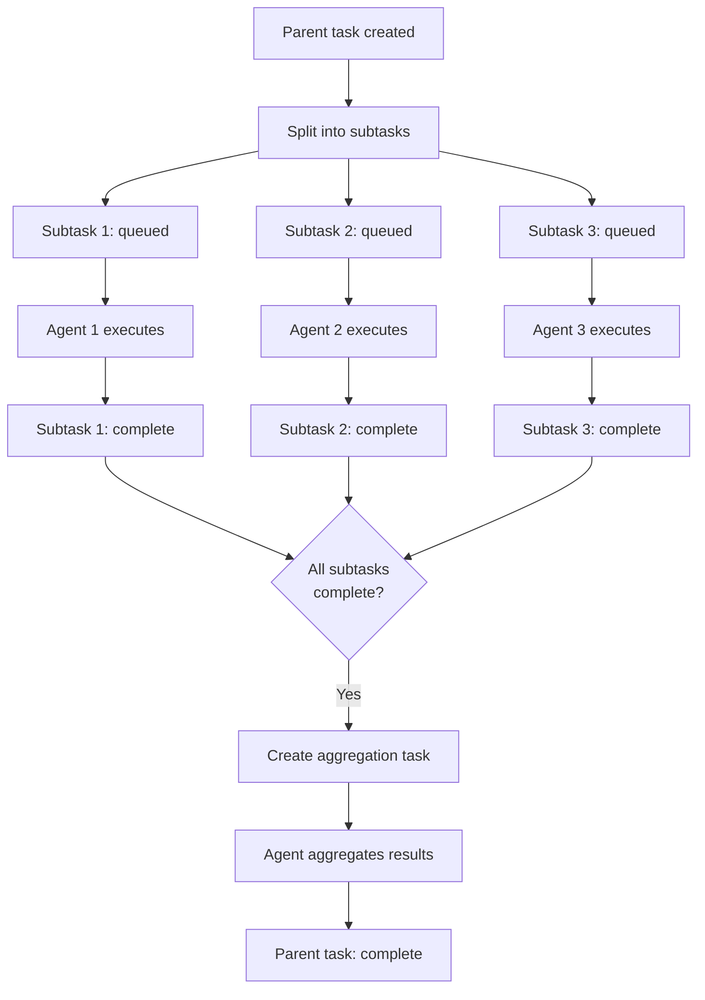
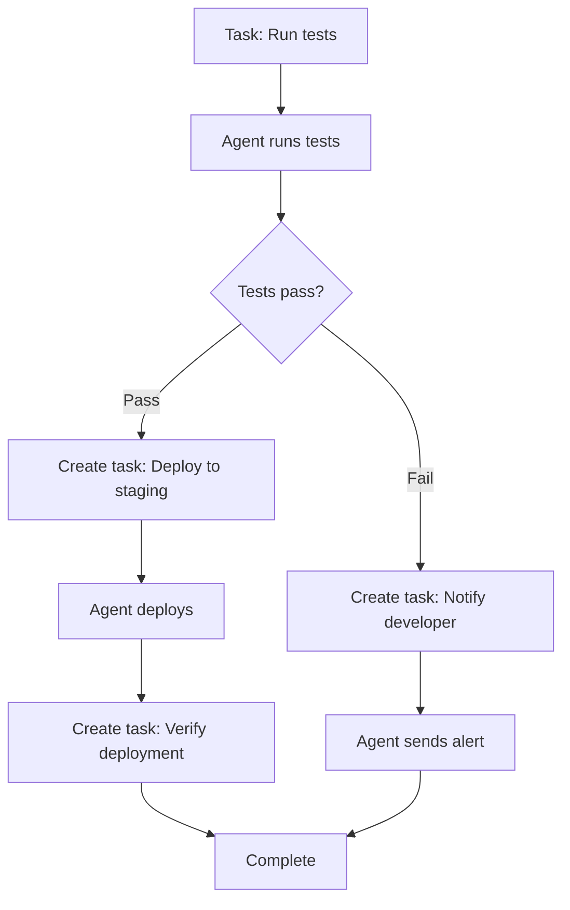
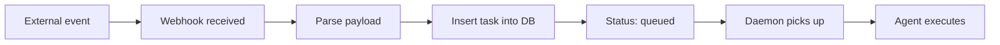
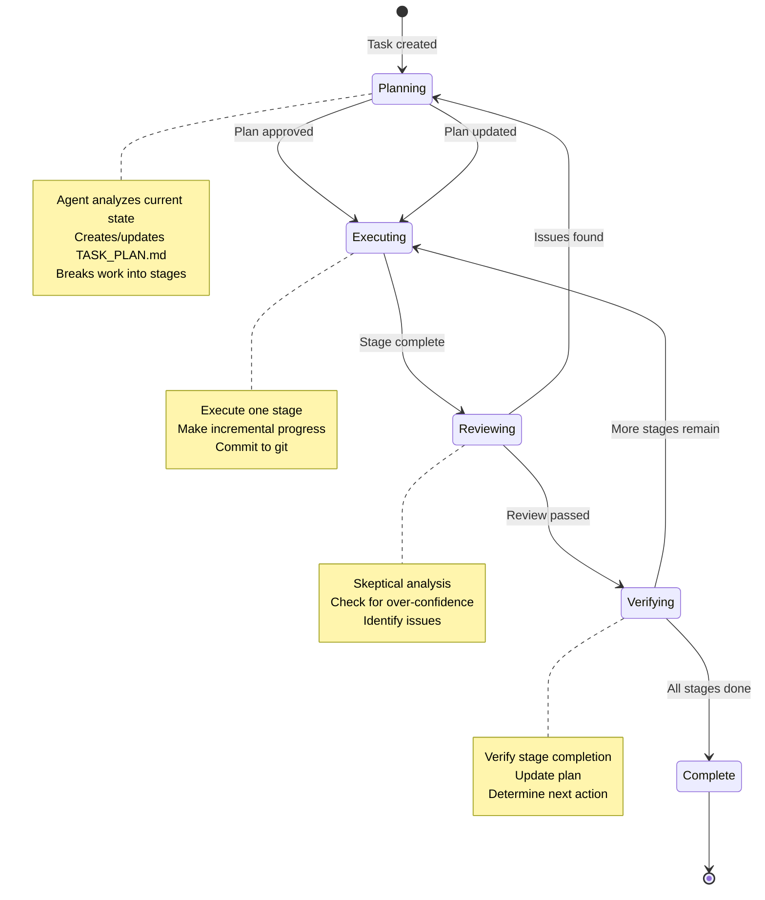
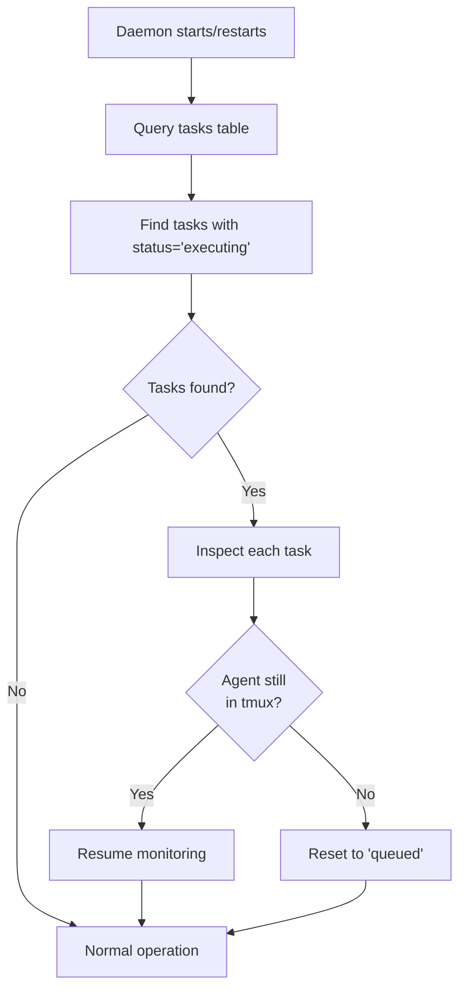

---
metadata:
  status: DRAFT
  version: 0.4
  tldr: "Database-driven orchestration, 4-stage execution cycle, workflow patterns"
  dependencies: [architecture-principles.md, agent-patterns.md, data-architecture.md]
  code_refs: [_dev_tools/cc_automation/]
---

# Orchestration Patterns

## Core Principle: Database as Control Plane

SQLite is not just logging - it's the orchestration engine. State transitions in the database trigger next stages automatically.



## Task Lifecycle State Machine



## Predefined Orchestration Workflows

### 1. Simple Task Execution

**Pattern**: Single agent, single task



**Database operations**:
```sql
-- 1. Create task
INSERT INTO tasks (prompt, status, created_at)
VALUES ('Review code in src/main.py', 'created', NOW());

-- 2. Daemon polls
SELECT * FROM tasks WHERE status='queued' LIMIT 1;

-- 3. Update state
UPDATE tasks SET status='executing', agent_id='agent-1' WHERE id=123;

-- 4. Hooks write events
INSERT INTO hook_events (task_id, hook_type, data)
VALUES (123, 'file_read', '{"file": "src/main.py"}');

-- 5. Task completes
UPDATE tasks SET status='complete', completed_at=NOW() WHERE id=123;
```

### 2. Task Chain (Sequential)

**Pattern**: Task A → Task B → Task C



**Implementation using triggers**:
```sql
-- Trigger: When task completes, spawn dependent task
CREATE TRIGGER after_task_complete
AFTER UPDATE ON tasks
FOR EACH ROW
WHEN NEW.status = 'complete' AND OLD.status != 'complete'
BEGIN
  -- Check for chained tasks
  INSERT INTO tasks (prompt, status, parent_task_id, depends_on)
  SELECT
    next_prompt,
    'queued',
    NEW.id,
    NEW.id
  FROM task_chains
  WHERE trigger_task_id = NEW.id;
END;
```

**Example workflow**: PR Review Chain
1. Task A: "Review PR #123" → complete
2. Trigger creates Task B: "Run tests on PR #123" → queued
3. Task B completes
4. Trigger creates Task C: "Generate PR summary" → queued

### 3. Task with Supervisory Review

**Pattern**: Worker task → Automatic supervisory analysis



**Trigger implementation**:
```sql
CREATE TRIGGER after_worker_task_complete
AFTER UPDATE ON tasks
FOR EACH ROW
WHEN NEW.status = 'complete'
  AND NEW.task_type = 'worker'
  AND OLD.status = 'executing'
BEGIN
  -- Create supervisory task
  INSERT INTO tasks (
    prompt,
    status,
    task_type,
    parent_task_id,
    system_id
  ) VALUES (
    'Analyze execution of task #' || NEW.id || '. Review hook events and determine quality.',
    'queued',
    'supervisory',
    NEW.id,
    NEW.system_id  -- Same system
  );
END;
```

### 4. Parallel Task Execution

**Pattern**: Split work across multiple agents



**Example**: Analyze 100 log files
1. Parent task: "Analyze all logs in /var/log/nginx/"
2. Split into 100 subtasks (one per file)
3. All execute in parallel across available systems
4. When all complete, aggregation task combines results

**Tracking with parent/child relationship**:
```sql
-- Parent task
INSERT INTO tasks (id, prompt, status, task_type)
VALUES (1, 'Analyze all nginx logs', 'created', 'parent');

-- Child tasks
INSERT INTO tasks (prompt, status, parent_task_id, task_type)
VALUES
  ('Analyze access.log.1', 'queued', 1, 'worker'),
  ('Analyze access.log.2', 'queued', 1, 'worker'),
  ('Analyze access.log.3', 'queued', 1, 'worker');

-- Check completion
SELECT COUNT(*) FROM tasks
WHERE parent_task_id = 1 AND status != 'complete';

-- If 0, all children complete, trigger aggregation
```

### 5. Conditional Workflow

**Pattern**: Different paths based on results



**Implementation**:
```sql
-- Worker agent writes result to task
UPDATE tasks
SET status='complete', result_data='{"tests_passed": true}'
WHERE id=123;

-- Trigger reads result and branches
CREATE TRIGGER after_test_task_complete
AFTER UPDATE ON tasks
FOR EACH ROW
WHEN NEW.status = 'complete'
  AND NEW.task_type = 'test'
BEGIN
  -- Branch based on result
  SELECT CASE
    WHEN json_extract(NEW.result_data, '$.tests_passed') = true
    THEN (
      INSERT INTO tasks (prompt, status)
      VALUES ('Deploy to staging', 'queued')
    )
    ELSE (
      INSERT INTO tasks (prompt, status, priority)
      VALUES ('Notify developer: tests failed', 'queued', 'high')
    )
  END;
END;
```

## Database-Driven Scheduling

### Time-Based Triggers

**Pattern**: Execute tasks at specific times

```sql
-- Scheduled tasks table
CREATE TABLE scheduled_tasks (
    id INTEGER PRIMARY KEY,
    prompt TEXT NOT NULL,
    cron_expression TEXT NOT NULL,  -- "0 2 * * *" = daily at 2 AM
    last_run TIMESTAMP,
    next_run TIMESTAMP,
    enabled BOOLEAN DEFAULT true
);

-- Daemon checks every minute
SELECT * FROM scheduled_tasks
WHERE enabled = true
  AND next_run <= NOW()
  AND (last_run IS NULL OR last_run < next_run);

-- Create actual task
INSERT INTO tasks (prompt, status, scheduled_task_id)
VALUES (
  (SELECT prompt FROM scheduled_tasks WHERE id=5),
  'queued',
  5
);

-- Update scheduled_task
UPDATE scheduled_tasks
SET last_run = NOW(),
    next_run = calculate_next_run(cron_expression)
WHERE id=5;
```

**Example scheduled tasks**:
- Daily at 2 AM: "Analyze yesterday's logs"
- Every 4 hours: "Check system health"
- Weekly Sunday: "Generate usage report"
- Every 15 min: "Sync skills from Supabase"

### Event-Based Triggers

**Pattern**: React to external events



**Example events**:
- GitHub webhook: PR opened → Create "Review PR" task
- Prometheus alert: CPU high → Create "Investigate CPU" task
- Telegram message: User request → Create "Execute command" task
- Supabase realtime: New task assigned → Create local task

**Webhook handler**:
```python
@app.post("/webhook/github")
async def github_webhook(payload: dict):
    if payload["action"] == "opened" and "pull_request" in payload:
        pr = payload["pull_request"]

        # Create task in database
        cursor.execute("""
            INSERT INTO tasks (prompt, status, metadata, priority)
            VALUES (?, 'queued', ?, 'high')
        """, (
            f"Review PR #{pr['number']}: {pr['title']}",
            json.dumps({"pr_url": pr["html_url"], "repo": pr["base"]["repo"]["full_name"]})
        ))

        # Database-driven orchestration takes over
        return {"status": "task_created"}
```

## 4-Stage Execution Cycle (Complex Tasks)

**Source**: Adapted from cc_automation overnight development system.

**Use Case**: Long-running, multi-step tasks requiring adaptive planning and skeptical review.

### Overview



### Stage Workflow

**1. Assessment & Planning**:
- Agent reads current project state
- Creates `TASK_PLAN.md` in worktree
- Breaks task into numbered stages
- Each stage is concrete and testable

**2. Stage Execution**:
- Execute ONE stage at a time
- Make incremental file edits
- Run tests relevant to stage
- Git auto-checkpoint every 5 edits (automation)

**3. Skeptical Review**:
- Critical analysis of work done
- Check for logical errors
- Verify tests passed
- Update plan if needed

**4. Completion Check**:
- Verify stage actually complete
- Decide: continue to next stage OR finalize
- Update task_plan_progress

### Database Support

**TASK_PLAN tracking**:
```sql
CREATE TABLE task_plans (
    task_id TEXT PRIMARY KEY,
    plan_file_path TEXT,  -- Path to TASK_PLAN.md in worktree
    total_stages INTEGER,
    current_stage INTEGER DEFAULT 0,
    last_review_result TEXT,  -- 'passed', 'issues_found', 'plan_updated'
    created_at TIMESTAMP DEFAULT CURRENT_TIMESTAMP,
    updated_at TIMESTAMP DEFAULT CURRENT_TIMESTAMP,

    FOREIGN KEY (task_id) REFERENCES tasks(id)
);

-- Stage progress tracking
CREATE TABLE task_plan_stages (
    id INTEGER PRIMARY KEY AUTOINCREMENT,
    task_id TEXT NOT NULL,
    stage_number INTEGER NOT NULL,
    stage_description TEXT NOT NULL,
    status TEXT CHECK(status IN ('pending', 'in_progress', 'completed', 'failed')) DEFAULT 'pending',
    started_at TIMESTAMP,
    completed_at TIMESTAMP,
    review_notes TEXT,

    FOREIGN KEY (task_id) REFERENCES tasks(id),
    UNIQUE(task_id, stage_number)
);
```

### State Machine Integration

**Task status** reflects execution stage:

```sql
-- Task with 4-stage cycle uses extended states
CREATE TABLE tasks (
    ...
    execution_stage TEXT CHECK(execution_stage IN (
        'planning',
        'executing',
        'reviewing',
        'verifying',
        'complete'
    )) DEFAULT 'planning',
    ...
);

-- State transitions trigger next actions
CREATE TRIGGER on_stage_transition
AFTER UPDATE ON tasks
FOR EACH ROW
WHEN OLD.execution_stage != NEW.execution_stage
BEGIN
    -- Log transition
    INSERT INTO task_events (task_id, event_type, event_data)
    VALUES (NEW.id, 'stage_transition', json_object(
        'from', OLD.execution_stage,
        'to', NEW.execution_stage,
        'current_stage', (SELECT current_stage FROM task_plans WHERE task_id = NEW.id)
    ));

    -- Schedule next agent invocation
    INSERT INTO agent_commands (task_id, command, scheduled_at)
    VALUES (NEW.id, get_next_stage_command(NEW.execution_stage), datetime('now'));
END;
```

### Skeptical Review Pattern

**Prevents over-confident progression**:

```python
# Supervisory agent analyzes completed stage
def skeptical_review(task_id, stage_number):
    # Read hook events for this stage
    events = db.execute("""
        SELECT * FROM hook_events
        WHERE task_id = ?
          AND hook_timestamp > (
              SELECT started_at FROM task_plan_stages
              WHERE task_id = ? AND stage_number = ?
          )
    """, (task_id, task_id, stage_number)).fetchall()

    # Analyze patterns
    issues = []

    # Check 1: Were tests run?
    test_runs = [e for e in events if 'test' in e['event_data'].get('command', '')]
    if not test_runs:
        issues.append("No tests executed in this stage")

    # Check 2: Did files change as expected?
    file_edits = [e for e in events if e['tool_name'] == 'Edit']
    if len(file_edits) == 0:
        issues.append("No files modified (stage incomplete?)")

    # Check 3: Were there errors?
    errors = [e for e in events if e['success'] == False]
    if errors:
        issues.append(f"{len(errors)} tool errors occurred")

    # Decision
    if issues:
        # Update plan, re-execute stage
        db.execute("""
            UPDATE task_plans
            SET last_review_result = 'issues_found'
            WHERE task_id = ?
        """, (task_id,))

        # Transition back to planning
        db.execute("""
            UPDATE tasks
            SET execution_stage = 'planning'
            WHERE id = ?
        """, (task_id,))

        return {"status": "issues_found", "issues": issues}
    else:
        # Advance to verification
        db.execute("""
            UPDATE tasks
            SET execution_stage = 'verifying'
            WHERE id = ?
        """, (task_id,))

        return {"status": "passed"}
```

### TASK_PLAN.md Format

**Standard structure**:
```markdown
# Task Plan: Fix Authentication Bug

## Objective
Resolve issue where users can't log in with 2FA enabled.

## Current Status
Stage 2 of 4 in progress

## Stages

### Stage 1: Investigation ✓
- Read authentication code
- Identify 2FA flow
- Reproduce bug locally
**Status**: COMPLETE
**Review**: Passed - Bug located in token validation

### Stage 2: Fix Implementation 🔄
- Update token validator
- Add test cases
- Verify fix locally
**Status**: IN PROGRESS
**Started**: 2025-11-17 10:30

### Stage 3: Integration Testing
- Run full test suite
- Test 2FA flow end-to-end
- Verify no regressions
**Status**: PENDING

### Stage 4: Documentation
- Update CHANGELOG
- Add test documentation
- Create PR description
**Status**: PENDING

## Notes
- Token expiry was 5 min, should be 10 min
- Need to update config docs
```

### Execution Example

**Workflow**:
```
1. Task created → execution_stage='planning'
   Agent: "Let me analyze the authentication bug..."
   Creates: TASK_PLAN.md with 4 stages
   Updates: DB with stages

2. Planning complete → execution_stage='executing'
   Agent: "Executing Stage 1: Investigation..."
   Reads code, identifies bug
   Updates: TASK_PLAN.md (Stage 1 ✓)

3. Stage 1 done → execution_stage='reviewing'
   Supervisory Agent: "Reviewing Stage 1..."
   Checks: Files read, issue identified
   Result: Passed

4. Review passed → execution_stage='verifying'
   Agent: "Stage 1 complete, proceeding to Stage 2"
   Updates: current_stage = 2

5. Verification done → execution_stage='executing'
   Agent: "Executing Stage 2: Fix Implementation..."
   Edits files, runs tests
   Updates: TASK_PLAN.md (Stage 2 🔄)

6. Stage 2 done → execution_stage='reviewing'
   Supervisory Agent: "Reviewing Stage 2..."
   Checks: Tests passed, files modified
   Result: Passed

7-12. Repeat for Stages 3 & 4...

13. All stages done → execution_stage='complete'
    Task marked complete
```

### When to Use 4-Stage Cycle

**Good Fit**:
- Long-running tasks (>30 min)
- Multi-step workflows with dependencies
- Tasks requiring adaptive planning
- Overnight autonomous development

**Not Needed**:
- Simple one-shot tasks
- Quick fixes (<10 min)
- Tasks with predefined fixed steps

### Integration with Existing Patterns

**Combine with**:
- Git worktree isolation (all work in dedicated worktree)
- Quota management (pause between stages if needed)
- Hook-based monitoring (track stage progress)
- Supervisory agents (automated review step)

## Priority and Queue Management

### Priority Levels

```sql
CREATE TABLE tasks (
    ...
    priority TEXT CHECK(priority IN ('low', 'normal', 'high', 'urgent')) DEFAULT 'normal',
    ...
);

-- Daemon query respects priority
SELECT * FROM tasks
WHERE status='queued'
ORDER BY
  CASE priority
    WHEN 'urgent' THEN 1
    WHEN 'high' THEN 2
    WHEN 'normal' THEN 3
    WHEN 'low' THEN 4
  END,
  created_at ASC  -- Then FIFO within priority
LIMIT 1;
```

### Resource-Based Queueing

**Pattern**: Limit concurrent tasks per system/project

```sql
-- Check running tasks before spawning
SELECT COUNT(*) FROM tasks
WHERE status='executing' AND system_id = 'mac-pro-office';

-- If < max_concurrent, spawn new task
-- Otherwise, keep in queued state

-- Configuration
CREATE TABLE system_config (
    system_id TEXT PRIMARY KEY,
    max_concurrent_agents INTEGER DEFAULT 10,
    max_memory_mb INTEGER DEFAULT 4096
);
```

## State Recovery and Consistency

### Handling Daemon Restart

**Pattern**: Resume in-progress tasks



**Recovery query**:
```sql
-- Find orphaned tasks (executing but no agent)
SELECT t.id, t.agent_id
FROM tasks t
LEFT JOIN tmux_sessions ts ON t.agent_id = ts.agent_id
WHERE t.status = 'executing'
  AND ts.agent_id IS NULL;

-- Reset to queued (will be retried)
UPDATE tasks
SET status='queued', agent_id=NULL, retry_count=retry_count+1
WHERE id IN (...);
```

### Idempotency

**Principle**: Tasks can be safely retried

```sql
-- Track retry attempts
ALTER TABLE tasks ADD COLUMN retry_count INTEGER DEFAULT 0;
ALTER TABLE tasks ADD COLUMN max_retries INTEGER DEFAULT 3;

-- Only retry if under limit
SELECT * FROM tasks
WHERE status='failed'
  AND retry_count < max_retries
  AND error_type IN ('network_timeout', 'temporary_error');

-- Mark permanently failed if over limit
UPDATE tasks
SET status='permanently_failed'
WHERE status='failed'
  AND retry_count >= max_retries;
```

## Orchestration Patterns Comparison

| Pattern | Use Case | Complexity | Parallelization | State Changes |
|---------|----------|------------|-----------------|---------------|
| **Simple** | Single independent task | Low | N/A | 3-4 |
| **Chain** | Sequential dependencies | Medium | None | 6-8 per task |
| **Supervisory** | Quality assurance | Medium | Parallel reviews | 5-7 |
| **Parallel** | Batch processing | High | Full | 3-4 per subtask |
| **Conditional** | Branching logic | High | Varies | 4-10 |

## Best Practices

### 1. Keep Tasks Granular
**Good**: "Review src/api/auth.py and suggest improvements"
**Bad**: "Review entire codebase and refactor everything"

### 2. Use Metadata for Context
```sql
INSERT INTO tasks (prompt, metadata) VALUES (
  'Review PR #123',
  json_object(
    'pr_number', 123,
    'repo_url', 'https://github.com/org/repo',
    'branch', 'feature/new-auth',
    'author', 'user@example.com'
  )
);
```

### 3. Implement Timeouts
```sql
-- Find tasks running too long
SELECT * FROM tasks
WHERE status='executing'
  AND (julianday('now') - julianday(started_at)) * 24 * 60 > 30;  -- 30 minutes

-- Mark as timeout
UPDATE tasks
SET status='timeout', error_message='Exceeded 30 min execution time'
WHERE id IN (...);
```

### 4. Log State Transitions
```sql
CREATE TABLE task_state_log (
    id INTEGER PRIMARY KEY AUTOINCREMENT,
    task_id INTEGER REFERENCES tasks(id),
    old_status TEXT,
    new_status TEXT,
    changed_at TIMESTAMP DEFAULT CURRENT_TIMESTAMP,
    changed_by TEXT  -- 'daemon', 'agent', 'user', 'trigger'
);

-- Trigger logs all state changes
CREATE TRIGGER log_task_state_change
AFTER UPDATE ON tasks
FOR EACH ROW
WHEN OLD.status != NEW.status
BEGIN
  INSERT INTO task_state_log (task_id, old_status, new_status, changed_by)
  VALUES (NEW.id, OLD.status, NEW.status, 'daemon');
END;
```

---

**Status**: DRAFT
**Version**: 0.4
**Last Updated**: 2025-11-17

**Key Enhancements in v0.4**:
- Added 4-stage execution cycle (Planning → Executing → Reviewing → Verifying)
- TASK_PLAN.md workflow with adaptive planning
- Skeptical review pattern prevents over-confident progression
- Database support for multi-stage task orchestration (task_plans, task_plan_stages tables)
- Integration with worktree isolation, quota management, hook monitoring
