---
metadata:
  status: DRAFT
  version: 0.1
  tldr: "Business user persona - Voice-driven content automation"
---

# Persona: Business User

## Profile

## Current Workflow (Before CCM)

## Pain Points Deep Dive

## User Journey with CCM

## Workflow with CCM

## Typical Tasks

## Voice-to-Task Flow

```mermaid
flowchart TD
    Start[Maria's voice message] --> Telegram[Telegram bot]
    Telegram --> Transcribe[Speech-to-text]
    Transcribe --> Parse[Parse intent]

    Parse --> Type{Task type?}

    Type -->|Create| Create[Create content task]
    Type -->|Research| Research[Research task]
    Type -->|Edit| Edit[Edit task]
    Type -->|Schedule| Schedule[Schedule task]

    Create --> Supabase[Add to Supabase]
    Research --> Supabase
    Edit --> Supabase
    Schedule --> Supabase

    Supabase --> Agent[Agent executes]
    Agent --> Result[Generate result]
    Result --> Notify[Notify Maria]

    Notify --> Review{Maria reviews}
    Review -->|Approve| Done[✓ Complete]
    Review -->|Revise| Feedback[Voice feedback]
    Feedback --> Agent
```

## Telegram Bot Interface

## Content Folder Structure

## Mobile-First Experience

## Integration Points

## Success Metrics for Business User

```mermaid
graph TD
    subgraph "Productivity"
        M1[Content pieces: 2→10/week]
        M2[Time per piece: 5hrs→30min]
        M3[Research time: -80%]
        M4[Revision cycles: 3→1]
    end

    subgraph "Quality"
        M5[Consistency: +60%]
        M6[SEO scores: +40%]
        M7[Engagement: +25%]
        M8[Error rate: -90%]
    end

    subgraph "Freedom"
        M9[Mobile work: +70%]
        M10[Work-life balance: Better]
        M11[Creative time: +3hrs/day]
        M12[Stress: -50%]
    end

    M1 & M2 & M3 & M4 --> Success[🎉 Success]
    M5 & M6 & M7 & M8 --> Success
    M9 & M10 & M11 & M12 --> Success
```

## Real Example: Blog Post Creation

```mermaid
sequenceDiagram
    participant Maria
    participant Telegram
    participant Agent

    Note over Maria: Monday 9 AM (in Uber)
    Maria->>Telegram: 🎤 Voice message
    Note over Maria: "Create blog post:<br/>Top 5 AI tools for marketers,<br/>1000 words, casual tone"

    Telegram->>Agent: Task created
    Note over Agent: Agent works (20 min)

    Agent->>Agent: 1. Research AI tools
    Agent->>Agent: 2. Check our past content
    Agent->>Agent: 3. Create outline
    Agent->>Agent: 4. Write sections
    Agent->>Agent: 5. Add examples
    Agent->>Agent: 6. Format with template
    Agent->>Agent: 7. Add SEO metadata

    Agent->>Telegram: ✅ Draft ready
    Telegram->>Maria: Notification

    Note over Maria: 10 AM (at desk)
    Maria->>Telegram: "Show me"
    Telegram->>Maria: Preview (markdown)

    Maria->>Telegram: 🎤 "Add more examples<br/>in section 3"

    Telegram->>Agent: Revision request
    Agent->>Agent: Add examples
    Agent->>Telegram: ✅ Updated

    Telegram->>Maria: Ready for review

    Maria->>Telegram: "Approve & publish"
    Agent->>Agent: Move to blog/published/
    Agent->>Agent: Update content calendar

    Note over Maria: Total time: 10 minutes<br/>(vs 5 hours before)
```

## Template System

## Future: Voice Dashboard

---

**Status**: DRAFT
**Version**: 0.1
**Last Updated**: 2025-11-17