---
metadata:
  status: DRAFT
  version: 0.1
  tldr: "Developer persona - Autonomous project execution and task automation"
---

# Persona: Software Developer

## Profile

## Current Workflow (Before CCM)

## Pain Points Deep Dive

```mermaid
graph TB
    subgraph "Time Wasters"
        T1[Context Switching - 2hrs/day]
        T2[Waiting for CI - 1hr/day]
        T3[Manual Testing - 1.5hrs/day]
        T4[Documentation - 0hrs/day 😞]
    end

    subgraph "Quality Issues"
        Q1[Forgotten Edge Cases]
        Q2[Outdated README]
        Q3[Missing Tests]
        Q4[Inconsistent Style]
    end

    subgraph "Frustrations"
        F1[Repetitive Tasks]
        F2[Late-Night Deploys]
        F3[Breaking Changes]
        F4[Lost Productivity]
    end

    T1 & T2 & T3 & T4 --> Pain[Daily Pain]
    Q1 & Q2 & Q3 & Q4 --> Pain
    F1 & F2 & F3 & F4 --> Pain
```

## User Journey with CCM

## Workflow with CCM

## Typical Tasks

## Setup & Configuration

```mermaid
flowchart TD
    Start[Developer Onboarding] --> Install[Install CCM]
    Install --> Init[ccm-orchestrator init]
    Init --> Supabase[Configure Supabase]

    Supabase --> Register1[Register Project 1]
    Supabase --> Register2[Register Project 2]
    Supabase --> Register3[Register Project N]

    Register1 --> Skills1[Add Claude skills]
    Register2 --> Skills2[Add Claude skills]
    Register3 --> Skills3[Add Claude skills]

    Skills1 --> Ready[✓ Ready]
    Skills2 --> Ready
    Skills3 --> Ready

    Ready --> Create[Create first task]
    Create --> Watch[Watch agent execute]
    Watch --> Happy[😊 Productive]
```

## Integration Points

## Success Metrics for Developer

## Real Example: Feature Development

---

**Status**: DRAFT
**Version**: 0.1
**Last Updated**: 2025-11-17