---
metadata:
  status: DRAFT
  version: 0.1
  tldr: "DevOps persona - Server fleet monitoring and auto-remediation"
---

# Persona: DevOps Engineer

## Profile

## Current Workflow (Before CCM)

## Pain Points Deep Dive

## User Journey with CCM

## Workflow with CCM

## Typical Tasks

## Fleet Management

## Auto-Remediation Flow

## Integration with Monitoring

## Multi-Server Task Distribution

## Success Metrics for DevOps

```mermaid
graph TD
    subgraph "Operational"
        M1[MTTR: -70%]
        M2[Manual incidents: -80%]
        M3[Alert fatigue: -60%]
        M4[Uptime: +2% → 99.9%]
    end

    subgraph "Team Impact"
        M5[On-call pages: -90%]
        M6[Weekend incidents: -85%]
        M7[Sleep quality: +100%]
        M8[Burnout risk: Eliminated]
    end

    subgraph "Business"
        M9[Ops cost: -40%]
        M10[Incident cost: -$50k/mo]
        M11[Capacity: +30%]
        M12[Compliance: Improved]
    end

    M1 & M2 & M3 & M4 --> Success[🎉 Success]
    M5 & M6 & M7 & M8 --> Success
    M9 & M10 & M11 & M12 --> Success
```

## Real Example: Disk Space Alert

## Knowledge Base Integration

---

**Status**: DRAFT
**Version**: 0.1
**Last Updated**: 2025-11-17