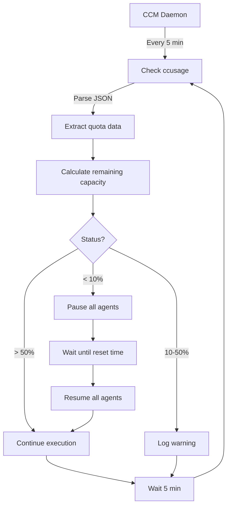
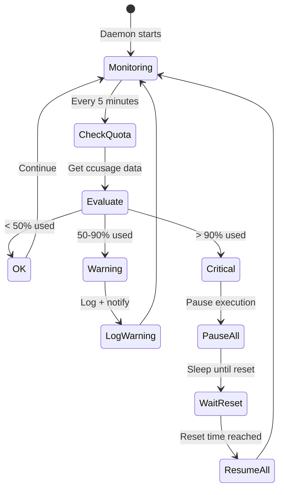

---
metadata:
  status: DRAFT
  version: 0.4
  tldr: "ccusage integration for quota detection, pause/resume mechanisms"
  dependencies: [architecture-principles.md, monitoring-architecture.md]
  code_refs: [_dev_tools/pneuma-claude-hooks/statusline.sh]
---

# Quota Management

## Core Principle

**Detect quota limits proactively using ccusage tool.** Pause task execution before exhaustion, auto-resume after reset.

## Why ccusage (Not Multiple Strategies)

**User Decision**: Single authoritative source for quota information.

**Rationale**:
- Most precise (official tool)
- Real reset times (not estimates)
- Proven working (in production use)
- Reduces complexity (one integration point)

**Conservative Estimation** still used as fallback when ccusage unavailable.

## ccusage Integration

### Overview



### ccusage Tool

**Installation**:
```bash
# ccusage is a CLI tool for Claude usage tracking
npm install -g ccusage

# Verify installation
ccusage --version
```

**Command**:
```bash
ccusage blocks --json --no-pricing
```

**Output Format**:
```json
{
  "blocks": [
    {
      "isActive": true,
      "startTime": "2025-01-17T00:00:00.000Z",
      "endTime": "2025-01-17T23:59:59.999Z",
      "usageLimitResetTime": "2025-01-18T00:00:00.000Z",
      "usageLimit": 1000000,
      "usage": {
        "input_tokens": 450000,
        "output_tokens": 200000,
        "cache_creation_input_tokens": 50000,
        "cache_read_input_tokens": 150000
      },
      "remainingUsage": 150000,
      "percentUsed": 85.0
    }
  ]
}
```

### Integration Pattern (Proven Working)

**Source**: Adapted from `pneuma-claude-hooks/statusline.sh`

**Core Logic**:
```bash
#!/bin/bash
# QuotaMonitor daemon component

check_quota_status() {
    # Call ccusage with timeout
    local blocks_output
    blocks_output=$(timeout 2 ccusage blocks --json --no-pricing 2>/dev/null)

    if [ $? -ne 0 ]; then
        # ccusage failed, use conservative fallback
        echo "ccusage_unavailable"
        return 1
    fi

    # Extract active block
    local active_block
    active_block=$(echo "$blocks_output" | jq -c '.blocks[] | select(.isActive == true)' | head -n1)

    if [ -z "$active_block" ]; then
        echo "no_active_block"
        return 1
    fi

    # Extract key fields
    local reset_time_str
    local start_time_str
    local percent_used
    local remaining_usage

    reset_time_str=$(echo "$active_block" | jq -r '.usageLimitResetTime // .endTime')
    start_time_str=$(echo "$active_block" | jq -r '.startTime')
    percent_used=$(echo "$active_block" | jq -r '.percentUsed')
    remaining_usage=$(echo "$active_block" | jq -r '.remainingUsage')

    # Calculate time until reset (macOS date format)
    local end_sec
    local now_sec
    local remaining_sec

    end_sec=$(date -j -f "%Y-%m-%dT%H:%M:%S" "${reset_time_str:0:19}" +%s 2>/dev/null)
    now_sec=$(date +%s)
    remaining_sec=$(( end_sec - now_sec ))

    # Return structured result
    cat <<EOF
{
  "reset_time": "$reset_time_str",
  "percent_used": $percent_used,
  "remaining_usage": $remaining_usage,
  "seconds_until_reset": $remaining_sec,
  "status": "$(get_status_level $percent_used)"
}
EOF
}

get_status_level() {
    local percent="$1"

    if (( $(echo "$percent >= 90" | bc -l) )); then
        echo "critical"
    elif (( $(echo "$percent >= 50" | bc -l) )); then
        echo "warning"
    else
        echo "ok"
    fi
}
```

**Python Implementation** (for daemon):
```python
import subprocess
import json
from datetime import datetime
from typing import Optional

class QuotaMonitor:
    def __init__(self):
        self.last_check = None
        self.cached_status = None

    def check_quota(self) -> Optional[dict]:
        """Check current quota status using ccusage"""
        try:
            # Call ccusage with timeout
            result = subprocess.run(
                ['ccusage', 'blocks', '--json', '--no-pricing'],
                capture_output=True,
                text=True,
                timeout=2
            )

            if result.returncode != 0:
                return None

            # Parse JSON
            data = json.loads(result.stdout)

            # Find active block
            active_block = next(
                (b for b in data.get('blocks', []) if b.get('isActive')),
                None
            )

            if not active_block:
                return None

            # Extract and calculate
            reset_time = datetime.fromisoformat(
                active_block['usageLimitResetTime'].replace('Z', '+00:00')
            )
            now = datetime.now(reset_time.tzinfo)
            seconds_until_reset = (reset_time - now).total_seconds()

            return {
                'reset_time': reset_time,
                'percent_used': active_block.get('percentUsed', 0),
                'remaining_usage': active_block.get('remainingUsage', 0),
                'seconds_until_reset': max(0, seconds_until_reset),
                'status': self._get_status_level(active_block.get('percentUsed', 0))
            }

        except Exception as e:
            logger.error(f"ccusage check failed: {e}")
            return None

    def _get_status_level(self, percent_used: float) -> str:
        """Determine status level from percentage"""
        if percent_used >= 90:
            return 'critical'
        elif percent_used >= 50:
            return 'warning'
        else:
            return 'ok'
```

## Pause/Resume Mechanism

### When to Pause



### Pause Implementation

**Database State**:
```sql
CREATE TABLE quota_status (
    id INTEGER PRIMARY KEY,
    checked_at TIMESTAMP DEFAULT CURRENT_TIMESTAMP,
    percent_used REAL,
    remaining_usage INTEGER,
    reset_time TIMESTAMP,
    status TEXT CHECK(status IN ('ok', 'warning', 'critical', 'paused')),
    paused BOOLEAN DEFAULT FALSE
);

-- Current status (singleton)
INSERT OR REPLACE INTO quota_status (id, status, paused)
VALUES (1, 'ok', FALSE);
```

**Pause All Agents**:
```python
async def pause_all_agents(reset_time: datetime):
    """Pause all running agents until quota reset"""

    # Update database
    db.execute("""
        UPDATE quota_status
        SET status = 'paused',
            paused = TRUE,
            reset_time = ?
        WHERE id = 1
    """, (reset_time,))

    # Get all running tasks
    running_tasks = db.execute("""
        SELECT task_id, agent_id, tmux_window
        FROM agents
        WHERE status = 'running'
    """).fetchall()

    # Send pause signal to each agent
    for task in running_tasks:
        # Send Ctrl+C to tmux window
        subprocess.run([
            'tmux', 'send-keys',
            '-t', task['tmux_window'],
            'C-c'
        ])

        # Log pause event
        db.execute("""
            INSERT INTO task_events (task_id, event_type, event_data)
            VALUES (?, 'paused', json_object(
                'reason', 'quota_exhausted',
                'reset_time', ?
            ))
        """, (task['task_id'], reset_time.isoformat()))

        # Update task status
        db.execute("""
            UPDATE tasks
            SET status = 'paused'
            WHERE id = ?
        """, (task['task_id'],))

    # Notify user
    await notify_quota_exhausted(reset_time, len(running_tasks))

    # Log summary
    logger.warning(f"Paused {len(running_tasks)} agents. Reset at {reset_time}")
```

### Resume Implementation

```python
async def resume_all_agents():
    """Resume all paused agents after quota reset"""

    # Verify quota actually reset
    quota_status = check_quota()
    if not quota_status or quota_status['percent_used'] > 50:
        logger.error("Quota not reset, delaying resume")
        return

    # Update database
    db.execute("""
        UPDATE quota_status
        SET status = 'ok',
            paused = FALSE
        WHERE id = 1
    """)

    # Get all paused tasks
    paused_tasks = db.execute("""
        SELECT task_id, agent_id, tmux_window
        FROM tasks
        WHERE status = 'paused'
    """).fetchall()

    # Resume each task
    for task in paused_tasks:
        # Restart agent with --resume
        await spawn_agent(
            task_id=task['task_id'],
            resume=True
        )

        # Log resume event
        db.execute("""
            INSERT INTO task_events (task_id, event_type, event_data)
            VALUES (?, 'resumed', json_object('reason', 'quota_reset'))
        """, (task['task_id'],))

        # Update task status
        db.execute("""
            UPDATE tasks
            SET status = 'executing'
            WHERE id = ?
        """, (task['task_id'],))

    # Notify user
    await notify_quota_resumed(len(paused_tasks))

    logger.info(f"Resumed {len(paused_tasks)} agents")
```

## Conservative Fallback

### When ccusage Unavailable

**Scenarios**:
- ccusage not installed
- Network error
- API change breaks parsing
- Timeout

**Fallback Strategy**:
```python
class ConservativeFallback:
    def __init__(self):
        # Conservative limits (configurable)
        self.max_tokens_per_hour = 100000  # Safe estimate
        self.max_concurrent_agents = 3
        self.hourly_reset = True

    def should_pause(self) -> bool:
        """Conservative decision without ccusage"""

        # Count tokens used in current hour
        hour_start = datetime.now().replace(minute=0, second=0, microsecond=0)

        tokens_used = db.execute("""
            SELECT SUM(
                json_extract(event_data, '$.usage.input_tokens') +
                json_extract(event_data, '$.usage.output_tokens')
            ) as total
            FROM hook_events
            WHERE hook_type = 'PostToolUse'
              AND hook_timestamp >= ?
        """, (hour_start,)).fetchone()['total'] or 0

        # Pause if approaching limit
        return tokens_used >= (self.max_tokens_per_hour * 0.9)
```

## Monitoring Dashboard

### Quota Widget

**Web UI Display**:
```
┌─────────────────────────────────────┐
│ Quota Status                        │
├─────────────────────────────────────┤
│ Current Usage: 85% [████████░░] 🟠  │
│ Remaining: 150,000 tokens           │
│ Reset in: 2h 15m                    │
│ Status: WARNING                     │
│                                     │
│ [Pause Now] [View History]          │
└─────────────────────────────────────┘
```

**Data Source**:
```python
@app.get("/api/quota/status")
async def get_quota_status():
    """API endpoint for quota widget"""

    status = await quota_monitor.check_quota()

    if not status:
        # Fallback to conservative estimate
        status = conservative_fallback.get_status()

    return {
        "percent_used": status['percent_used'],
        "remaining_usage": status['remaining_usage'],
        "reset_time": status['reset_time'].isoformat(),
        "seconds_until_reset": status['seconds_until_reset'],
        "status": status['status'],
        "paused": db.execute("SELECT paused FROM quota_status WHERE id=1").fetchone()['paused']
    }
```

### Historical Tracking

```sql
CREATE TABLE quota_history (
    id INTEGER PRIMARY KEY AUTOINCREMENT,
    timestamp TIMESTAMP DEFAULT CURRENT_TIMESTAMP,
    percent_used REAL,
    remaining_usage INTEGER,
    status TEXT,
    source TEXT CHECK(source IN ('ccusage', 'conservative'))
);

-- Log every check
INSERT INTO quota_history (percent_used, remaining_usage, status, source)
VALUES (85.0, 150000, 'warning', 'ccusage');
```

**Trend Visualization**:
```
Quota Usage (Last 24 Hours)

100% ┤                                        ╭─ PAUSED
 90% ┤                                   ╭────╯
 80% ┤                             ╭─────╯
 70% ┤                       ╭─────╯
 60% ┤                 ╭─────╯
 50% ┤           ╭─────╯
 40% ┤     ╭─────╯
 30% ┤╭────╯
  0% └─────────────────────────────────────────────────
     00:00   06:00   12:00   18:00   00:00
```

## Notification System

### Alert Levels

**Warning (50-90%)**:
```python
async def notify_quota_warning(status: dict):
    """Low-priority notification"""

    message = f"""
⚠️ Quota Warning
Usage: {status['percent_used']:.1f}%
Remaining: {status['remaining_usage']:,} tokens
Reset: {format_time(status['reset_time'])}
"""

    # Log only (no interruption)
    logger.warning(message)

    # Update dashboard
    await broadcast_to_websockets({
        'type': 'quota_warning',
        'data': status
    })
```

**Critical (>90%)**:
```python
async def notify_quota_critical(status: dict):
    """High-priority notification"""

    message = f"""
🚨 Quota Critical
Usage: {status['percent_used']:.1f}%
Remaining: {status['remaining_usage']:,} tokens
Reset: {format_time(status['reset_time'])}

Pausing all agents in 5 minutes...
"""

    # Multi-channel alert
    logger.critical(message)

    # Desktop notification (if configured)
    if config.get('notifications.desktop'):
        subprocess.run(['osascript', '-e', f'display notification "{message}"'])

    # Telegram/Slack (if configured)
    if config.get('notifications.telegram'):
        await send_telegram(message)

    # Dashboard alert
    await broadcast_to_websockets({
        'type': 'quota_critical',
        'data': status
    })
```

**Paused**:
```python
async def notify_quota_exhausted(reset_time: datetime, paused_count: int):
    """Notification when agents paused"""

    message = f"""
🛑 Quota Exhausted - Agents Paused
Paused: {paused_count} tasks
Resume: {format_time(reset_time)}
Duration: {format_duration(reset_time)}
"""

    # Always notify (blocking)
    logger.critical(message)

    # All channels
    await send_telegram(message)
    await broadcast_to_websockets({
        'type': 'quota_paused',
        'data': {
            'reset_time': reset_time.isoformat(),
            'paused_count': paused_count
        }
    })
```

## Manual Override

### Force Pause

```bash
# CLI command
ccm-orchestrator quota pause --reason "Manual intervention"

# Pauses all agents immediately
```

**Implementation**:
```python
@app.post("/api/quota/pause")
async def force_pause(reason: str = "Manual"):
    """Manually pause all agents"""

    # Set far-future reset time
    fake_reset = datetime.now() + timedelta(hours=24)

    await pause_all_agents(fake_reset)

    # Log manual pause
    db.execute("""
        INSERT INTO task_events (task_id, event_type, event_data)
        SELECT id, 'paused', json_object('reason', ?)
        FROM tasks WHERE status = 'executing'
    """, (reason,))

    return {"status": "paused", "reason": reason}
```

### Force Resume

```bash
# CLI command
ccm-orchestrator quota resume --force

# Resumes all agents regardless of quota
```

**Implementation**:
```python
@app.post("/api/quota/resume")
async def force_resume(force: bool = False):
    """Manually resume all agents"""

    if not force:
        # Verify quota available
        status = check_quota()
        if status and status['percent_used'] > 90:
            raise HTTPException(
                status_code=400,
                detail="Quota still critical. Use --force to override."
            )

    await resume_all_agents()

    return {"status": "resumed", "force": force}
```

## Configuration

### Global Settings

```yaml
# .ccm/config.yaml
quota:
  # Monitoring
  check_interval: 300                 # Check every 5 minutes
  source: ccusage                     # Primary: ccusage, fallback: conservative

  # Thresholds
  warning_threshold: 50               # Log warning at 50%
  critical_threshold: 90              # Pause at 90%

  # Behavior
  auto_pause: true                    # Automatically pause agents
  auto_resume: true                   # Automatically resume after reset
  grace_period: 300                   # Wait 5 min before pausing (allows tasks to finish)

  # Fallback (when ccusage unavailable)
  conservative:
    max_tokens_per_hour: 100000
    max_concurrent_agents: 3

  # Notifications
  notifications:
    desktop: true
    telegram: false
    slack: false
```

### Per-Task Override

```sql
-- Some tasks can ignore quota (high priority)
CREATE TABLE tasks (
    ...
    ignore_quota BOOLEAN DEFAULT FALSE
);

-- High-priority task
INSERT INTO tasks (prompt, priority, ignore_quota)
VALUES ('Critical security fix', 'urgent', TRUE);
```

## Best Practices

### 1. Check Frequency

**Recommended**: 5 minutes
- Frequent enough to catch exhaustion
- Not too aggressive (avoid API spam)

**Adjust based on workload**:
- High activity: 3 minutes
- Low activity: 10 minutes

### 2. Threshold Tuning

**Conservative** (recommended):
```yaml
warning_threshold: 50
critical_threshold: 90
```

**Aggressive** (maximize usage):
```yaml
warning_threshold: 70
critical_threshold: 95
```

### 3. Grace Period

**Purpose**: Allow current operations to complete before pausing.

**Recommended**: 5 minutes
- Enough for most tasks to finish current step
- Not too long (risk exhaustion)

### 4. Testing ccusage

```bash
# Verify ccusage working
ccusage blocks --json --no-pricing

# Expected output: JSON with blocks array
# If error: Install or troubleshoot ccusage
```

### 5. Monitoring Health

```sql
-- Check if quota monitoring working
SELECT
    MAX(checked_at) as last_check,
    (julianday('now') - julianday(MAX(checked_at))) * 24 * 60 as minutes_ago
FROM quota_status;

-- Alert if >10 minutes since last check
```

## Troubleshooting

### ccusage Not Found

**Error**: `ccusage: command not found`

**Solution**:
```bash
# Install ccusage
npm install -g ccusage

# Verify PATH
which ccusage
# Should show: /usr/local/bin/ccusage or similar

# If not in PATH, add to daemon environment
export PATH="/usr/local/bin:$PATH"
```

### ccusage Timeout

**Error**: `timeout after 2 seconds`

**Causes**:
- Network latency
- API slow response
- System load

**Solution**:
```python
# Increase timeout
result = subprocess.run(
    ['ccusage', 'blocks', '--json', '--no-pricing'],
    timeout=5  # Increase from 2 to 5 seconds
)
```

### Incorrect Parsing

**Error**: `KeyError: 'usageLimitResetTime'`

**Cause**: ccusage API changed

**Solution**:
```python
# Defensive parsing
reset_time = (
    active_block.get('usageLimitResetTime') or
    active_block.get('endTime') or
    active_block.get('resetTime')
)

if not reset_time:
    # Fallback to conservative estimation
    return None
```

### Agents Not Pausing

**Issue**: Quota critical but agents still running

**Debug**:
```sql
-- Check pause status
SELECT * FROM quota_status WHERE id = 1;

-- Check agent status
SELECT task_id, status FROM tasks WHERE status != 'paused';
```

**Solution**:
```bash
# Verify pause mechanism
ccm-orchestrator quota pause --force

# Check logs
tail -f ~/.ccm/logs/daemon.log | grep -i quota
```

---

**Status**: DRAFT
**Version**: 0.4
**Last Updated**: 2025-11-17

**Key Enhancements in v0.4**:
- ccusage integration (primary quota detection)
- Proven working code adapted from pneuma-claude-hooks
- Conservative fallback for reliability
- Automatic pause/resume mechanisms
- Dashboard integration and notifications
- Manual override controls
