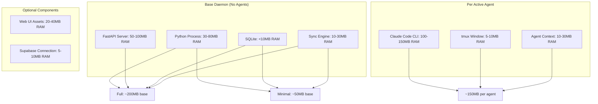
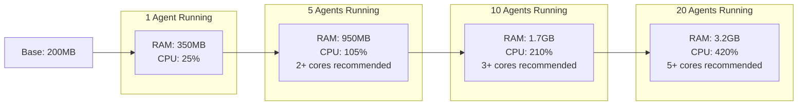

---
metadata:
  status: DRAFT
  version: 0.2
  tldr: "System resource requirements and optimization strategies"
---

# Resource Requirements

## Resource Consumption Breakdown



## Configuration Profile Comparison

| Component | Full Profile (Mac) | Minimal Profile (Linux Server) |
|-----------|-------------------|-------------------------------|
| **Base RAM** | ~200MB | ~50MB |
| **Base CPU (idle)** | ~5% | ~2% |
| **FastAPI Web UI** | ✓ Enabled | ✗ Disabled |
| **FastAPI API only** | ✓ Enabled | ✓ Enabled (minimal endpoints) |
| **Supabase Sync** | Optional | Optional |
| **tmux Support** | ✓ Enabled | ✓ Enabled |
| **Disk Usage** | ~10MB | ~5MB |

## Resource Scaling by Agent Count



**Formula**:
- RAM: `Base (200MB) + (150MB × Active Agents)`
- CPU: `Base (5%) + (20% × Active Agents)`

## Recommended Server Specs

### Developer Workstation (Mac/Linux Desktop)

**Typical Usage**: 2-5 concurrent agents

| Spec | Minimum | Recommended |
|------|---------|-------------|
| **RAM** | 8GB | 16GB+ |
| **CPU** | 4 cores | 8 cores |
| **Disk** | 256GB SSD | 512GB+ SSD |
| **Profile** | Full | Full |

### Small Linux Server (1-10 repos)

**Typical Usage**: 1-3 concurrent agents

| Spec | Minimum | Recommended |
|------|---------|-------------|
| **RAM** | 2GB | 4GB |
| **CPU** | 2 cores | 4 cores |
| **Disk** | 20GB | 50GB |
| **Profile** | Minimal | Minimal |

### Large DevOps Fleet Server (50+ managed systems)

**Typical Usage**: 5-10 concurrent agents

| Spec | Minimum | Recommended |
|------|---------|-------------|
| **RAM** | 4GB | 8GB |
| **CPU** | 4 cores | 8 cores |
| **Disk** | 50GB | 100GB |
| **Profile** | Minimal | Minimal |

## Minimal Profile Configuration

**`config.yaml` for Linux servers**:

```yaml
profile: minimal

web_ui:
  enabled: false  # Disables Web UI, saves ~100MB RAM

agents:
  max_concurrent: 3  # Limit agents
  max_idle_time: 120  # Cleanup idle agents faster

daemon:
  log_level: warning  # Reduce logging overhead

resources:
  max_agents: 3
  max_queue_size: 100  # Smaller queue
```

**Startup**:
```bash
ccm-orchestrator init --minimal --no-web-ui
```

**Result**:
- Base RAM: ~50MB (vs 200MB full)
- No FastAPI static file serving
- API endpoints still available for CLI
- Managed via CLI only: `ccm-orchestrator task create`

## Resource Optimization Strategies

### 1. Agent Pooling

**Problem**: Spawning agents on-demand is slow and resource-intensive.

**Solution**: Pre-spawn idle agents, reuse for tasks.

```yaml
agents:
  pool_size: 3  # Keep 3 idle agents ready
  pool_max_idle: 300  # Cleanup after 5min idle
```

**Impact**:
- Faster task execution (no spawn delay)
- Higher base RAM usage (+450MB for 3 agents)
- Trade-off: Speed vs Memory

### 2. Agent Limits

**Problem**: Unlimited agents can exhaust system resources.

**Solution**: Configure limits.

```yaml
agents:
  max_concurrent: 5  # Hard limit
  max_per_project: 2  # Per-project limit
  queue_tasks: true  # Queue if at limit
```

**Impact**:
- Predictable resource usage
- Tasks wait in queue if limit reached

### 3. Memory-Limited Environments

**Example**: 512MB VPS running CCM

```yaml
profile: minimal
web_ui:
  enabled: false

agents:
  max_concurrent: 1  # One agent at a time
  max_agent_memory_mb: 300  # Limit agent memory (if supported by CLI)

daemon:
  log_level: error  # Minimal logging

supabase:
  enabled: false  # Local-only, no sync overhead
```

**Result**:
- Base: ~50MB
- 1 Agent: ~150MB
- **Total: ~200MB peak**

### 4. Reduce tmux Overhead

**Problem**: Each tmux window consumes ~5-10MB.

**Solution**: Reuse windows, cleanup aggressively.

```yaml
agents:
  tmux_reuse_windows: true  # Reuse windows for completed agents
  cleanup_interval: 60  # Check every 60s for idle windows
```

**Impact**:
- Save ~5-10MB per agent
- Reduced tmux session size

### 5. Disable Web UI (Linux Servers)

**Problem**: Web UI uses ~100MB RAM + serves static assets.

**Solution**: Use minimal profile.

```bash
ccm-orchestrator init --minimal
```

**Impact**:
- Save ~100MB RAM
- Manage via CLI: `ccm-orchestrator task create`, `ccm-orchestrator task list`
- API still available for programmatic access

## CPU Usage Patterns

```mermaid
gantt
    title CPU Usage Over Time (5 Agents)
    dateFormat HH:mm
    axisFormat %H:%M

    section Daemon Only
    Idle (5%): 00:00, 10m

    section Agent Spawning
    Spawn 5 agents (80%): 00:10, 2m

    section Agents Working
    5 agents active (105%): 00:12, 30m

    section Completion
    Agents finishing (60%): 00:42, 5m
    Back to idle (5%): 00:47, 10m
```



**CPU Spikes**:
- Agent spawn: 80-100% (brief, <10s per agent)
- Active agents: 20% per agent (sustained)
- Idle: 2-5% (daemon only)

**Multi-core Benefit**:
- 1 core: Max 5 agents (CPU-bound)
- 2 cores: Max 10 agents
- 4 cores: Max 20 agents
- 8 cores: Max 40 agents

## Disk Usage

**Base Installation**: ~10MB
- ccm-orchestrator package
- SQLite database schema
- Config files

**Per-Project**: Variable
- Project source code
- `.claude/` context files (~1-5MB)
- Agent logs (~1-10MB per agent, rotated)

**Logs**:
- Daemon log: ~1MB/day (rotated weekly)
- Agent logs: ~5MB per agent (rotated after completion)

**Total Estimate**:
- 10 projects: ~100MB
- 100 projects: ~1GB

## Network Bandwidth (Supabase Sync)

**Sync Traffic**:
- Realtime WebSocket: ~5KB/min idle
- Task sync: ~1-10KB per task
- Skill sync: ~10-100KB per skill update

**Estimated Monthly**:
- 100 tasks/day: ~3MB/month
- 10 skill updates: ~1MB/month
- WebSocket overhead: ~200MB/month

**Total**: <300MB/month

## Monitoring Resource Usage

**System Stats API**:
```
GET /api/system/stats
```

Response:
```json
{
  "memory": {
    "daemon_mb": 85,
    "agents_mb": 450,
    "total_mb": 535
  },
  "cpu": {
    "daemon_percent": 3.2,
    "agents_percent": 87.5,
    "total_percent": 90.7
  },
  "agents": {
    "active": 3,
    "idle": 1,
    "max_configured": 10
  },
  "disk": {
    "database_mb": 12,
    "logs_mb": 34,
    "total_mb": 46
  }
}
```

**CLI Monitoring**:
```bash
ccm-orchestrator stats

# Output:
# Daemon: 85MB RAM, 3.2% CPU
# Agents: 3 active, 450MB RAM, 87.5% CPU
# Total: 535MB RAM, 90.7% CPU
```

## Scaling Recommendations

**Single Machine Limits**:
- **MacBook Pro (16GB RAM)**: 50-80 concurrent agents (not recommended, 10-20 practical)
- **Linux Server (8GB RAM)**: 30-50 concurrent agents (10-15 practical)
- **Linux Server (4GB RAM)**: 15-20 concurrent agents (5-10 practical)
- **Linux Server (2GB RAM)**: 5-10 concurrent agents (1-3 practical)

**Multi-Machine Architecture**:
- For >20 concurrent agents, use multiple systems
- Each system manages its own projects
- Supabase coordinates across systems

**Example**: 100 projects, 50 concurrent agents
- Deploy 5 servers (10 agents each)
- Each server: 4GB RAM, 4 cores
- Central Supabase for coordination

---

**Status**: DRAFT
**Version**: 0.2
**Last Updated**: 2025-11-17
