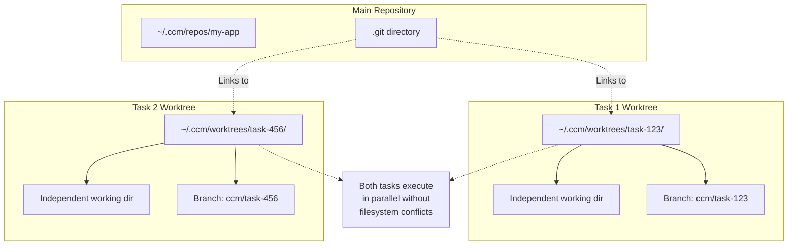
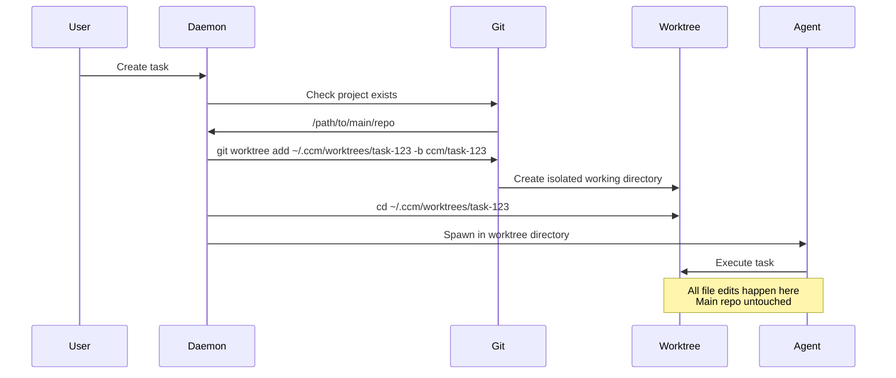
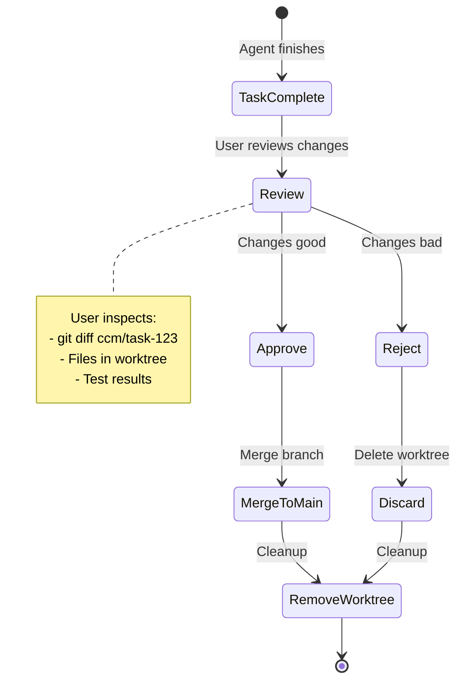
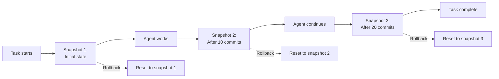
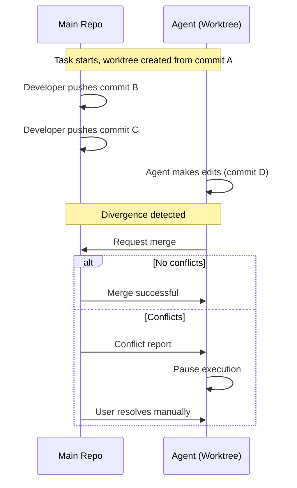

---
metadata:
  status: DRAFT
  version: 0.4
  tldr: "Git worktree isolation, security model, rollback mechanisms"
  dependencies: [architecture-principles.md, orchestration-patterns.md]
---

# Safety and Sandboxing

## Core Principle

**Git worktrees provide isolated working directories** for each task execution. Every agent operates in its own filesystem space, preventing interference and enabling safe rollback.

## Why Git Worktrees (Not Branches)

**User Decision**: Worktrees provide superior isolation for concurrent task execution.



### Advantages Over Branches

**Filesystem Isolation**:
- Each task has own working directory
- No conflicts when editing same files
- True parallel execution

**Visibility**:
- Clear directory structure
- Easy to inspect task state
- Separate tmux windows per worktree

**Safety**:
- Delete worktree = clean removal
- Main repo never touched
- No branch switching conflicts

**Performance**:
- No checkout overhead
- Parallel git operations
- Independent file watchers

### Advantages Over Containers

**Simplicity**:
- Native git feature
- No Docker overhead
- Instant setup/teardown

**Integration**:
- Same environment as main repo
- Works with existing tools
- No network complexity

**Resources**:
- Minimal overhead (~10MB per worktree)
- No image storage
- No container runtime

## Worktree Lifecycle

### 1. Task Creation → Worktree Spawn



**Command Sequence**:
```bash
# Daemon executes on task spawn
PROJECT_DIR="/path/to/main/repo"
TASK_ID="task-123"
WORKTREE_DIR="$HOME/.ccm/worktrees/$TASK_ID"
BRANCH_NAME="ccm/$TASK_ID"

# Create worktree with dedicated branch
cd "$PROJECT_DIR"
git worktree add "$WORKTREE_DIR" -b "$BRANCH_NAME"

# Record in database
sqlite3 ~/.ccm/ccm.db <<SQL
INSERT INTO task_worktrees (task_id, worktree_path, branch_name, created_at)
VALUES ('$TASK_ID', '$WORKTREE_DIR', '$BRANCH_NAME', datetime('now'));
SQL

# Spawn agent in worktree
tmux new-window -t "ccm:$TASK_ID" -c "$WORKTREE_DIR"
tmux send-keys -t "ccm:$TASK_ID" "claude --project '$WORKTREE_DIR' ..." Enter
```

### 2. Task Execution → Isolated Work

**Working Directory**:
```
~/.ccm/worktrees/task-123/
├── .git                    # Link to main .git
├── src/                    # Independent working files
│   ├── main.py
│   └── utils.py
├── tests/
└── .ccm/                   # Task-specific metadata
    ├── task.json
    └── hooks.db
```

**Agent Environment**:
- Current directory: `~/.ccm/worktrees/task-123`
- Git branch: `ccm/task-123`
- All operations isolated
- No impact on main repo or other tasks

### 3. Task Completion → Cleanup



**Cleanup Commands**:
```bash
# On task completion
TASK_ID="task-123"
WORKTREE_DIR="$HOME/.ccm/worktrees/$TASK_ID"
BRANCH_NAME="ccm/$TASK_ID"

# If user approves changes
cd "$PROJECT_DIR"
git merge "$BRANCH_NAME"  # Merge to main
git worktree remove "$WORKTREE_DIR"
git branch -d "$BRANCH_NAME"

# If user rejects changes
cd "$PROJECT_DIR"
git worktree remove "$WORKTREE_DIR" --force
git branch -D "$BRANCH_NAME"  # Force delete

# Update database
sqlite3 ~/.ccm/ccm.db <<SQL
UPDATE task_worktrees SET removed_at = datetime('now') WHERE task_id = '$TASK_ID';
SQL
```

## Worktree Management

### Directory Structure

```
~/.ccm/
├── repos/                          # Main repositories (one per project)
│   └── my-app/
│       ├── .git/
│       └── src/
│
├── worktrees/                      # Task worktrees (temporary)
│   ├── task-123/                   # Task-specific working dir
│   │   ├── .git -> ../repos/my-app/.git
│   │   └── src/
│   ├── task-456/
│   └── task-789/
│
└── ccm.db                          # SQLite database
```

### Worktree Metadata Table

```sql
CREATE TABLE task_worktrees (
    task_id TEXT PRIMARY KEY,
    project_id TEXT NOT NULL,
    worktree_path TEXT NOT NULL,
    branch_name TEXT NOT NULL,
    created_at TIMESTAMP DEFAULT CURRENT_TIMESTAMP,
    removed_at TIMESTAMP DEFAULT NULL,
    status TEXT CHECK(status IN ('active', 'merged', 'discarded', 'stale')) DEFAULT 'active',

    FOREIGN KEY (task_id) REFERENCES tasks(id),
    FOREIGN KEY (project_id) REFERENCES projects(id)
);

CREATE INDEX idx_worktrees_active ON task_worktrees(status, created_at)
WHERE status = 'active';
```

### Auto-Cleanup Policies

**Immediate Cleanup**:
- Task status = `complete` or `failed`
- User explicitly deletes task
- Worktree older than 7 days (stale)

**Stale Detection**:
```sql
-- Find stale worktrees (older than 7 days, task still running)
SELECT tw.task_id, tw.worktree_path, tw.created_at
FROM task_worktrees tw
JOIN tasks t ON tw.task_id = t.id
WHERE tw.status = 'active'
  AND tw.created_at < datetime('now', '-7 days')
  AND t.status NOT IN ('complete', 'failed');
```

**Cleanup Daemon Loop**:
```python
async def cleanup_stale_worktrees():
    while True:
        await asyncio.sleep(3600)  # Every hour

        # Find stale worktrees
        stale = db.execute("""
            SELECT task_id, worktree_path, branch_name
            FROM task_worktrees
            WHERE status = 'active'
              AND created_at < datetime('now', '-7 days')
        """).fetchall()

        for wt in stale:
            # Verify task is not running
            task_status = get_task_status(wt['task_id'])
            if task_status in ['complete', 'failed']:
                # Safe to cleanup
                remove_worktree(wt['worktree_path'], wt['branch_name'])
                mark_worktree_stale(wt['task_id'])
```

## Security Model

### Filesystem Permissions

**Worktree Ownership**:
```bash
# Worktrees owned by ccm daemon user
chown -R ccm-daemon:ccm-daemon ~/.ccm/worktrees/task-123

# Read-only for other users
chmod 750 ~/.ccm/worktrees/task-123
```

**Restricted Paths**:
```python
# Agents cannot access outside worktree
ALLOWED_PATHS = [
    os.path.expanduser("~/.ccm/worktrees/{task_id}"),
    "/tmp/ccm-task-{task_id}"
]

FORBIDDEN_PATHS = [
    "/",
    os.path.expanduser("~"),
    "/etc",
    "/var",
    "/.ccm/repos"  # Main repos protected
]

def validate_path(path, task_id):
    real_path = os.path.realpath(path)
    worktree_root = os.path.realpath(f"~/.ccm/worktrees/{task_id}")

    if not real_path.startswith(worktree_root):
        raise SecurityError(f"Path outside worktree: {path}")
```

### Git Operation Restrictions

**Allowed Operations** (in worktree):
- `git add`, `git commit`
- `git diff`, `git status`
- `git log`, `git show`
- `git checkout` (files only, not branches)

**Forbidden Operations**:
- `git push` (agent cannot push to remote)
- `git checkout` (branch switching blocked)
- `git merge main` (cannot pull from main)
- `git submodule` (security risk)

**Implementation**:
```bash
# Git wrapper for agents
ccm-git() {
    local cmd="$1"

    case "$cmd" in
        push|fetch|pull)
            echo "ERROR: Remote operations forbidden for agents" >&2
            return 1
            ;;
        checkout)
            # Only allow file checkout, not branch switching
            if [[ "$2" != "-b" && "$2" != "--" ]]; then
                echo "ERROR: Branch switching forbidden" >&2
                return 1
            fi
            ;;
    esac

    git "$@"
}

# Export in agent environment
export -f ccm-git
alias git=ccm-git
```

### Resource Limits

**Per-Task Limits**:
```yaml
# .ccm/config.yaml
task_limits:
  max_worktree_size: 1GB        # Disk space per worktree
  max_file_size: 100MB          # Individual file size
  max_files: 10000              # Total files in worktree
  max_commits: 100              # Commits per task
```

**Enforcement**:
```python
def check_worktree_size(task_id):
    worktree_path = get_worktree_path(task_id)
    total_size = sum(
        os.path.getsize(os.path.join(dirpath, filename))
        for dirpath, _, filenames in os.walk(worktree_path)
        for filename in filenames
    )

    if total_size > MAX_WORKTREE_SIZE:
        raise ResourceLimitExceeded(
            f"Worktree size {total_size} exceeds limit {MAX_WORKTREE_SIZE}"
        )
```

## Rollback Mechanisms

### Snapshot-Based Rollback

**Auto-Snapshots**:


**Implementation**:
```bash
# Auto-snapshot every 10 commits
on_commit() {
    local task_id="$1"
    local commit_count=$(git rev-list --count HEAD)

    if (( commit_count % 10 == 0 )); then
        # Create snapshot tag
        git tag "snapshot-$task_id-$commit_count"

        # Record in database
        sqlite3 ~/.ccm/ccm.db <<SQL
INSERT INTO task_snapshots (task_id, commit_hash, commit_count, created_at)
VALUES ('$task_id', '$(git rev-parse HEAD)', $commit_count, datetime('now'));
SQL
    fi
}
```

### Rollback Operations

**Full Rollback** (discard all changes):
```bash
ccm-orchestrator task rollback <task_id> --full

# Executes:
cd ~/.ccm/worktrees/task-123
git reset --hard HEAD~999  # Reset to initial state
git clean -fdx             # Remove untracked files
```

**Partial Rollback** (to snapshot):
```bash
ccm-orchestrator task rollback <task_id> --to-snapshot 2

# Executes:
cd ~/.ccm/worktrees/task-123
git reset --hard snapshot-task-123-20  # Reset to commit 20
```

**File-Level Rollback**:
```bash
ccm-orchestrator task rollback <task_id> --file src/main.py

# Executes:
cd ~/.ccm/worktrees/task-123
git checkout HEAD -- src/main.py  # Restore single file
```

## Conflict Resolution

### Worktree vs Main Repo

**Scenario**: Agent edits files while main repo advances.



**Detection**:
```python
def detect_divergence(task_id):
    worktree_path = get_worktree_path(task_id)

    # Fetch latest from main
    subprocess.run(['git', 'fetch', 'origin', 'main'], cwd=worktree_path)

    # Compare commits
    result = subprocess.run(
        ['git', 'rev-list', '--left-right', '--count', 'HEAD...origin/main'],
        cwd=worktree_path,
        capture_output=True,
        text=True
    )

    ahead, behind = map(int, result.stdout.split())

    if behind > 0:
        # Worktree is behind main repo
        return DivergenceStatus.BEHIND
    elif ahead > 0 and behind > 0:
        # Both have commits
        return DivergenceStatus.DIVERGED
    else:
        return DivergenceStatus.SYNCED
```

**Auto-Rebase** (optional):
```yaml
# .ccm/config.yaml
worktree_sync:
  auto_rebase: true           # Automatically rebase on main updates
  rebase_frequency: 3600      # Every hour
  pause_on_conflict: true     # Pause agent if conflict
```

### Multi-Worktree Conflicts

**Scenario**: Two tasks edit same file.

**Resolution**: Isolated worktrees prevent conflicts during work. Only merge order matters.

```
Task A worktree: edits src/main.py → commit X
Task B worktree: edits src/main.py → commit Y

Both complete independently.

User merges Task A first → main has commit X
User merges Task B second → conflict detected, user resolves
```

## Best Practices

### 1. Worktree Naming

**Consistent Pattern**:
```bash
# Pattern: task-{task_id}
~/.ccm/worktrees/task-123/
~/.ccm/worktrees/task-456/

# Branch pattern: ccm/task-{task_id}
ccm/task-123
ccm/task-456
```

### 2. Cleanup Frequency

**Recommended**:
- Immediate: On task completion
- Hourly: Stale detection
- Daily: Orphaned worktrees (no task record)
- Weekly: Full audit

### 3. Disk Space Management

**Monitor**:
```sql
-- Total worktree disk usage
SELECT
    COUNT(*) as active_worktrees,
    SUM(disk_size_mb) as total_mb
FROM task_worktrees
WHERE status = 'active';

-- Alert if >10GB
```

**Auto-Archive**:
```bash
# Archive old worktrees as tarballs
tar -czf ~/.ccm/archives/task-123.tar.gz ~/.ccm/worktrees/task-123/
git worktree remove ~/.ccm/worktrees/task-123/
```

### 4. Branch Cleanup

**Auto-Delete**:
```bash
# After worktree removal
git branch -d ccm/task-123  # Safe delete (merged)
# OR
git branch -D ccm/task-123  # Force delete (not merged)
```

**Prune Regularly**:
```bash
# Clean up worktree metadata
git worktree prune

# Remove stale branches
git fetch --prune
```

## Troubleshooting

### Worktree Locked

**Error**: `fatal: 'worktree-path' is already locked`

**Solution**:
```bash
# Remove lock file
rm ~/.ccm/repos/my-app/.git/worktrees/task-123/locked

# Force remove worktree
git worktree remove ~/.ccm/worktrees/task-123 --force
```

### Orphaned Worktrees

**Detection**:
```bash
# List all worktrees
git worktree list

# Compare with database
sqlite3 ~/.ccm/ccm.db "SELECT worktree_path FROM task_worktrees WHERE status='active';"

# Find orphans (in git but not in DB)
```

**Cleanup**:
```bash
# Remove orphaned worktree
git worktree remove <path> --force
git worktree prune
```

### Disk Space Full

**Emergency Cleanup**:
```bash
# Remove all inactive worktrees
ccm-orchestrator worktrees cleanup --all-inactive

# Remove worktrees older than 1 day
ccm-orchestrator worktrees cleanup --older-than 1d

# Force remove all (dangerous)
ccm-orchestrator worktrees cleanup --force-all
```

---

**Status**: DRAFT
**Version**: 0.4
**Last Updated**: 2025-11-17

**Key Enhancements in v0.4**:
- Git worktree isolation (replaces branch-only approach)
- Comprehensive worktree lifecycle management
- Security model with filesystem and git restrictions
- Snapshot-based rollback mechanisms
- Auto-cleanup policies for stale worktrees
