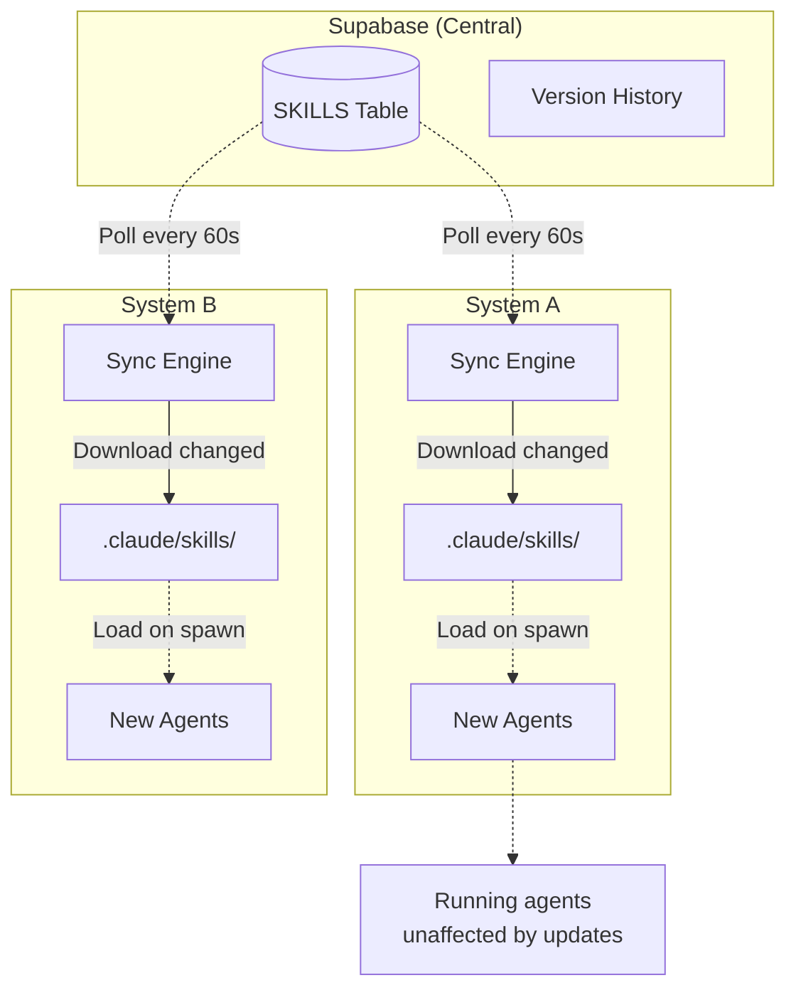
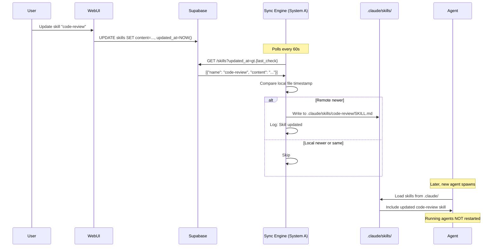
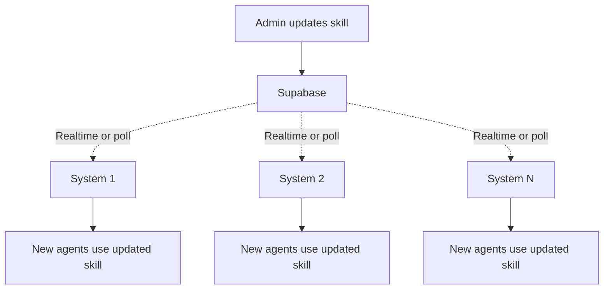
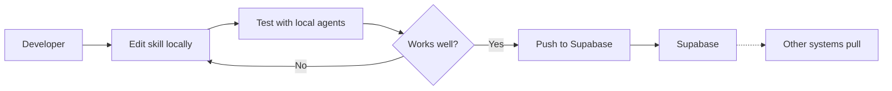
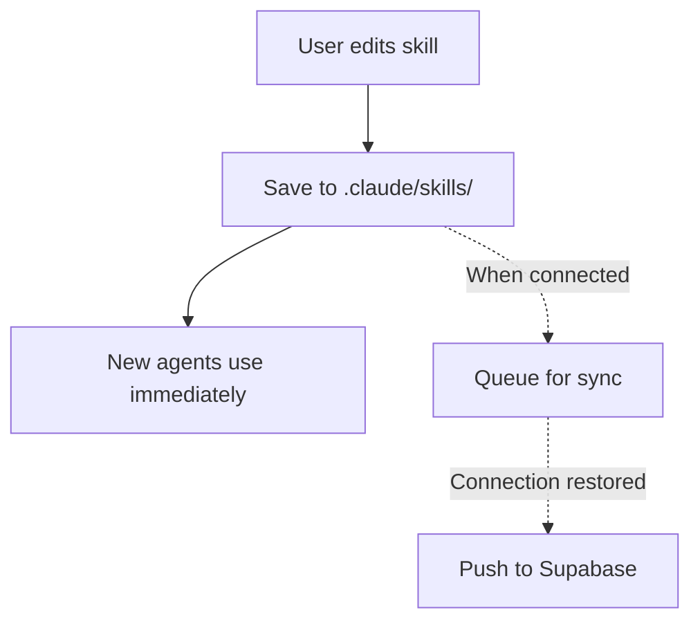

---
metadata:
  status: DRAFT
  version: 0.2
  tldr: "Central skill repository with auto-sync to local agent contexts"
---

# Skill Management

## Core Principle

**Skills stored centrally in Supabase** (optional). Auto-sync to local `.claude/` directories. Updates apply to NEW agents only.

## Skill Repository Architecture



## Skill Sync Flow



## Skills Table Schema

```sql
CREATE TABLE skills (
    id UUID PRIMARY KEY DEFAULT uuid_generate_v4(),
    name TEXT UNIQUE NOT NULL,
    version TEXT NOT NULL,
    content TEXT NOT NULL,  -- Full SKILL.md file content
    file_path TEXT NOT NULL,  -- e.g., ".claude/skills/code-review/SKILL.md"
    created_at TIMESTAMP DEFAULT NOW(),
    updated_at TIMESTAMP DEFAULT NOW(),
    user_id UUID REFERENCES auth.users(id)
);

CREATE INDEX idx_skills_updated ON skills(updated_at DESC);
CREATE INDEX idx_skills_user ON skills(user_id);
```

## Skill Versioning

**Approach**: Simple timestamp-based (MVP).

- `updated_at` timestamp tracks last modification
- No complex version numbers
- Last-write-wins on conflicts

**Future Enhancement**: Git-style versioning with branches, rollback.

## Sync Behavior

**Polling Interval**: Every 60 seconds (configurable)

**Sync Process**:
1. Query Supabase: `SELECT * FROM skills WHERE updated_at > {last_sync}`
2. For each changed skill:
   - Download content
   - Write to local `.claude/skills/{name}/SKILL.md`
   - Update local timestamp

**Impact on Agents**:
- **Running agents**: Unaffected (already loaded context)
- **New agents**: Load updated skills automatically
- **No restarts required**

## Manual Skill Operations

### Via Web UI

**List Skills**:
- Local skills (filesystem)
- Remote skills (Supabase, if connected)
- Merged view with sync status

**Edit Skill**:
1. User edits skill in Web UI
2. Save to local file
3. Option: "Push to Supabase" (sync to other systems)

**Create Skill**:
1. Name: `my-custom-skill`
2. Content: (Editor with syntax highlighting)
3. Save locally
4. Option: Publish to Supabase

### Via CLI

```bash
# List skills
ccm-orchestrator skill list

# Show skill content
ccm-orchestrator skill show code-review

# Create new skill
ccm-orchestrator skill create my-skill --file ./my-skill.md

# Update skill
ccm-orchestrator skill update code-review --file ./updated.md

# Publish to Supabase
ccm-orchestrator skill push code-review

# Pull from Supabase
ccm-orchestrator skill pull code-review

# Sync all skills
ccm-orchestrator skill sync
```

## Skill Discovery

**Auto-scan local filesystem**:
- Scan `.claude/skills/` on daemon start
- Register in SQLite `local_skills` table
- Compare with Supabase (if connected)

**Conflict Resolution**:
- If local & remote differ → Show in Web UI
- User chooses: Keep local | Pull remote | Merge

## Skill Distribution Patterns

### Pattern 1: Central Update, Global Apply



**Use Case**: Update code review guidelines across all developer machines.

### Pattern 2: Local Development, Selective Publish



**Use Case**: Developer creates custom skill, tests locally, then shares with team.

### Pattern 3: Offline-First



**Use Case**: Work offline, skills auto-sync when connection available.

## Skill Types

**Supported Artifacts**:
- Skills (`.claude/skills/*/SKILL.md`)
- Commands (`.claude/commands/*.md`)
- Agents (`.claude/agents/*.md`)
- Prompts (`./prompts/*.md`)

**Sync Scope** (MVP):
- Skills only

**Future**:
- Commands, Agents, Prompts
- Full `.claude/` directory sync

## Performance Considerations

**Local Filesystem**:
- Skills loaded on agent spawn (~10-50ms per skill)
- No performance impact on running agents

**Supabase Sync**:
- Poll every 60s → ~100 bytes per request (if no changes)
- Download skill (~1-10KB per skill)
- Minimal bandwidth

**Agent Spawn Time**:
- Without skills: ~1s
- With 10 skills: ~1.2s
- With 50 skills: ~1.5s
- Impact: Negligible

## Security

**RLS Policies** (Supabase):
```sql
-- Users can only read/write their own skills
CREATE POLICY "Users manage own skills"
ON skills
FOR ALL
USING (auth.uid() = user_id);
```

**Local Filesystem**:
- `.claude/` directory: User-only permissions (chmod 700)
- Skills cannot execute code (plain markdown)

## Monitoring

**Sync Status API**:
```
GET /api/skills/sync/status
```

Response:
```json
{
  "last_sync": "2025-01-17T10:30:00Z",
  "synced_skills": 12,
  "pending_updates": 0,
  "conflicts": 0
}
```

**Web UI Indicator**:
- Green: All skills synced
- Yellow: Pending updates
- Red: Conflicts require resolution

---

**Status**: DRAFT
**Version**: 0.2
**Last Updated**: 2025-11-17
