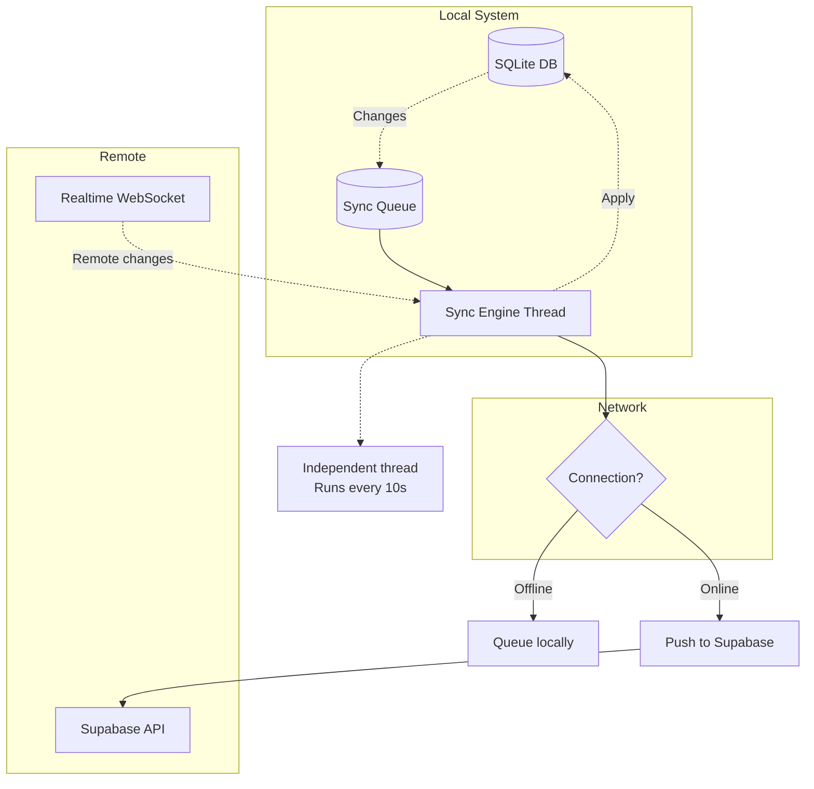
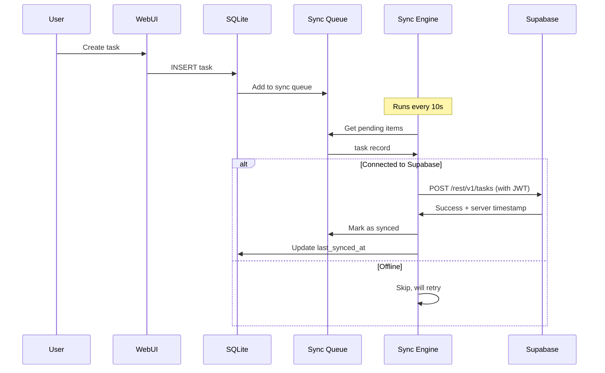
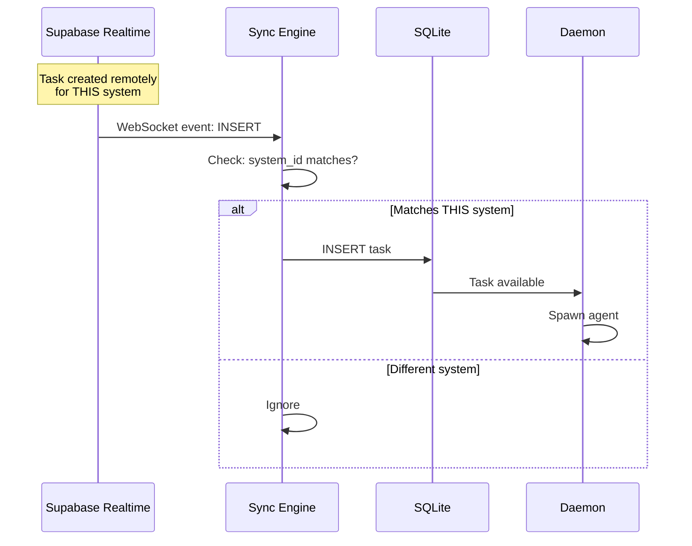
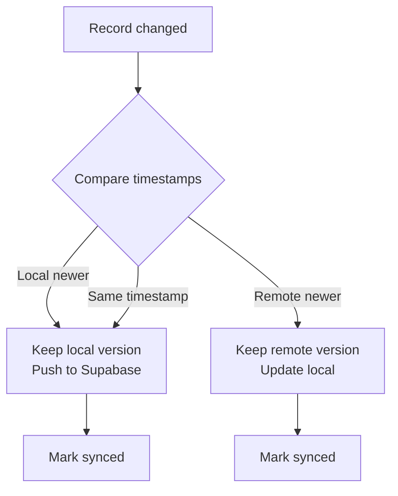
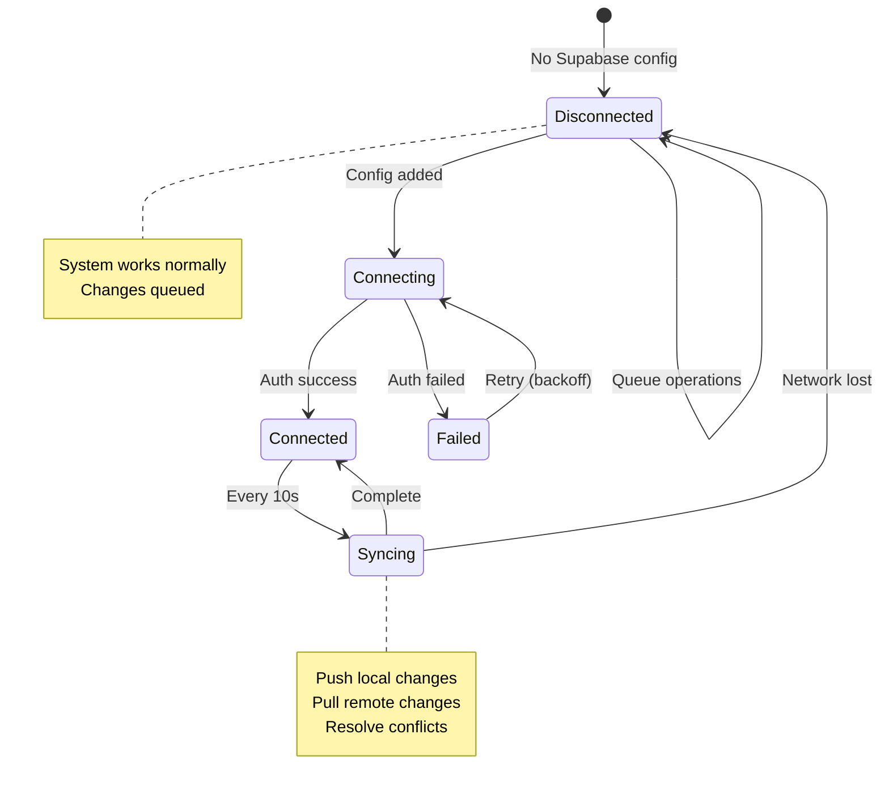
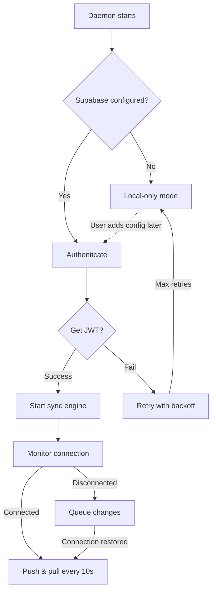
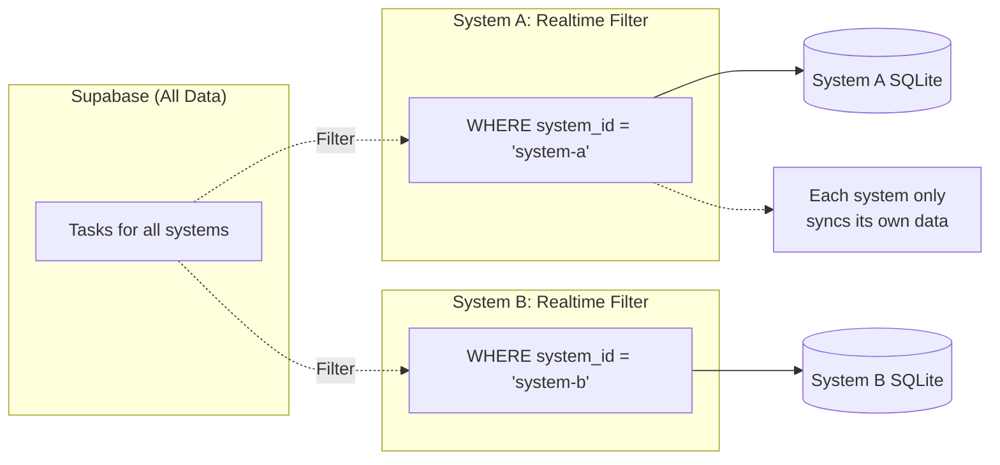
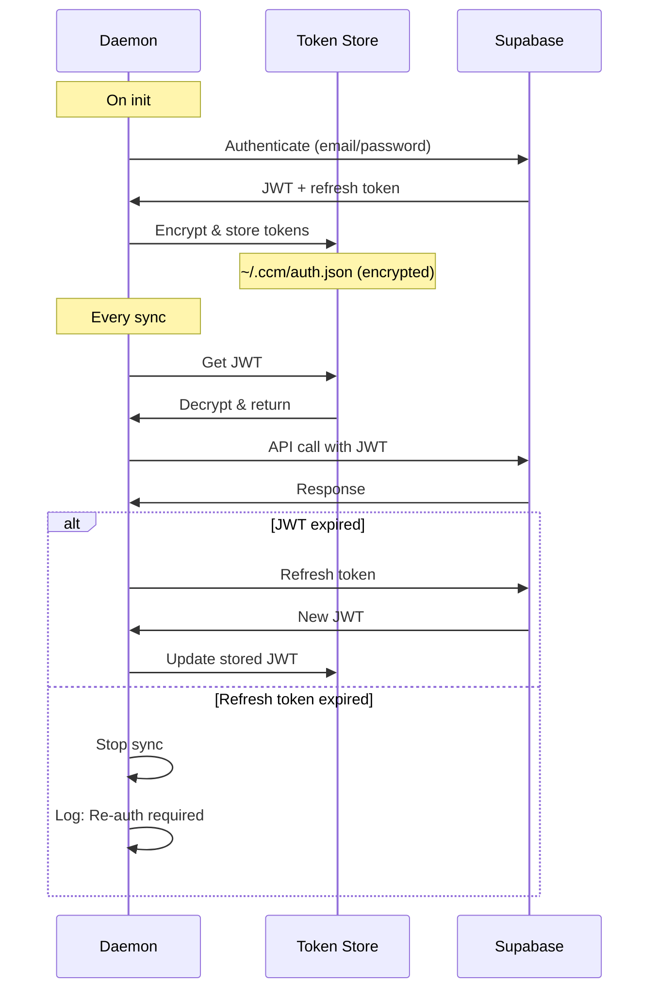

---
metadata:
  status: DRAFT
  version: 0.2
  tldr: "Bidirectional sync between SQLite and Supabase"
---

# Sync Architecture

## Core Principle

**SQLite is source of truth for local system.** Supabase is source of truth for global view. Bidirectional sync keeps them consistent.

## Sync Components



## Sync Flow: Local → Remote



## Sync Flow: Remote → Local



## Conflict Resolution

**Strategy**: Last-write-wins with timestamps.



**Conflict Scenarios**:

1. **Same task edited locally & remotely**:
   - Compare `updated_at` timestamps
   - Newer wins, older discarded
   - No merge attempts (simple, predictable)

2. **Task deleted locally, edited remotely**:
   - Remote edit wins (task restored locally)
   - Log warning for user review

3. **Network partition**:
   - Local system continues working
   - On reconnect, sync all queued changes
   - Conflicts resolved per timestamp rules

## Sync Queue Table

```sql
CREATE TABLE sync_queue (
    id INTEGER PRIMARY KEY AUTOINCREMENT,
    operation TEXT CHECK(operation IN ('INSERT','UPDATE','DELETE')),
    table_name TEXT NOT NULL,
    record_id TEXT NOT NULL,
    record_data JSON,
    created_at TIMESTAMP DEFAULT CURRENT_TIMESTAMP,
    synced_at TIMESTAMP DEFAULT NULL,
    retry_count INTEGER DEFAULT 0
);
```

## Sync Engine States



## Connection State Management



## Scope Filtering

Only sync relevant data for THIS system.

**Local → Remote (Push)**:
- Push ALL local changes (projects, tasks, results)
- Include `system_id` in all records
- Supabase stores globally

**Remote → Local (Pull)**:
- Subscribe to Realtime with filter: `system_id = eq.{this_system_id}`
- Only pull tasks/projects targeting THIS system
- Ignore others



## Sync Performance

**Batch Operations**:
- Process up to 100 records per sync cycle
- Prioritize: DELETE → UPDATE → INSERT
- Prevents queue buildup

**Throttling**:
- Sync every 10 seconds (configurable)
- Skip cycle if previous sync still running
- Exponential backoff on errors

**Realtime**:
- WebSocket connection for instant remote→local
- Fallback to polling if WebSocket fails

## Authentication Token Management



## Error Handling

**Network Errors**:
- Retry with exponential backoff: 1s, 2s, 4s, 8s
- Max retries: 5
- After max: Stay in offline mode, retry later

**API Errors**:
- 401 Unauthorized → Attempt token refresh
- 403 Forbidden → Log error, skip record
- 429 Rate limit → Back off, retry
- 5xx Server error → Retry with backoff

**Conflict Errors**:
- Log conflicts to `~/.ccm/logs/conflicts.log`
- Notify user via Web UI
- Automatic resolution via last-write-wins

## Manual Sync Controls

**CLI Commands**:
```bash
ccm-orchestrator sync now       # Force sync immediately
ccm-orchestrator sync status    # Show sync state
ccm-orchestrator sync conflicts # Show unresolved conflicts
ccm-orchestrator sync reset     # Clear queue, re-sync from Supabase
```

**Web UI**:
- Show sync status indicator (green/yellow/red)
- Display last sync time
- Show queued changes count
- Manual sync button

## Monitoring

**Sync Metrics**:
- Last successful sync timestamp
- Sync queue depth
- Conflict count (last 24h)
- Average sync latency

**Health Checks**:
- Is sync engine running?
- Is WebSocket connected?
- Queue depth < 1000? (alert if exceeded)

---

**Status**: DRAFT
**Version**: 0.2
**Last Updated**: 2025-11-17
