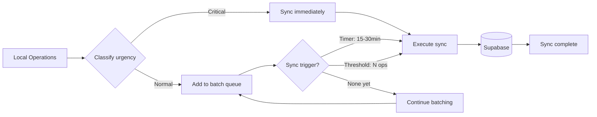
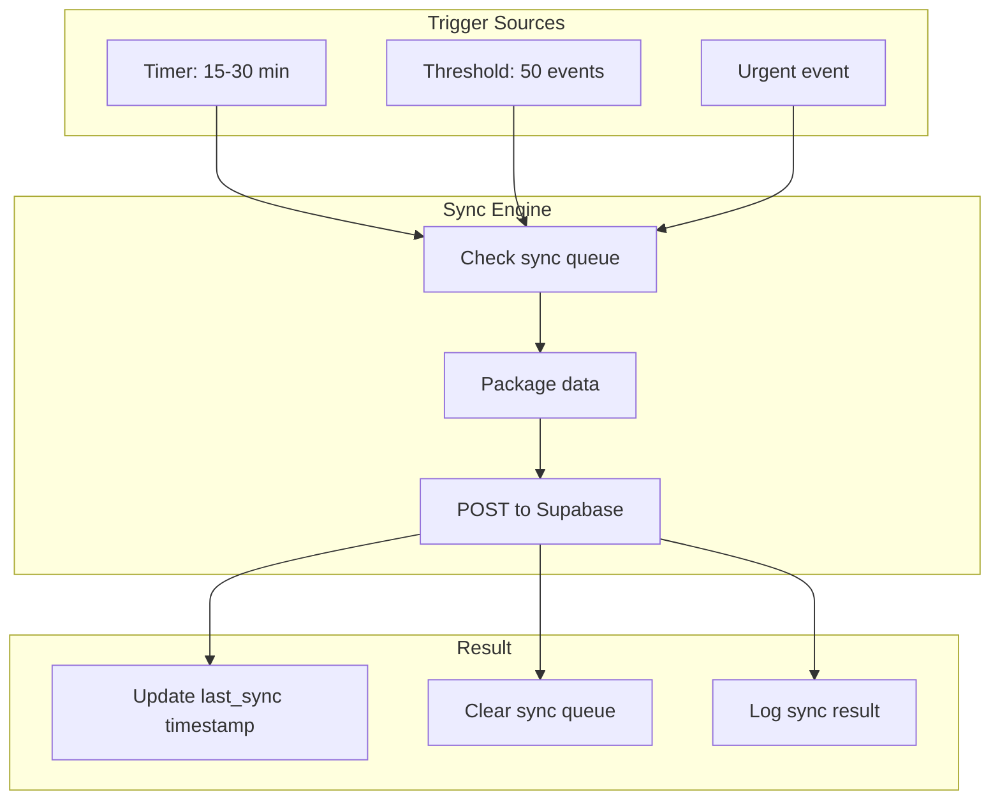
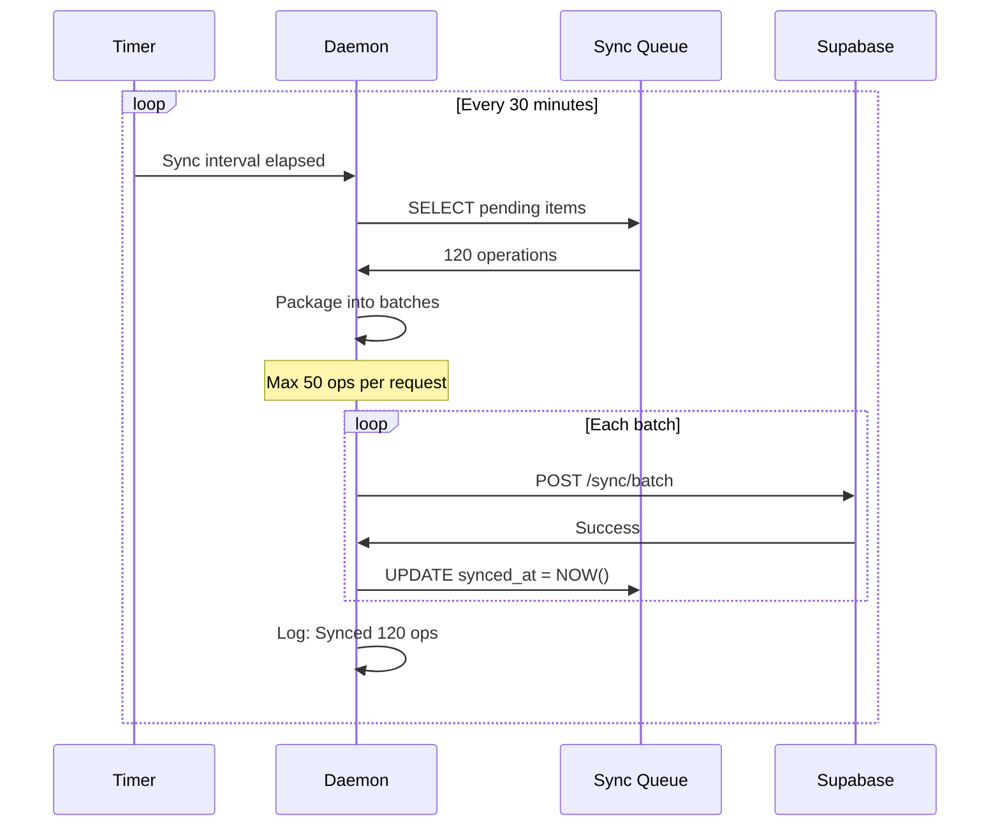
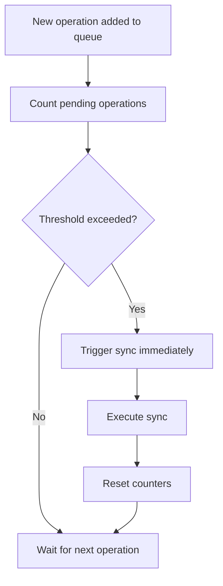
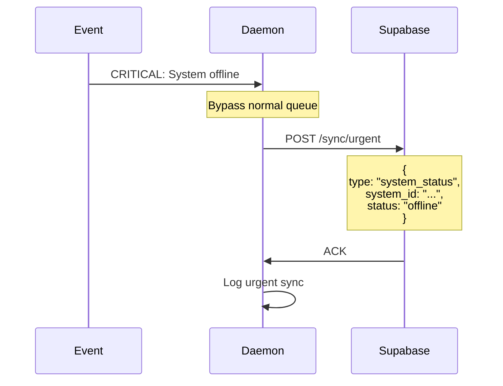
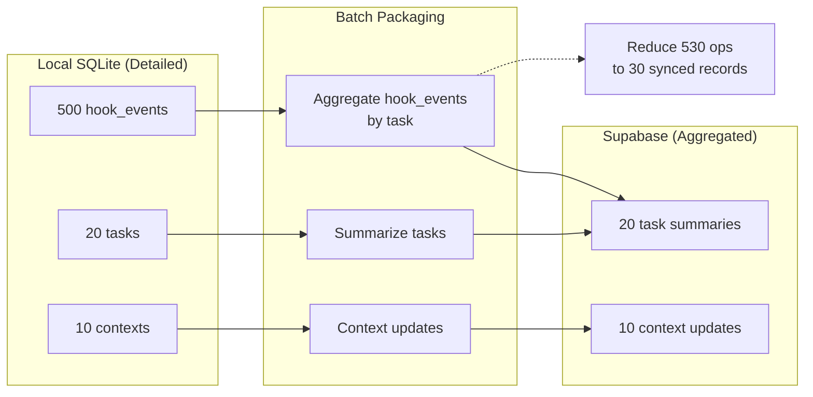
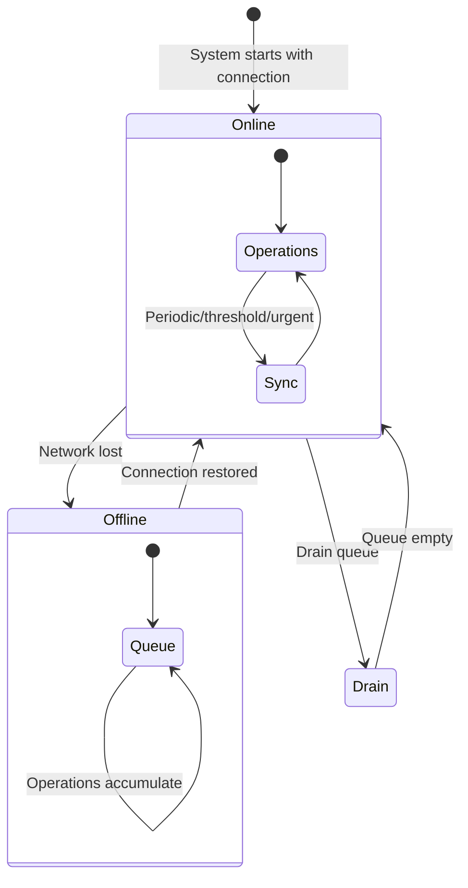

---
metadata:
  status: DRAFT
  version: 0.3
  tldr: "Adaptive sync strategies: periodic, threshold, event-driven"
  dependencies: [architecture-principles.md, data-architecture.md]
---

# Sync Strategies

## Principle: Adaptive, Not Fixed

Sync timing adapts based on activity, urgency, and system configuration. Balance responsiveness with Supabase efficiency.



## Adaptive Sync Model

### Three Trigger Types

**1. Periodic (Time-Based)**
- Default: Every 15-30 minutes
- Configurable per system
- Ensures eventual consistency

**2. Threshold (Count-Based)**
- Every N operations (e.g., 50 hook events)
- Every N task completions (e.g., 5 tasks)
- Prevents queue buildup

**3. Event-Driven (Urgency-Based)**
- Critical errors
- User-requested updates
- Security events
- Context changes



## Sync Queue Architecture

### Queue Table

```sql
CREATE TABLE sync_queue (
    id INTEGER PRIMARY KEY AUTOINCREMENT,
    operation TEXT CHECK(operation IN ('INSERT', 'UPDATE', 'DELETE')),
    table_name TEXT NOT NULL,
    record_id TEXT NOT NULL,
    record_data JSON,
    priority TEXT CHECK(priority IN ('low', 'normal', 'high', 'urgent')) DEFAULT 'normal',
    created_at TIMESTAMP DEFAULT CURRENT_TIMESTAMP,
    synced_at TIMESTAMP DEFAULT NULL,
    retry_count INTEGER DEFAULT 0,
    error_message TEXT
);

CREATE INDEX idx_sync_queue_pending ON sync_queue(synced_at) WHERE synced_at IS NULL;
CREATE INDEX idx_sync_queue_priority ON sync_queue(priority, created_at);
```

### Queueing Operations

**Add to queue** (after local operation):
```sql
-- Task completed locally
UPDATE tasks SET status='complete', completed_at=NOW() WHERE id=123;

-- Queue for sync
INSERT INTO sync_queue (operation, table_name, record_id, record_data, priority)
VALUES (
    'UPDATE',
    'tasks',
    '123',
    json_object('status', 'complete', 'completed_at', datetime('now')),
    'normal'
);
```

**Urgent operation**:
```sql
-- Critical error detected
INSERT INTO sync_queue (operation, table_name, record_id, record_data, priority)
VALUES (
    'INSERT',
    'alerts',
    'alert-' || hex(randomblob(16)),
    json_object('level', 'critical', 'message', 'System offline'),
    'urgent'  -- Triggers immediate sync
);
```

## Periodic Sync (Time-Based)

### Configuration

```yaml
# .ccm-global/config.yaml
sync:
  enabled: true
  mode: adaptive  # adaptive | aggressive | conservative

  # Periodic sync timing (configurable)
  intervals:
    default: 1800  # 30 minutes
    high_priority_system: 300  # 5 minutes
    low_priority_system: 3600  # 60 minutes

  # Choose interval based on system type
  interval_selection: auto  # auto | manual
```

**Auto interval selection**:
```python
def get_sync_interval(system):
    if system.type == 'developer_workstation':
        return 1800  # 30 min

    elif system.type == 'production_server':
        return 300  # 5 min (more frequent)

    elif system.type == 'backup_server':
        return 3600  # 60 min (less frequent)

    else:
        return 1800  # Default
```

### Periodic Sync Loop



**Implementation**:
```python
async def periodic_sync_loop():
    while True:
        # Wait for configured interval
        await asyncio.sleep(sync_interval)

        # Get pending operations
        pending = db.execute("""
            SELECT * FROM sync_queue
            WHERE synced_at IS NULL
            ORDER BY priority DESC, created_at ASC
            LIMIT 500  -- Cap per sync
        """).fetchall()

        if not pending:
            continue  # Nothing to sync

        # Package and sync
        await sync_to_supabase(pending)
```

## Threshold Sync (Count-Based)

### Trigger Conditions

```python
class SyncThresholds:
    max_pending_operations = 50  # Any 50 operations
    max_pending_tasks = 5  # 5 completed tasks
    max_pending_errors = 3  # 3 errors (lower threshold)
    max_pending_contexts = 1  # Context changes (immediate)
```

### Threshold Check



**Implementation**:
```python
def on_operation_queued(operation):
    # Count pending by type
    counts = db.execute("""
        SELECT
            table_name,
            COUNT(*) as count
        FROM sync_queue
        WHERE synced_at IS NULL
        GROUP BY table_name
    """).fetchall()

    # Check thresholds
    total = sum(c['count'] for c in counts)

    if total >= 50:
        trigger_sync('threshold_total')
    elif counts.get('tasks', 0) >= 5:
        trigger_sync('threshold_tasks')
    elif counts.get('errors', 0) >= 3:
        trigger_sync('threshold_errors')
```

## Event-Driven Sync (Urgency-Based)

### Immediate Sync Events

**Critical events that bypass queue**:
- System going offline/online
- Critical error detected
- Security event (unauthorized access)
- User explicitly requests sync
- Context registration/removal



**Priority handling**:
```sql
-- Get operations by priority
SELECT * FROM sync_queue
WHERE synced_at IS NULL
ORDER BY
  CASE priority
    WHEN 'urgent' THEN 1
    WHEN 'high' THEN 2
    WHEN 'normal' THEN 3
    WHEN 'low' THEN 4
  END,
  created_at ASC;

-- Urgent operations sync first
```

### User-Requested Sync

```bash
# CLI command
ccm-orchestrator sync now

# Triggers immediate sync of all pending operations
```

**Implementation**:
```python
@app.post("/api/sync/now")
async def force_sync():
    """User requests immediate sync"""
    pending_count = db.execute("""
        SELECT COUNT(*) FROM sync_queue WHERE synced_at IS NULL
    """).fetchone()[0]

    if pending_count == 0:
        return {"status": "nothing_to_sync"}

    # Execute sync immediately
    result = await sync_to_supabase_now()

    return {
        "status": "synced",
        "operations_synced": result.count,
        "duration_ms": result.duration
    }
```

## Batch Packaging

### Data Aggregation

**Principle**: Supabase gets summaries, not full details



### Aggregation Examples

**Hook events → Task summary**:
```python
# Local: 500 individual hook events for task #123
hook_events = db.execute("""
    SELECT * FROM hook_events WHERE task_id = 123
""").fetchall()

# Aggregate to summary
summary = {
    "task_id": 123,
    "total_events": len(hook_events),
    "tools_used": count_by_tool(hook_events),
    "files_modified": extract_files(hook_events),
    "commands_run": extract_commands(hook_events),
    "errors": [e for e in hook_events if not e.success],
    "duration_seconds": calc_duration(hook_events)
}

# Sync only summary to Supabase
supabase.table('task_summaries').upsert(summary)
```

**Benefits**:
- Reduces sync payload by 95%+
- Supabase has enough for visibility
- Local SQLite retains full detail

### Batch Request Format

```python
# Batch sync request
batch = {
    "system_id": "mac-pro-office",
    "sync_timestamp": "2025-11-17T10:30:00Z",
    "operations": [
        {
            "operation": "UPDATE",
            "table": "tasks",
            "record_id": "123",
            "data": {"status": "complete", "completed_at": "..."}
        },
        {
            "operation": "INSERT",
            "table": "supervisory_reports",
            "record_id": "report-456",
            "data": {"task_id": "123", "quality_score": 8, ...}
        },
        # ... up to 50 operations
    ]
}

# POST to Supabase
response = requests.post(
    "https://xxx.supabase.co/rest/v1/rpc/batch_sync",
    json=batch,
    headers={"Authorization": f"Bearer {jwt}"}
)
```

### Conflict Resolution

**Last-Write-Wins** (simple, default):
```sql
-- Compare timestamps
SELECT
    local.updated_at as local_time,
    remote.updated_at as remote_time
FROM local_tasks local
JOIN remote_tasks remote ON local.id = remote.id;

-- If remote is newer, update local
-- If local is newer, update remote
```

**Manual Resolution** (for critical data):
```sql
-- Detect conflicts
SELECT * FROM sync_queue
WHERE operation = 'UPDATE'
  AND EXISTS (
    SELECT 1 FROM remote_tasks
    WHERE id = sync_queue.record_id
      AND updated_at > :local_updated_at
  );

-- Mark for manual review
UPDATE sync_queue SET status='conflict' WHERE ...;
```

## Offline Operation

### Offline Queue



**Queue accumulation**:
```sql
-- Operations continue to queue while offline
INSERT INTO sync_queue (operation, table_name, record_id, record_data)
VALUES ('UPDATE', 'tasks', '123', '{"status": "complete"}');

-- Check connection status
SELECT status FROM system_status WHERE system_id = current_system;
-- Result: 'offline'

-- Sync skipped, operation remains in queue
```

**Connection restoration**:
```python
async def on_connection_restored():
    logger.info("Connection restored, draining sync queue")

    pending = db.execute("""
        SELECT COUNT(*) FROM sync_queue WHERE synced_at IS NULL
    """).fetchone()[0]

    logger.info(f"Syncing {pending} pending operations")

    # Sync all pending (may take multiple batches)
    await sync_all_pending()

    logger.info("Sync queue drained")
```

### Offline Duration Handling

**Short offline** (<1 hour):
- Queue accumulates
- Sync on reconnect
- No issues

**Extended offline** (>1 hour):
- Queue may be large
- Sync in batches
- May take 5-10 minutes to drain

**Very extended offline** (days):
- Queue very large (thousands of operations)
- Consider selective sync (tasks only, skip hook events)
- Or background drain over hours

## Sync Configuration Examples

### Aggressive Sync (Developer Workstation)

```yaml
sync:
  mode: aggressive

  intervals:
    default: 300  # 5 minutes

  thresholds:
    max_pending_operations: 20  # Low threshold
    max_pending_tasks: 2

  event_driven:
    enable_urgent: true
    immediate_on_error: true
```

**Result**: Near real-time sync, more Supabase requests

### Conservative Sync (Low-Priority Server)

```yaml
sync:
  mode: conservative

  intervals:
    default: 3600  # 60 minutes

  thresholds:
    max_pending_operations: 200  # High threshold
    max_pending_tasks: 20

  event_driven:
    enable_urgent: true  # Still sync critical events
    immediate_on_error: false
```

**Result**: Batch operations heavily, fewer Supabase requests

### Balanced Sync (Default)

```yaml
sync:
  mode: adaptive

  intervals:
    default: 1800  # 30 minutes

  thresholds:
    max_pending_operations: 50
    max_pending_tasks: 5

  event_driven:
    enable_urgent: true
    immediate_on_error: true
```

**Result**: Good balance of responsiveness and efficiency

## Monitoring Sync Health

### Sync Metrics

```sql
CREATE TABLE sync_metrics (
    id INTEGER PRIMARY KEY AUTOINCREMENT,
    timestamp TIMESTAMP DEFAULT CURRENT_TIMESTAMP,
    operations_synced INTEGER,
    duration_ms INTEGER,
    trigger_type TEXT,  -- 'periodic', 'threshold', 'urgent'
    success BOOLEAN,
    error_message TEXT
);

-- Query sync health
SELECT
    DATE(timestamp) as date,
    COUNT(*) as sync_count,
    SUM(operations_synced) as total_ops,
    AVG(duration_ms) as avg_duration_ms,
    SUM(CASE WHEN success = false THEN 1 ELSE 0 END) as failures
FROM sync_metrics
GROUP BY DATE(timestamp)
ORDER BY date DESC
LIMIT 7;  -- Last 7 days
```

### Dashboard Display

```
Sync Health (Last 7 Days)

Date       | Syncs | Operations | Avg Duration | Failures
-----------|-------|------------|--------------|----------
2025-11-17 |   48  |    2,400   |    850ms     |    0
2025-11-16 |   48  |    2,150   |    780ms     |    1
2025-11-15 |   48  |    2,600   |    920ms     |    0
...
```

### Alerting

```sql
-- Alert if sync failures >5 in last hour
SELECT COUNT(*) FROM sync_metrics
WHERE success = false
  AND timestamp > datetime('now', '-1 hour');

-- Alert if queue backing up (>500 pending)
SELECT COUNT(*) FROM sync_queue WHERE synced_at IS NULL;

-- Alert if last sync >2 hours ago
SELECT MAX(timestamp) FROM sync_metrics;
```

## Best Practices

### 1. Choose Appropriate Mode

**Aggressive** for:
- Developer workstations (need visibility)
- Critical production servers
- Systems with urgent tasks

**Conservative** for:
- Backup servers
- Low-priority systems
- Bandwidth-constrained systems

### 2. Monitor Queue Size

```bash
# Check queue size
ccm-orchestrator sync status
# Output:
# Pending operations: 23
# Last sync: 5 minutes ago
# Next sync: in 10 minutes
```

### 3. Manual Drain for Large Queues

```bash
# If queue >1000, drain manually
ccm-orchestrator sync drain --batch-size 100

# Syncs in batches of 100 until empty
```

### 4. Test Offline Resilience

```bash
# Simulate offline
ccm-orchestrator test offline --duration 30m

# Execute operations while offline
# Reconnect and verify sync
```

---

**Status**: DRAFT
**Version**: 0.3
**Last Updated**: 2025-11-17
