---
metadata:
  status: DRAFT
  version: 0.3
  tldr: "Technical implementation patterns: libtmux, FastAPI, hooks, Supabase"
  dependencies: [architecture-principles.md, monitoring-architecture.md, agent-patterns.md]
---

# Technical Deep Dives

**Note**: This document covers low-level implementation details. For high-level patterns, see:
- [architecture-principles.md](./architecture-principles.md) - Core architectural principles
- [agent-patterns.md](./agent-patterns.md) - Worker, supervisory, manager patterns
- [orchestration-patterns.md](./orchestration-patterns.md) - Database-driven workflows
- [monitoring-architecture.md](./monitoring-architecture.md) - Hook-based monitoring

## Hook Integration Patterns

### Hook Handler Architecture

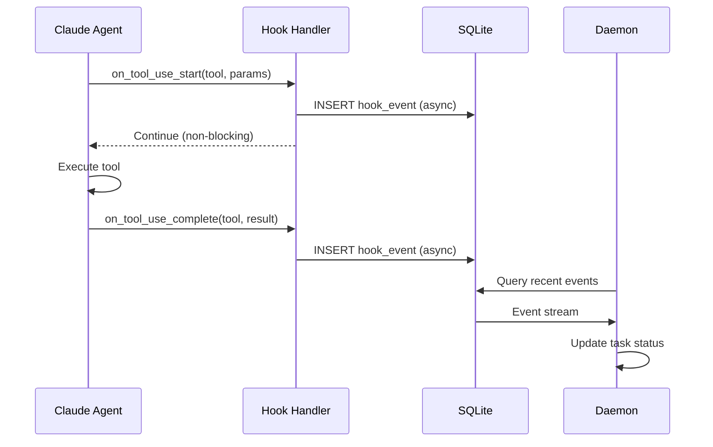
```mermaid
sequenceDiagram
    participant Agent as Claude Agent
    participant Hook as Hook Handler
    participant SQLite
    participant Daemon

    Agent->>Hook: on_tool_use_start(tool, params)
    Hook->>SQLite: INSERT hook_event (async)
    Hook-->>Agent: Continue (non-blocking)

    Agent->>Agent: Execute tool

    Agent->>Hook: on_tool_use_complete(tool, result)
    Hook->>SQLite: INSERT hook_event (async)

    Daemon->>SQLite: Query recent events
    SQLite->>Daemon: Event stream
    Daemon->>Daemon: Update task status
```

### Hook Handler Implementation

**Pseudocode**:
```python
class AgentHookHandler:
    def __init__(self, task_id, agent_id, db_path):
        self.task_id = task_id
        self.agent_id = agent_id
        self.db = AsyncSQLite(db_path)
        self.event_buffer = []

    async def on_tool_use_start(self, tool_name, params):
        event = {
            "task_id": self.task_id,
            "agent_id": self.agent_id,
            "hook_type": "tool_use_start",
            "tool_name": tool_name,
            "event_data": params,
            "hook_timestamp": datetime.now()
        }
        self.event_buffer.append(event)

        # Batch write every 10 events
        if len(self.event_buffer) >= 10:
            await self.flush_events()

    async def flush_events(self):
        await self.db.executemany(
            "INSERT INTO hook_events (...) VALUES (...)",
            self.event_buffer
        )
        self.event_buffer.clear()
```

**Key principles**:
- **Async writes**: Don't block agent execution
- **Batch inserts**: Write 10-50 events at once
- **Non-blocking**: Agent continues while hooks log
- **Structured data**: JSON for all event details

### Hook Types Catalog

**Tool Use Hooks**:
```python
on_tool_use_start(tool_name, parameters)
on_tool_use_complete(tool_name, result, duration_ms)
on_tool_error(tool_name, error_message)
```

**File Operation Hooks**:
```python
on_file_read(file_path)
on_file_edit(file_path, old_hash, new_hash, lines_changed)
on_file_write(file_path, content_size)
```

**Session Lifecycle Hooks**:
```python
on_session_start(agent_id, working_directory)
on_session_complete(agent_id, result)
on_session_error(agent_id, error_type, error_message)
```

**Command Execution Hooks**:
```python
on_bash_command(command, working_dir)
on_bash_output(command, exit_code, stdout, stderr, duration_ms)
```

**Detailed documentation**: See [monitoring-architecture.md](./monitoring-architecture.md)

## libtmux Control Architecture

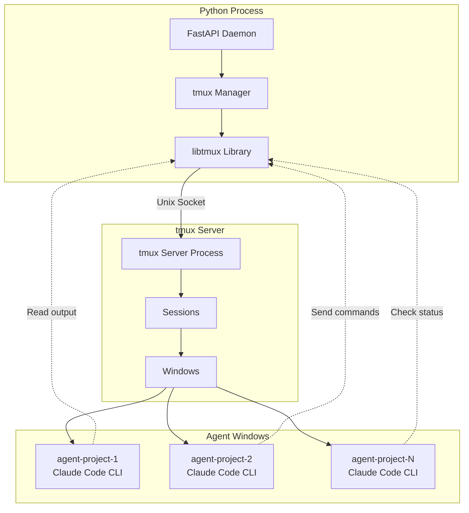
```mermaid
flowchart TD
    subgraph "Python Process"
        Daemon[FastAPI Daemon]
        TmuxMgr[tmux Manager]
        LibTmux[libtmux Library]
    end

    subgraph "tmux Server"
        Server[tmux Server Process]
        Sessions[Sessions]
        Windows[Windows]
    end

    subgraph "Agent Windows"
        W1[agent-project-1<br/>Claude Code CLI]
        W2[agent-project-2<br/>Claude Code CLI]
        WN[agent-project-N<br/>Claude Code CLI]
    end

    Daemon --> TmuxMgr
    TmuxMgr --> LibTmux
    LibTmux -->|Unix Socket| Server

    Server --> Sessions
    Sessions --> Windows
    Windows --> W1 & W2 & WN

    W1 -.->|Read output| LibTmux
    W2 -.->|Send commands| LibTmux
    WN -.->|Check status| LibTmux
```

## libtmux Code Pattern

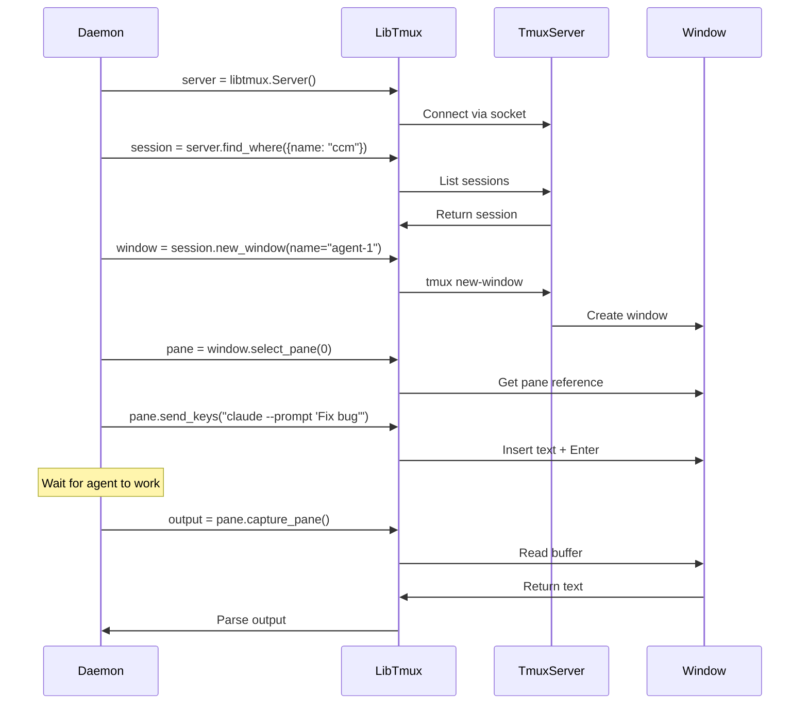
```mermaid
sequenceDiagram
    participant Daemon
    participant LibTmux
    participant TmuxServer
    participant Window

    Daemon->>LibTmux: server = libtmux.Server()
    LibTmux->>TmuxServer: Connect via socket

    Daemon->>LibTmux: session = server.find_where({name: "ccm"})
    LibTmux->>TmuxServer: List sessions
    TmuxServer->>LibTmux: Return session

    Daemon->>LibTmux: window = session.new_window(name="agent-1")
    LibTmux->>TmuxServer: tmux new-window
    TmuxServer->>Window: Create window

    Daemon->>LibTmux: pane = window.select_pane(0)
    LibTmux->>Window: Get pane reference

    Daemon->>LibTmux: pane.send_keys("claude --prompt 'Fix bug'")
    LibTmux->>Window: Insert text + Enter

    Note over Daemon: Wait for agent to work

    Daemon->>LibTmux: output = pane.capture_pane()
    LibTmux->>Window: Read buffer
    Window->>LibTmux: Return text
    LibTmux->>Daemon: Parse output
```

## FastAPI Daemon Architecture

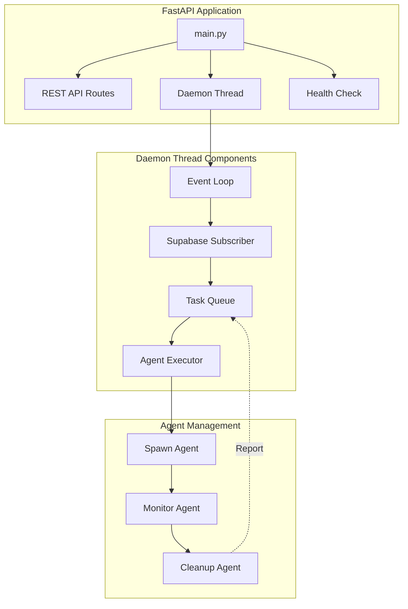
```mermaid
graph TB
    subgraph "FastAPI Application"
        Main[main.py]
        API[REST API Routes]
        Daemon[Daemon Thread]
        Health[Health Check]
    end

    subgraph "Daemon Thread Components"
        Loop[Event Loop]
        Sub[Supabase Subscriber]
        Queue[Task Queue]
        Executor[Agent Executor]
    end

    subgraph "Agent Management"
        Spawn[Spawn Agent]
        Monitor[Monitor Agent]
        Cleanup[Cleanup Agent]
    end

    Main --> API
    Main --> Daemon
    Main --> Health

    Daemon --> Loop
    Loop --> Sub
    Sub --> Queue
    Queue --> Executor

    Executor --> Spawn
    Spawn --> Monitor
    Monitor --> Cleanup

    Cleanup -.->|Report| Queue
```

## FastAPI Endpoints

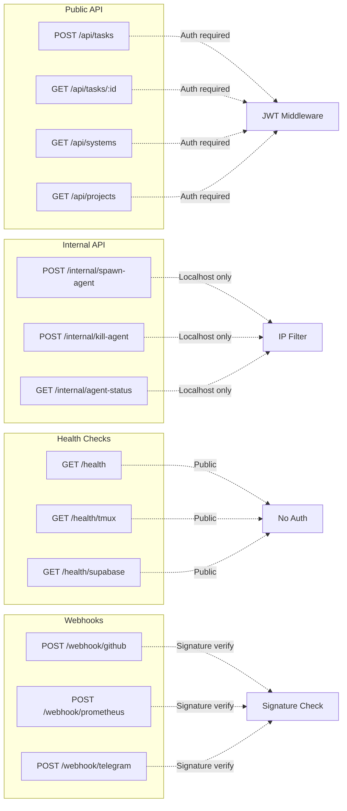
```mermaid
graph LR
    subgraph "Public API"
        P1[POST /api/tasks]
        P2[GET /api/tasks/:id]
        P3[GET /api/systems]
        P4[GET /api/projects]
    end

    subgraph "Internal API"
        I1[POST /internal/spawn-agent]
        I2[POST /internal/kill-agent]
        I3[GET /internal/agent-status]
    end

    subgraph "Health Checks"
        H1[GET /health]
        H2[GET /health/tmux]
        H3[GET /health/supabase]
    end

    subgraph "Webhooks"
        W1[POST /webhook/github]
        W2[POST /webhook/prometheus]
        W3[POST /webhook/telegram]
    end

    P1 & P2 & P3 & P4 -.->|Auth required| Auth[JWT Middleware]
    I1 & I2 & I3 -.->|Localhost only| Local[IP Filter]
    H1 & H2 & H3 -.->|Public| NoAuth[No Auth]
    W1 & W2 & W3 -.->|Signature verify| Verify[Signature Check]
```

## Process Supervision (systemd/launchd)

**For complete systemd and launchd configuration**, see [installation-setup.md](./installation-setup.md) (lines 241-312).

**Key principle**: systemd/launchd supervises the FastAPI daemon, tmux provides isolation.

**Summary**:
- **Linux**: systemd service with `Restart=always`
- **macOS**: launchd agent with `KeepAlive=true`
- **Both**: Ensure 24/7 operation, auto-restart on crash, start on boot

**Why this matters**: See [architecture-principles.md](./architecture-principles.md) section "Layered Supervision Model" for detailed rationale

## Supabase Realtime Subscription

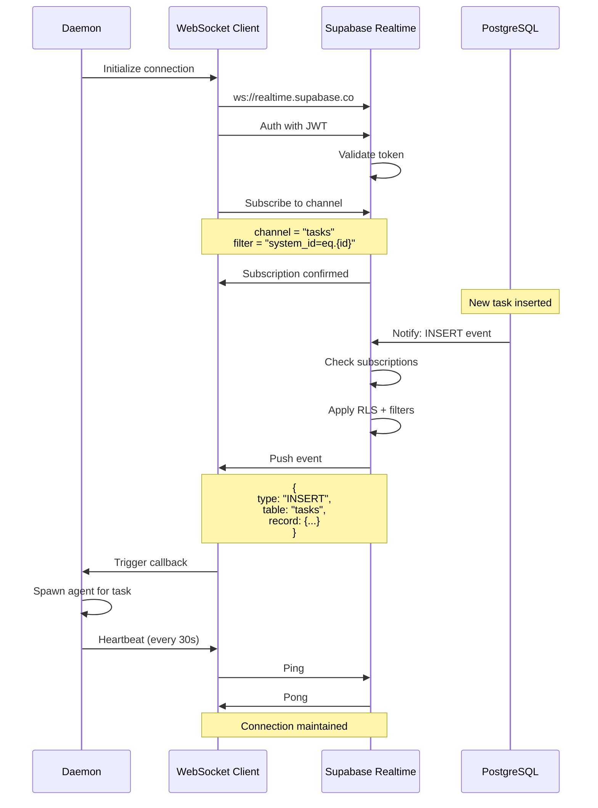
```mermaid
sequenceDiagram
    participant D as Daemon
    participant WS as WebSocket Client
    participant RT as Supabase Realtime
    participant DB as PostgreSQL

    D->>WS: Initialize connection
    WS->>RT: ws://realtime.supabase.co

    WS->>RT: Auth with JWT
    RT->>RT: Validate token

    WS->>RT: Subscribe to channel
    Note over WS,RT: channel = "tasks"<br/>filter = "system_id=eq.{id}"

    RT->>WS: Subscription confirmed

    Note over DB: New task inserted
    DB->>RT: Notify: INSERT event
    RT->>RT: Check subscriptions
    RT->>RT: Apply RLS + filters

    RT->>WS: Push event
    Note over RT,WS: {<br/>  type: "INSERT",<br/>  table: "tasks",<br/>  record: {...}<br/>}

    WS->>D: Trigger callback
    D->>D: Spawn agent for task

    D->>WS: Heartbeat (every 30s)
    WS->>RT: Ping
    RT->>WS: Pong

    Note over WS,RT: Connection maintained
```

## Supabase Realtime Filtering

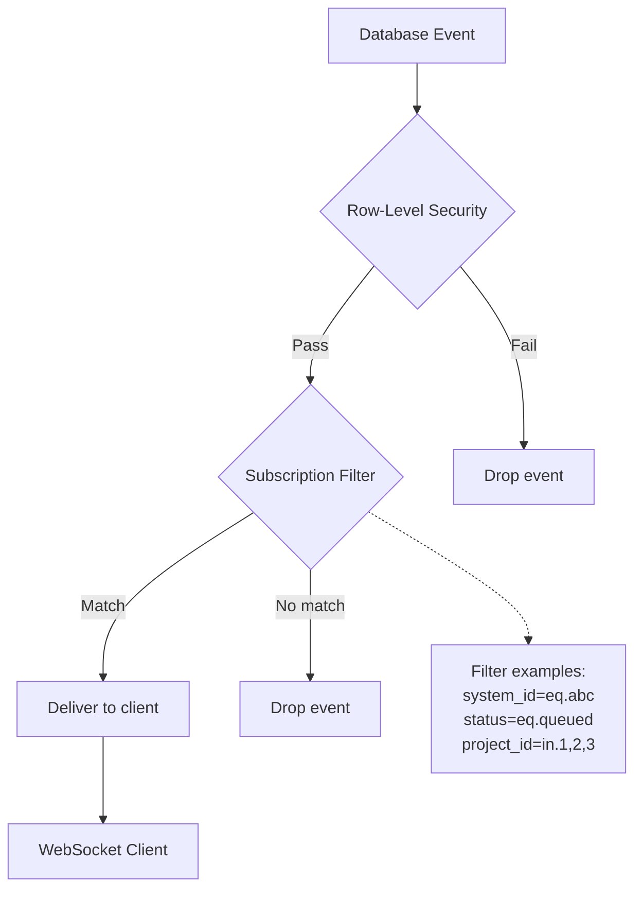
```mermaid
flowchart TD
    Event[Database Event] --> RLS{Row-Level Security}

    RLS -->|Pass| Filter{Subscription Filter}
    RLS -->|Fail| Drop1[Drop event]

    Filter -->|Match| Deliver[Deliver to client]
    Filter -->|No match| Drop2[Drop event]

    Deliver --> Client[WebSocket Client]

    Note1[Filter examples:<br/>system_id=eq.abc<br/>status=eq.queued<br/>project_id=in.1,2,3]

    Filter -.-> Note1
```

## Claude Code CLI Automation

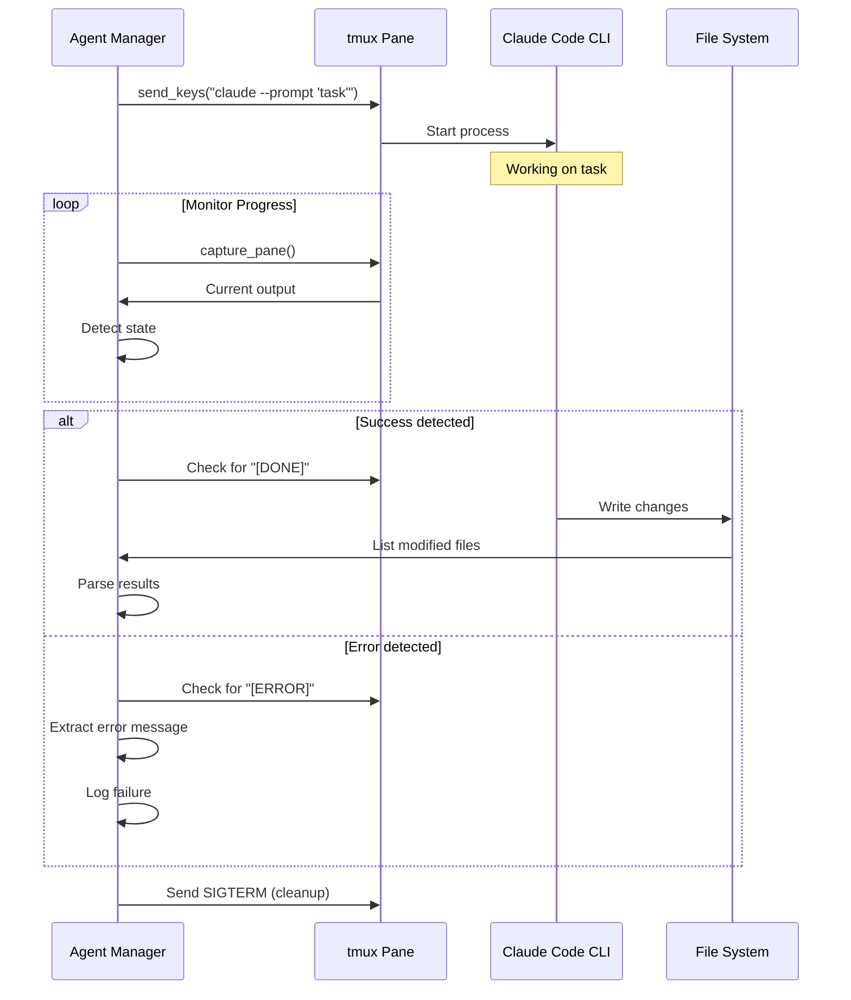
```mermaid
sequenceDiagram
    participant Agent as Agent Manager
    participant Pane as tmux Pane
    participant Claude as Claude Code CLI
    participant Files as File System

    Agent->>Pane: send_keys("claude --prompt 'task'")
    Pane->>Claude: Start process

    Note over Claude: Working on task

    loop Monitor Progress
        Agent->>Pane: capture_pane()
        Pane->>Agent: Current output
        Agent->>Agent: Detect state
    end

    alt Success detected
        Agent->>Pane: Check for "[DONE]"
        Claude->>Files: Write changes
        Files->>Agent: List modified files
        Agent->>Agent: Parse results
    else Error detected
        Agent->>Pane: Check for "[ERROR]"
        Agent->>Agent: Extract error message
        Agent->>Agent: Log failure
    end

    Agent->>Pane: Send SIGTERM (cleanup)
```

## Claude Code CLI Output Parsing

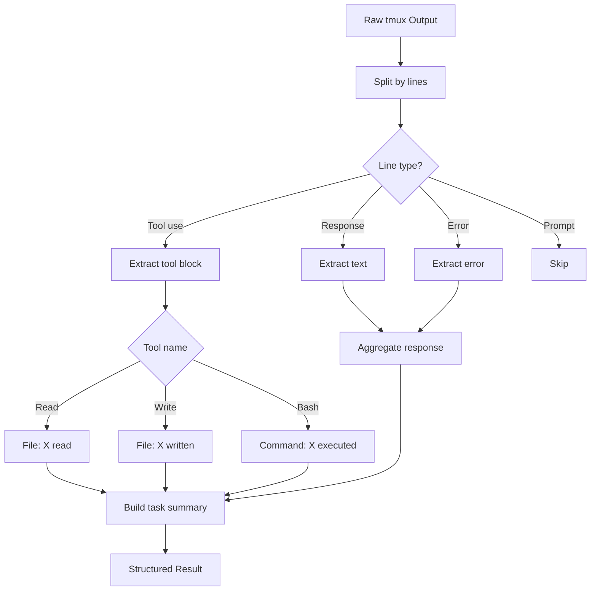
```mermaid
flowchart TD
    Output[Raw tmux Output] --> Split[Split by lines]
    Split --> Filter{Line type?}

    Filter -->|Tool use| ToolBlock[Extract tool block]
    Filter -->|Response| ResponseText[Extract text]
    Filter -->|Error| ErrorMsg[Extract error]
    Filter -->|Prompt| SkipPrompt[Skip]

    ToolBlock --> ParseTool{Tool name}
    ParseTool -->|Read| FileRead[File: X read]
    ParseTool -->|Write| FileWrite[File: X written]
    ParseTool -->|Bash| Command[Command: X executed]

    ResponseText --> Aggregate[Aggregate response]
    ErrorMsg --> Aggregate

    FileRead & FileWrite & Command --> Summary[Build task summary]
    Aggregate --> Summary

    Summary --> Result[Structured Result]
```

## Agent State Detection

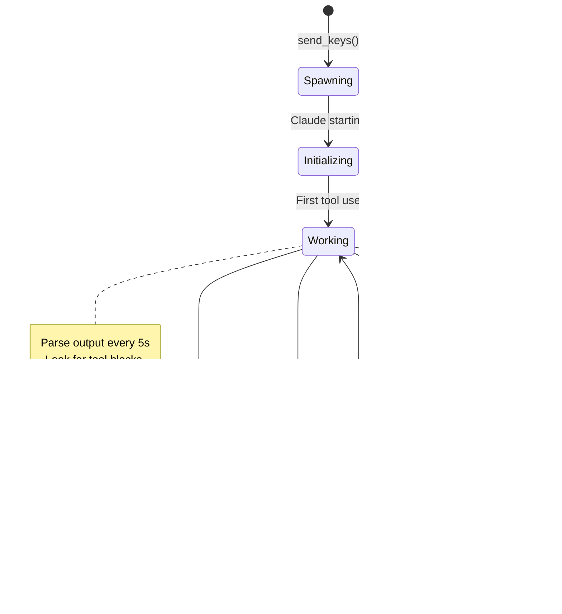
```mermaid
stateDiagram-v2
    [*] --> Spawning: send_keys()

    Spawning --> Initializing: Claude starting
    Initializing --> Working: First tool use

    Working --> Working: Tool blocks appear
    Working --> Waiting: Waiting for user
    Working --> Complete: [DONE] marker
    Working --> Error: [ERROR] marker

    Waiting --> Timeout: No activity 5min
    Timeout --> Error

    Complete --> [*]
    Error --> [*]

    note right of Working
        Parse output every 5s
        Look for tool blocks,
        errors, completion
    end note
```

## Process Supervision Patterns

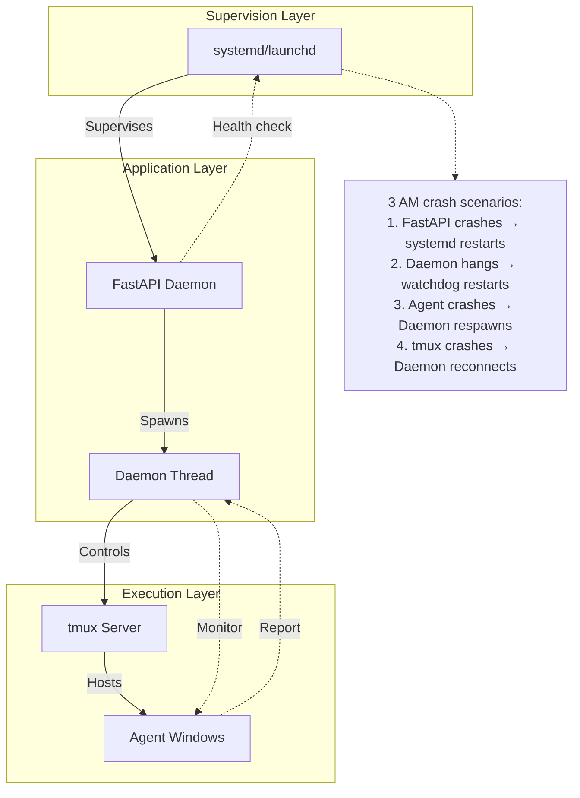
```mermaid
graph TB
    subgraph "Supervision Layer"
        Systemd[systemd/launchd]
    end

    subgraph "Application Layer"
        FastAPI[FastAPI Daemon]
        Daemon[Daemon Thread]
    end

    subgraph "Execution Layer"
        TmuxServer[tmux Server]
        Agents[Agent Windows]
    end

    Systemd -->|Supervises| FastAPI
    FastAPI -->|Spawns| Daemon
    Daemon -->|Controls| TmuxServer
    TmuxServer -->|Hosts| Agents

    FastAPI -.->|Health check| Systemd
    Daemon -.->|Monitor| Agents
    Agents -.->|Report| Daemon

    Note1[3 AM crash scenarios:<br/>1. FastAPI crashes → systemd restarts<br/>2. Daemon hangs → watchdog restarts<br/>3. Agent crashes → Daemon respawns<br/>4. tmux crashes → Daemon reconnects]

    Systemd -.-> Note1
```

## Watchdog Timer Implementation

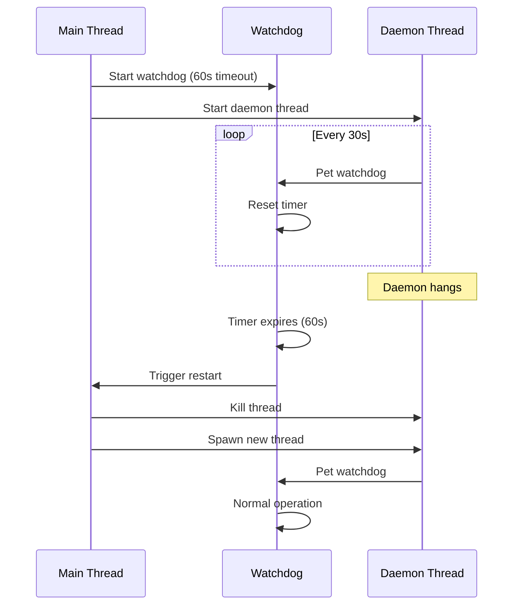
```mermaid
sequenceDiagram
    participant Main as Main Thread
    participant Watchdog
    participant Daemon as Daemon Thread

    Main->>Watchdog: Start watchdog (60s timeout)
    Main->>Daemon: Start daemon thread

    loop Every 30s
        Daemon->>Watchdog: Pet watchdog
        Watchdog->>Watchdog: Reset timer
    end

    Note over Daemon: Daemon hangs

    Watchdog->>Watchdog: Timer expires (60s)
    Watchdog->>Main: Trigger restart
    Main->>Daemon: Kill thread
    Main->>Daemon: Spawn new thread

    Daemon->>Watchdog: Pet watchdog
    Watchdog->>Watchdog: Normal operation
```

## Security Model

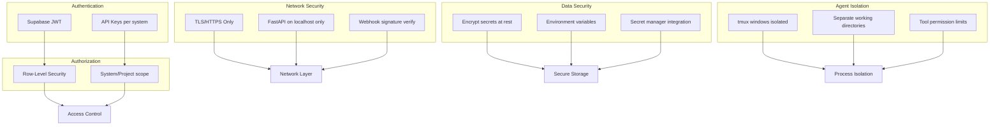
```mermaid
graph TB
    subgraph "Authentication"
        JWT[Supabase JWT]
        API[API Keys per system]
    end

    subgraph "Authorization"
        RLS[Row-Level Security]
        Scope[System/Project scope]
    end

    subgraph "Network Security"
        TLS[TLS/HTTPS Only]
        Firewall[FastAPI on localhost only]
        Webhook[Webhook signature verify]
    end

    subgraph "Data Security"
        Encrypt[Encrypt secrets at rest]
        Env[Environment variables]
        Secrets[Secret manager integration]
    end

    subgraph "Agent Isolation"
        Tmux[tmux windows isolated]
        WorkDir[Separate working directories]
        Tools[Tool permission limits]
    end

    JWT --> RLS
    API --> Scope
    RLS --> Access[Access Control]
    Scope --> Access

    TLS --> Network[Network Layer]
    Firewall --> Network
    Webhook --> Network

    Encrypt --> Storage[Secure Storage]
    Env --> Storage
    Secrets --> Storage

    Tmux --> Isolation[Process Isolation]
    WorkDir --> Isolation
    Tools --> Isolation
```

## Performance Optimization

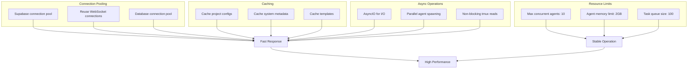
```mermaid
flowchart TD
    subgraph "Connection Pooling"
        P1[Supabase connection pool]
        P2[Reuse WebSocket connections]
        P3[Database connection pool]
    end

    subgraph "Caching"
        C1[Cache project configs]
        C2[Cache system metadata]
        C3[Cache templates]
    end

    subgraph "Async Operations"
        A1[AsyncIO for I/O]
        A2[Parallel agent spawning]
        A3[Non-blocking tmux reads]
    end

    subgraph "Resource Limits"
        R1[Max concurrent agents: 10]
        R2[Agent memory limit: 2GB]
        R3[Task queue size: 100]
    end

    P1 & P2 & P3 --> Fast[Fast Response]
    C1 & C2 & C3 --> Fast
    A1 & A2 & A3 --> Fast
    R1 & R2 & R3 --> Stable[Stable Operation]

    Fast --> Performance[High Performance]
    Stable --> Performance
```

## Error Recovery Strategies

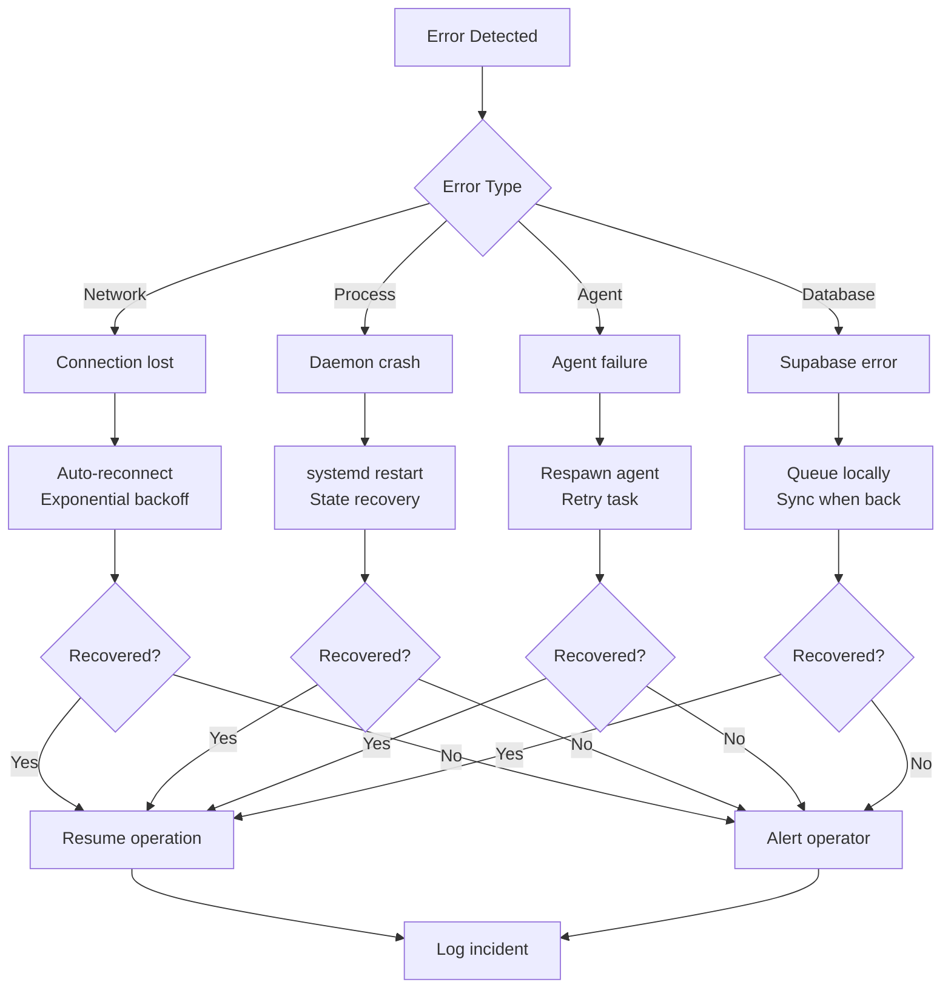
```mermaid
flowchart TD
    Error[Error Detected] --> Type{Error Type}

    Type -->|Network| Network[Connection lost]
    Type -->|Process| Process[Daemon crash]
    Type -->|Agent| Agent[Agent failure]
    Type -->|Database| Database[Supabase error]

    Network --> Reconnect[Auto-reconnect<br/>Exponential backoff]
    Process --> Restart[systemd restart<br/>State recovery]
    Agent --> Respawn[Respawn agent<br/>Retry task]
    Database --> Queue[Queue locally<br/>Sync when back]

    Reconnect --> Check1{Recovered?}
    Restart --> Check2{Recovered?}
    Respawn --> Check3{Recovered?}
    Queue --> Check4{Recovered?}

    Check1 & Check2 & Check3 & Check4 -->|Yes| Resume[Resume operation]
    Check1 & Check2 & Check3 & Check4 -->|No| Alert[Alert operator]

    Resume --> Log[Log incident]
    Alert --> Log
```

## Deployment Architecture

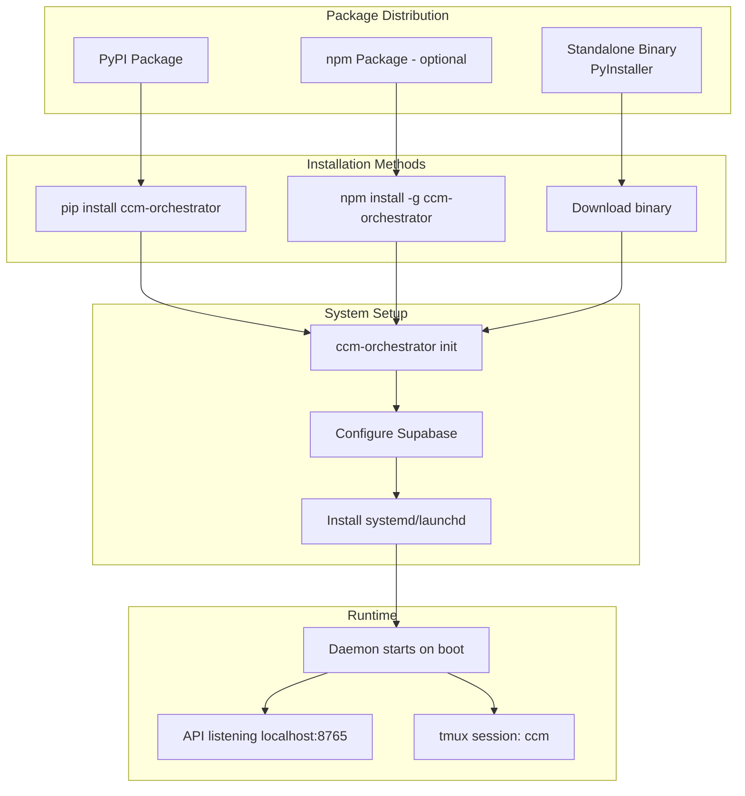
```mermaid
graph TB
    subgraph "Package Distribution"
        PyPI[PyPI Package]
        NPM[npm Package - optional]
        Binary[Standalone Binary<br/>PyInstaller]
    end

    subgraph "Installation Methods"
        I1[pip install ccm-orchestrator]
        I2[npm install -g ccm-orchestrator]
        I3[Download binary]
    end

    subgraph "System Setup"
        S1[ccm-orchestrator init]
        S2[Configure Supabase]
        S3[Install systemd/launchd]
    end

    subgraph "Runtime"
        R1[Daemon starts on boot]
        R2[API listening localhost:8765]
        R3[tmux session: ccm]
    end

    PyPI --> I1
    NPM --> I2
    Binary --> I3

    I1 & I2 & I3 --> S1
    S1 --> S2
    S2 --> S3

    S3 --> R1
    R1 --> R2
    R1 --> R3
```

## Logging & Observability

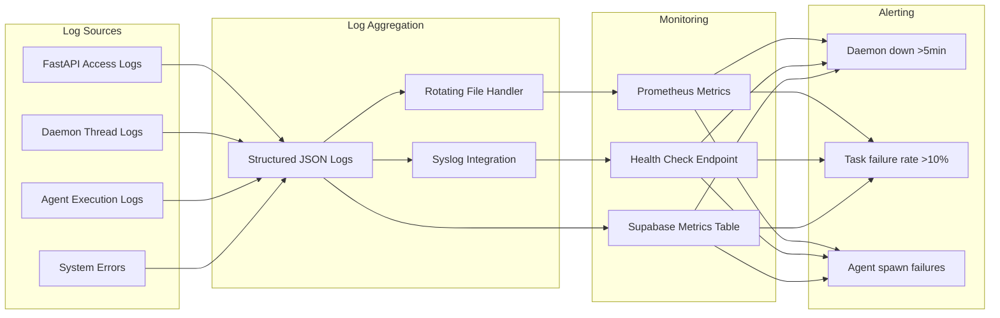
```mermaid
flowchart LR
    subgraph "Log Sources"
        L1[FastAPI Access Logs]
        L2[Daemon Thread Logs]
        L3[Agent Execution Logs]
        L4[System Errors]
    end

    subgraph "Log Aggregation"
        A1[Structured JSON Logs]
        A2[Rotating File Handler]
        A3[Syslog Integration]
    end

    subgraph "Monitoring"
        M1[Prometheus Metrics]
        M2[Health Check Endpoint]
        M3[Supabase Metrics Table]
    end

    subgraph "Alerting"
        Alert1[Daemon down >5min]
        Alert2[Task failure rate >10%]
        Alert3[Agent spawn failures]
    end

    L1 & L2 & L3 & L4 --> A1
    A1 --> A2
    A1 --> A3

    A2 --> M1
    A3 --> M2
    A1 --> M3

    M1 & M2 & M3 --> Alert1
    M1 & M2 & M3 --> Alert2
    M1 & M2 & M3 --> Alert3
```

## Testing Strategy

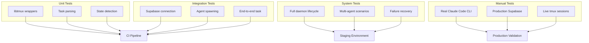
```mermaid
graph TB
    subgraph "Unit Tests"
        U1[libtmux wrappers]
        U2[Task parsing]
        U3[State detection]
    end

    subgraph "Integration Tests"
        I1[Supabase connection]
        I2[Agent spawning]
        I3[End-to-end task]
    end

    subgraph "System Tests"
        S1[Full daemon lifecycle]
        S2[Multi-agent scenarios]
        S3[Failure recovery]
    end

    subgraph "Manual Tests"
        M1[Real Claude Code CLI]
        M2[Production Supabase]
        M3[Live tmux sessions]
    end

    U1 & U2 & U3 --> CI[CI Pipeline]
    I1 & I2 & I3 --> CI

    S1 & S2 & S3 --> Staging[Staging Environment]
    M1 & M2 & M3 --> Production[Production Validation]
```

---

**Status**: DRAFT
**Version**: 0.1
**Last Updated**: 2025-11-17
