---
metadata:
  status: DRAFT
  version: 0.4
  tldr: "Technical implementation: libtmux, FastAPI, hooks, worktrees, ccusage, Supabase"
  dependencies: [architecture-principles.md, monitoring-architecture.md, agent-patterns.md, safety-and-sandboxing.md, quota-management.md]
  code_refs: [_dev_tools/pneuma-claude-hooks/, _dev_tools/cc_automation/]
---

# Technical Deep Dives

**Note**: This document covers low-level implementation details. For high-level patterns, see:
- [architecture-principles.md](./architecture-principles.md) - Core architectural principles
- [agent-patterns.md](./agent-patterns.md) - Worker, supervisory, manager patterns
- [orchestration-patterns.md](./orchestration-patterns.md) - Database-driven workflows
- [monitoring-architecture.md](./monitoring-architecture.md) - Hook-based monitoring

## Hook Integration Patterns

### Hook Handler Architecture

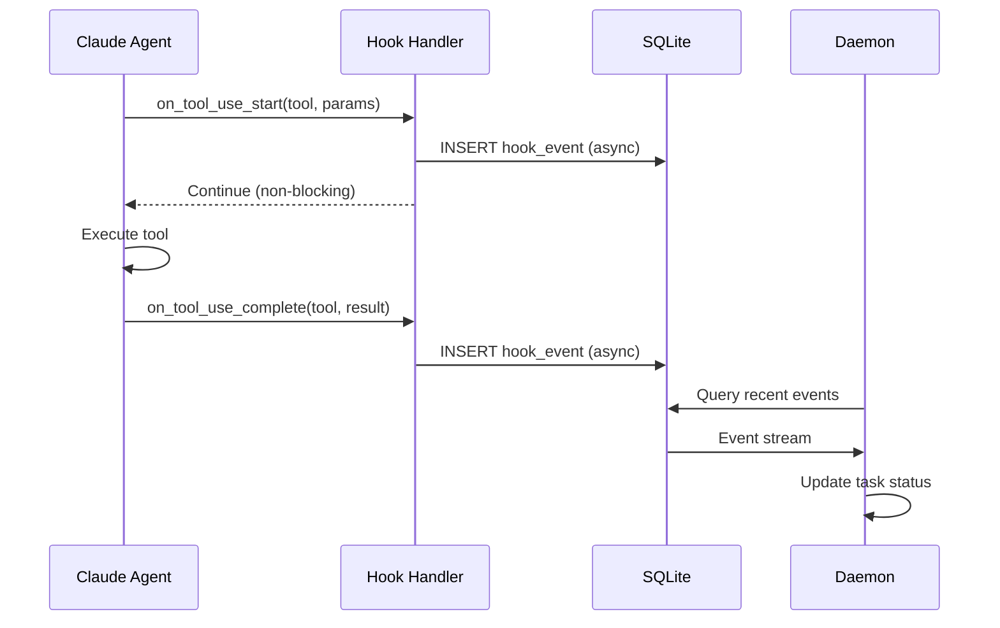
```mermaid
sequenceDiagram
    participant Agent as Claude Agent
    participant Hook as Hook Handler
    participant SQLite
    participant Daemon

    Agent->>Hook: on_tool_use_start(tool, params)
    Hook->>SQLite: INSERT hook_event (async)
    Hook-->>Agent: Continue (non-blocking)

    Agent->>Agent: Execute tool

    Agent->>Hook: on_tool_use_complete(tool, result)
    Hook->>SQLite: INSERT hook_event (async)

    Daemon->>SQLite: Query recent events
    SQLite->>Daemon: Event stream
    Daemon->>Daemon: Update task status
```

### Hook Handler Implementation

**Pseudocode**:
```python
class AgentHookHandler:
    def __init__(self, task_id, agent_id, db_path):
        self.task_id = task_id
        self.agent_id = agent_id
        self.db = AsyncSQLite(db_path)
        self.event_buffer = []

    async def on_tool_use_start(self, tool_name, params):
        event = {
            "task_id": self.task_id,
            "agent_id": self.agent_id,
            "hook_type": "tool_use_start",
            "tool_name": tool_name,
            "event_data": params,
            "hook_timestamp": datetime.now()
        }
        self.event_buffer.append(event)

        # Batch write every 10 events
        if len(self.event_buffer) >= 10:
            await self.flush_events()

    async def flush_events(self):
        await self.db.executemany(
            "INSERT INTO hook_events (...) VALUES (...)",
            self.event_buffer
        )
        self.event_buffer.clear()
```

**Key principles**:
- **Async writes**: Don't block agent execution
- **Batch inserts**: Write 10-50 events at once
- **Non-blocking**: Agent continues while hooks log
- **Structured data**: JSON for all event details

### Hook Types Catalog

**Tool Use Hooks**:
```python
on_tool_use_start(tool_name, parameters)
on_tool_use_complete(tool_name, result, duration_ms)
on_tool_error(tool_name, error_message)
```

**File Operation Hooks**:
```python
on_file_read(file_path)
on_file_edit(file_path, old_hash, new_hash, lines_changed)
on_file_write(file_path, content_size)
```

**Session Lifecycle Hooks**:
```python
on_session_start(agent_id, working_directory)
on_session_complete(agent_id, result)
on_session_error(agent_id, error_type, error_message)
```

**Command Execution Hooks**:
```python
on_bash_command(command, working_dir)
on_bash_output(command, exit_code, stdout, stderr, duration_ms)
```

**Detailed documentation**: See [monitoring-architecture.md](./monitoring-architecture.md)

## libtmux Control Architecture

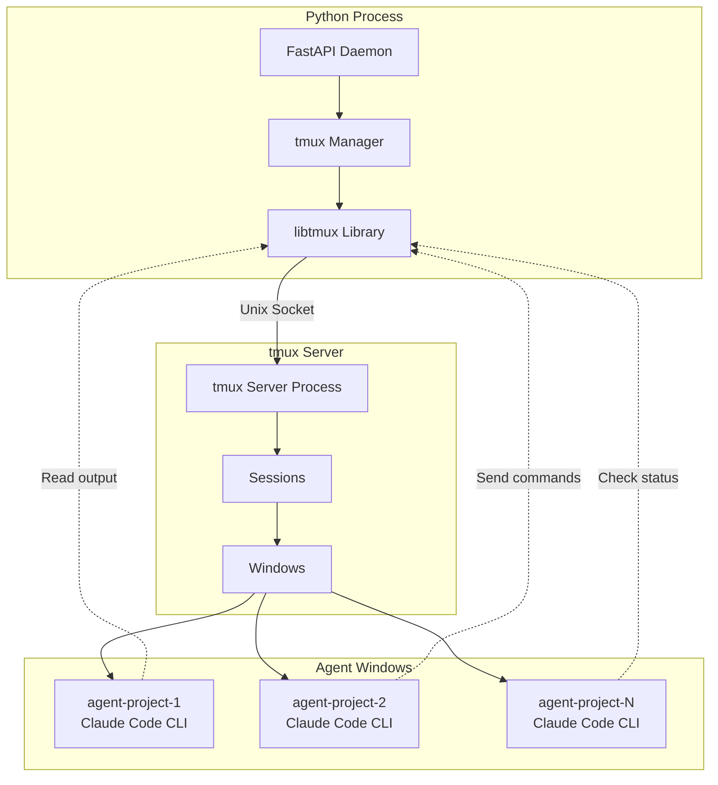
```mermaid
flowchart TD
    subgraph "Python Process"
        Daemon[FastAPI Daemon]
        TmuxMgr[tmux Manager]
        LibTmux[libtmux Library]
    end

    subgraph "tmux Server"
        Server[tmux Server Process]
        Sessions[Sessions]
        Windows[Windows]
    end

    subgraph "Agent Windows"
        W1[agent-project-1<br/>Claude Code CLI]
        W2[agent-project-2<br/>Claude Code CLI]
        WN[agent-project-N<br/>Claude Code CLI]
    end

    Daemon --> TmuxMgr
    TmuxMgr --> LibTmux
    LibTmux -->|Unix Socket| Server

    Server --> Sessions
    Sessions --> Windows
    Windows --> W1 & W2 & WN

    W1 -.->|Read output| LibTmux
    W2 -.->|Send commands| LibTmux
    WN -.->|Check status| LibTmux
```

## libtmux Code Pattern

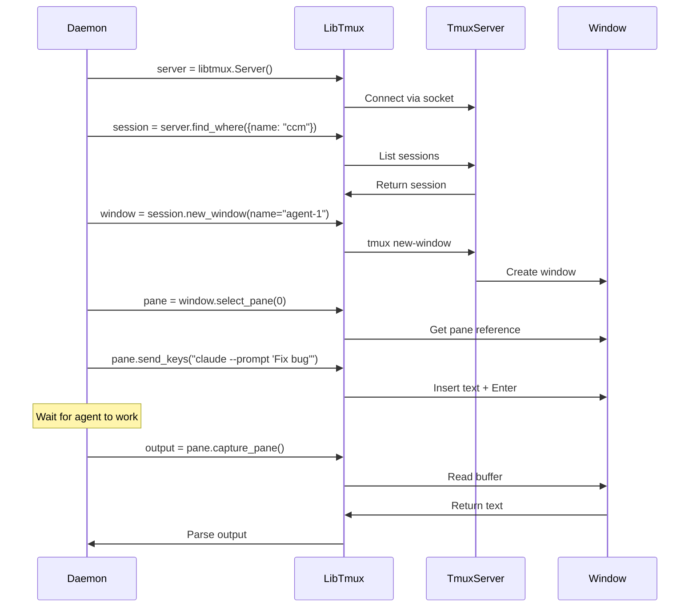
```mermaid
sequenceDiagram
    participant Daemon
    participant LibTmux
    participant TmuxServer
    participant Window

    Daemon->>LibTmux: server = libtmux.Server()
    LibTmux->>TmuxServer: Connect via socket

    Daemon->>LibTmux: session = server.find_where({name: "ccm"})
    LibTmux->>TmuxServer: List sessions
    TmuxServer->>LibTmux: Return session

    Daemon->>LibTmux: window = session.new_window(name="agent-1")
    LibTmux->>TmuxServer: tmux new-window
    TmuxServer->>Window: Create window

    Daemon->>LibTmux: pane = window.select_pane(0)
    LibTmux->>Window: Get pane reference

    Daemon->>LibTmux: pane.send_keys("claude --prompt 'Fix bug'")
    LibTmux->>Window: Insert text + Enter

    Note over Daemon: Wait for agent to work

    Daemon->>LibTmux: output = pane.capture_pane()
    LibTmux->>Window: Read buffer
    Window->>LibTmux: Return text
    LibTmux->>Daemon: Parse output
```

## FastAPI Daemon Architecture

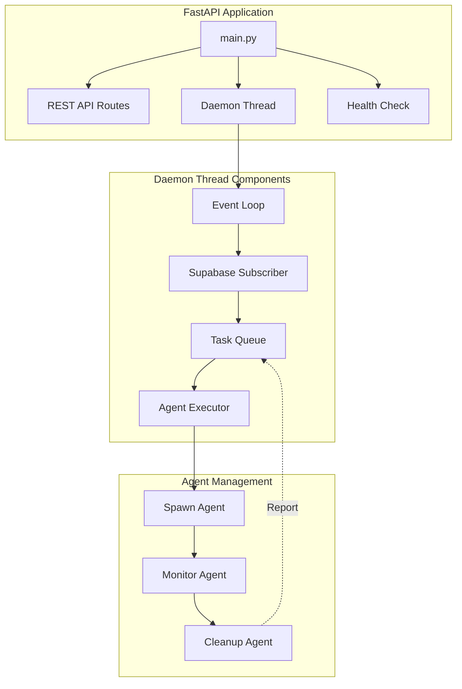
```mermaid
graph TB
    subgraph "FastAPI Application"
        Main[main.py]
        API[REST API Routes]
        Daemon[Daemon Thread]
        Health[Health Check]
    end

    subgraph "Daemon Thread Components"
        Loop[Event Loop]
        Sub[Supabase Subscriber]
        Queue[Task Queue]
        Executor[Agent Executor]
    end

    subgraph "Agent Management"
        Spawn[Spawn Agent]
        Monitor[Monitor Agent]
        Cleanup[Cleanup Agent]
    end

    Main --> API
    Main --> Daemon
    Main --> Health

    Daemon --> Loop
    Loop --> Sub
    Sub --> Queue
    Queue --> Executor

    Executor --> Spawn
    Spawn --> Monitor
    Monitor --> Cleanup

    Cleanup -.->|Report| Queue
```

## FastAPI Endpoints

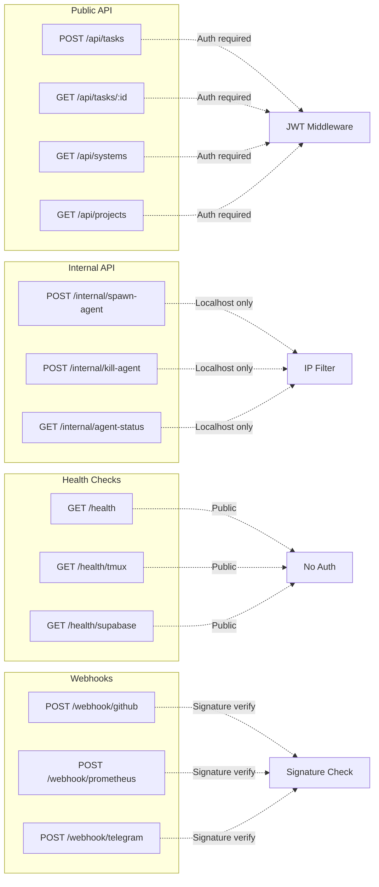
```mermaid
graph LR
    subgraph "Public API"
        P1[POST /api/tasks]
        P2[GET /api/tasks/:id]
        P3[GET /api/systems]
        P4[GET /api/projects]
    end

    subgraph "Internal API"
        I1[POST /internal/spawn-agent]
        I2[POST /internal/kill-agent]
        I3[GET /internal/agent-status]
    end

    subgraph "Health Checks"
        H1[GET /health]
        H2[GET /health/tmux]
        H3[GET /health/supabase]
    end

    subgraph "Webhooks"
        W1[POST /webhook/github]
        W2[POST /webhook/prometheus]
        W3[POST /webhook/telegram]
    end

    P1 & P2 & P3 & P4 -.->|Auth required| Auth[JWT Middleware]
    I1 & I2 & I3 -.->|Localhost only| Local[IP Filter]
    H1 & H2 & H3 -.->|Public| NoAuth[No Auth]
    W1 & W2 & W3 -.->|Signature verify| Verify[Signature Check]
```

## Process Supervision (systemd/launchd)

**For complete systemd and launchd configuration**, see [installation-setup.md](./installation-setup.md) (lines 241-312).

**Key principle**: systemd/launchd supervises the FastAPI daemon, tmux provides isolation.

**Summary**:
- **Linux**: systemd service with `Restart=always`
- **macOS**: launchd agent with `KeepAlive=true`
- **Both**: Ensure 24/7 operation, auto-restart on crash, start on boot

**Why this matters**: See [architecture-principles.md](./architecture-principles.md) section "Layered Supervision Model" for detailed rationale

## Supabase Realtime Subscription

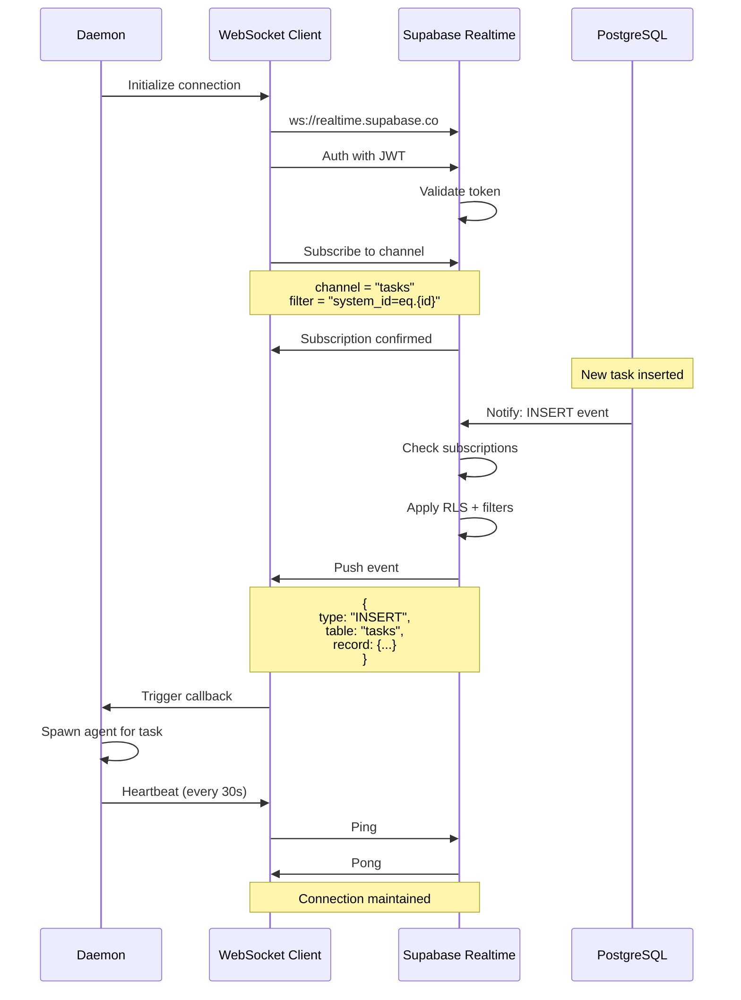
```mermaid
sequenceDiagram
    participant D as Daemon
    participant WS as WebSocket Client
    participant RT as Supabase Realtime
    participant DB as PostgreSQL

    D->>WS: Initialize connection
    WS->>RT: ws://realtime.supabase.co

    WS->>RT: Auth with JWT
    RT->>RT: Validate token

    WS->>RT: Subscribe to channel
    Note over WS,RT: channel = "tasks"<br/>filter = "system_id=eq.{id}"

    RT->>WS: Subscription confirmed

    Note over DB: New task inserted
    DB->>RT: Notify: INSERT event
    RT->>RT: Check subscriptions
    RT->>RT: Apply RLS + filters

    RT->>WS: Push event
    Note over RT,WS: {<br/>  type: "INSERT",<br/>  table: "tasks",<br/>  record: {...}<br/>}

    WS->>D: Trigger callback
    D->>D: Spawn agent for task

    D->>WS: Heartbeat (every 30s)
    WS->>RT: Ping
    RT->>WS: Pong

    Note over WS,RT: Connection maintained
```

## Supabase Realtime Filtering

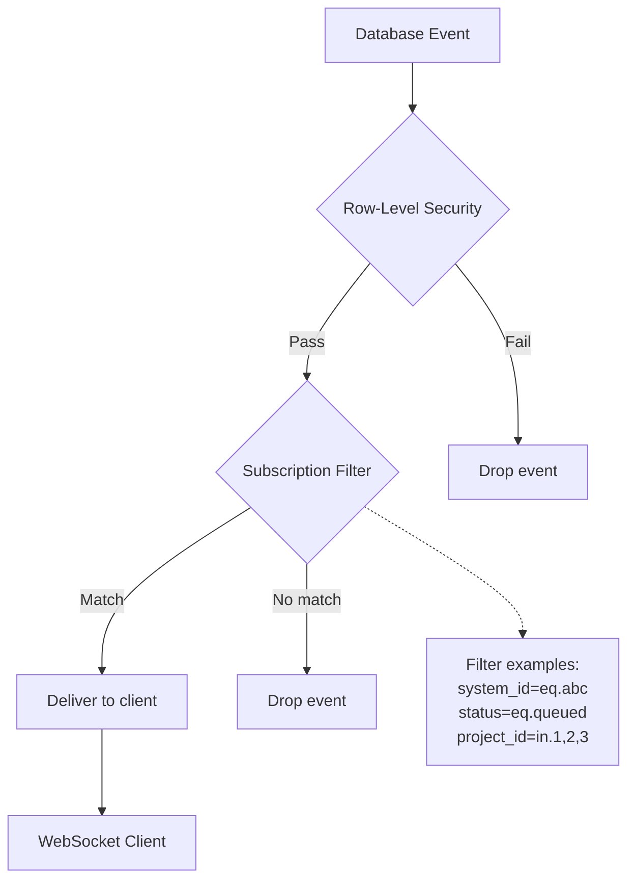
```mermaid
flowchart TD
    Event[Database Event] --> RLS{Row-Level Security}

    RLS -->|Pass| Filter{Subscription Filter}
    RLS -->|Fail| Drop1[Drop event]

    Filter -->|Match| Deliver[Deliver to client]
    Filter -->|No match| Drop2[Drop event]

    Deliver --> Client[WebSocket Client]

    Note1[Filter examples:<br/>system_id=eq.abc<br/>status=eq.queued<br/>project_id=in.1,2,3]

    Filter -.-> Note1
```

## Claude Code CLI Automation

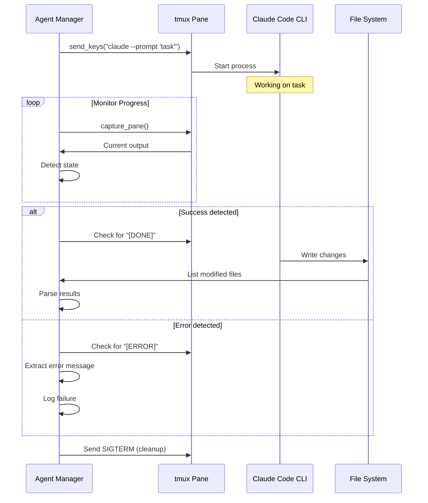
```mermaid
sequenceDiagram
    participant Agent as Agent Manager
    participant Pane as tmux Pane
    participant Claude as Claude Code CLI
    participant Files as File System

    Agent->>Pane: send_keys("claude --prompt 'task'")
    Pane->>Claude: Start process

    Note over Claude: Working on task

    loop Monitor Progress
        Agent->>Pane: capture_pane()
        Pane->>Agent: Current output
        Agent->>Agent: Detect state
    end

    alt Success detected
        Agent->>Pane: Check for "[DONE]"
        Claude->>Files: Write changes
        Files->>Agent: List modified files
        Agent->>Agent: Parse results
    else Error detected
        Agent->>Pane: Check for "[ERROR]"
        Agent->>Agent: Extract error message
        Agent->>Agent: Log failure
    end

    Agent->>Pane: Send SIGTERM (cleanup)
```

## Claude Code CLI Output Parsing

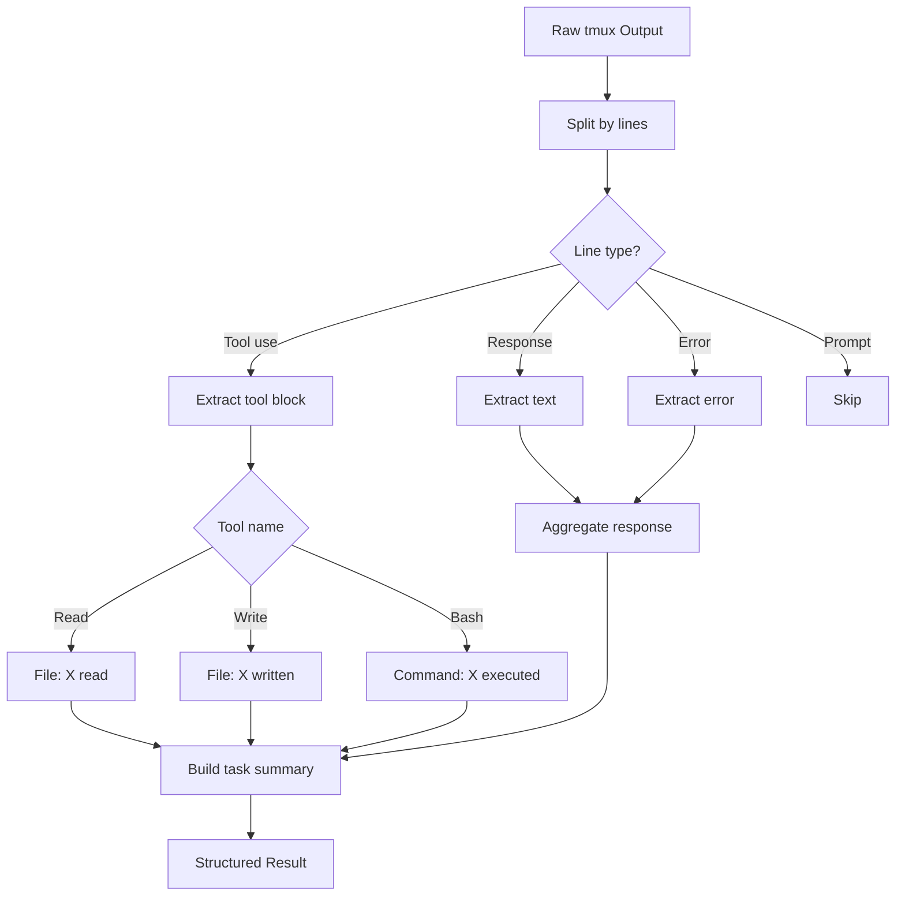
```mermaid
flowchart TD
    Output[Raw tmux Output] --> Split[Split by lines]
    Split --> Filter{Line type?}

    Filter -->|Tool use| ToolBlock[Extract tool block]
    Filter -->|Response| ResponseText[Extract text]
    Filter -->|Error| ErrorMsg[Extract error]
    Filter -->|Prompt| SkipPrompt[Skip]

    ToolBlock --> ParseTool{Tool name}
    ParseTool -->|Read| FileRead[File: X read]
    ParseTool -->|Write| FileWrite[File: X written]
    ParseTool -->|Bash| Command[Command: X executed]

    ResponseText --> Aggregate[Aggregate response]
    ErrorMsg --> Aggregate

    FileRead & FileWrite & Command --> Summary[Build task summary]
    Aggregate --> Summary

    Summary --> Result[Structured Result]
```

## Agent State Detection

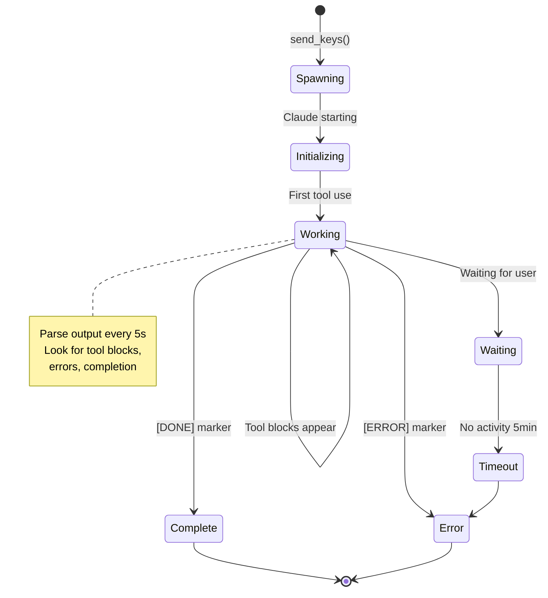
```mermaid
stateDiagram-v2
    [*] --> Spawning: send_keys()

    Spawning --> Initializing: Claude starting
    Initializing --> Working: First tool use

    Working --> Working: Tool blocks appear
    Working --> Waiting: Waiting for user
    Working --> Complete: [DONE] marker
    Working --> Error: [ERROR] marker

    Waiting --> Timeout: No activity 5min
    Timeout --> Error

    Complete --> [*]
    Error --> [*]

    note right of Working
        Parse output every 5s
        Look for tool blocks,
        errors, completion
    end note
```

## Process Supervision Patterns

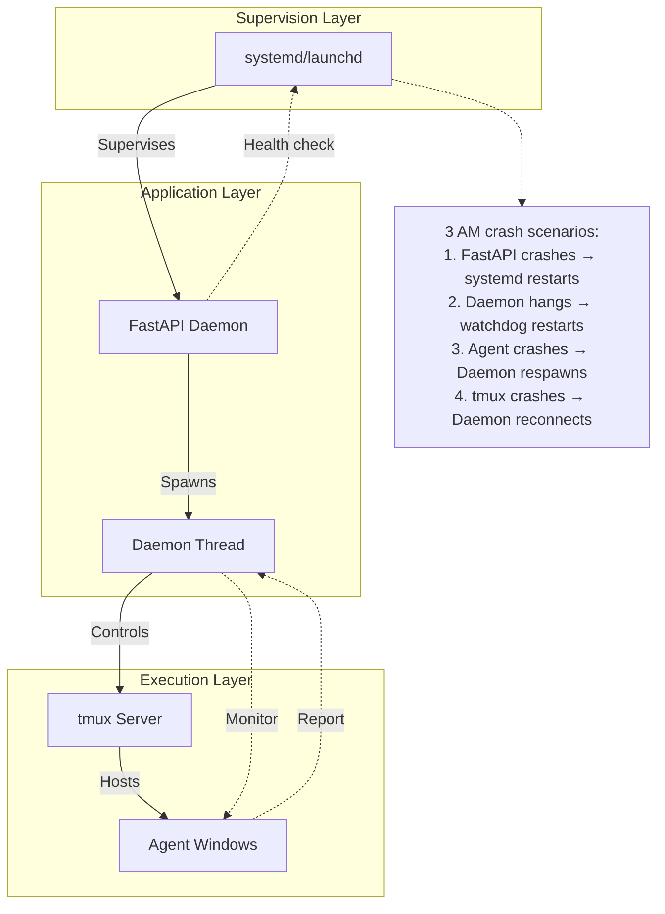
```mermaid
graph TB
    subgraph "Supervision Layer"
        Systemd[systemd/launchd]
    end

    subgraph "Application Layer"
        FastAPI[FastAPI Daemon]
        Daemon[Daemon Thread]
    end

    subgraph "Execution Layer"
        TmuxServer[tmux Server]
        Agents[Agent Windows]
    end

    Systemd -->|Supervises| FastAPI
    FastAPI -->|Spawns| Daemon
    Daemon -->|Controls| TmuxServer
    TmuxServer -->|Hosts| Agents

    FastAPI -.->|Health check| Systemd
    Daemon -.->|Monitor| Agents
    Agents -.->|Report| Daemon

    Note1[3 AM crash scenarios:<br/>1. FastAPI crashes → systemd restarts<br/>2. Daemon hangs → watchdog restarts<br/>3. Agent crashes → Daemon respawns<br/>4. tmux crashes → Daemon reconnects]

    Systemd -.-> Note1
```

## Watchdog Timer Implementation

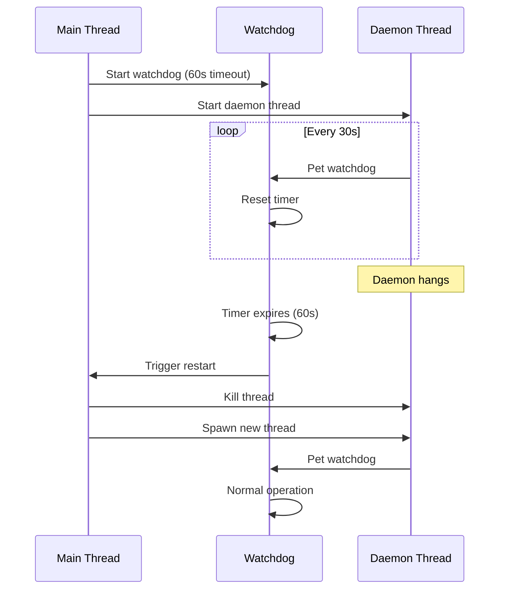
```mermaid
sequenceDiagram
    participant Main as Main Thread
    participant Watchdog
    participant Daemon as Daemon Thread

    Main->>Watchdog: Start watchdog (60s timeout)
    Main->>Daemon: Start daemon thread

    loop Every 30s
        Daemon->>Watchdog: Pet watchdog
        Watchdog->>Watchdog: Reset timer
    end

    Note over Daemon: Daemon hangs

    Watchdog->>Watchdog: Timer expires (60s)
    Watchdog->>Main: Trigger restart
    Main->>Daemon: Kill thread
    Main->>Daemon: Spawn new thread

    Daemon->>Watchdog: Pet watchdog
    Watchdog->>Watchdog: Normal operation
```

## Security Model

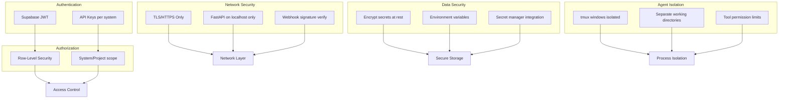
```mermaid
graph TB
    subgraph "Authentication"
        JWT[Supabase JWT]
        API[API Keys per system]
    end

    subgraph "Authorization"
        RLS[Row-Level Security]
        Scope[System/Project scope]
    end

    subgraph "Network Security"
        TLS[TLS/HTTPS Only]
        Firewall[FastAPI on localhost only]
        Webhook[Webhook signature verify]
    end

    subgraph "Data Security"
        Encrypt[Encrypt secrets at rest]
        Env[Environment variables]
        Secrets[Secret manager integration]
    end

    subgraph "Agent Isolation"
        Tmux[tmux windows isolated]
        WorkDir[Separate working directories]
        Tools[Tool permission limits]
    end

    JWT --> RLS
    API --> Scope
    RLS --> Access[Access Control]
    Scope --> Access

    TLS --> Network[Network Layer]
    Firewall --> Network
    Webhook --> Network

    Encrypt --> Storage[Secure Storage]
    Env --> Storage
    Secrets --> Storage

    Tmux --> Isolation[Process Isolation]
    WorkDir --> Isolation
    Tools --> Isolation
```

## Performance Optimization

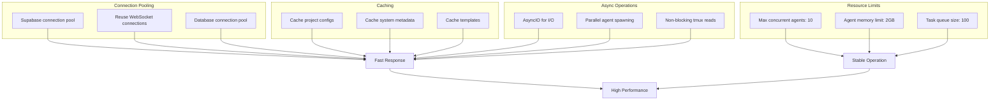
```mermaid
flowchart TD
    subgraph "Connection Pooling"
        P1[Supabase connection pool]
        P2[Reuse WebSocket connections]
        P3[Database connection pool]
    end

    subgraph "Caching"
        C1[Cache project configs]
        C2[Cache system metadata]
        C3[Cache templates]
    end

    subgraph "Async Operations"
        A1[AsyncIO for I/O]
        A2[Parallel agent spawning]
        A3[Non-blocking tmux reads]
    end

    subgraph "Resource Limits"
        R1[Max concurrent agents: 10]
        R2[Agent memory limit: 2GB]
        R3[Task queue size: 100]
    end

    P1 & P2 & P3 --> Fast[Fast Response]
    C1 & C2 & C3 --> Fast
    A1 & A2 & A3 --> Fast
    R1 & R2 & R3 --> Stable[Stable Operation]

    Fast --> Performance[High Performance]
    Stable --> Performance
```

## Error Recovery Strategies

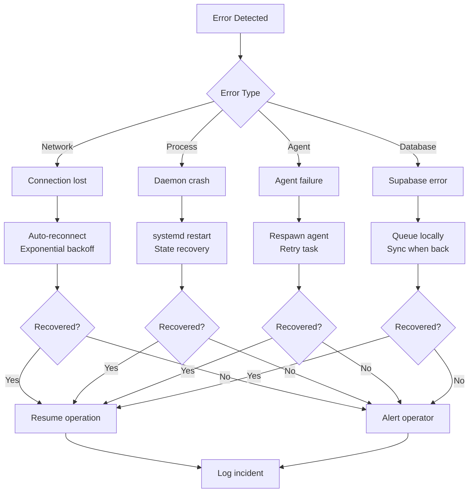
```mermaid
flowchart TD
    Error[Error Detected] --> Type{Error Type}

    Type -->|Network| Network[Connection lost]
    Type -->|Process| Process[Daemon crash]
    Type -->|Agent| Agent[Agent failure]
    Type -->|Database| Database[Supabase error]

    Network --> Reconnect[Auto-reconnect<br/>Exponential backoff]
    Process --> Restart[systemd restart<br/>State recovery]
    Agent --> Respawn[Respawn agent<br/>Retry task]
    Database --> Queue[Queue locally<br/>Sync when back]

    Reconnect --> Check1{Recovered?}
    Restart --> Check2{Recovered?}
    Respawn --> Check3{Recovered?}
    Queue --> Check4{Recovered?}

    Check1 & Check2 & Check3 & Check4 -->|Yes| Resume[Resume operation]
    Check1 & Check2 & Check3 & Check4 -->|No| Alert[Alert operator]

    Resume --> Log[Log incident]
    Alert --> Log
```

## Deployment Architecture

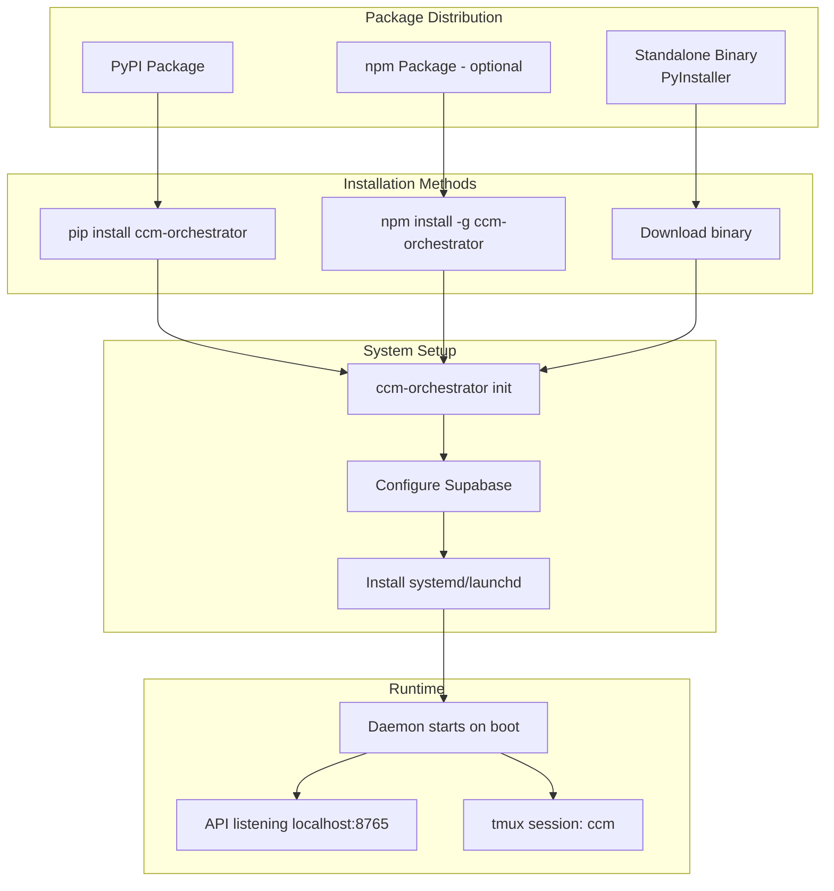
```mermaid
graph TB
    subgraph "Package Distribution"
        PyPI[PyPI Package]
        NPM[npm Package - optional]
        Binary[Standalone Binary<br/>PyInstaller]
    end

    subgraph "Installation Methods"
        I1[pip install ccm-orchestrator]
        I2[npm install -g ccm-orchestrator]
        I3[Download binary]
    end

    subgraph "System Setup"
        S1[ccm-orchestrator init]
        S2[Configure Supabase]
        S3[Install systemd/launchd]
    end

    subgraph "Runtime"
        R1[Daemon starts on boot]
        R2[API listening localhost:8765]
        R3[tmux session: ccm]
    end

    PyPI --> I1
    NPM --> I2
    Binary --> I3

    I1 & I2 & I3 --> S1
    S1 --> S2
    S2 --> S3

    S3 --> R1
    R1 --> R2
    R1 --> R3
```

## Logging & Observability

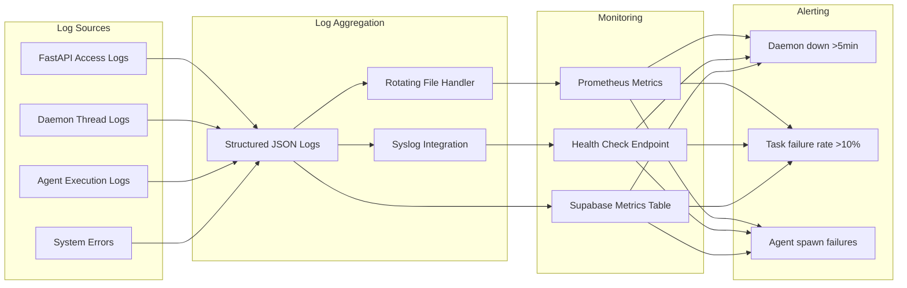
```mermaid
flowchart LR
    subgraph "Log Sources"
        L1[FastAPI Access Logs]
        L2[Daemon Thread Logs]
        L3[Agent Execution Logs]
        L4[System Errors]
    end

    subgraph "Log Aggregation"
        A1[Structured JSON Logs]
        A2[Rotating File Handler]
        A3[Syslog Integration]
    end

    subgraph "Monitoring"
        M1[Prometheus Metrics]
        M2[Health Check Endpoint]
        M3[Supabase Metrics Table]
    end

    subgraph "Alerting"
        Alert1[Daemon down >5min]
        Alert2[Task failure rate >10%]
        Alert3[Agent spawn failures]
    end

    L1 & L2 & L3 & L4 --> A1
    A1 --> A2
    A1 --> A3

    A2 --> M1
    A3 --> M2
    A1 --> M3

    M1 & M2 & M3 --> Alert1
    M1 & M2 & M3 --> Alert2
    M1 & M2 & M3 --> Alert3
```

## Git Worktree Management

### Worktree Creation Pattern

**Source**: Adapted from git worktree best practices for isolated task execution.

**Implementation**:
```python
import subprocess
import os
from pathlib import Path

class WorktreeManager:
    def __init__(self, main_repo_path, worktrees_base):
        self.main_repo = Path(main_repo_path)
        self.worktrees_base = Path(worktrees_base)

    def create_worktree(self, task_id, base_branch='main'):
        """Create isolated worktree for task"""
        worktree_path = self.worktrees_base / task_id
        branch_name = f"ccm/{task_id}"

        # Ensure main repo exists
        if not self.main_repo.exists():
            raise ValueError(f"Main repo not found: {self.main_repo}")

        # Create worktree with dedicated branch
        subprocess.run([
            'git', 'worktree', 'add',
            str(worktree_path),
            '-b', branch_name,
            base_branch
        ], cwd=self.main_repo, check=True)

        # Record in database
        db.execute("""
            INSERT INTO task_worktrees (task_id, worktree_path, branch_name)
            VALUES (?, ?, ?)
        """, (task_id, str(worktree_path), branch_name))

        return worktree_path

    def remove_worktree(self, task_id, force=False):
        """Remove worktree and cleanup"""
        worktree_data = db.execute("""
            SELECT worktree_path, branch_name FROM task_worktrees
            WHERE task_id = ?
        """, (task_id,)).fetchone()

        if not worktree_data:
            return

        worktree_path = worktree_data['worktree_path']
        branch_name = worktree_data['branch_name']

        # Remove worktree
        cmd = ['git', 'worktree', 'remove', worktree_path]
        if force:
            cmd.append('--force')

        subprocess.run(cmd, cwd=self.main_repo, check=True)

        # Delete branch (if merged)
        subprocess.run([
            'git', 'branch', '-d' if not force else '-D',
            branch_name
        ], cwd=self.main_repo, check=True)

        # Update database
        db.execute("""
            UPDATE task_worktrees
            SET removed_at = datetime('now'), status = 'discarded'
            WHERE task_id = ?
        """, (task_id,))

    def list_worktrees(self):
        """List all git worktrees"""
        result = subprocess.run([
            'git', 'worktree', 'list', '--porcelain'
        ], cwd=self.main_repo, capture_output=True, text=True, check=True)

        worktrees = []
        current = {}

        for line in result.stdout.split('\n'):
            if line.startswith('worktree '):
                if current:
                    worktrees.append(current)
                current = {'path': line.split(' ', 1)[1]}
            elif line.startswith('branch '):
                current['branch'] = line.split(' ', 1)[1]

        if current:
            worktrees.append(current)

        return worktrees

    def prune_stale(self):
        """Remove stale worktree metadata"""
        subprocess.run(['git', 'worktree', 'prune'], cwd=self.main_repo, check=True)
```

### Worktree Safety Guards

**Prevent dangerous operations**:
```python
def validate_worktree_path(path, task_id):
    """Ensure path is within allowed worktree"""
    allowed_root = Path(f"~/.ccm/worktrees/{task_id}").expanduser().resolve()
    actual_path = Path(path).resolve()

    if not str(actual_path).startswith(str(allowed_root)):
        raise SecurityError(f"Path outside worktree: {path}")

    return actual_path

# Wrap git commands
class SafeGitWrapper:
    ALLOWED_COMMANDS = ['add', 'commit', 'diff', 'status', 'log', 'show']
    FORBIDDEN_COMMANDS = ['push', 'pull', 'fetch', 'checkout', 'merge', 'rebase']

    def execute(self, command, args, cwd):
        if command in self.FORBIDDEN_COMMANDS:
            raise SecurityError(f"Git command '{command}' forbidden for agents")

        if command not in self.ALLOWED_COMMANDS:
            raise SecurityError(f"Git command '{command}' not in allowed list")

        # Execute safely
        return subprocess.run(
            ['git', command] + args,
            cwd=cwd,
            capture_output=True,
            text=True,
            check=True
        )
```

### Worktree Lifecycle Hooks

**Track worktree state changes**:
```python
# After worktree created
def on_worktree_created(task_id, worktree_path):
    # Log event
    db.execute("""
        INSERT INTO task_events (task_id, event_type, event_data)
        VALUES (?, 'worktree_created', json_object('path', ?))
    """, (task_id, str(worktree_path)))

    # Initialize .ccm directory in worktree
    ccm_dir = Path(worktree_path) / '.ccm'
    ccm_dir.mkdir(exist_ok=True)

    # Create task metadata file
    (ccm_dir / 'task.json').write_text(json.dumps({
        'task_id': task_id,
        'created_at': datetime.now().isoformat(),
        'worktree_path': str(worktree_path)
    }))

# Before worktree removed
def on_worktree_remove(task_id, merged=False):
    # Archive worktree if has uncommitted changes
    worktree_data = db.execute("""
        SELECT worktree_path FROM task_worktrees WHERE task_id = ?
    """, (task_id,)).fetchone()

    worktree_path = Path(worktree_data['worktree_path'])

    # Check for uncommitted changes
    result = subprocess.run(
        ['git', 'status', '--porcelain'],
        cwd=worktree_path,
        capture_output=True,
        text=True
    )

    if result.stdout.strip():
        # Archive uncommitted changes
        archive_path = Path(f"~/.ccm/archives/{task_id}.tar.gz").expanduser()
        subprocess.run([
            'tar', '-czf', str(archive_path), '-C', str(worktree_path.parent), worktree_path.name
        ])

    # Log removal
    db.execute("""
        INSERT INTO task_events (task_id, event_type, event_data)
        VALUES (?, 'worktree_removed', json_object('merged', ?))
    """, (task_id, merged))
```

## Quota Detection via ccusage

### ccusage Integration Pattern

**Source**: Proven working code from pneuma-claude-hooks/statusline.sh

**Implementation**:
```python
import subprocess
import json
from datetime import datetime, timedelta
from typing import Optional, Dict

class QuotaMonitor:
    def __init__(self):
        self.cache_ttl = 300  # 5 minutes
        self.last_check = None
        self.cached_status = None

    def check_quota(self) -> Optional[Dict]:
        """Check quota using ccusage tool"""
        # Return cached if recent
        if self.last_check and (datetime.now() - self.last_check).seconds < self.cache_ttl:
            return self.cached_status

        try:
            # Call ccusage with timeout
            result = subprocess.run(
                ['ccusage', 'blocks', '--json', '--no-pricing'],
                capture_output=True,
                text=True,
                timeout=2
            )

            if result.returncode != 0:
                return self.conservative_fallback()

            # Parse JSON output
            data = json.loads(result.stdout)

            # Find active block
            active_block = next(
                (b for b in data.get('blocks', []) if b.get('isActive')),
                None
            )

            if not active_block:
                return self.conservative_fallback()

            # Extract quota information
            status = self._parse_quota_block(active_block)

            # Cache result
            self.last_check = datetime.now()
            self.cached_status = status

            # Store in database
            self._store_quota_status(status)

            return status

        except subprocess.TimeoutExpired:
            logger.warning("ccusage timeout, using conservative fallback")
            return self.conservative_fallback()
        except json.JSONDecodeError as e:
            logger.error(f"ccusage JSON parse error: {e}")
            return self.conservative_fallback()
        except Exception as e:
            logger.error(f"ccusage check failed: {e}")
            return self.conservative_fallback()

    def _parse_quota_block(self, block: Dict) -> Dict:
        """Parse active quota block"""
        reset_time_str = block.get('usageLimitResetTime') or block.get('endTime')
        reset_time = datetime.fromisoformat(reset_time_str.replace('Z', '+00:00'))

        now = datetime.now(reset_time.tzinfo)
        seconds_until_reset = max(0, (reset_time - now).total_seconds())

        percent_used = block.get('percentUsed', 0)
        remaining = block.get('remainingUsage', 0)

        return {
            'source': 'ccusage',
            'reset_time': reset_time,
            'percent_used': percent_used,
            'remaining_usage': remaining,
            'seconds_until_reset': seconds_until_reset,
            'status': self._determine_status(percent_used),
            'checked_at': datetime.now()
        }

    def _determine_status(self, percent_used: float) -> str:
        """Determine quota status level"""
        if percent_used >= 90:
            return 'critical'
        elif percent_used >= 50:
            return 'warning'
        else:
            return 'ok'

    def _store_quota_status(self, status: Dict):
        """Store quota status in database"""
        db.execute("""
            INSERT OR REPLACE INTO quota_status (id, percent_used, remaining_usage, reset_time, status)
            VALUES (1, ?, ?, ?, ?)
        """, (
            status['percent_used'],
            status['remaining_usage'],
            status['reset_time'].isoformat(),
            status['status']
        ))

        # Log to history
        db.execute("""
            INSERT INTO quota_history (percent_used, remaining_usage, status, source)
            VALUES (?, ?, ?, ?)
        """, (
            status['percent_used'],
            status['remaining_usage'],
            status['status'],
            status['source']
        ))

    def conservative_fallback(self) -> Dict:
        """Conservative quota estimation when ccusage unavailable"""
        # Get token usage from hook events (last hour)
        hour_ago = datetime.now() - timedelta(hours=1)

        tokens_used = db.execute("""
            SELECT SUM(
                COALESCE(json_extract(event_data, '$.usage.input_tokens'), 0) +
                COALESCE(json_extract(event_data, '$.usage.output_tokens'), 0)
            ) as total
            FROM hook_events
            WHERE hook_type = 'PostToolUse'
              AND hook_timestamp >= ?
        """, (hour_ago,)).fetchone()['total'] or 0

        # Conservative hourly limit
        MAX_TOKENS_PER_HOUR = 100000

        percent_used = min(100, (tokens_used / MAX_TOKENS_PER_HOUR) * 100)

        return {
            'source': 'conservative',
            'percent_used': percent_used,
            'remaining_usage': max(0, MAX_TOKENS_PER_HOUR - tokens_used),
            'status': self._determine_status(percent_used),
            'checked_at': datetime.now(),
            'note': 'Estimated from hook events (ccusage unavailable)'
        }

    def should_pause_agents(self) -> bool:
        """Determine if agents should be paused"""
        status = self.check_quota()

        if not status:
            # Err on side of caution
            return True

        return status['status'] == 'critical'
```

### Quota-Aware Task Scheduling

**Integration with daemon**:
```python
class DaemonScheduler:
    def __init__(self, quota_monitor):
        self.quota_monitor = quota_monitor

    async def schedule_next_task(self):
        """Schedule next task respecting quota"""
        # Check quota first
        if self.quota_monitor.should_pause_agents():
            logger.warning("Quota critical, pausing task scheduling")
            await self.pause_all_agents()
            return

        # Get next queued task
        task = db.execute("""
            SELECT * FROM tasks
            WHERE status = 'queued'
            ORDER BY priority, created_at
            LIMIT 1
        """).fetchone()

        if task:
            await self.spawn_agent(task)

    async def pause_all_agents(self):
        """Pause all running agents due to quota"""
        running_tasks = db.execute("""
            SELECT task_id, tmux_window FROM agents
            WHERE status = 'running'
        """).fetchall()

        for task in running_tasks:
            # Send Ctrl+C to tmux window
            subprocess.run([
                'tmux', 'send-keys', '-t', task['tmux_window'], 'C-c'
            ])

            # Update task status
            db.execute("""
                UPDATE tasks SET status = 'paused' WHERE id = ?
            """, (task['task_id'],))

        # Store pause reason
        quota_status = self.quota_monitor.check_quota()
        db.execute("""
            UPDATE quota_status
            SET paused = TRUE, reset_time = ?
            WHERE id = 1
        """, (quota_status['reset_time'].isoformat(),))
```

## Testing Strategy

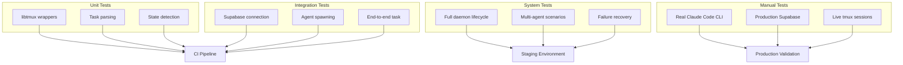
```mermaid
graph TB
    subgraph "Unit Tests"
        U1[libtmux wrappers]
        U2[Task parsing]
        U3[State detection]
    end

    subgraph "Integration Tests"
        I1[Supabase connection]
        I2[Agent spawning]
        I3[End-to-end task]
    end

    subgraph "System Tests"
        S1[Full daemon lifecycle]
        S2[Multi-agent scenarios]
        S3[Failure recovery]
    end

    subgraph "Manual Tests"
        M1[Real Claude Code CLI]
        M2[Production Supabase]
        M3[Live tmux sessions]
    end

    U1 & U2 & U3 --> CI[CI Pipeline]
    I1 & I2 & I3 --> CI

    S1 & S2 & S3 --> Staging[Staging Environment]
    M1 & M2 & M3 --> Production[Production Validation]
```

---

**Status**: DRAFT
**Version**: 0.4
**Last Updated**: 2025-11-17

**Key Enhancements in v0.4**:
- Git Worktree Management (WorktreeManager class, safety guards, lifecycle hooks)
- Quota Detection via ccusage (QuotaMonitor class, conservative fallback, quota-aware scheduling)
- Proven working code adapted from pneuma-claude-hooks and cc_automation
- Integration patterns for worktree isolation and quota management
