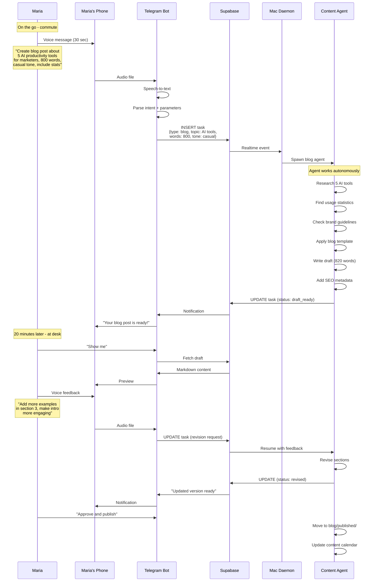
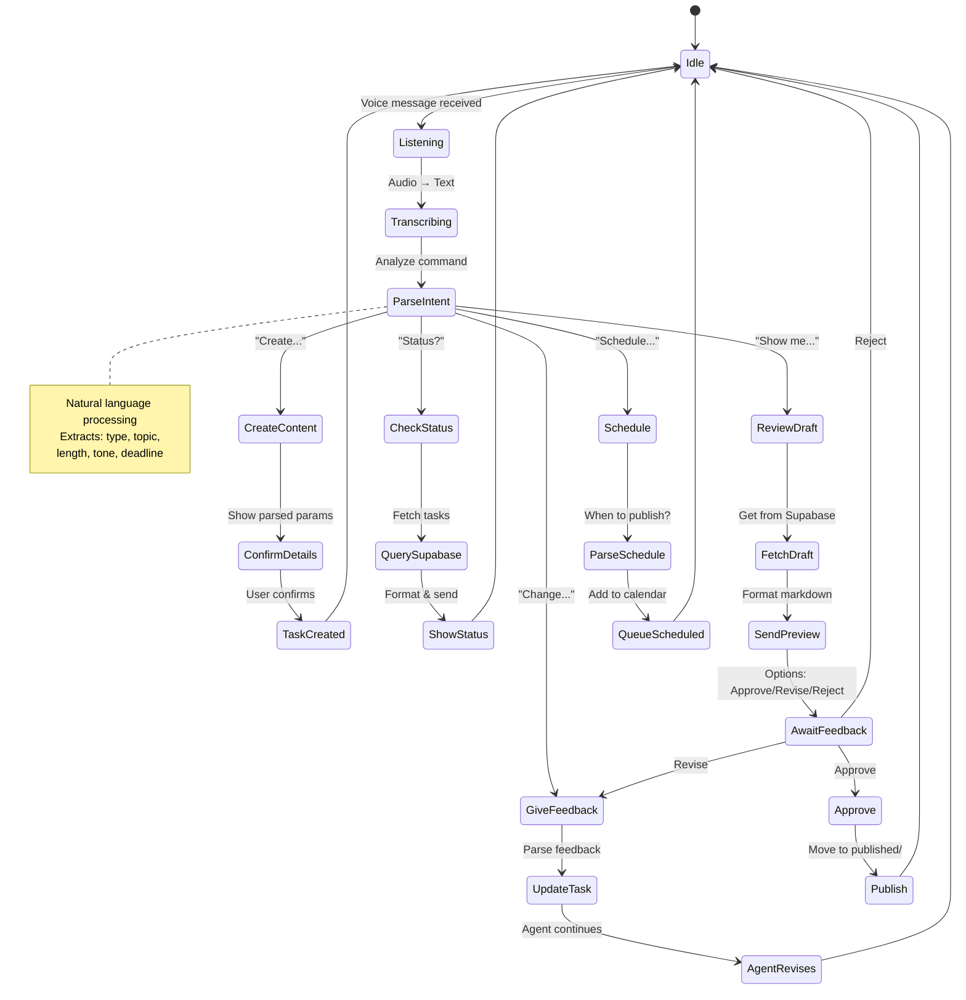
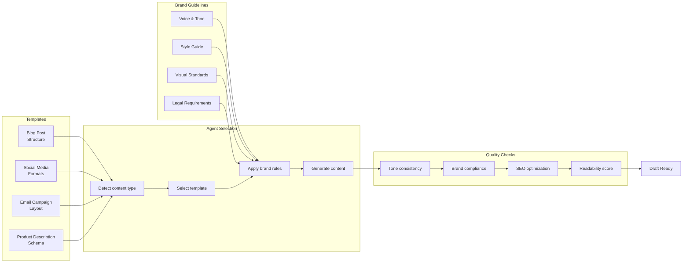
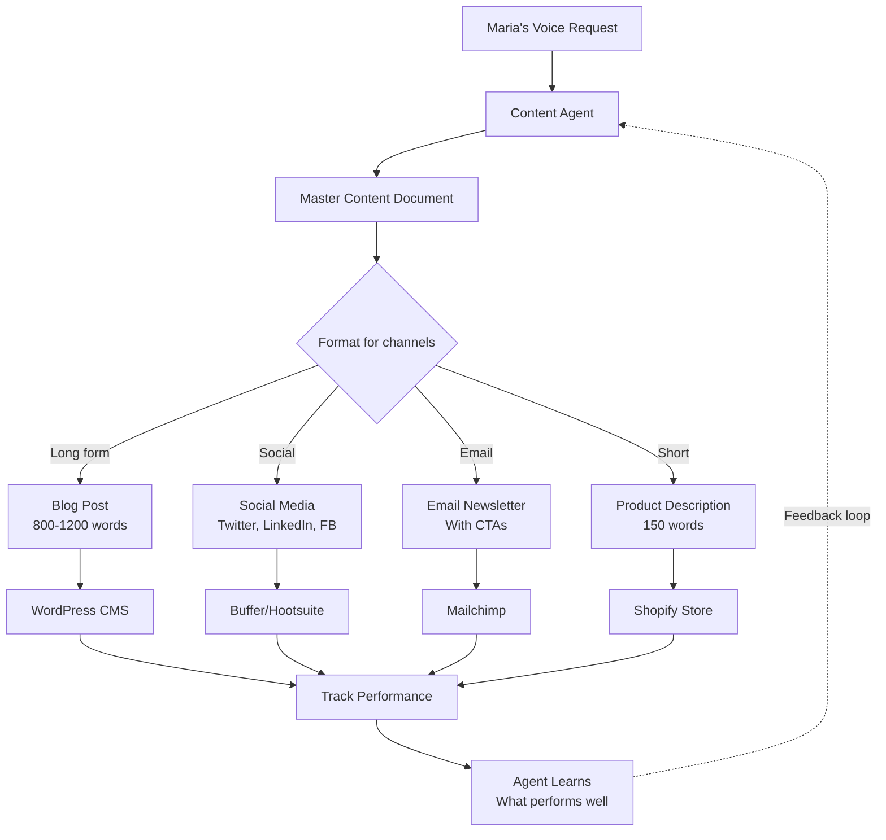
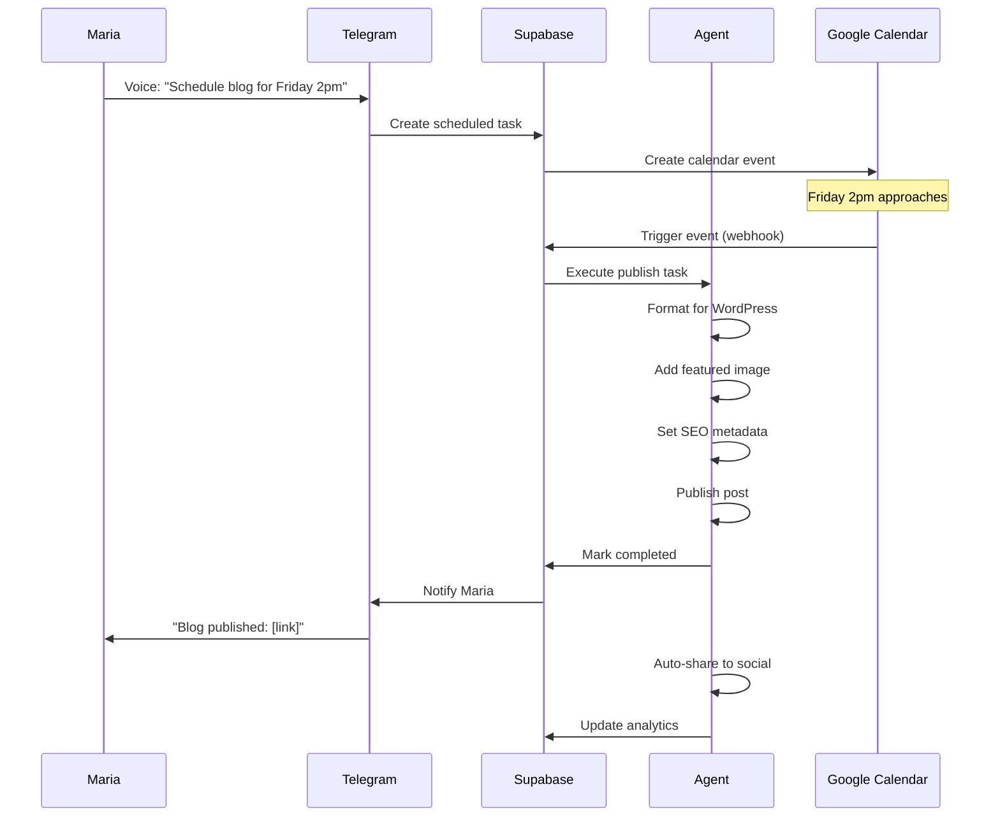
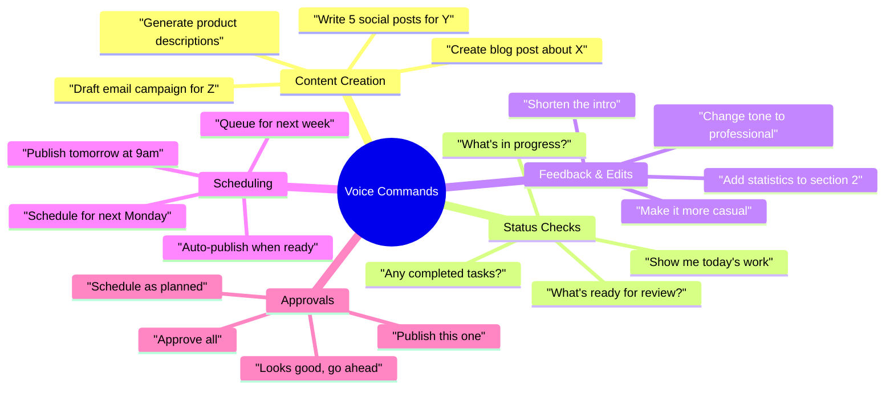
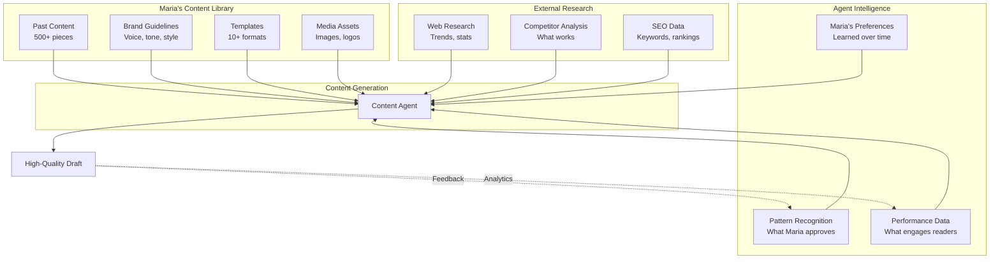
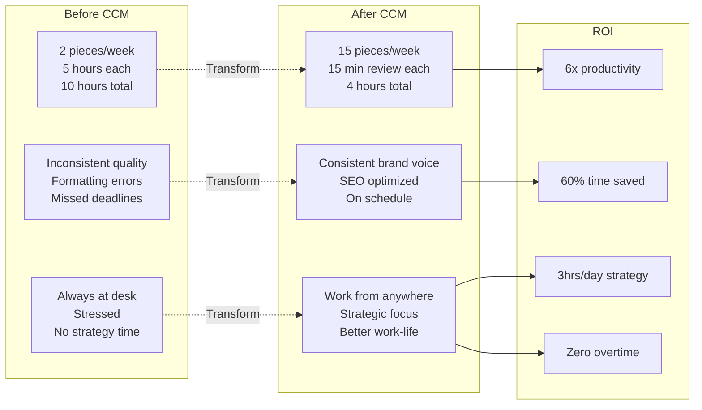
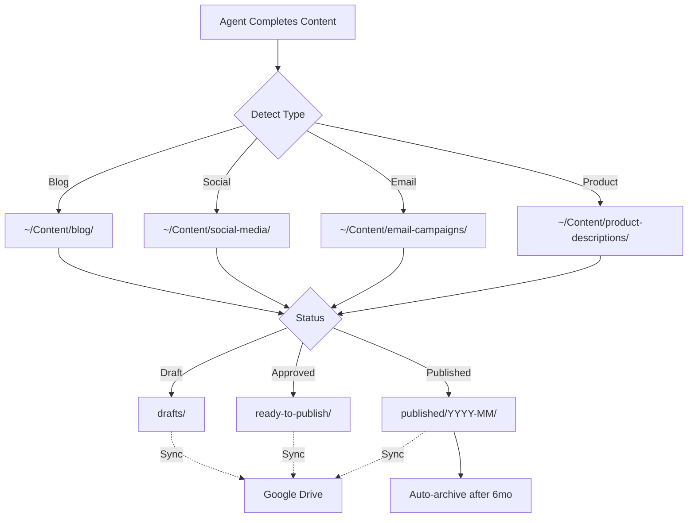

---
metadata:
  status: DRAFT
  version: 0.1
  tldr: "Business user use case - Voice-driven content creation workflows"
---

# Business User Use Case: Voice-Driven Content Automation

## Initial Setup for Non-Technical User

```mermaid
flowchart TD
    Start[Maria needs content automation] --> Colleague[Colleague helps setup]
    Colleague --> Install[Install CCM on Mac]

    Install --> Init[ccm-orchestrator init]
    Init --> Supabase[Connect to Supabase]

    Supabase --> Telegram[Setup Telegram bot]
    Telegram --> Token[Get bot token from @BotFather]
    Token --> Link[Link bot to Supabase]

    Link --> Folders[Organize content folders]
    Folders --> Brand[Add brand guidelines]
    Brand --> Templates[Add templates]

    Templates --> Test[Test with voice message]
    Test --> Success[✓ Ready to create content]

    Note over Start,Success: One-time setup<br/>30 minutes
```

## Voice-to-Content Flow



## Telegram Bot Interface States



## Content Template System



## Daily Mobile Workflow

```mermaid
journey
    title Maria's Mobile-First Day
    section Morning Commute (7:30-8:00)
      Check overnight work: 5: Maria
      Voice: 3 new blog ideas: 5: Maria
      Approve 2 completed drafts: 5: Maria
    section Coffee Break (10:30)
      Review social media drafts: 4: Maria
      Quick voice feedback: 5: Maria
      Schedule posts for afternoon: 5: Maria
    section Lunch (12:30-13:00)
      Voice: Plan next week content: 5: Maria
      Check agent progress: 5: Maria
      Revise 1 draft: 4: Maria
    section Afternoon Walk (15:00)
      Voice: 5 product descriptions needed: 5: Maria
      Approve email campaign: 5: Maria
    section Evening (18:00)
      Check completed work: 5: Maria
      Queue tomorrow's tasks: 5: Maria
      Total screen time today: 15min: 5: Maria
```

## Multi-Format Content Distribution



## Real Example: Weekly Content Batch

```mermaid
gantt
    title Maria's Week: 15 Content Pieces
    dateFormat HH:mm

    section Monday Morning
    Voice: 5 blog topics     :09:00, 5m
    Agents research         :09:05, 2h
    Agents write drafts     :11:05, 3h

    section Monday Afternoon
    Maria reviews (mobile)  :14:00, 30m
    Voice feedback          :14:30, 10m
    Agents revise           :14:40, 1h

    section Monday EOD
    Approve 3 blogs         :17:00, 15m
    Queue social posts      :17:15, 10m

    section Tuesday
    Agents create social    :09:00, 2h
    Maria approves          :12:00, 20m

    section Wednesday
    Voice: 2 email campaigns :09:00, 5m
    Agents write emails     :09:05, 3h
    Review & approve        :15:00, 30m

    section Thursday
    Voice: 5 product descriptions :10:00, 5m
    Agents write            :10:05, 1h
    Quick review            :14:00, 15m

    section Friday
    Final reviews           :10:00, 30m
    Schedule next week      :11:00, 20m
    Total Maria time        :milestone, 12:00, 0m
```

## Content Calendar Integration



## Feedback & Revision Loop

```mermaid
flowchart TD
    Draft[Agent Creates Draft] --> Notify[Notify Maria]
    Notify --> Review{Maria Reviews}

    Review -->|Approve| Publish[Publish Immediately]
    Review -->|Minor Changes| QuickFix[Voice Quick Feedback]
    Review -->|Major Changes| DetailedFeedback[Detailed Instructions]

    QuickFix --> Parse1[Parse feedback]
    Parse1 --> Revise1[Agent revises]
    Revise1 --> Notify

    DetailedFeedback --> Parse2[Parse requirements]
    Parse2 --> Research[Agent researches]
    Research --> Revise2[Agent rewrites]
    Revise2 --> Notify

    Publish --> Analytics[Track Performance]
    Analytics --> Learn[Learning Database]

    Learn -.->|Improve next time| Draft

    Note over Review,Publish: 90% approved<br/>on first review
```

## Voice Command Examples



## Agent Knowledge Sources



## Success Metrics Tracking



## Content Folder Auto-Organization



---

**Status**: DRAFT
**Version**: 0.1
**Last Updated**: 2025-11-17
