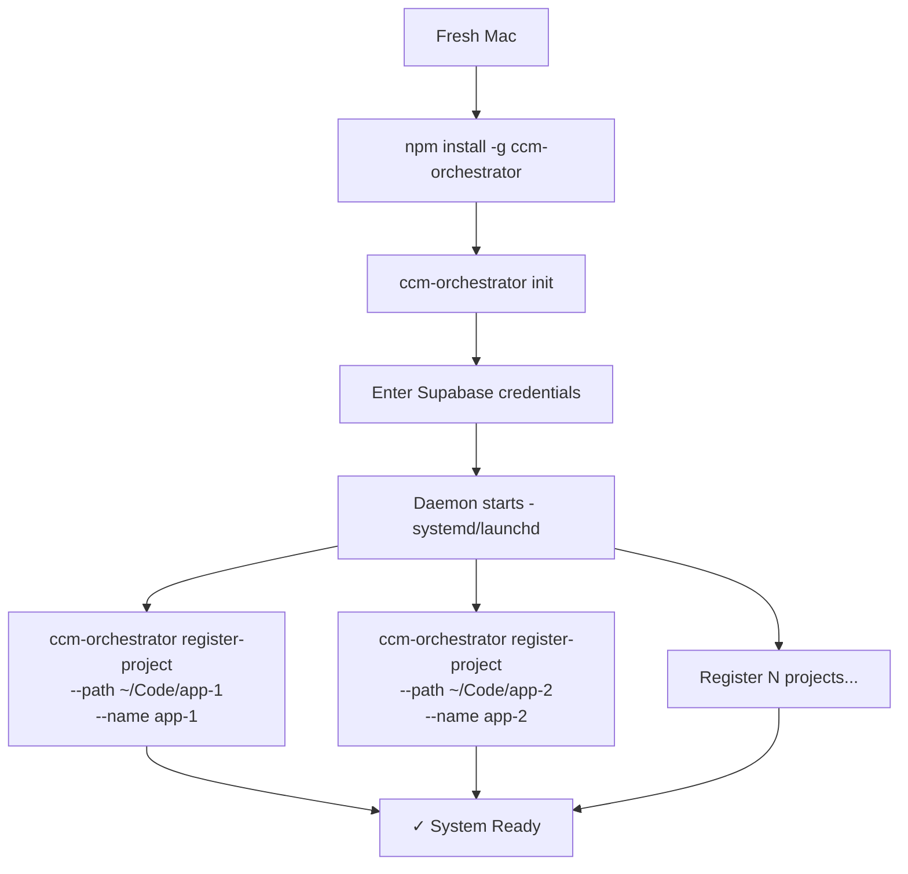
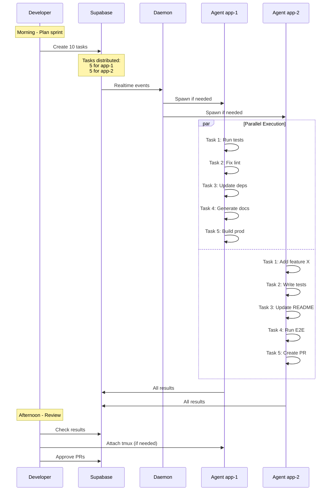
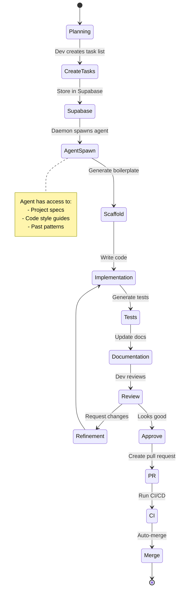
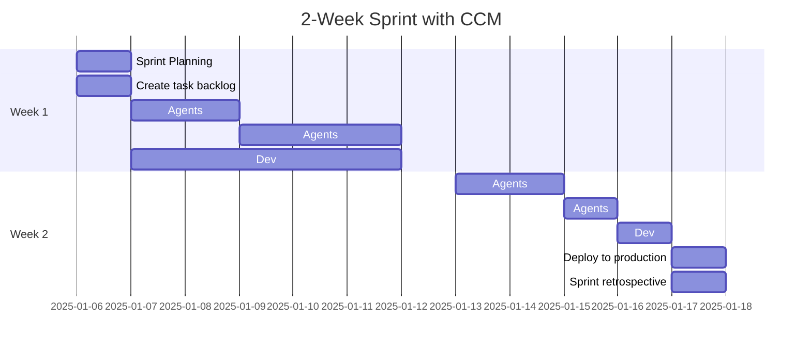
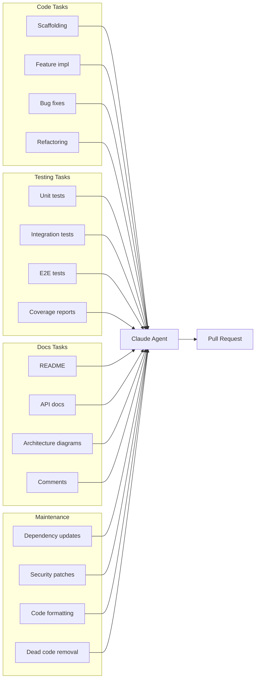
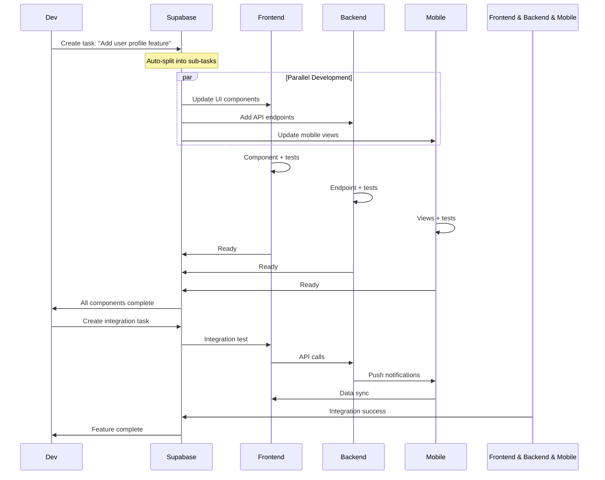
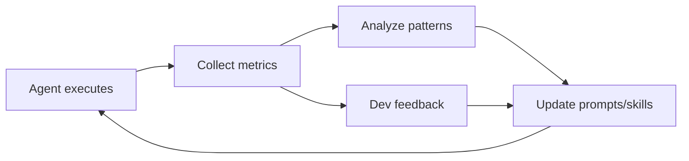
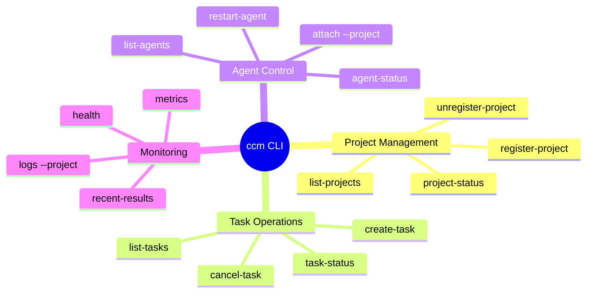
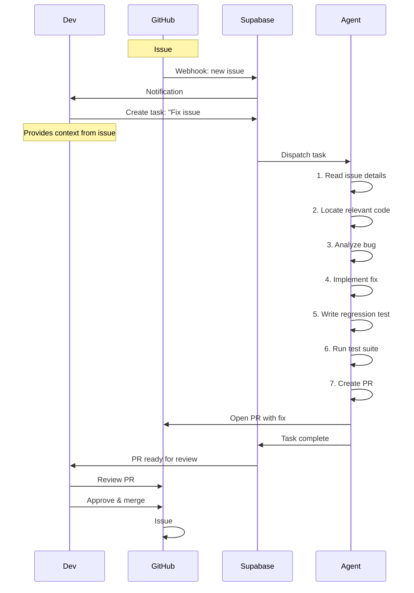
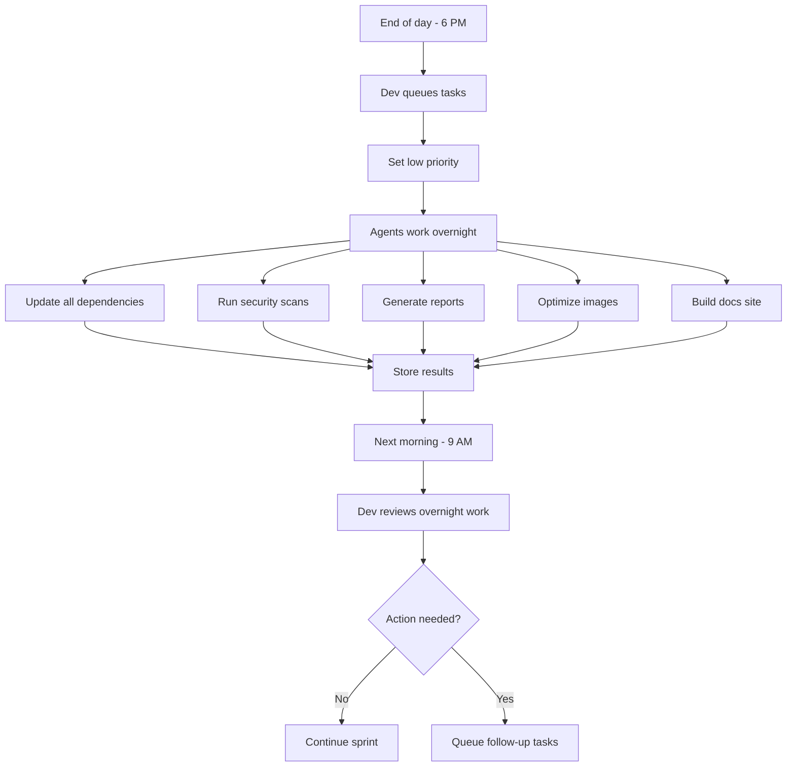

---
metadata:
  status: DRAFT
  version: 0.1
  tldr: "Developer use case - Autonomous project execution workflows"
---

# Developer Use Case: Autonomous Project Execution

## Initial Setup



## Daily Workflow



## Feature Development Flow



## Sprint Automation



## Task Types & Execution



## Multi-Repo Coordination



## GitHub Integration

```mermaid
flowchart TD
    Push[Git push] -->|Webhook| API[CCM API]
    API --> Task[Create task: "Run CI"]

    Task --> Agent[Spawn agent]
    Agent --> Tests[Run test suite]
    Tests --> Build[Build artifacts]
    Build --> Deploy[Deploy staging]

    Deploy --> Success{Success?}
    Success -->|Yes| PR[Update PR status ✓]
    Success -->|No| Comment[Comment on PR ✗]

    PR --> Review[Dev reviews]
    Comment --> Fix[Agent attempts fix]
    Fix --> Tests
```

## Continuous Improvement Loop



## CLI Commands for Developers



## Real Example: Bug Fix



## Overnight Batch Processing



---

**Status**: DRAFT
**Version**: 0.1
**Last Updated**: 2025-11-17