---
metadata:
  status: DRAFT
  version: 0.1
  tldr: "DevOps use case - Server fleet monitoring and auto-remediation workflows"
---

# DevOps Use Case: Fleet Management & Auto-Remediation

## Fleet Setup & Registration

## Alert-to-Remediation Flow

## Auto-Remediation Decision Tree

## Multi-Server Task Distribution

## Incident Response Timeline

```mermaid
gantt
    title Incident: Database Slow Queries
    dateFormat HH:mm

    section Detection
    Alert fires                 :milestone, 02:15, 0m
    Webhook to Supabase        :02:15, 10s

    section Agent Investigation
    Spawn agent                :02:15, 2s
    Check slow query log       :02:15, 15s
    Analyze query patterns     :02:16, 30s
    Identify missing index     :02:16, 20s

    section Auto-Remediation
    Check pattern confidence   :02:17, 5s
    Match known fix (>90%)     :02:17, 2s
    Create index               :02:17, 45s
    Verify query speed         :02:18, 20s

    section Reporting
    Update Supabase           :02:18, 5s
    Resolve alert             :02:18, 5s
    Notify Jordan (summary)   :02:19, 1s

    section Human Review
    Jordan reviews in AM       :09:00, 10m
```

## Knowledge Base Learning Loop

## Monitoring Stack Integration

## Batch Maintenance Operations

## Real Example: Memory Leak Detection

## Fleet Health Dashboard Data Flow

## Compliance & Audit Trail

---

**Status**: DRAFT
**Version**: 0.1
**Last Updated**: 2025-11-17
