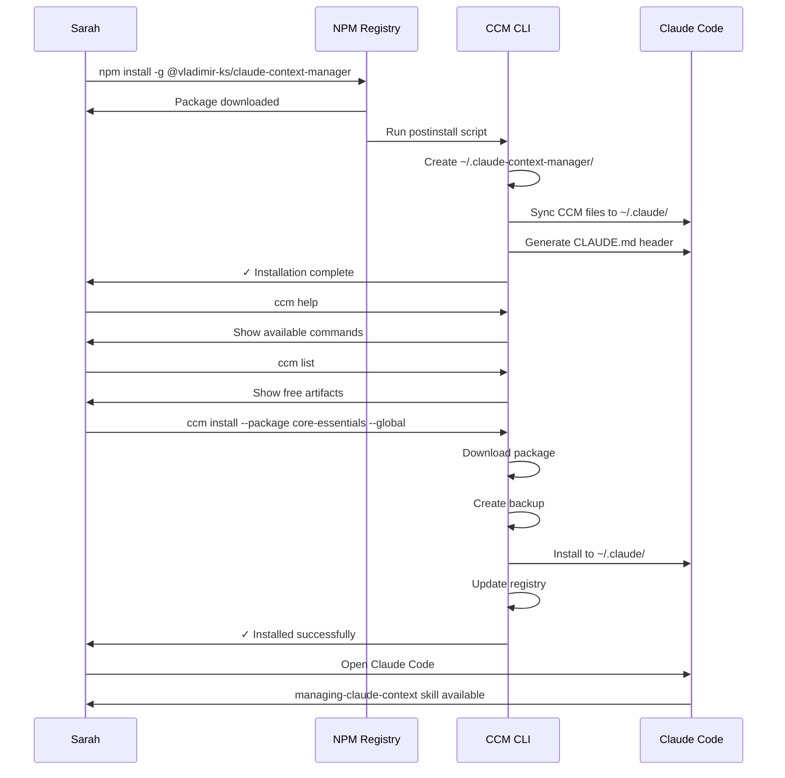
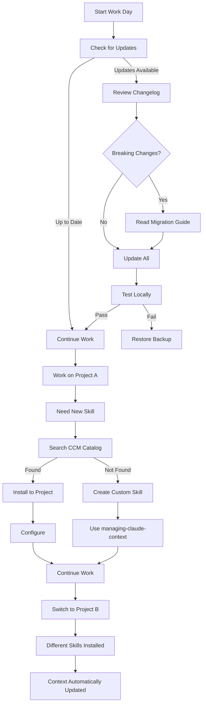
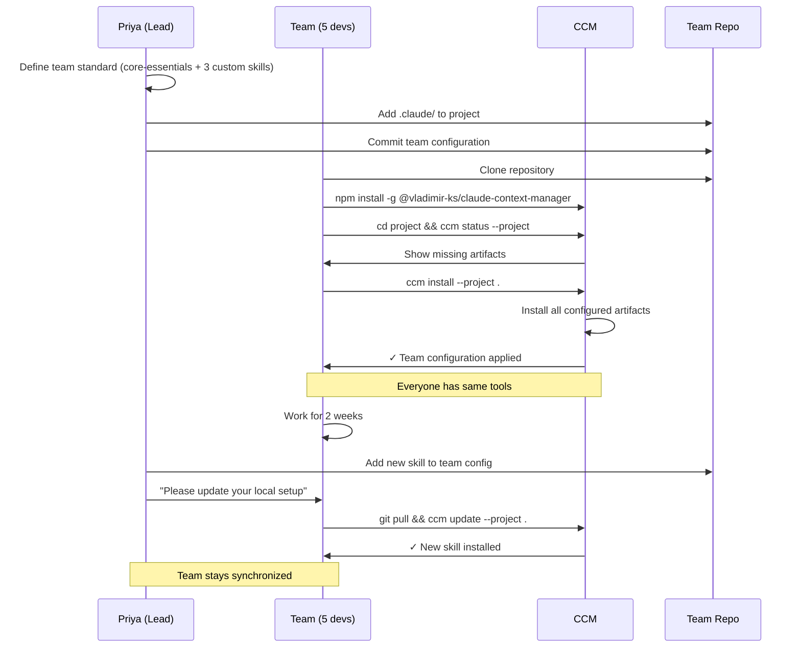
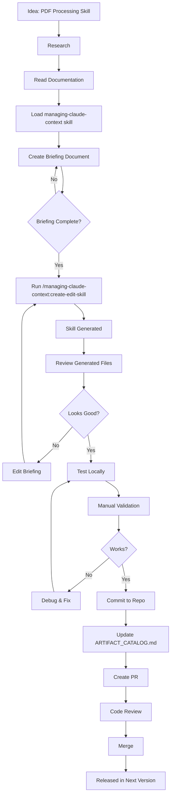

# User Journeys

User personas and their workflows with Claude Context Manager.

## Personas

### 1. **New User (Casual Developer)**
**Name:** Sarah
**Background:** Frontend developer, new to Claude Code
**Goal:** Get started with core functionality
**Technical Level:** Intermediate developer
**Pain Points:** Overwhelming options, unclear value proposition

### 2. **Power User (Professional Developer)**
**Name:** Marcus
**Background:** Full-stack developer, experienced with CLI tools
**Goal:** Maximize productivity with advanced features
**Technical Level:** Expert developer
**Pain Points:** Manual workflows, lack of automation

### 3. **Team Lead (Manager)**
**Name:** Priya
**Background:** Engineering manager, 5-person team
**Goal:** Standardize team workflows
**Technical Level:** Technical manager
**Pain Points:** Inconsistent tooling, onboarding overhead

### 4. **Contributor (Open Source Developer)**
**Name:** Alex
**Background:** Open source contributor, context engineering enthusiast
**Goal:** Create and share custom skills
**Technical Level:** Expert developer
**Pain Points:** Complex creation process, lacking documentation

---

## Journey 1: New User - First Installation

**Persona:** Sarah (Casual Developer)
**Scenario:** Installing CCM for the first time

### Steps



### Touchpoints & Emotions

| Step | Touchpoint | Emotion | Notes |
|------|-----------|---------|-------|
| 1 | NPM install | 😐 Neutral | Standard process |
| 2 | Postinstall runs | 🤔 Curious | "What's happening?" |
| 3 | Files created | 😊 Positive | Visual feedback |
| 4 | `ccm help` | 😃 Confident | Clear options |
| 5 | `ccm list` | 🤩 Excited | "So many options!" |
| 6 | Install core-essentials | 😌 Satisfied | Easy process |
| 7 | Use in Claude Code | 🎉 Delighted | Works immediately |

### Pain Points

- **Information Overload:** Too many commands in help
- **Unclear Next Steps:** After install, what now?
- **Value Unclear:** Why use this vs manual setup?

### Solutions

- ✅ `ccm help` shows concise summary
- ✅ Post-install message: "Run 'ccm install --package core-essentials --global'"
- ✅ README clearly explains value proposition

---

## Journey 2: Power User - Daily Workflow

**Persona:** Marcus (Professional Developer)
**Scenario:** Managing multiple projects with custom skills

### Steps



### Daily Commands

```bash
# Morning routine
ccm notifications check
ccm status --global

# Per-project work
cd ~/projects/project-a
ccm status --project .
ccm install --skill specialized-skill --project

# Afternoon - different project
cd ~/projects/project-b
ccm status --project .
# Different skills active automatically

# End of day
ccm update --all --global  # Keep global tools updated
```

### Touchpoints & Emotions

| Step | Touchpoint | Emotion | Notes |
|------|-----------|---------|-------|
| Morning check | `ccm notifications` | 😊 Informed | Knows what's new |
| Update | `ccm update --all` | 😌 Confident | Trust automated backup |
| New skill needed | `ccm search` | 🤔 Searching | Finds quickly |
| Install to project | `--project` flag | 😃 Efficient | Project-specific config |
| Switch projects | Automatic context | 🎯 Focused | No manual switching |

### Pain Points

- **Update Disruption:** Updates mid-project risky
- **Skill Discovery:** Hard to find right skill
- **Multi-Project:** Managing different configs

### Solutions

- ✅ Automatic backups before updates
- ✅ `ccm restore` for quick rollback
- ✅ `ccm search` with descriptions
- ✅ Project-specific installations

---

## Journey 3: Team Lead - Team Onboarding

**Persona:** Priya (Engineering Manager)
**Scenario:** Onboarding 5 developers to standardized tooling

### Steps



### Team Setup Checklist

```markdown
## Priya's Onboarding Checklist

### Pre-Onboarding
- [ ] Define team standard artifacts
- [ ] Install CCM globally: `npm install -g @vladimir-ks/claude-context-manager`
- [ ] Test configuration locally

### Repository Setup
- [ ] Install team artifacts to project: `ccm install --skill X --project`
- [ ] Commit `.claude/` directory
- [ ] Add `.claude-context-manager/` to `.gitignore`
- [ ] Document in README:
  ```markdown
  ## Setup
  1. Install CCM: `npm install -g @vladimir-ks/claude-context-manager`
  2. Install project tools: `ccm install --project .`
  ```

### Team Onboarding
- [ ] Share setup instructions
- [ ] Verify each team member installs CCM
- [ ] Verify each team member runs `ccm install --project`
- [ ] Confirm everyone sees same skills in Claude Code

### Ongoing Maintenance
- [ ] Weekly: Check for CCM updates (`ccm notifications`)
- [ ] Monthly: Review team artifact configuration
- [ ] As needed: Add new artifacts to project
```

### Touchpoints & Emotions

| Step | Touchpoint | Emotion | Notes |
|------|-----------|---------|-------|
| Define standard | Planning | 🤔 Thoughtful | Important decision |
| Configure repo | Setup | 😊 Organized | Clean structure |
| Team install | Onboarding | 😌 Smooth | Just works™ |
| Everyone aligned | Daily use | 🎯 Productive | No config drift |
| Add new tool | Update | 😃 Easy | One command |

### Pain Points

- **Configuration Drift:** Team members have different tools
- **Onboarding Time:** Each person configures manually
- **Update Coordination:** "Everyone please update"

### Solutions

- ✅ Project-specific `.claude/` committed to git
- ✅ Single command: `ccm install --project`
- ✅ Automatic synchronization via git pull

---

## Journey 4: Contributor - Creating Custom Skill

**Persona:** Alex (Open Source Developer)
**Scenario:** Creating a new skill for the community

### Steps



### Creation Workflow

```bash
# Step 1: Load primary skill
# In Claude Code, use Skill tool: "managing-claude-context"

# Step 2: Create briefing (Markdown or JSON)
cat > briefing.md <<EOF
# PDF Processing Skill Briefing

## Purpose
Advanced PDF operations including OCR, form filling, and security.

## Target User
Developers working with PDF automation.

## Core Capabilities
1. Extract text from PDFs (with OCR)
2. Fill PDF forms programmatically
3. Merge/split PDFs
4. Add/remove security

## Dependencies
- pdf-lib library
- tesseract.js for OCR

## Progressive Disclosure
- QUICK_START.md (basic operations)
- SKILL.md (comprehensive guide)
- references/ocr-guide.md (advanced OCR)
- references/security-guide.md (PDF security)
EOF

# Step 3: Run creation command
# In Claude Code: /managing-claude-context:create-edit-skill briefing.md

# Step 4: Review generated files
ls -la .claude/skills/pdf-processing/
# SKILL.md
# QUICK_START.md
# references/
# manuals/

# Step 5: Test locally
# Use the skill in Claude Code, verify functionality

# Step 6: Commit
git add .claude/skills/pdf-processing/
git commit -m "Add: PDF processing skill"

# Step 7: Update catalog
echo "- pdf-processing (v0.1.0) - Advanced PDF operations" >> ARTIFACT_CATALOG.md
git add ARTIFACT_CATALOG.md
git commit -m "Update: Add pdf-processing to catalog"

# Step 8: Create PR
git push origin feature/pdf-processing-skill
gh pr create --title "Add: PDF processing skill" --body "..."
```

### Touchpoints & Emotions

| Step | Touchpoint | Emotion | Notes |
|------|-----------|---------|-------|
| Idea | Inspiration | 🤩 Excited | "This would be useful!" |
| Read docs | Documentation | 🤔 Learning | Clear process |
| Create briefing | Planning | 😊 Organized | Structured approach |
| Generate skill | Automation | 😲 Amazed | "It works!" |
| Review | Validation | 🧐 Critical | Check quality |
| Test | Verification | 😌 Confident | Functions correctly |
| Commit | Contribution | 🎉 Proud | Giving back |

### Pain Points

- **Complex Process:** Many steps to create skill
- **Documentation Heavy:** Need to write lots of docs
- **Quality Uncertainty:** Is this good enough?

### Solutions

- ✅ `managing-claude-context` automates structure
- ✅ Templates and examples provided
- ✅ Validation checklist in documentation
- ✅ Code review catches issues

---

## Success Metrics

### New User (Sarah)

**Goals:**
- Install CCM within 5 minutes
- Understand value proposition
- Successfully install core-essentials

**Metrics:**
- Time to first install: < 10 minutes
- Completion rate: > 80%
- Support tickets: < 5% of installs

### Power User (Marcus)

**Goals:**
- Efficient daily workflow
- Quick skill discovery
- Reliable updates

**Metrics:**
- Daily active commands: 5-10
- Update success rate: > 95%
- Restore usage: < 5% (rare failures)

### Team Lead (Priya)

**Goals:**
- Fast team onboarding
- Consistent team configuration
- Low maintenance overhead

**Metrics:**
- Onboarding time per developer: < 15 minutes
- Configuration drift: 0% (via git)
- Update coordination time: < 5 minutes/month

### Contributor (Alex)

**Goals:**
- Create high-quality skills
- Share with community
- Get feedback

**Metrics:**
- Skill creation time: < 4 hours (first skill)
- Quality score: > 4/5 (reviewer rating)
- Community adoption: > 10 installs/month

---

## Improvement Opportunities

### Identified Pain Points

1. **Information Overload** (New Users)
   - Too many commands shown
   - Unclear prioritization
   - **Solution:** Interactive onboarding wizard

2. **Skill Discovery** (Power Users)
   - Search only by name
   - No categories or tags
   - **Solution:** Enhanced search with filters

3. **Team Coordination** (Team Leads)
   - Manual "please update" messages
   - No visibility into team status
   - **Solution:** Team dashboard (future)

4. **Creation Complexity** (Contributors)
   - Steep learning curve
   - Heavy documentation burden
   - **Solution:** Interactive creation wizard

---

**Last Updated:** 2025-11-21
**Author:** Vladimir K.S.
