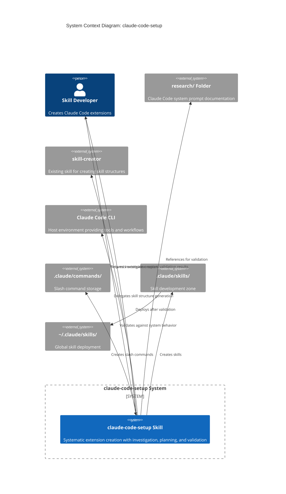

# C1: System Context - claude-code-setup

## Overview

This diagram shows the **claude-code-setup** system in its environment, including external actors, systems, and data flows.

## System Context Diagram



## External Actors

### Skill Developer (Human)

**Who:** Vladimir K.S. (primary), future skill developers

**Interactions:**
- Requests creation of commands, skills, or agents
- Reviews investigation reports
- Confirms intentional contradictions
- Validates generated extensions

**Goals:**
- Create high-quality extensions
- Ensure compliance with system standards
- Avoid contradictions with Claude Code behavior
- Follow SDD/BDD/TDD methodology

---

## External Systems

### research/ Folder

**Type:** Documentation Repository

**Purpose:** Single source of truth for Claude Code system prompt knowledge

**Contents:**
- `claude-code-system-prompt/` - System prompt components
- `claude-code-cli-tools.md` - Tool specifications
- `workflow-protocols.md` - Git, testing, workflow patterns
- `agent-architecture.md` - Agent usage patterns

**Interaction:**
- **Investigation Phase:** Referenced to find patterns and constraints
- **Validation Phase:** Cross-referenced to detect contradictions

**Criticality:** HIGH - Primary validation source

---

### skill-creator

**Type:** External Skill (Existing)

**Purpose:** Generate skill directory structures with proper frontmatter

**Capabilities:**
- Initialize skill structure (Simple/Medium/Full)
- Generate frontmatter
- Create reference documents
- Validate structure

**Interaction:**
- claude-code-setup delegates to skill-creator for skill generation
- Receives generated structure
- Validates output for methodology compliance

**Delegation Pattern:**
```
claude-code-setup (investigates + plans)
    ↓
skill-creator (generates structure)
    ↓
claude-code-setup (validates + ensures SDD/BDD/TDD)
```

---

### Claude Code CLI

**Type:** Host Environment

**Purpose:** Provides tools, workflows, and runtime for skills

**Capabilities:**
- Tool execution (Read, Write, Edit, Bash, Grep, etc.)
- Skill invocation
- Command expansion
- Agent orchestration
- Hook system

**Interaction:**
- claude-code-setup validates prompts against Claude Code behaviors
- Ensures generated extensions use tools correctly
- Follows workflow protocols (git, commits, TodoWrite)

**Validation Against:**
- Tool usage patterns
- Workflow requirements
- Hook behaviors
- System constraints

---

### .claude/commands/

**Type:** File System Directory

**Purpose:** Storage for slash commands

**Structure:**
```
.claude/commands/
├── command-name.md
└── another-command.md
```

**Interaction:**
- claude-code-setup creates command files here
- Simple markdown format (no frontmatter)
- Commands available project-wide after creation

---

### .claude/skills/

**Type:** File System Directory (Development Zone)

**Purpose:** Local skill development and testing

**Structure:**
```
.claude/skills/
├── skill-name/
│   ├── SKILL.md
│   ├── references/
│   └── scripts/
└── another-skill/
```

**Interaction:**
- claude-code-setup creates skills here for testing
- Skills tested locally before global deployment
- Version controlled

---

### ~/.claude/skills/

**Type:** File System Directory (Global)

**Purpose:** Global skill deployment

**Access:** All Claude Code sessions system-wide

**Interaction:**
- Skills deployed here after validation
- Symlink or copy from `.claude/skills/`
- Production environment

---

## Data Flows

### 1. Extension Creation Request

```
Developer → claude-code-setup
    Input: "I want to create X to do Y"
    Flow: Investigation → Planning → Validation → Generation
    Output: Created extension
```

### 2. Investigation Phase

```
claude-code-setup → research/ Folder
    Query: What patterns exist? What constraints apply?
    Response: System prompt references, tool specs, examples
    Output: Investigation Report
```

### 3. Skill Generation (Delegation)

```
claude-code-setup → skill-creator
    Input: Skill specifications
    Process: skill-creator generates structure
    Output: Skill directory with files
claude-code-setup validates output
```

### 4. Validation Phase

```
claude-code-setup ← research/ (system prompt docs)
claude-code-setup ← Claude Code CLI (behavior specs)
    Process: Cross-reference, detect contradictions
    Output: Validation Report
```

### 5. Deployment

```
.claude/skills/ → ~/.claude/skills/
    Trigger: After validation passes
    Method: Copy or symlink
    Result: Global availability
```

---

## System Boundaries

### Inside claude-code-setup

- Investigation engine
- Planning framework
- Validation engine
- Contradiction detector
- Extension generators (command/skill/agent)

### Outside (Dependencies)

- research/ folder (documentation)
- skill-creator (structure generation)
- Claude Code CLI (runtime environment)
- File system (storage)

---

## Key Interactions Summary

| From | To | Purpose | Data |
|------|-----|---------|------|
| Developer | claude-code-setup | Request extension | Intent description |
| claude-code-setup | research/ | Validate | System prompt docs |
| claude-code-setup | skill-creator | Generate skill | Specifications |
| claude-code-setup | .claude/commands/ | Create command | Markdown file |
| claude-code-setup | .claude/skills/ | Create skill | Skill directory |
| claude-code-setup | Developer | Report | Investigation, validation results |

---

## Non-Functional Requirements (Context)

### Performance

- Investigation: <5 minutes
- Planning: <10 minutes
- Validation: <3 minutes
- Generation: <2 minutes

### Reliability

- 100% validation coverage
- Zero unintentional contradictions
- All files created with correct structure

### Usability

- Clear investigation reports
- Understandable validation results
- Actionable error messages

### Maintainability

- Modular components (investigation, planning, validation, generation)
- Extensible for new extension types
- Updatable when research/ changes

---

## Future Context Expansion

### Potential External Systems (Future Versions)

- **MCP Server Registry** - For MCP server creation
- **Extension Marketplace** - For sharing extensions
- **Testing Framework** - For automated extension testing
- **CI/CD Integration** - For automated validation

### Potential New Actors

- **Team Members** - Multi-user collaboration
- **Extension Consumers** - Users of created extensions
- **Automated Validators** - CI/CD validation bots

---

## Context Evolution

**Current State (v0.1):**
- Single developer (Vladimir K.S.)
- Local development
- Manual workflows

**Target State (v1.0):**
- Systematic extension creation
- Automated validation
- Methodology compliance

**Future State (v2.0+):**
- Team collaboration
- Extension marketplace
- Automated testing
- CI/CD integration

---

## References

- [02_PRD.md](./01_PRD.md) - Product requirements
- [C2_Container_Diagram.md](./C2_Container_Diagram.md) - Internal architecture
- [../01_SPECS/](../01_SPECS/) - Detailed specifications
