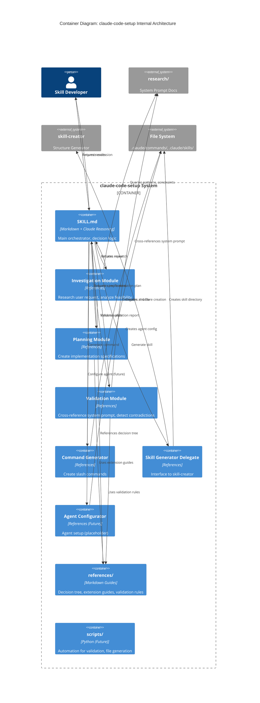

# C2: Container Diagram - claude-code-setup

## Overview

This diagram shows the major technology containers within the claude-code-setup system and how they interact.

## Container Diagram



## Containers

### SKILL.md (Orchestrator)

**Technology:** Markdown + Claude's natural language reasoning

**Purpose:** Main entry point and workflow coordinator

**Responsibilities:**
- Receive user requests
- Coordinate investigation → planning → validation → generation flow
- Make decisions based on investigation/validation results
- Handle contradiction resolution
- Report progress to user

**Key Logic:**
1. Parse user intent
2. Invoke investigation module
3. Review findings with user
4. Invoke planning module
5. Invoke validation module
6. Handle contradictions (confirm with user if intentional)
7. Invoke appropriate generator
8. Report results

**File:** `.claude/skills/claude-code-setup/SKILL.md`

---

### Investigation Module

**Technology:** Markdown references + Claude reasoning

**Purpose:** Research user request and analyze feasibility

**Responsibilities:**
- Understand user intent
- Determine extension type (command/skill/agent)
- Query research/ folder for patterns
- Identify constraints from system prompt
- Analyze feasibility
- Produce investigation report

**Inputs:**
- User request description
- references/decision-tree.md
- research/ folder contents

**Outputs:**
- Investigation Report with:
  - User intent analysis
  - Recommended extension type
  - Relevant system prompt sections
  - Constraints and limitations
  - Similar patterns
  - Next steps

**Files:** `references/investigation-guide.md`

---

### Planning Module

**Technology:** Markdown references + Claude reasoning

**Purpose:** Create detailed implementation specifications

**Responsibilities:**
- Design file structure
- Specify frontmatter (if skill)
- Plan content sections
- Define tool usage patterns
- Create validation checklist
- Document integration points

**Inputs:**
- Investigation report
- references/commands-guide.md (if command)
- references/skills-guide.md (if skill)
- references/agents-guide.md (if agent)

**Outputs:**
- Implementation Plan with:
  - File structure
  - Frontmatter schema
  - Content sections
  - Tool usage specifications
  - Validation checklist
  - Known/expected contradictions

**Files:** `references/planning-guide.md`

---

### Validation Module

**Technology:** Markdown references + Claude reasoning + research/ cross-reference

**Purpose:** Validate plans against system prompt, detect contradictions

**Responsibilities:**
- Cross-reference implementation plan against research/
- Validate tool usage patterns
- Check workflow compliance (git, TodoWrite, etc.)
- Detect contradictions
- Categorize: Unintentional (error) vs Intentional (necessary)
- Flag violations

**Validation Checks:**
1. **Tool Usage** - Against `research/claude-code-cli-tools.md`
2. **Workflows** - Against `research/workflow-protocols.md`
3. **Agents** - Against `research/agent-architecture.md`
4. **System Prompt** - Against `research/claude-code-system-prompt/`

**Contradiction Detection:**
- Compare prompt instructions vs system prompt requirements
- Flag any conflicts
- Determine if intentional or unintentional
- Require confirmation for intentional

**Inputs:**
- Implementation plan
- references/validation-rules.md
- research/ folder (all docs)

**Outputs:**
- Validation Report with:
  - ✅ Passed checks
  - ⚠️ Warnings (acceptable conflicts)
  - ❌ Failed checks (must fix)
  - Contradictions requiring confirmation
  - Recommendation (approve/fix/confirm)

**Files:** `references/validation-engine.md`

---

### Command Generator

**Technology:** Markdown references + file creation logic

**Purpose:** Create slash commands

**Responsibilities:**
- Generate `.claude/commands/name.md` file
- Write prompt content
- Follow naming conventions
- No frontmatter (commands are simple)

**Inputs:**
- Validated implementation plan
- Command specifications

**Outputs:**
- Single markdown file in `.claude/commands/`

**Template:**
```markdown
# Command Name

[Description]

[Prompt text]

## Examples
[Usage examples]
```

**Files:** `references/command-generator.md`

---

### Skill Generator Delegate

**Technology:** Interface to skill-creator + validation logic

**Purpose:** Delegate skill creation to skill-creator, ensure methodology compliance

**Responsibilities:**
- Prepare specifications for skill-creator
- Invoke skill-creator for structure generation
- Receive generated structure
- Validate output for:
  - Proper frontmatter
  - Complexity-appropriate structure (Simple/Medium/Full)
  - SDD/BDD/TDD compliance
- Ensure specs/tests created when needed

**Delegation Flow:**
```
1. claude-code-setup: Investigate + Plan
2. skill-creator: Generate structure
3. claude-code-setup: Validate + Ensure methodology
```

**Inputs:**
- Validated implementation plan
- Skill specifications

**Outputs:**
- Skill directory in `.claude/skills/`
- Validation confirmation

**Files:** `references/skill-delegator.md`

---

### Agent Configurator

**Technology:** Markdown references (placeholder)

**Purpose:** Configure agents (future)

**Status:** Research phase - agents not fully documented

**Responsibilities (Future):**
- Create agent configuration
- Define agent prompts
- Specify tool access
- Set autonomy levels

**Current Approach:**
- Document agent use cases
- Reference `research/agent-architecture.md`
- Placeholder for when API stabilizes

**Files:** `references/agent-configurator.md` (future)

---

### references/ (Reference Documents)

**Technology:** Markdown guides

**Purpose:** Detailed guides for each module

**Contents:**
- `decision-tree.md` - Logic for choosing extension type
- `investigation-guide.md` - How to research requests
- `planning-guide.md` - How to create implementation plans
- `validation-engine.md` - Validation rules and patterns
- `validation-rules.md` - Specific validation checks
- `commands-guide.md` - Command creation details
- `skills-guide.md` - Skill creation details
- `agents-guide.md` - Agent configuration details
- `command-generator.md` - Command generation logic
- `skill-delegator.md` - skill-creator delegation interface
- `contradiction-handling.md` - How to handle contradictions
- `examples/` - Real-world examples

**Access:** Read by orchestrator and modules as needed

---

### scripts/ (Automation Scripts)

**Technology:** Python (future)

**Purpose:** Automation for validation and file generation

**Future Contents:**
- `validate_extension.py` - Automated validation runner
- `detect_contradictions.py` - Automated contradiction detection
- `generate_command.py` - Command file generator
- `generate_frontmatter.py` - Frontmatter generator

**Current State:** Placeholder - v1.0 uses Claude reasoning

---

## Technology Choices

### Why Markdown + Claude Reasoning?

**Advantages:**
- Leverages Claude's natural language understanding
- Easy to read and modify
- No additional dependencies
- Version controllable
- Fast iteration

**Trade-offs:**
- Less deterministic than code
- Requires careful prompting
- No automated testing (initially)

**Future Evolution:**
- Add Python scripts for deterministic validation
- Keep markdown for guides and human-readable specs

---

### Why Delegate to skill-creator?

**Advantages:**
- DRY - don't duplicate skill structure logic
- Leverage existing, tested functionality
- Focus claude-code-setup on methodology enforcement

**Trade-offs:**
- Dependency on skill-creator
- Must validate skill-creator output

**Alternative Considered:**
- All-in-one skill generation
- Rejected: Too much duplication

---

## Data Flow Between Containers

### 1. Investigation Flow

```
Developer → SKILL.md → Investigation Module
Investigation Module → references/decision-tree.md
Investigation Module → research/ folder
Investigation Module → SKILL.md (report)
SKILL.md → Developer (review)
```

### 2. Planning Flow

```
Developer (approves investigation) → SKILL.md
SKILL.md → Planning Module
Planning Module → references/commands-guide.md (if command)
Planning Module → references/skills-guide.md (if skill)
Planning Module → SKILL.md (implementation plan)
```

### 3. Validation Flow

```
SKILL.md → Validation Module (with plan)
Validation Module → research/ (cross-reference)
Validation Module → references/validation-rules.md
Validation Module → SKILL.md (validation report)
SKILL.md → Developer (contradiction confirmation if needed)
```

### 4. Generation Flow (Command)

```
SKILL.md → Command Generator (if validated)
Command Generator → .claude/commands/name.md (create file)
Command Generator → SKILL.md (confirmation)
SKILL.md → Developer (success)
```

### 5. Generation Flow (Skill)

```
SKILL.md → Skill Generator Delegate (if validated)
Skill Generator Delegate → skill-creator (with specs)
skill-creator → .claude/skills/name/ (create structure)
Skill Generator Delegate → Validates output
Skill Generator Delegate → SKILL.md (confirmation)
SKILL.md → Developer (success)
```

---

## Deployment View

### File Organization

```
.claude/skills/claude-code-setup/
├── SKILL.md                             # Orchestrator
├── references/
│   ├── decision-tree.md
│   ├── investigation-guide.md
│   ├── planning-guide.md
│   ├── validation-engine.md
│   ├── validation-rules.md
│   ├── commands-guide.md
│   ├── skills-guide.md
│   ├── agents-guide.md
│   ├── command-generator.md
│   ├── skill-delegator.md
│   ├── contradiction-handling.md
│   └── examples/
│       ├── command-examples.md
│       ├── skill-examples.md
│       └── agent-examples.md
└── scripts/                             # Future
    ├── validate_extension.py
    └── detect_contradictions.py
```

---

## Integration Points

### With research/ Folder

**Used By:** Investigation Module, Validation Module

**Purpose:**
- Investigation: Find patterns and constraints
- Validation: Cross-reference to detect contradictions

**Critical Files:**
- `claude-code-system-prompt/` (all components)
- `claude-code-cli-tools.md`
- `workflow-protocols.md`
- `agent-architecture.md`

---

### With skill-creator

**Used By:** Skill Generator Delegate

**Purpose:** Generate skill directory structures

**Interface:**
- Input: Skill specifications (name, complexity, features)
- Output: Skill directory with files
- Validation: Ensure methodology compliance

---

### With File System

**Used By:** Command Generator, Skill Generator Delegate

**Purpose:** Create extension files

**Locations:**
- `.claude/commands/` - Slash commands
- `.claude/skills/` - Skills (development)
- `~/.claude/skills/` - Skills (production, after deployment)

---

## Scaling Considerations

### Current Design (v1.0)

**Suitable For:**
- Single developer
- Sequential extension creation
- Manual workflows

**Limitations:**
- No parallel processing
- Manual validation
- No automated testing

---

### Future Design (v2.0+)

**Enhancements:**
- Python validation scripts (automated)
- Batch extension generation
- Parallel validation
- CI/CD integration
- Automated testing

---

## References

- [01_PRD.md](./01_PRD.md) - Product requirements
- [C1_System_Context.md](./C1_System_Context.md) - System context
- [../01_SPECS/](../01_SPECS/) - Detailed specifications
