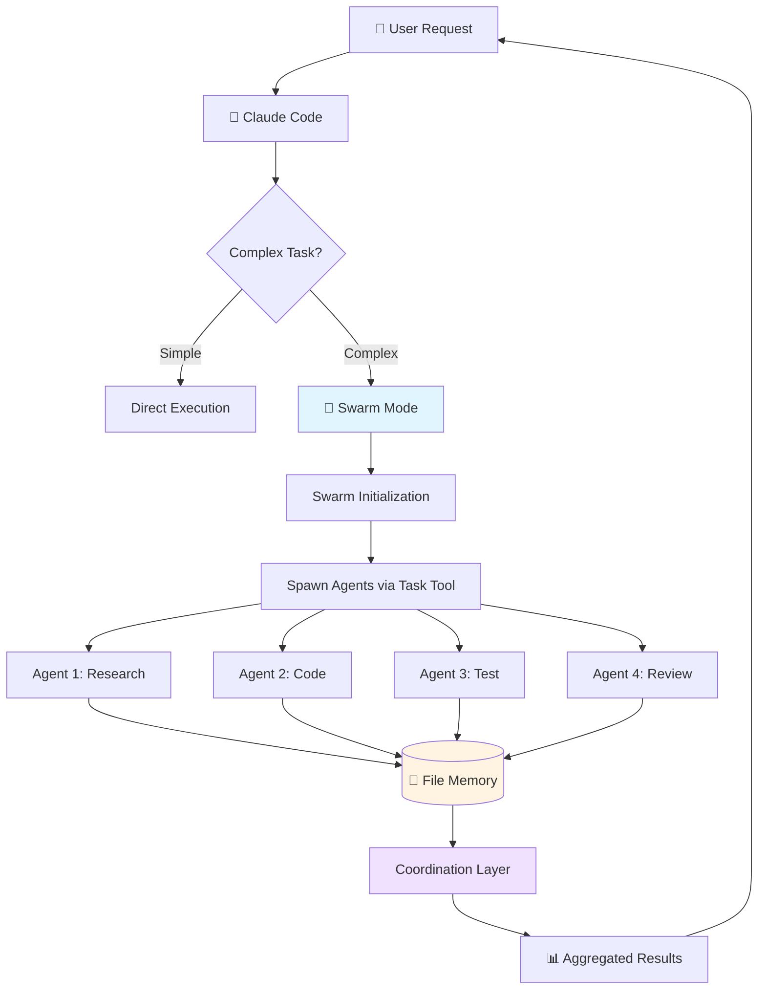
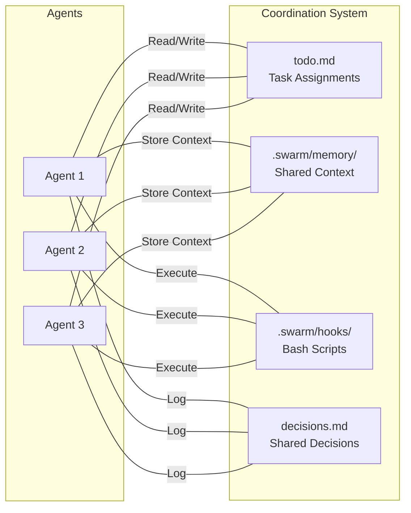
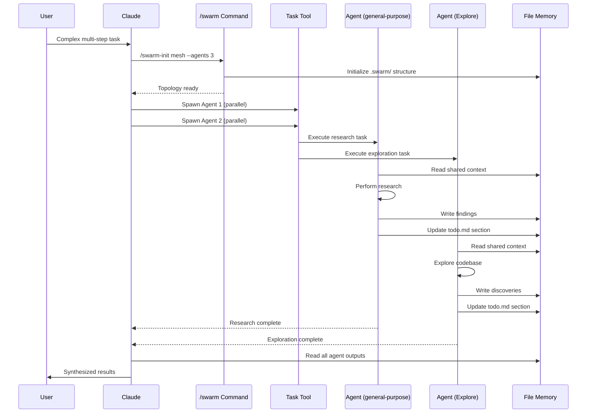
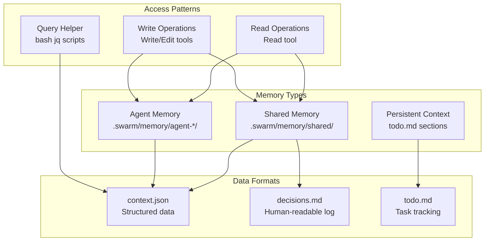
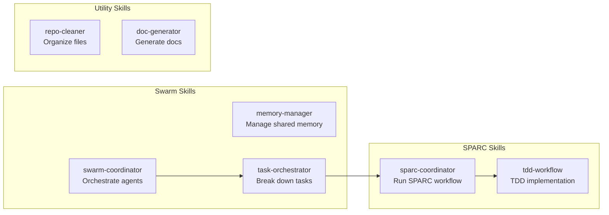
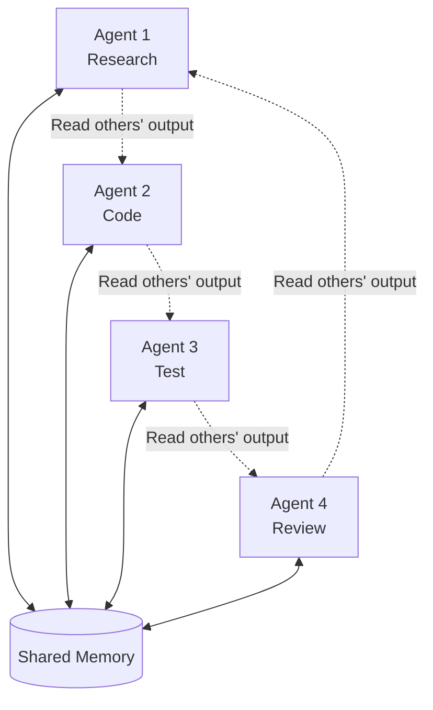
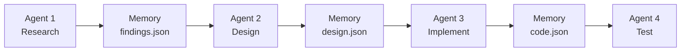
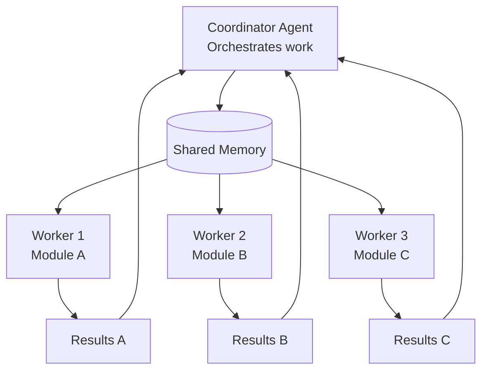
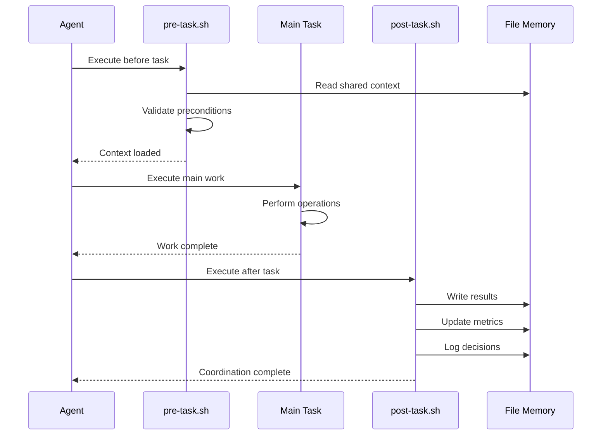

# Claude-Flow Remake: Architecture Without MCP

## Vision

**Recreate claude-flow's swarm coordination using only:**
- ✅ Claude Code's native Task tool
- ✅ Custom slash commands
- ✅ Custom skills
- ✅ File-based memory
- ✅ Bash hooks
- ❌ NO MCP servers

---

## System Architecture

### High-Level Flow



---

## Component Architecture

### 1. Coordination Layer (File-Based)



**File Structure**:
```
.swarm/
├── memory/
│   ├── shared/
│   │   ├── context.json       # Shared context
│   │   └── decisions.md       # Decision log
│   ├── agent-research/
│   │   └── findings.json
│   ├── agent-coder/
│   │   └── progress.json
│   └── agent-tester/
│       └── coverage.json
├── hooks/
│   ├── pre-task.sh           # Before task starts
│   ├── post-task.sh          # After task completes
│   └── coordination.sh       # Cross-agent coordination
└── config/
    └── topology.json         # Swarm configuration
```

---

### 2. Agent Execution Flow



---

### 3. Memory System Architecture



---

### 4. Slash Command Architecture

```mermaid
graph TB
    subgraph "Core Commands"
        Init[/swarm-init<br/>Initialize swarm]
        TDD[/tdd<br/>Test-Driven Development]
        SPARC[/sparc<br/>Full SPARC workflow]
    end

    subgraph "SPARC Sub-Commands"
        Spec[/sparc-spec<br/>Specification]
        Pseudo[/sparc-pseudo<br/>Pseudocode]
        Arch[/sparc-arch<br/>Architecture]
        Refine[/sparc-refine<br/>Refinement]
    end

    Init --> Setup[Create .swarm/<br/>Initialize memory<br/>Setup hooks]

    TDD --> Test1[Write failing test]
    Test1 --> Code1[Implement code]
    Code1 --> Test2[Run tests]
    Test2 --> Refactor[Refactor if needed]

    SPARC --> Spec
    Spec --> Pseudo
    Pseudo --> Arch
    Arch --> Refine

    style Init fill:#e1f5ff
    style TDD fill:#ffe1e1
    style SPARC fill:#e1ffe1
```

---

### 5. Skill Architecture



---

## Agent Role Mapping

### Claude-Flow Agents → Claude Code Implementation

| Claude-Flow Agent | Claude Code Agent Type | Specialized Prompt Role |
|-------------------|------------------------|-------------------------|
| `coder` | general-purpose | Write production code following specs |
| `reviewer` | general-purpose | Review code quality, security, best practices |
| `tester` | general-purpose | Write and run comprehensive test suites |
| `researcher` | Explore (very thorough) | Deep codebase analysis and pattern discovery |
| `planner` | general-purpose | Break down tasks, create implementation plans |
| `backend-dev` | general-purpose | Backend API and service implementation |
| `frontend-dev` | general-purpose | UI/UX component development |
| `architect` | general-purpose | System design and architecture decisions |
| `security-auditor` | general-purpose | Security review and vulnerability scanning |
| `performance-optimizer` | general-purpose | Performance analysis and optimization |
| `code-analyzer` | Explore (medium) | Code quality metrics and analysis |
| `integration-tester` | general-purpose | End-to-end and integration testing |

**Key Insight**: We don't need 54 agent types. We need 6 agent types with 54 **specialized prompts**.

---

## Coordination Patterns

### Pattern 1: Mesh Topology (All-to-All)



**Use Case**: Complex tasks requiring cross-functional collaboration

---

### Pattern 2: Pipeline Topology (Sequential)



**Use Case**: SPARC workflow, waterfall-style tasks

---

### Pattern 3: Hierarchical (Coordinator + Workers)



**Use Case**: Large repository refactoring, parallel module work

---

## Hook System Design

### Hook Execution Flow



---

## Comparison: Before vs After

### Before (claude-flow with MCP)

```javascript
// MCP coordination
mcp__claude-flow__swarm_init { topology: "mesh" }
mcp__claude-flow__agent_spawn { type: "researcher" }
mcp__claude-flow__memory_store { key: "findings", value: {...} }

// Hooks via MCP
npx claude-flow@alpha hooks pre-task --description "task"
```

**Problems**:
- MCP server dependency
- Black box coordination
- Complex setup
- Network overhead

---

### After (claude-flow-remake)

```javascript
// Native Claude Code
/swarm-init mesh --agents 4

// Parallel agent spawning
Task("Research agent", "Analyze patterns. Use .swarm/memory/ for context.", "Explore")
Task("Coder agent", "Implement features. Read .swarm/memory/shared/context.json", "general-purpose")

// Hooks via bash
bash .swarm/hooks/pre-task.sh "research-task"
```

**Benefits**:
- ✅ No MCP dependency
- ✅ Transparent file-based coordination
- ✅ Simple bash scripts
- ✅ Fully local
- ✅ Easy to debug

---

## Implementation Priority

### Phase 1: Core Infrastructure
1. Create `.swarm/` directory structure
2. Implement file-based memory system
3. Create basic bash hooks

### Phase 2: Slash Commands
1. `/swarm-init` - Initialize swarm
2. `/tdd` - TDD workflow
3. `/sparc` - SPARC workflow

### Phase 3: Skills
1. `swarm-coordinator` - Orchestrate multi-agent tasks
2. `memory-manager` - Manage shared context
3. `sparc-coordinator` - Run SPARC methodology

### Phase 4: Agent Prompts
1. Create specialized prompts for each role
2. Document when to use each agent type
3. Create prompt templates

---

**Next**: See `03_implementation-rules.md` for detailed implementation guidelines.
