# Claude-Flow Remake: Visual System Overview

## Complete System Architecture

```mermaid
graph TB
    subgraph "User Interface"
        User[👤 User]
        Request[Feature Request]
    end

    subgraph "Claude Code Decision Layer"
        Claude[🤖 Claude Code]
        Analyze{Complexity<br/>Analysis}
        Choose{Choose<br/>Topology}
    end

    subgraph "Swarm Initialization"
        Init[/swarm-init]
        CreateDir[Create .swarm/]
        WriteConfig[Write config files]
        SetupHooks[Setup bash hooks]
    end

    subgraph "Coordination Layer - File-Based"
        SharedMem[(Shared Memory<br/>.swarm/memory/shared/)]
        AgentMem[(Agent Memory<br/>.swarm/memory/agent-*/)]
        Hooks[Bash Hooks<br/>.swarm/hooks/]
        Config[Configuration<br/>.swarm/config/]
    end

    subgraph "Agent Execution - Task Tool"
        TaskTool[Task Tool]

        subgraph "Parallel Agents"
            A1[Agent 1<br/>Research]
            A2[Agent 2<br/>Design]
            A3[Agent 3<br/>Code]
            A4[Agent 4<br/>Test]
        end
    end

    subgraph "Memory Operations"
        Read[Read Memory<br/>context.json]
        Write[Write Results<br/>output.json]
        Update[Update Progress<br/>progress.json]
        Log[Log Decisions<br/>decisions.md]
    end

    subgraph "Deliverables"
        Code[Source Code<br/>src/]
        Tests[Test Suite<br/>tests/]
        Docs[Documentation<br/>docs/]
        Report[Swarm Report<br/>.swarm/memory/]
    end

    User --> Request
    Request --> Claude
    Claude --> Analyze

    Analyze -->|Simple| DirectExec[Direct Execution]
    Analyze -->|Complex| Choose

    Choose -->|Mesh| Init
    Choose -->|Pipeline| Init
    Choose -->|Hierarchical| Init

    Init --> CreateDir
    CreateDir --> WriteConfig
    WriteConfig --> SetupHooks

    SetupHooks --> SharedMem
    SetupHooks --> Hooks
    SetupHooks --> Config

    Claude --> TaskTool
    TaskTool --> A1
    TaskTool --> A2
    TaskTool --> A3
    TaskTool --> A4

    A1 --> Read
    A2 --> Read
    A3 --> Read
    A4 --> Read

    Read --> SharedMem
    Read --> AgentMem

    A1 --> Write
    A2 --> Write
    A3 --> Write
    A4 --> Write

    Write --> AgentMem
    Write --> Update
    Write --> Log

    Update --> SharedMem
    Log --> SharedMem

    A1 --> Code
    A2 --> Code
    A3 --> Code
    A4 --> Tests

    Code --> Report
    Tests --> Report
    Docs --> Report

    Report --> User

    style User fill:#e1f5ff
    style Claude fill:#fff4e1
    style SharedMem fill:#f0e1ff
    style TaskTool fill:#e1ffe1
    style Report fill:#ffe1e1
```

---

## Swarm Topologies Comparison


---

## Memory System Flow


---

## Command Workflow: /sparc

```mermaid
graph TD
    Start[User: /sparc feature-name]

    Start --> Init[Initialize pipeline topology]
    Init --> Stage1[Stage 1: Specification Agent]

    Stage1 --> S1Write[Write spec to memory/stage-1/]
    S1Write --> S1Update[Update progress.json]
    S1Update --> Stage2Check{Stage 1<br/>Complete?}

    Stage2Check -->|Yes| Stage2[Stage 2: Pseudocode Agent]
    Stage2 --> S2Read[Read stage-1 output]
    S2Read --> S2Write[Write pseudocode to memory/stage-2/]
    S2Write --> S2Update[Update progress.json]
    S2Update --> Stage3Check{Stage 2<br/>Complete?}

    Stage3Check -->|Yes| Stage3[Stage 3: Architecture Agent]
    Stage3 --> S3Read[Read stage-1 & stage-2]
    S3Read --> S3Write[Write architecture to memory/stage-3/]
    S3Write --> S3Update[Update progress.json]
    S3Update --> Stage4Check{Stage 3<br/>Complete?}

    Stage4Check -->|Yes| Stage4[Stage 4: Refinement Agent<br/>TDD Implementation]
    Stage4 --> S4Read[Read all previous stages]
    S4Read --> S4TDD[Run TDD cycles]
    S4TDD --> S4Write[Write code + tests]
    S4Write --> S4Update[Update progress.json]
    S4Update --> Stage5Check{Stage 4<br/>Complete?}

    Stage5Check -->|Yes| Stage5[Stage 5: Completion Agent]
    Stage5 --> S5Read[Read all stages + code]
    S5Read --> S5Test[Run integration tests]
    S5Test --> S5Doc[Generate docs]
    S5Doc --> S5Validate[Validate against spec]
    S5Validate --> S5Report[Write final report]

    S5Report --> Complete[✅ SPARC Complete]
    Complete --> User[Report to user]

    style Start fill:#e1f5ff
    style Complete fill:#e1ffe1
    style User fill:#ffe1e1
```



---

## Skill Invocation Flow

```mermaid
graph TB
    UserReq[User Request:<br/>"Use swarm to build feature"]

    UserReq --> SkillMatch{Match<br/>Skill?}

    SkillMatch -->|Yes| LoadSkill[Load swarm-coordinator skill]
    SkillMatch -->|No| Regular[Regular execution]

    LoadSkill --> SkillLogic[Skill provides domain logic]

    SkillLogic --> Assess[Assess: 3+ agents needed?]
    Assess -->|Yes| ChooseTopo[Choose topology:<br/>mesh/pipeline/hierarchical]
    Assess -->|No| Regular

    ChooseTopo --> InitSwarm[Initialize swarm:<br/>/swarm-init]

    InitSwarm --> AssignRoles[Assign roles:<br/>research, design, code, test]

    AssignRoles --> SpawnAll[Spawn ALL agents<br/>in ONE message]

    SpawnAll --> A1[Agent 1 with<br/>memory instructions]
    SpawnAll --> A2[Agent 2 with<br/>memory instructions]
    SpawnAll --> A3[Agent 3 with<br/>memory instructions]
    SpawnAll --> A4[Agent 4 with<br/>memory instructions]

    A1 --> Coord[Coordinate via<br/>.swarm/memory/]
    A2 --> Coord
    A3 --> Coord
    A4 --> Coord

    Coord --> Synth[Synthesize results]
    Synth --> Report[Report to user]

    style UserReq fill:#e1f5ff
    style LoadSkill fill:#fff4e1
    style SpawnAll fill:#f0e1ff
    style Report fill:#ffe1e1
```

---

## File System Layout


---

## Agent Coordination Protocol


---

## Comparison: MCP vs Native

```mermaid
graph LR
    subgraph "claude-flow (MCP-based)"
        direction TB
        MCPUser[User Request]
        MCPClaude[Claude Code]
        MCPServer[MCP Server<br/>claude-flow]
        MCPCoord[Coordination Logic<br/>In MCP Server]
        MCPAgents[Agents via Task Tool]

        MCPUser --> MCPClaude
        MCPClaude -->|network call| MCPServer
        MCPServer --> MCPCoord
        MCPCoord -->|spawn| MCPAgents

        MCPNote[⚠️ Issues:<br/>- Network overhead<br/>- Black box coordination<br/>- Complex setup<br/>- MCP dependency]
    end

    subgraph "claude-flow-remake (Native)"
        direction TB
        NativeUser[User Request]
        NativeClaude[Claude Code]
        NativeFiles[File System<br/>.swarm/]
        NativeCoord[Coordination via Files<br/>Simple, Transparent]
        NativeAgents[Agents via Task Tool]

        NativeUser --> NativeClaude
        NativeClaude -->|local I/O| NativeFiles
        NativeFiles --> NativeCoord
        NativeCoord -->|spawn| NativeAgents

        NativeNote[✅ Benefits:<br/>- Local files (fast)<br/>- Transparent coordination<br/>- Simple setup<br/>- Zero dependencies]
    end

    style MCPNote fill:#ffe1e1
    style NativeNote fill:#e1ffe1
```

---

## Implementation Phases


---

All diagrams support the documentation in `00_DOCS/claude-flow-remake/`.
