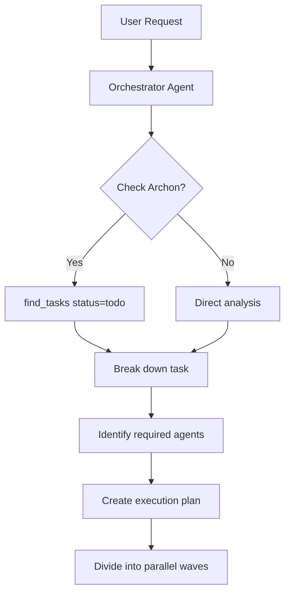
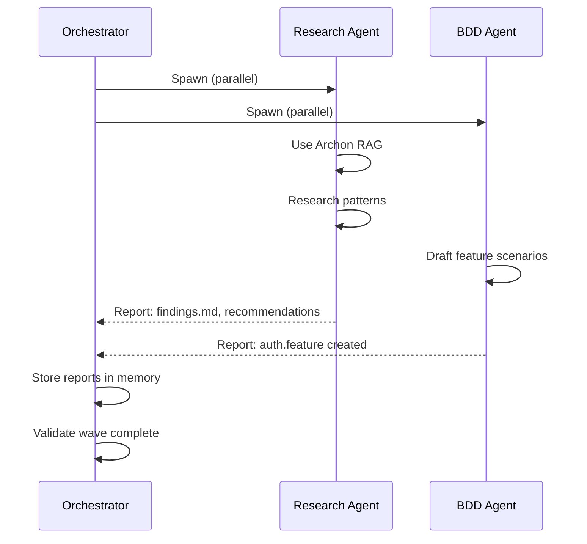
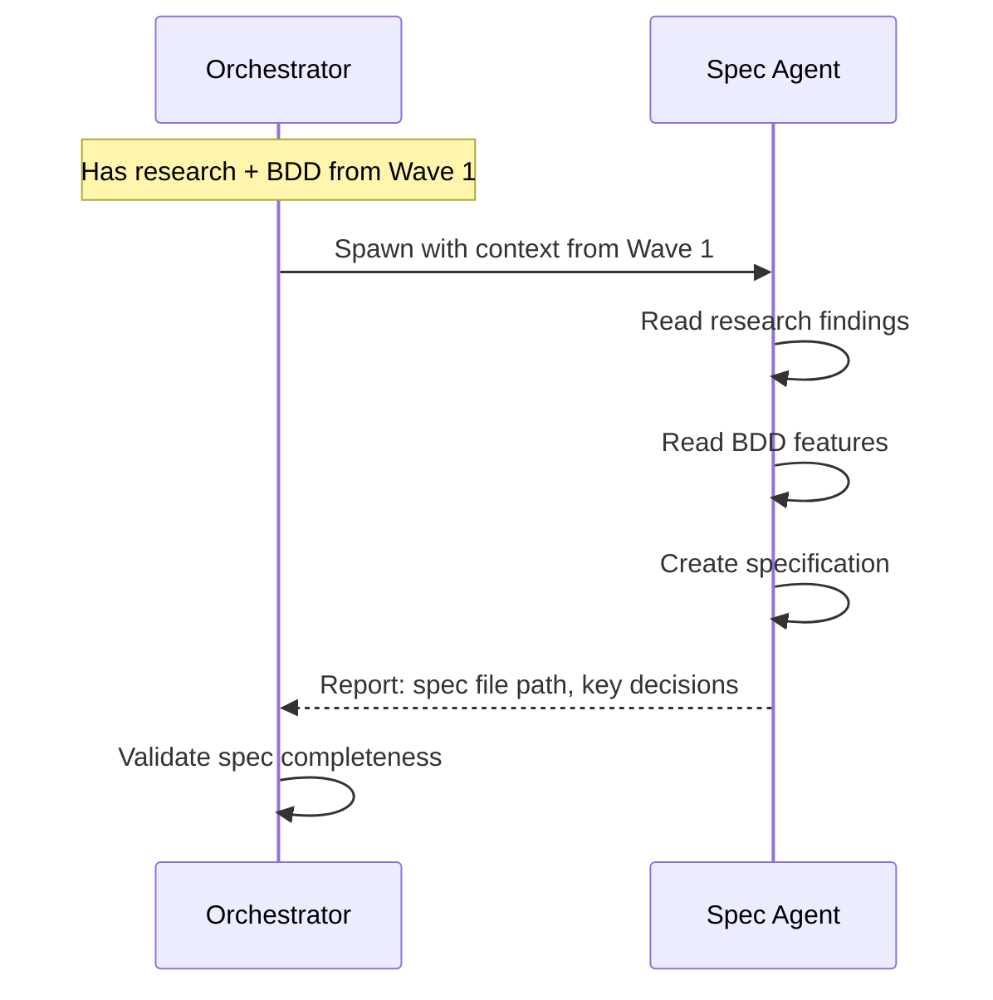
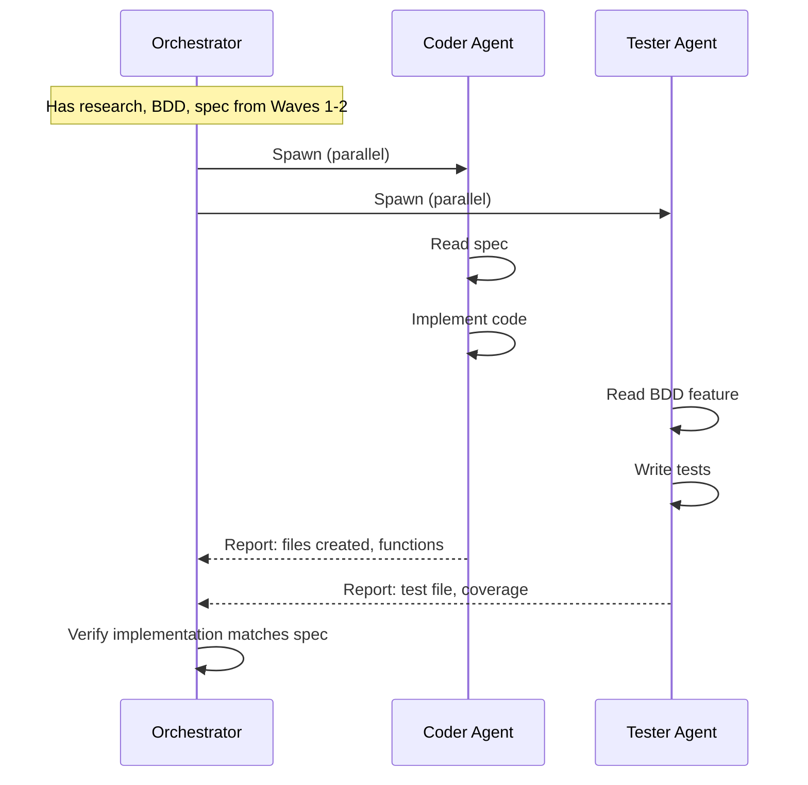
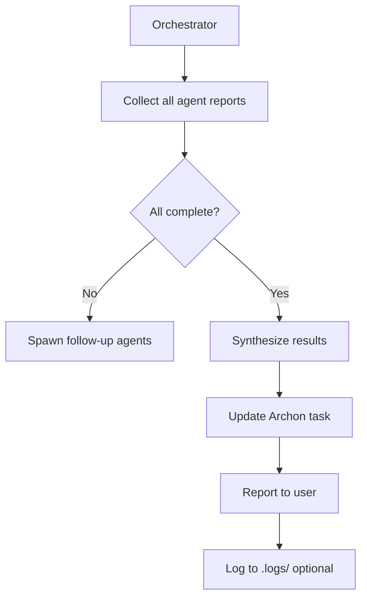

# Orchestrator System: Detailed Architecture

## Overview

The orchestrator system is a **message-based coordination pattern** where one Claude agent (the orchestrator) coordinates multiple specialist agents through a report-back protocol.

**Core Idea**: Instead of complex file-based coordination, use Claude's conversation memory as the coordination layer.

---

## System Components

### 1. Orchestrator Agent (Main Claude Instance)

**Role**: The "you" in the main conversation. Coordinates everything.

**Responsibilities**:
- Receive user request
- Break down into sub-tasks
- Identify which specialists needed
- Spawn agents in parallel (ONE message)
- Collect agent reports
- Synthesize results
- Update Archon tasks (if available)
- Report to user

**Memory**: Conversation history + Archon persistent storage

---

### 2. Specialist Agents (Task Tool Agents)

**Available Types**:
- `general-purpose` - Most implementation work
- `Explore` - Codebase exploration, research
- `code-review-orchestrator` - Repository reviews
- `module-integrity-auditor` - Module validation

**Roles** (via specialized prompts):
- **Research Agent** - RAG search, pattern discovery
- **Spec Agent** - Create specifications
- **BDD Agent** - Write .feature files
- **Architect Agent** - System design
- **Coder Agent** - Implementation
- **Tester Agent** - Write tests
- **Reviewer Agent** - Code review

**Communication**: Report back to orchestrator with structured output

---

### 3. Archon MCP Server (Optional but Recommended)

**Provides**:
- Task management (projects, tasks, statuses)
- Knowledge base (RAG search)
- Persistence across sessions

**Integration**:
```bash
# Orchestrator uses Archon before delegating
find_tasks(filter_by="status", filter_value="todo")
manage_task("update", task_id="123", status="doing")

# Research agent uses Archon for knowledge
rag_search_knowledge_base(query="authentication JWT")
```

---

### 4. Repository Structure (Universal Repo Guide)

**Provides context and outputs**:
```
project/
├── 00_DOCS/          # High-level docs (BRDs, PRDs)
├── 01_SPECS/         # Functional specifications
├── 02_FEATURES/      # BDD .feature files
├── 03_TESTING_INFRA/ # Test infrastructure
├── .logs/            # Orchestrator logs (optional)
└── src/
    └── module/
        ├── 00_DOCS/      # Module documentation
        ├── 01_SPECS/     # Module specifications
        ├── 02_FEATURES/  # Module BDD features
        ├── code.js
        └── code.test.js
```

---

## Execution Flow

### Phase 1: Task Analysis (Orchestrator)



**Example**:
```
User: "Build authentication system with OAuth support"

Orchestrator thinks:
1. Check Archon for related tasks
2. Break down:
   - Research OAuth patterns
   - Write spec
   - Write BDD features
   - Implement code
   - Write tests
3. Identify agents:
   - Research Agent (Explore type)
   - Spec Agent (general-purpose)
   - BDD Agent (general-purpose)
   - Coder Agent (general-purpose)
   - Tester Agent (general-purpose)
4. Organize into waves:
   - Wave 1: Research + BDD (parallel)
   - Wave 2: Spec (depends on research)
   - Wave 3: Code + Tests (parallel, depend on spec)
```

---

### Phase 2: Wave 1 Execution (Parallel Independent Agents)



**Orchestrator spawns agents** (ONE message):
```javascript
Task("Research Agent", "
# Research OAuth 2.0 Authentication Patterns

Use Archon RAG to research:
- rag_search_knowledge_base(query='OAuth 2.0 best practices')
- rag_search_knowledge_base(query='JWT authentication')
- rag_search_code_examples(query='OAuth implementation')

Your deliverables:
1. Summary of findings
2. Recommended patterns
3. Security considerations
4. References

Report back in this format:
## Research Report: OAuth Authentication
- **Recommended Pattern**: [name]
- **Rationale**: [why]
- **Security Notes**: [key points]
- **References**: [URLs]
", "Explore")

Task("BDD Agent", "
# Create BDD Feature for Authentication

Create 02_FEATURES/authentication.feature with scenarios:
- User registration
- User login
- OAuth login (Google, GitHub)
- Token refresh
- Logout

Follow Gherkin syntax:
Feature: Authentication
  Scenario: User registers with email
    Given the user is on the registration page
    When they submit valid credentials
    Then a new account is created

Report back:
- Feature file path
- Scenarios written
- Edge cases covered
", "general-purpose")
```

**Agents work independently, report back**:
- Research Agent returns findings
- BDD Agent returns feature file path

**Orchestrator collects reports** in conversation memory.

---

### Phase 3: Wave 2 Execution (Depends on Wave 1)



**Orchestrator spawns** (with context from Wave 1):
```javascript
Task("Spec Agent", "
# Create Functional Specification for Authentication

You have access to:
- Research findings: [paste research agent report]
- BDD features: 02_FEATURES/authentication.feature

Create 01_SPECS/authentication-spec.md:

---
status: draft
version: 1.0
module: auth
tldr: OAuth 2.0 authentication system specification
dependencies: []
---

# Authentication System Specification

## Functional Requirements
[Based on BDD scenarios]

## Technical Approach
[Based on research findings]

## Data Models
[Define user, token structures]

## API Endpoints
[Define REST endpoints]

## Security Considerations
[From research]

Report back:
- Spec file path
- Key technical decisions made
- Any questions or ambiguities
", "general-purpose")
```

---

### Phase 4: Wave 3 Execution (Parallel Implementation)



**Orchestrator spawns** (ONE message, parallel):
```javascript
Task("Coder Agent", "
# Implement Authentication Module

Based on specification: 01_SPECS/authentication-spec.md

Implement in src/auth/:
- src/auth/oauth.js - OAuth provider handlers
- src/auth/jwt.js - JWT token management
- src/auth/middleware.js - Express middleware

Follow specification exactly. Use patterns from research.

Repository structure:
src/auth/
  ├── 00_DOCS/README.md   (module overview)
  ├── 01_SPECS/           (link to root spec)
  ├── oauth.js
  ├── jwt.js
  └── middleware.js

Report back:
- Files created with paths
- Functions implemented
- Any deviations from spec (with rationale)
", "general-purpose")

Task("Tester Agent", "
# Write Tests for Authentication

Based on:
- BDD feature: 02_FEATURES/authentication.feature
- Specification: 01_SPECS/authentication-spec.md

Create test suite:
- src/auth/oauth.test.js
- src/auth/jwt.test.js
- src/auth/middleware.test.js

Follow TDD: Tests should validate BDD scenarios.

Report back:
- Test files created
- Scenarios covered
- Test coverage estimate
- Any missing test cases
", "general-purpose")
```

---

### Phase 5: Synthesis (Orchestrator)



**Orchestrator**:
1. Collects all reports from conversation
2. Validates completeness
3. Updates Archon task status
4. Creates summary for user
5. (Optional) Logs to .logs/orchestrator.log

```
Orchestrator synthesizes:

✅ Authentication System Complete

## Research Phase
- Investigated OAuth 2.0 and JWT patterns
- Identified security best practices
- References: [links]

## Specification Phase
- Created: 01_SPECS/authentication-spec.md
- Decisions: JWT with httpOnly cookies, PKCE for OAuth

## BDD Features
- Created: 02_FEATURES/authentication.feature
- Scenarios: 5 (registration, login, OAuth, refresh, logout)

## Implementation
- Files created:
  - src/auth/oauth.js (Google, GitHub providers)
  - src/auth/jwt.js (token generation, validation)
  - src/auth/middleware.js (Express integration)

## Tests
- Files created:
  - src/auth/*.test.js (15 tests, ~90% coverage)

## Archon Update
- Task #123: Status → done
- Added deliverables to task notes

## Next Steps
- Integration testing
- Security audit
- Documentation review
```

---

## Agent Report Protocol

### Standard Report Format

Every agent should report back with:

```markdown
## [Agent Type] Report: [Task Name]

### Status
✅ Complete | ⚠️ Partial | ❌ Blocked

### Deliverables
- File 1: path/to/file (purpose)
- File 2: path/to/file (purpose)

### Key Decisions
- Decision 1: rationale
- Decision 2: rationale

### Findings/Results
[Specific to agent type]

### Blockers/Questions
- [Any issues encountered]
- [Questions for orchestrator]

### Next Steps
- [Recommendations for follow-up work]
```

### Agent-Specific Report Structures

**Research Agent**:
```markdown
## Research Report: [Topic]

### Key Findings
- Finding 1: description
- Finding 2: description

### Recommended Patterns
- Pattern: rationale

### Security Considerations
- Concern: mitigation

### References
- [URLs]
```

**Spec Agent**:
```markdown
## Specification Report: [Module]

### Spec File
- Path: 01_SPECS/module-spec.md
- Status: draft

### Technical Decisions
- Decision: rationale

### Open Questions
- Question: requires user input

### Dependencies
- [Other specs needed]
```

**Coder Agent**:
```markdown
## Implementation Report: [Module]

### Files Created
- src/module/file.js: purpose

### Functions Implemented
- functionName(): description

### Deviations from Spec
- None | [deviation]: rationale

### Technical Notes
- [Implementation details]
```

**Tester Agent**:
```markdown
## Test Report: [Module]

### Test Files
- src/module/file.test.js: scenarios

### Coverage
- Scenarios: X/Y from BDD
- Estimate: ~Z% code coverage

### Test Results
- Passing: X
- Failing: Y (expected if TDD)

### Missing Coverage
- [Scenarios not yet tested]
```

---

## Comparison: Shared Memory vs Report-Back

### Shared Memory (.swarm/ files)
```javascript
// Agent 1
Write ".swarm/memory/agent-research/findings.json"

// Agent 2 (later)
Read ".swarm/memory/agent-research/findings.json"
```

**Problems**:
- Complex file management
- Coordination overhead
- Hard to debug
- Resumability unclear

### Report-Back (Orchestrator Pattern)
```javascript
// Agent 1
Task("Research Agent", "Report back: findings") →
  Returns report to orchestrator

// Orchestrator
Stores report in conversation memory

// Agent 2 (later)
Task("Spec Agent", "
Here are the research findings: [paste report]
Create spec based on this.
")
```

**Benefits**:
- Simple message passing
- Orchestrator holds all context
- Easy to debug (read conversation)
- Resumability via Archon tasks

---

## Integration Points

### With Archon MCP Server

**Before starting**:
```javascript
// Orchestrator checks Archon
find_tasks(filter_by="status", filter_value="todo")
// → Task #123: "Implement authentication"

manage_task("update", task_id="123", status="doing")
```

**During research**:
```javascript
// Research agent prompt includes
rag_search_knowledge_base(query="OAuth 2.0")
```

**After completion**:
```javascript
// Orchestrator updates Archon
manage_task("update", task_id="123",
  status="done",
  notes="Deliverables:\n- src/auth/\n- tests/auth/"
)
```

---

### With Universal Repo Guide Structure

**Agents write to structured locations**:

```javascript
// Spec Agent → 01_SPECS/
// BDD Agent → 02_FEATURES/
// Coder Agent → src/module/
// Tester Agent → src/module/*.test.js
```

**Frontmatter added automatically**:
```yaml
---
status: draft
version: 1.0
module: auth
tldr: OAuth 2.0 authentication
dependencies: [00_DOCS/security-requirements.md]
code_refs: [src/auth/]
---
```

---

### With claude-flow Parallel Execution

**Use the golden rule**:
```javascript
// ✅ ONE message with ALL independent agents
Task("Agent 1", "...", "type")
Task("Agent 2", "...", "type")
Task("Agent 3", "...", "type")

// ❌ NOT multiple messages
Message 1: Task("Agent 1")
Message 2: Task("Agent 2")
```

---

## Central Logging (Optional)

For resumability, orchestrator can log to `.logs/orchestrator.log`:

```bash
# Orchestrator logs major milestones
echo "[2025-01-19 14:30] Task: Build auth system - Started" >> .logs/orchestrator.log
echo "[2025-01-19 14:35] Wave 1: Research + BDD - Spawned" >> .logs/orchestrator.log
echo "[2025-01-19 14:45] Wave 1: Complete - Reports received" >> .logs/orchestrator.log
echo "[2025-01-19 15:00] Wave 2: Spec - Spawned" >> .logs/orchestrator.log
echo "[2025-01-19 15:15] Wave 2: Complete" >> .logs/orchestrator.log
echo "[2025-01-19 15:20] Wave 3: Code + Tests - Spawned" >> .logs/orchestrator.log
echo "[2025-01-19 15:45] Task complete - All deliverables ready" >> .logs/orchestrator.log
```

Combined with Archon task tracking, this provides full resumability.

---

## Key Advantages

1. **Simplicity**: No complex file coordination, just messages
2. **Speed**: Maximum parallelism through wave-based execution
3. **Clarity**: Conversation history shows entire flow
4. **Persistence**: Archon tasks survive session interruptions
5. **Structure**: Universal Repo Guide provides clear outputs
6. **Flexibility**: Easy to add new agent types as needed

---

**Next**: See [02_orchestrator-skill.md](../skills/02_orchestrator-skill.md) for the orchestrator skill implementation.
