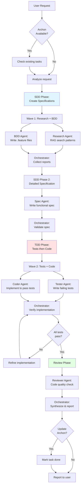

# Workflow Integration: SDD/BDD/TDD with Orchestration

## Overview

This document explains how Specification-Driven Development (SDD), Behavior-Driven Development (BDD), and Test-Driven Development (TDD) integrate with the orchestrator pattern.

---

## The Workflow



---

## Phase 1: Specification-Driven Development (SDD)

**Principle**: No code without specifications.

### Step 1: Research (if needed)

For unfamiliar domains or technologies:

```javascript
Task("Research Agent", "
Research [technology/pattern]

Use Archon RAG:
- rag_search_knowledge_base(query='[keywords]')
- rag_search_code_examples(query='[pattern]')

Report:
- Recommended approaches
- Best practices
- Security considerations
- Implementation references
", "Explore")
```

**Deliverable**: Research findings that inform specification

---

### Step 2: BDD Feature Definition (Parallel with Research)

Define system behavior from user perspective:

```javascript
Task("BDD Agent", "
Create Gherkin feature file: 02_FEATURES/[feature].feature

Scenarios to cover:
- Happy path
- Edge cases
- Error conditions

Format:
Feature: [Name]
  Scenario: [Description]
    Given [context]
    When [action]
    Then [outcome]

Report: scenarios written, edge cases covered
", "general-purpose")
```

**Deliverable**: `02_FEATURES/[feature].feature`

**Example**:
```gherkin
Feature: User Registration

  Scenario: Successful registration
    Given the user is on the registration page
    When they submit email "user@example.com" and password "SecurePass123!"
    Then a new account is created
    And the user receives a confirmation email

  Scenario: Duplicate email rejection
    Given a user exists with email "existing@example.com"
    When someone tries to register with "existing@example.com"
    Then the registration is rejected
    And an error message "Email already registered" is shown
```

---

### Step 3: Functional Specification

Based on research + BDD:

```javascript
Task("Spec Agent", "
Create functional specification: 01_SPECS/[module]-spec.md

Input:
- Research findings: [paste research report]
- BDD feature: 02_FEATURES/[feature].feature

Structure:
---
status: draft
version: 1.0
module: [name]
tldr: [one-line description]
toc_tags: [keywords]
dependencies: [02_FEATURES/[feature].feature]
code_refs: [src/[module]/]
---

# [Module] Specification

## Overview
[Purpose and scope]

## Functional Requirements
[From BDD scenarios]

## Technical Architecture
[Based on research]

## Data Models
[Exact structures with types]

## API Contracts
[Request/response formats]

## Security Requirements
[From research]

## Error Handling
[All error cases from BDD]

Report: spec file path, key decisions
", "general-purpose")
```

**Deliverable**: `01_SPECS/[module]-spec.md`

**SDD Checkpoint**: ✅ Specification approved before any code

---

## Phase 2: Test-Driven Development (TDD)

**Principle**: Tests before implementation.

### Step 4: Write Failing Tests

Based on BDD scenarios and spec:

```javascript
Task("Tester Agent", "
Write test suite for [module]

Based on:
- BDD: 02_FEATURES/[feature].feature
- Spec: 01_SPECS/[module]-spec.md

Create tests: src/[module]/[file].test.js

Requirements:
1. Each BDD scenario → test case
2. Test all API contracts from spec
3. Test error handling
4. Tests should FAIL (no implementation yet)

Structure:
describe('[Module]', () => {
  describe('[Feature]', () => {
    it('[scenario from BDD]', () => {
      // Arrange: setup
      // Act: call function
      // Assert: verify outcome from BDD
    })
  })
})

Report: test files, scenarios covered, expected failures
", "general-purpose")
```

**Deliverable**: Test files with failing tests

**TDD Checkpoint**: ✅ Red - Tests written and failing

---

### Step 5: Implement to Pass Tests (Parallel with Tests)

**Important**: In orchestrator pattern, Code and Tests agents can work in parallel if coordinated.

**Option A - Sequential TDD (Traditional)**:
1. Tests first (fail)
2. Code implementation (pass tests)

**Option B - Parallel (Orchestrator)**:
```javascript
// Spawn both in parallel
Task("Tester Agent", "[test instructions]", "general-purpose")
Task("Coder Agent", "
Implement [module] per spec: 01_SPECS/[module]-spec.md

Follow Universal Repo Guide structure:
src/[module]/
  ├── 00_DOCS/README.md
  ├── 01_SPECS/README.md (link to root)
  ├── 02_FEATURES/README.md (link to root)
  ├── index.js
  ├── [component].js
  └── [component].test.js (written by Tester)

Implementation requirements:
- Match spec exactly
- Use patterns from research
- Handle all scenarios from BDD
- Make tests pass

Report: files created, functions implemented
", "general-purpose")
```

**Why parallel works**: Tester and Coder both reference the same spec. Tester writes what SHOULD work, Coder makes it work.

**Deliverable**: Implementation files

**TDD Checkpoint**: ✅ Green - Tests passing

---

### Step 6: Refactor (if needed)

After tests pass, improve code quality:

```javascript
Task("Reviewer Agent", "
Review [module] implementation

Check:
- Code quality (readability, structure)
- Performance considerations
- Security best practices
- Spec compliance

Suggest refactorings that maintain test green status

Report: issues found, refactoring recommendations
", "general-purpose")
```

**TDD Checkpoint**: ✅ Refactor - Code improved, tests still passing

---

## Phase 3: Integration & Validation

### Step 7: Integration Testing

```javascript
Task("Integration Tester", "
Create integration tests for [system]

Test interactions between:
- [Module 1] ↔ [Module 2]
- [Module] ↔ [External service]

Verify:
- BDD scenarios work end-to-end
- Error propagation
- Transaction handling

Report: integration test results
", "general-purpose")
```

---

### Step 8: Documentation

```javascript
Task("Documentation Agent", "
Create documentation for [module]

Files:
- src/[module]/00_DOCS/README.md (module overview)
- API documentation (if applicable)
- Usage examples

Include:
- Purpose (from spec)
- Usage examples (from tests)
- API reference (from spec)
- Edge cases (from BDD)

Report: documentation files created
", "general-purpose")
```

---

## Complete Workflow Example

### User Request
"Build a user registration system with email verification"

### Orchestrator Execution

**Wave 1: Research + BDD (Parallel)**
```javascript
Task("Research Agent", "
Research user registration best practices
Use: rag_search_knowledge_base(query='email verification patterns')
Report: security best practices, verification flows
", "Explore")

Task("BDD Agent", "
Create: 02_FEATURES/registration.feature
Scenarios:
- Successful registration
- Email verification flow
- Duplicate email handling
- Invalid email format
Report: feature file path, scenarios count
", "general-purpose")
```

**Result**:
- Research: Email verification via JWT tokens, 24hr expiry
- BDD: 8 scenarios in 02_FEATURES/registration.feature

---

**Wave 2: Specification**
```javascript
Task("Spec Agent", "
Create: 01_SPECS/registration-spec.md

Input:
- Research findings: [paste report]
- BDD: 02_FEATURES/registration.feature

Include:
- User data model
- Registration endpoint API
- Email service integration
- Verification token format
- Error codes

Report: spec complete, decisions made
", "general-purpose")
```

**Result**: 01_SPECS/registration-spec.md created

---

**Wave 3: Tests + Code (Parallel)**
```javascript
Task("Tester Agent", "
Based on:
- BDD: 02_FEATURES/registration.feature
- Spec: 01_SPECS/registration-spec.md

Create: src/registration/registration.test.js

Tests for:
- POST /register endpoint
- Email verification flow
- Error cases from BDD

Report: test file, expected failures
", "general-purpose")

Task("Coder Agent", "
Based on: 01_SPECS/registration-spec.md

Implement: src/registration/
- index.js (main logic)
- email-service.js (verification emails)
- validators.js (input validation)

Structure per Universal Repo Guide

Report: files created, API implemented
", "general-purpose")
```

**Result**:
- Tests: src/registration/registration.test.js (25 tests)
- Code: src/registration/ (3 files)
- Tests passing ✅

---

**Wave 4: Review**
```javascript
Task("Reviewer Agent", "
Review src/registration/

Check:
- Security (password hashing, token security)
- Error handling completeness
- Code quality
- Spec compliance

Report: findings, recommendations
", "general-purpose")
```

**Result**: Code review report, minor refactoring suggestions

---

**Synthesis**
```markdown
## User Registration System Complete

### SDD Phase ✅
- Research: Email verification patterns, JWT tokens
- BDD: 8 scenarios in 02_FEATURES/registration.feature
- Spec: 01_SPECS/registration-spec.md

### TDD Phase ✅
- Tests: 25 tests in src/registration/registration.test.js
- Code: src/registration/ (3 files)
- All tests passing ✅

### Review Phase ✅
- Security review complete
- No critical issues
- Minor refactoring applied

### Deliverables
- Specifications: 01_SPECS/registration-spec.md
- Features: 02_FEATURES/registration.feature
- Implementation: src/registration/
- Tests: 100% scenario coverage

### Next Steps
1. Integration testing with auth system
2. Email service configuration
3. Deploy verification email templates
```

---

## Orchestrator's Role in Each Phase

### SDD Phase
- **Spawn**: Research + BDD in parallel
- **Wait**: Collect reports
- **Validate**: Check spec completeness
- **Spawn**: Spec agent with research + BDD context

### BDD Phase
- **Integrated**: BDD agent in Wave 1
- **Validate**: Scenarios cover requirements
- **Pass**: Feature file to Spec agent

### TDD Phase
- **Spawn**: Tests + Code in parallel (with spec)
- **Wait**: Collect reports
- **Validate**: All tests passing
- **If fail**: Refine implementation

### Integration Phase
- **Spawn**: Integration tester
- **Spawn**: Documentation agent
- **Synthesize**: Final deliverables

---

## Archon Integration Throughout

### Before Starting
```javascript
find_tasks(filter_by="status", filter_value="todo")
// → Task #456: "Implement user registration"
manage_task("update", task_id="456", status="doing")
```

### During Research
```javascript
// Research agent uses
rag_search_knowledge_base(query="email verification")
```

### After Each Phase
```javascript
// Orchestrator logs progress
manage_task("update", task_id="456",
  notes="SDD complete: spec at 01_SPECS/registration-spec.md"
)
```

### On Completion
```javascript
manage_task("update", task_id="456",
  status="done",
  notes="Deliverables:\n- 01_SPECS/registration-spec.md\n- 02_FEATURES/registration.feature\n- src/registration/"
)
```

---

## Key Principles

1. **Spec Before Code** (SDD)
   - No implementation without functional spec
   - Spec references BDD features

2. **Behavior Before Tests** (BDD)
   - Define expected behavior first
   - Tests validate behavior

3. **Tests Before Implementation** (TDD)
   - Write failing tests
   - Implement to pass
   - Refactor while staying green

4. **Parallel When Possible**
   - Research + BDD → parallel
   - Tests + Code → parallel (with same spec)
   - Independent modules → parallel

5. **Orchestrator Coordinates All**
   - Breaks down into phases
   - Spawns agents in waves
   - Validates phase completion
   - Synthesizes results

---

**Result**: Fast, structured development following proven methodologies, coordinated by intelligent orchestration.
