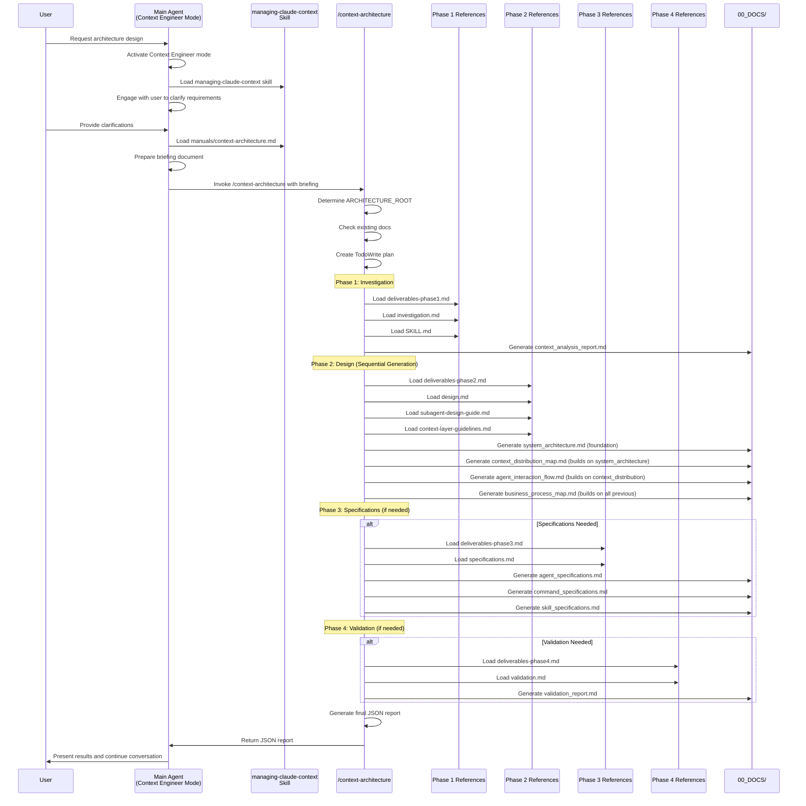
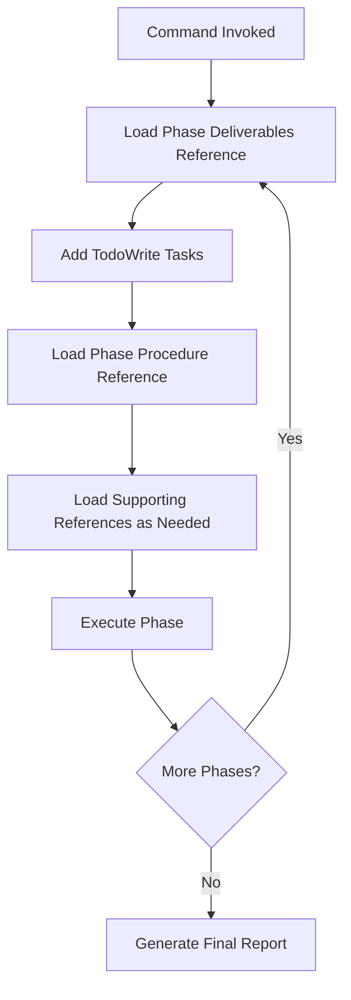
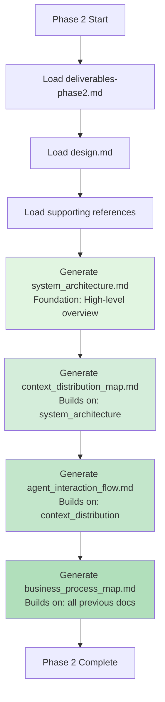
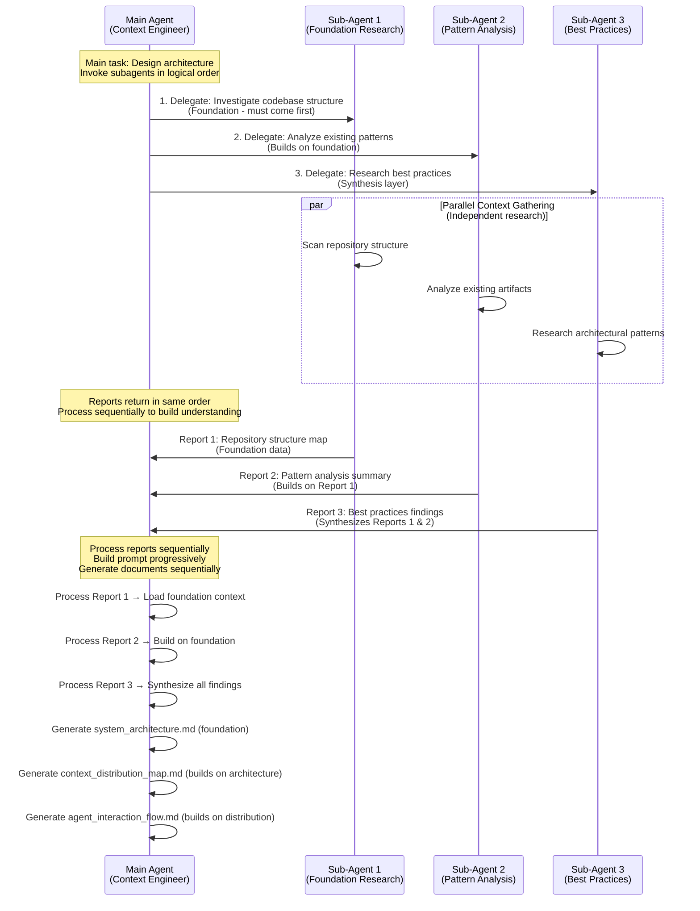
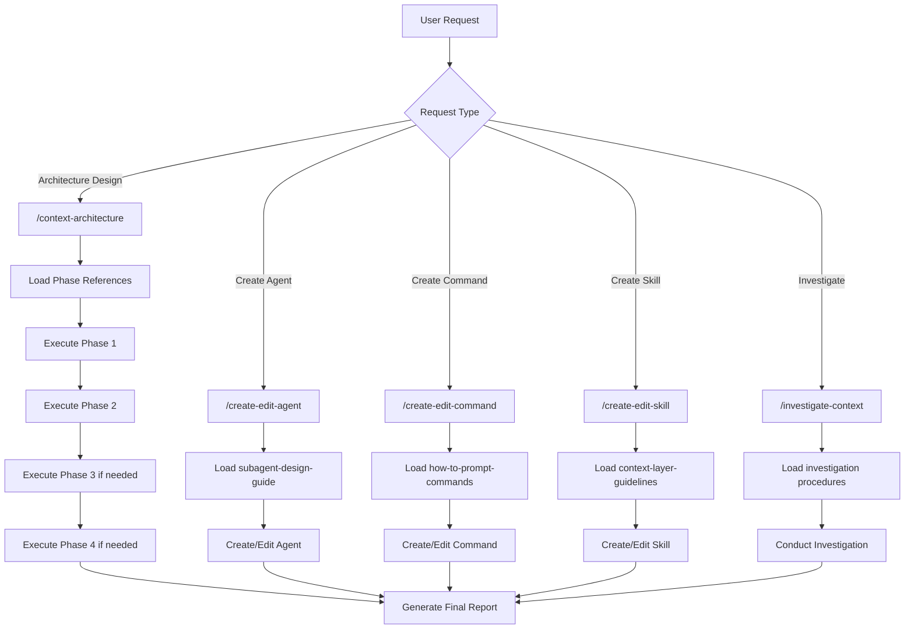
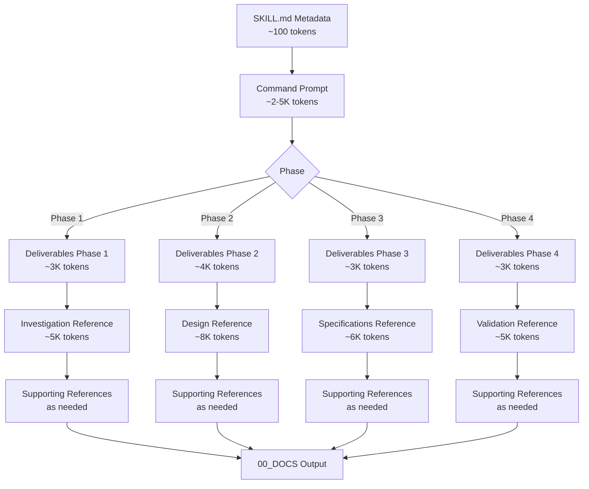
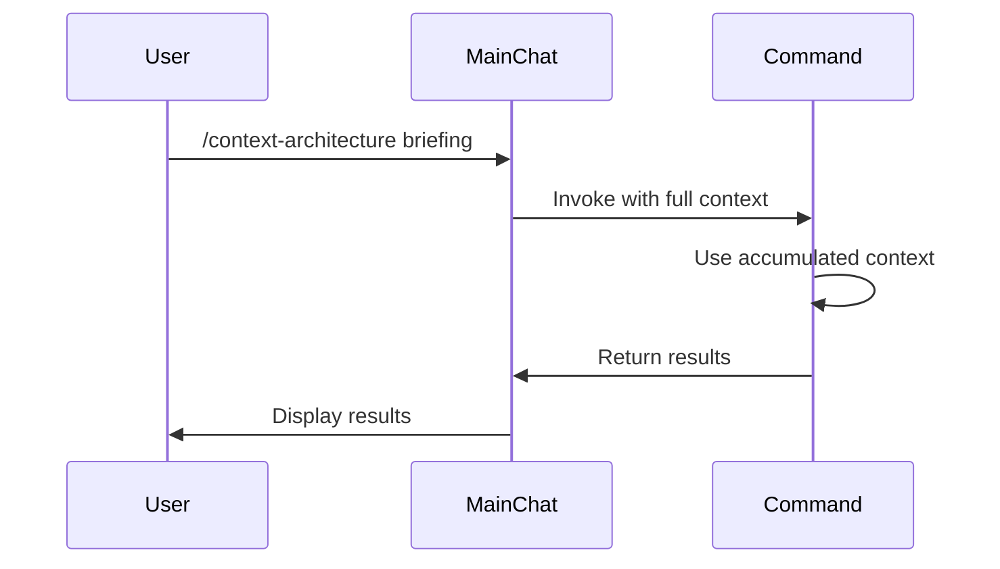
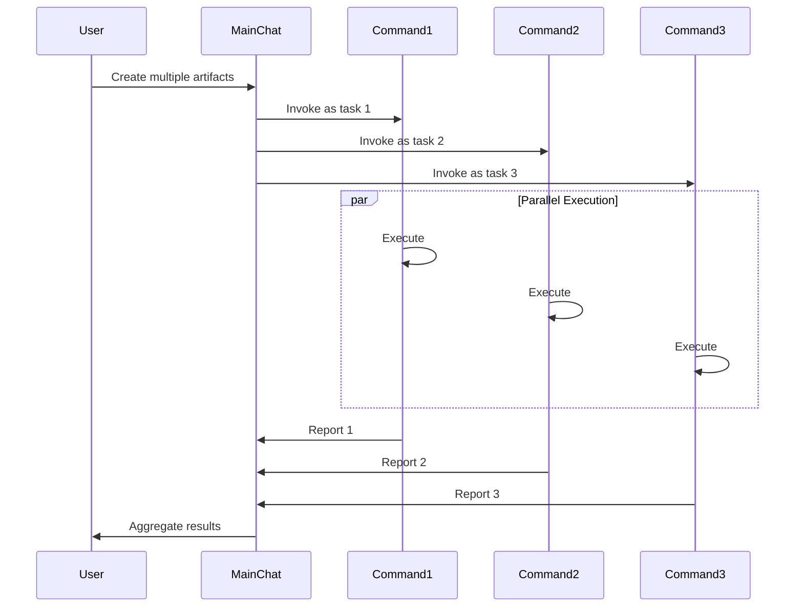
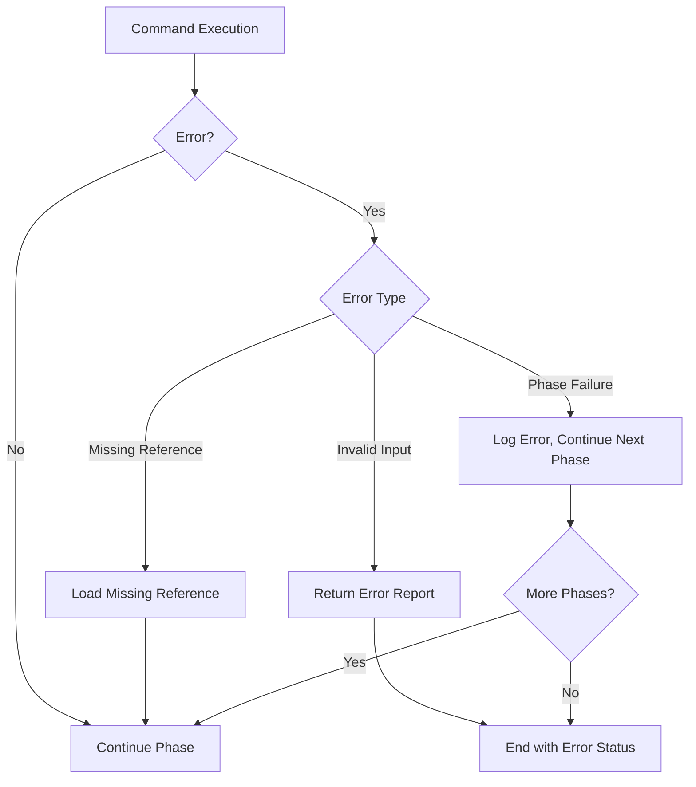

---
metadata:
  status: approved
  version: 1.0
  modules: [managing-claude-context]
  tldr: "Interaction flow diagram showing how skill components work together"
---

# Agent Interaction Flow: managing-claude-context Skill

## Main Sequence: Context Architecture Design

## Progressive Reference Loading Pattern

## Sequential Thinking: Foundation-to-Detail Document Generation

**CRITICAL PRINCIPLE**: Documents must be generated sequentially, not in parallel. This facilitates the model's thinking process and enables natural chain-of-thought reasoning. Each document builds upon previous ones, creating a foundation-to-detail flow that maximizes quality.

### Sequential Document Generation Flow

**Why Sequential?**

- Each document informs the next, building a coherent narrative
- Model maintains context and reasoning chain across documents
- Reduces contradictions and inconsistencies
- Enables progressive refinement and quality improvement
- Facilitates natural thinking flow (foundation → details → integration)

### Parallel Execution: Context Gathering via Subagents

**CRITICAL PRINCIPLE**: Parallel execution should be used ONLY for independent context gathering and research, NOT for document generation. Subagents gather and refine context that feeds into the main dialogue sequentially, avoiding context pollution.

**Sequential Subagent Invocation**: When invoking batches of subagents, call them in logical order and have them return results in the same order. This allows the main agent's prompt to be built sequentially, following the model's natural sequential processing.

**Key Points:**

- Subagents are invoked in logical order (foundation → analysis → synthesis)
- Reports return in the same order, allowing sequential processing
- Main agent processes each report sequentially, building understanding progressively
- Final document generation follows sequential pattern (foundation → details → integration)

### Command Invocation Patterns

## Information Flow: Skill → Command → References → Output

**CRITICAL**: Information flows sequentially, building upon previous context. Each phase loads only what's needed, and documents are generated in order to maintain coherent reasoning.

## Command Usage Modes

### Shared Context Mode

### Separated Task Mode (Parallel)

## Error Handling Flow

## State Management

- **No Persistent State**: Commands are stateless
- **Context Snapshot**: Each command invocation gets context snapshot
- **TodoWrite Tracking**: Progress tracked via TodoWrite tool
- **Report Contracts**: All outputs follow standardized JSON format
