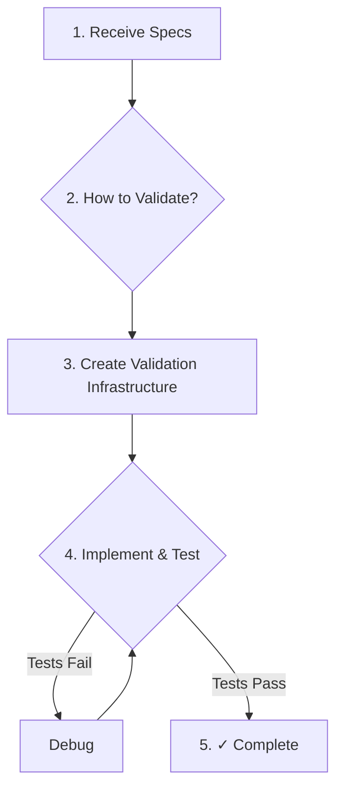

---
metadata:
  status: approved
  version: 1.0
  modules: [orchestration, subagents, tdd, bdd]
  tldr: "Defines the core principle that all AI work must be self-validating. Validation (tests, checklists, etc.) must be created before implementation to enable a reliable, autonomous feedback loop."
---

# Self-Validating Workflows: The Core Operational Principle

This document outlines the **Self-Validating Workflow**, the foundational principle for all work performed by AI agents in this framework. It extends the concepts of Test-Driven Development (TDD) to all domains of work, not just code.

## 1. The Core Principle: Validate First, Then Implement

Before an agent performs ANY substantive work (writing code, documentation, infrastructure, or even creating other context artifacts), it must first define and create the mechanism by which success will be validated.

This creates a closed feedback loop that enables an AI agent or subagents to **self-verify** their work, iterating and debugging autonomously until the validation criteria are met. This minimizes the need for human intervention and dramatically increases the reliability of the final output. The goal is for human review to focus on the quality of the final product, not on the correctness of its implementation.

## 2. The Universal TDD Pattern

Every task, regardless of its domain, must follow this sequence:

1.  **Receive Specs**: The agent receives a briefing with requirements and specifications.
2.  **Ask "How to Validate?"**: The agent's first step is to analyze the specs and determine the most appropriate validation mechanism.
3.  **Create Validation Infrastructure**: The agent creates the actual tests, checklists, or validation scripts. **This is a non-skippable gate.**
4.  **Implement in a Feedback Loop**: The agent begins the core implementation work, continuously running it against the validation infrastructure.
    - `[work] -> [test] -> [debug] -> [test]` and repeat
5.  **Achieve "Green" State**: The agent continues this loop until all validation checks pass.
6.  **Mark as Complete**: Only once the validation passes is the task considered "completed" and ready for a final report.

[[! it might be worth mentioning that depending on the complexity of the task and how big is it's context, the AI can use different agents for the parts of the loop OR it can be the same agent following the loop or ideally a combination of both as the agent might report something as "done" and "100% implemented" but then if we review, there are significant gaps - this has been always a problem especially for tasks for coding and implementation of bigger modules.]]
[{! Suggestion: This is a critical insight. I will propose adding a new section titled "Recursive and Multi-Agent Validation Loops". This section will formalize the user's note, explaining that for complex tasks, the `[work] -> [test] -> [debug]` loop can be orchestrated. For example, an `Implementer` agent does the work, a `Tester` agent validates it, and a `Debugger` agent fixes issues. This multi-agent approach provides a more robust validation process than relying on a single agent, which might "convince itself" that the work is done. This directly addresses the known failure mode of agents reporting incomplete work as 100% finished. }]

## 3. Examples by Domain

The specific implementation of the validation mechanism varies by the type of work being done.

| Domain                | Validation Mechanism                                                               | Feedback Loop                                                                     |
| --------------------- | ---------------------------------------------------------------------------------- | --------------------------------------------------------------------------------- |
| **Code**              | Unit tests, integration tests, end-to-end (e2e) tests.                             | `Write Code -> Run Tests -> Fix Failures -> Tests Pass ✓`                         |
| **Documentation**     | Readability checks, completeness validator, user acceptance criteria.              | `Write Docs -> Check Coverage -> Add Missing Sections -> Complete ✓`              |
| **Infrastructure**    | Health checks, monitoring alerts, Service Level Agreement (SLA) metrics.           | `Deploy Infra -> Monitor Metrics -> Fix Issues -> Stable ✓`                       |
| **Workflows**         | Success criteria checklist, quality gates, output schema validation.               | `Execute Workflow -> Validate Output -> Adjust Process -> Criteria Met ✓`         |
| **Context Artifacts** | Spec compliance check, integration tests with other artifacts, dry-run validation. | `Create Agent/Command -> Test with Sample Task -> Refine Prompt/Logic -> Works ✓` |

## 4. Key Concepts

- **Testing Infrastructure**: The actual tools, scripts, and frameworks that perform the validation (e.g., Jest, Pytest, a Bash script that checks file existence, checklists, SOPs, etc.).
- **Test Coverage**: The percentage of specifications or requirements that have a corresponding validation mechanism. The goal is 100% coverage.
- **Validation Strategy**: The plan for how to test a feature, created _before_ any implementation code is written.

By mandating this "validate first" approach, we transform the AI from a simple instruction-follower into a reliable, goal-oriented problem-solver that can autonomously drive tasks to a state of proven correctness.
[[! this approach is a important part of any good workflow]]